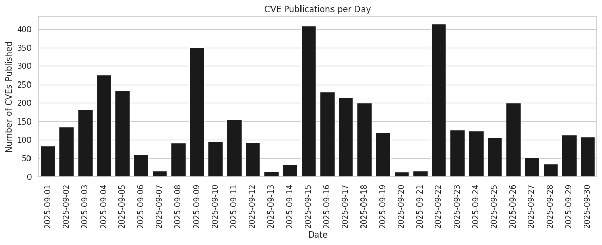
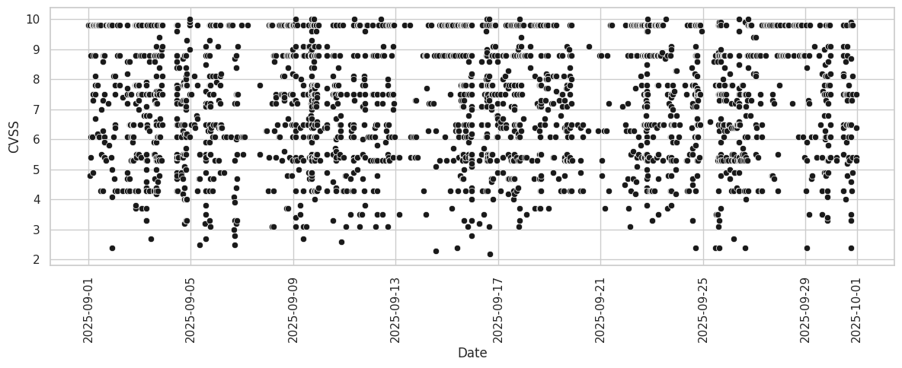
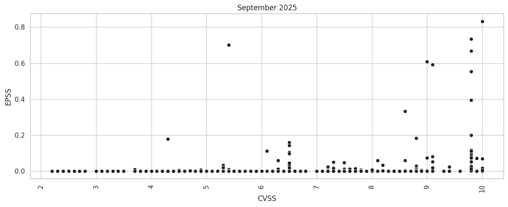
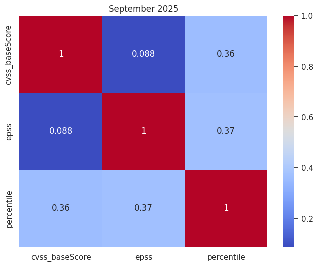
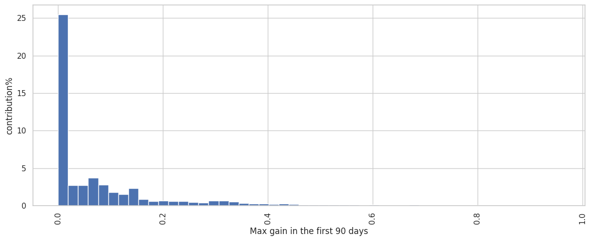

# EPSS LAB REPORT
Due to the amount of code and output present in the original jupyter notebook, this report has been heavily cut down to make it more readable. Only the main results will be shown and most of the code has been removed. The original notebook can still be reviewed on the GitHub.

## Exploratory Data Analysis
We start by extracting some interesting statistics about the CVEs that have been published in September 2025. The CVEs have been downloaded by the NVE website, and their relative EPSS values from the EPSS website using their API.

- ### Display some examples (e.g., the first two CVE records)

<div>
<table border="1" class="dataframe">
  <thead>
    <tr style="text-align: right;">
      <th></th>
      <th>0</th>
      <th>1</th>
    </tr>
  </thead>
  <tbody>
    <tr>
      <th>cve.id</th>
      <td>CVE-2025-9751</td>
      <td>CVE-2025-9752</td>
    </tr>
    <tr>
      <th>cve.sourceIdentifier</th>
      <td>cna@vuldb.com</td>
      <td>cna@vuldb.com</td>
    </tr>
    <tr>
      <th>cve.published</th>
      <td>2025-09-01 00:15:34.580000</td>
      <td>2025-09-01 01:15:46.817000</td>
    </tr>
    <tr>
      <th>cve.lastModified</th>
      <td>2025-09-08 14:06:05.217000</td>
      <td>2025-09-04 18:47:25.440000</td>
    </tr>
    <tr>
      <th>cve.vulnStatus</th>
      <td>Analyzed</td>
      <td>Analyzed</td>
    </tr>
    <tr>
      <th>cve.references</th>
      <td>[{'url': 'https://github.com/HAO-RAY/HCR-CVE/i...</td>
      <td>[{'url': 'https://github.com/i-Corner/cve/issu...</td>
    </tr>
    <tr>
      <th>cve.cisaExploitAdd</th>
      <td>NaN</td>
      <td>NaN</td>
    </tr>
    <tr>
      <th>cve.cisaActionDue</th>
      <td>NaN</td>
      <td>NaN</td>
    </tr>
    <tr>
      <th>cve.cisaRequiredAction</th>
      <td>NaN</td>
      <td>NaN</td>
    </tr>
    <tr>
      <th>cve.cisaVulnerabilityName</th>
      <td>NaN</td>
      <td>NaN</td>
    </tr>
    <tr>
      <th>description</th>
      <td>A weakness has been identified in Campcodes On...</td>
      <td>A security vulnerability has been detected in ...</td>
    </tr>
    <tr>
      <th>vulnerable_cpes</th>
      <td>[cpe:2.3:a:campcodes:online_learning_managemen...</td>
      <td>[cpe:2.3:o:dlink:dir-852_firmware:1.00cn_b09:*...</td>
    </tr>
    <tr>
      <th>num_references</th>
      <td>6</td>
      <td>6</td>
    </tr>
    <tr>
      <th>cwe_list</th>
      <td>[CWE-74, CWE-89, CWE-89]</td>
      <td>[CWE-77, CWE-78, CWE-78]</td>
    </tr>
    <tr>
      <th>cvss_version</th>
      <td>3.1</td>
      <td>3.1</td>
    </tr>
    <tr>
      <th>cvss_vectorString</th>
      <td>CVSS:3.1/AV:N/AC:L/PR:N/UI:N/S:U/C:H/I:H/A:H</td>
      <td>CVSS:3.1/AV:N/AC:L/PR:N/UI:N/S:U/C:H/I:H/A:H</td>
    </tr>
    <tr>
      <th>cvss_baseScore</th>
      <td>9.8</td>
      <td>9.8</td>
    </tr>
    <tr>
      <th>cvss_baseSeverity</th>
      <td>CRITICAL</td>
      <td>CRITICAL</td>
    </tr>
    <tr>
      <th>cvss_attackVector</th>
      <td>NETWORK</td>
      <td>NETWORK</td>
    </tr>
    <tr>
      <th>cvss_attackComplexity</th>
      <td>LOW</td>
      <td>LOW</td>
    </tr>
    <tr>
      <th>cvss_privilegesRequired</th>
      <td>NONE</td>
      <td>NONE</td>
    </tr>
    <tr>
      <th>cvss_userInteraction</th>
      <td>NONE</td>
      <td>NONE</td>
    </tr>
    <tr>
      <th>cvss_scope</th>
      <td>UNCHANGED</td>
      <td>UNCHANGED</td>
    </tr>
    <tr>
      <th>cvss_confidentialityImpact</th>
      <td>HIGH</td>
      <td>HIGH</td>
    </tr>
    <tr>
      <th>cvss_integrityImpact</th>
      <td>HIGH</td>
      <td>HIGH</td>
    </tr>
    <tr>
      <th>cvss_availabilityImpact</th>
      <td>HIGH</td>
      <td>HIGH</td>
    </tr>
    <tr>
      <th>cve</th>
      <td>CVE-2025-9751</td>
      <td>CVE-2025-9752</td>
    </tr>
    <tr>
      <th>epss</th>
      <td>0.00039</td>
      <td>0.0055</td>
    </tr>
    <tr>
      <th>percentile</th>
      <td>0.11582</td>
      <td>0.67317</td>
    </tr>
  </tbody>
</table>
</div>

- ### Show a bar plot with the daily volume of published CVEs
    

    
- ### Print the description of the last ten published vulnerabilities

```python
for idx, x in enumerate(candidate_cves_df.sort_values('cve.published', ascending=False)[:10].iterrows()):
    print('-' * 100)
    print(x[1]['cve.id'], x[1]['cve.published'])
    print(x[1].description)

```

    ----------------------------------------------------------------------------------------------------
    CVE-2025-61792 2025-09-30 23:15:29.700000
    Quadient DS-700 iQ devices through 2025-09-30 might have a race condition during the quick clicking of (in order) the Question Mark button, the Help Button, the About button, and the Help Button, leading to a transition out of kiosk mode into local administrative access. NOTE: the reporter indicates that the "behavior was observed sporadically" during "limited time on the client site," making it not "possible to gain more information about the specific kiosk mode crashing issue," and the only conclusion was "there appears to be some form of race condition." Accordingly, there can be doubt that a reproducible cybersecurity vulnerability was identified; sporadic software crashes can also be caused by a hardware fault on a single device (for example, transient RAM errors). The reporter also describes a variety of other issues, including initial access via USB because of the absence of a "lock-pick resistant locking solution for the External Controller PC cabinet," which is not a cybersecurity vulnerability (section 4.1.5 of the CNA Operational Rules). Finally, it is unclear whether the device or OS configuration was inappropriate, given that the risks are typically limited to insider threats within the mail operations room of a large company.
    ----------------------------------------------------------------------------------------------------
    CVE-2025-55191 2025-09-30 23:15:29.533000
    Argo CD is a declarative, GitOps continuous delivery tool for Kubernetes. Versions between 2.1.0 and 2.14.19, 3.2.0-rc1, 3.1.0-rc1 through 3.1.7, and 3.0.0-rc1 through 3.0.18 contain a race condition in the repository credentials handler that can cause the Argo CD server to panic and crash when concurrent operations are performed on the same repository URL. The vulnerability is located in numerous repository related handlers in the util/db/repository_secrets.go file. A valid API token with repositories resource permissions (create, update, or delete actions) is required to trigger the race condition. This vulnerability causes the entire Argo CD server to crash and become unavailable. Attackers can repeatedly and continuously trigger the race condition to maintain a denial-of-service state, disrupting all GitOps operations. This issue is fixed in versions 2.14.20, 3.2.0-rc2, 3.1.8 and 3.0.19.
    ----------------------------------------------------------------------------------------------------
    CVE-2025-43826 2025-09-30 23:15:29.160000
    Stored cross-site scripting (XSS) vulnerabilities in Web Content translation in Liferay Portal 7.4.0 through 7.4.3.112, and older unsupported versions, and Liferay DXP 2023.Q4.0 through 2023.Q4.8, 2023.Q3.1 through 2023.Q3.10, 7.4 GA through update 92, and older unsupported versions allow remote attackers to inject arbitrary web script or HTML via any rich text field in a web content article.
    ----------------------------------------------------------------------------------------------------
    CVE-2025-24525 2025-09-30 23:15:27.970000
    Keysight Ixia Vision has an issue with hardcoded cryptographic material 
    which may allow an attacker to intercept or decrypt payloads sent to the
     device via API calls or user authentication if the end user does not 
    replace the TLS certificate that shipped with the device. Remediation is
     available in Version 6.9.1, released on September 23, 2025.
    ----------------------------------------------------------------------------------------------------
    CVE-2025-56392 2025-09-30 20:15:39.997000
    An Insecure Direct Object Reference (IDOR) in the /dashboard/notes endpoint of Syaqui Collegetivity v1.0.0 allows attackers to impersonate other users and perform arbitrary operations via a crafted POST request.
    ----------------------------------------------------------------------------------------------------
    CVE-2025-36262 2025-09-30 20:15:37.993000
    IBM Planning Analytics Local 2.0.0 through 2.0.106 and 2.1.0 through 2.1.13 
    
    could allow a malicious privileged user to bypass the UI to gain unauthorized access to sensitive information due to the improper validation of input.
    ----------------------------------------------------------------------------------------------------
    CVE-2025-36132 2025-09-30 20:15:37.810000
    IBM Planning Analytics Local 2.0.0 through 2.0.106 and 2.1.0 through 2.1.13 is vulnerable to cross-site scripting. This vulnerability allows an authenticated user to embed arbitrary JavaScript code in the Web UI thus altering the intended functionality potentially leading to credentials disclosure within a trusted session.
    ----------------------------------------------------------------------------------------------------
    CVE-2025-10659 2025-09-30 20:15:36.450000
    The Telenium Online Web Application is vulnerable due to a PHP endpoint accessible to unauthenticated network users that improperly handles user-supplied input. This vulnerability occurs due to the insecure termination of a regular expression check within the endpoint. Because the input is not correctly validated or sanitized, an unauthenticated attacker can inject arbitrary operating system commands through a crafted HTTP request, leading to remote code execution on the server in the context of the web application service account.
    ----------------------------------------------------------------------------------------------------
    CVE-2024-55017 2025-09-30 20:15:36.100000
    Account Takeover in Corezoid 6.6.0 in the OAuth2 implementation via an open redirect in the redirect_uri parameter allows attackers to intercept authorization codes and gain unauthorized access to victim accounts.
    ----------------------------------------------------------------------------------------------------
    CVE-2025-56132 2025-09-30 19:15:37.253000
    LiquidFiles filetransfer server is vulnerable to a user enumeration issue in its password reset functionality. The application returns distinguishable responses for valid and invalid email addresses, allowing unauthenticated attackers to determine the existence of user accounts. Version 4.2 introduces user-based lockout mechanisms to mitigate brute-force attacks, user enumeration remains possible by default. In versions prior to 4.2, no such user-level protection is in place, only basic IP-based rate limiting is enforced. This IP-based protection can be bypassed by distributing requests across multiple IPs (e.g., rotating IP or proxies). Effectively bypassing both login and password reset security controls. Successful exploitation allows an attacker to enumerate valid email addresses registered for the application, increasing the risk of follow-up attacks such as password spraying.

- ### What is the percentage of CVEs which received a CVSS score?

```python
print(f"{(candidate_cves_df["cvss_baseScore"].count() / len(candidate_cves_df)) * 100:.02f}%")
```
    92.90%

- ### Report descriptive statistics of CVSS the CVSS base score and/or show its distribution

```python
candidate_cves_df["cvss_baseScore"].describe()
```

    count    4015.000000
    mean        6.773898
    std         1.735108
    min         2.200000
    25%         5.500000
    50%         6.500000
    75%         7.800000
    max        10.000000
    Name: cvss_baseScore, dtype: float64
  


It would seem that a relatively high number of CVEs published in september 2025 have a very high CVSS.
    


- ### Report descriptive statistics of EPSS and/or show its distribution

Here we print some statistics about EPSS base score and we show its distribution related to publication date.


```python
candidate_cves_df["epss"].describe()
```

    count    4015.000000
    mean        0.002853
    std         0.030654
    min         0.000020
    25%         0.000190
    50%         0.000410
    75%         0.000570
    max         0.831590
    Name: epss, dtype: float64


    
It is evident that, except for a couple of outliers, on average the EPSS is extremely low.

- ### Produce a scatter plot showing CVSS vs EPSS

    
As we can see, the CVSS and EPSS are not really related with each other, even though the only times the EPSS is high enough, it's in the presence of an equally high CVSS. We can further visualize this lack of correlation with a correlation matrix:


    
- ### Extra analysis - Top 20 most frequent vendors
   


## CVE Selection Process

As per specification, we start by filtering the CVEs with low EPSS (<1%). This leaves us with a moderate amount of CVEs to analyze.

    Index: 167 entries, 20 to 4304
    Data columns (total 16 columns):
     #   Column                      Non-Null Count  Dtype   
    ---  ------                      --------------  -----   
     0   cve.id                      167 non-null    object  
     1   cve.sourceIdentifier        167 non-null    category
     2   cve.vulnStatus              167 non-null    category
     3   description                 167 non-null    object  
     4   cwe_list                    167 non-null    object  
     5   cvss_vectorString           167 non-null    category
     6   cvss_baseScore              167 non-null    float64 
     7   cvss_baseSeverity           167 non-null    category
     8   cvss_attackVector           167 non-null    category
     9   cvss_attackComplexity       167 non-null    category
     10  cvss_privilegesRequired     167 non-null    category
     11  cvss_userInteraction        167 non-null    category
     12  cvss_scope                  167 non-null    category
     13  cvss_confidentialityImpact  167 non-null    category
     14  cvss_integrityImpact        167 non-null    category
     15  cvss_availabilityImpact     167 non-null    category
    dtypes: category(12), float64(1), object(3)
    memory usage: 12.0+ KB

### Additional data acquisition

- #### Downloading NVD 2022-2025 database
We start by downloading all the CVEs that have been published between January 2022 and August 2025. This is because EPSS data is only available from the second half of 2021, and since we want to analyze CVEs behavior from when they were published, we need CVEs from after 2021. We end up with a sizeable dataset of CVEs. Since the dataset is acceptably large, we remove all rows that contain empty data, to make our job easier.

```X.info()
```

    <class 'pandas.core.frame.DataFrame'>
    Index: 111051 entries, 0 to 111887
    Data columns (total 20 columns):
     #   Column                      Non-Null Count   Dtype   
    ---  ------                      --------------   -----   
     0   cve.id                      111051 non-null  object  
     1   cve.sourceIdentifier        111051 non-null  object  
     2   cve.vulnStatus              111051 non-null  object  
     3   cve.references              111051 non-null  object  
     4   description                 111051 non-null  object  
     5   vulnerable_cpes             111051 non-null  object  
     6   num_references              111051 non-null  int64   
     7   cwe_list                    111051 non-null  object  
     8   cvss_version                111051 non-null  object  
     9   cvss_vectorString           111051 non-null  object  
     10  cvss_baseScore              111051 non-null  float64 
     11  cvss_baseSeverity           111051 non-null  category
     12  cvss_attackVector           111051 non-null  object  
     13  cvss_attackComplexity       111051 non-null  object  
     14  cvss_privilegesRequired     111051 non-null  object  
     15  cvss_userInteraction        111051 non-null  object  
     16  cvss_scope                  111051 non-null  object  
     17  cvss_confidentialityImpact  111051 non-null  object  
     18  cvss_integrityImpact        111051 non-null  object  
     19  cvss_availabilityImpact     111051 non-null  object  
    dtypes: category(1), float64(1), int64(1), object(17)
    memory usage: 17.1+ MB

Even though the number of references and cpes could be very useful, since they refer to the status of the CVE at the moment of download and do not contain time series data, we cannot use them to asses how the CVE evolved during its first months after publication. For this reason, we drop those columns from our dataset.

- #### Downloading historical EPSS data

For each CVE, we download its complete EPSS history. We take all CVEs that started with a percentile value < 1% and we calculate the following metrics for their first 3 months after publication:
- $\frac{\sum_{t=1}^{T}pct_{i,t}-pct_{i,0}}{T}, T = 90$
- $\text{max}_t(pct_{i,t}-pct_{i,0}), t\in[1,...,90]$

We create a dictionary containing as keys all the CVEs published between Jan 2022 and Aug 2025, and as values a list of their first 90 percentile values since first publication on EPSS.

```python
percentiles_history = {}
r = 0
p = 0
# Loop through all CSV files
for filename in sorted(os.listdir(epss_path)):
    if filename.endswith(".csv") and filename.startswith("epss_scores-"):
        file_path = os.path.join(epss_path, filename)
        # Read file and acquire CVEs
        with open(file_path, newline='', encoding="utf-8") as csvfile:
            reader = csv.reader(csvfile)
            print(f"Reading {filename}...")
            for row in reader:
                if len(row) >= 3 and row[0].strip().startswith(("CVE-2022", "CVE-2023", "CVE-2024", "CVE-2025")):
                    r += 1
                    if row[0].strip() not in percentiles_history:
                        percentiles_history[row[0].strip()] = []
                        if float(row[2].strip()) < 0.01:
                            p += 1
                    percentiles_history[row[0].strip()].append(float(row[2].strip()))

# We cap the percentiles at the first 90 days
for cve in percentiles_history:
    percentiles_history[cve] = percentiles_history[cve][0:90]
```

- #### Feature Construction using EPSS data
For each CVE, we now compute the desired metrics and we add them to each data point.

$$\text{mean\_daily\_gain} = \frac{\sum_{t=1}^{T}pct_{i,t}-pct_{i,0}}{T} = \frac{(\sum_{t=1}^{T}pct_{i,t})-(T-1)pct_{i,0}}{T},  T = 90$$

```python
def mean_daily_gain(values):
    return (sum(values[1:-1]) - (len(values)-1)*values[0]) / len(values)
```

$$\text{total\_gain}=\text{max}_t(pct_{i,t}-pct_{i,0}), t\in[1,...,90]$$

```python
def total_gain(values):
    res = 0
    for value in values[1:-1]:
        res = max(res, value - values[0])
    return res
```

As we can see from the following plots, CVEs tend to start with an EPSS score sitting in the 10%. It is also evident how the mean daily gain and total gain over the first 90 days after publishing sit close to zero, meaning the vast majority of CVEs do not increase their threat level.
    

        

     


### Model selection, training, and prediction
We have chosen a 2-step approach to filtering the candidate CVEs based on ML models. First we filter based on an outlier detector, and then we order the remaining CVEs by the predicted metrics from a regression model.
    
- #### 1. Novelty detection model

We train a OneClasSVM on the dataset filtered by percentile < 0.01. This training set will be considered the "losers", and we hope to find some CVEs among our candidates that are detected as outliers (novel) by the SVM.

```python
estimator = OneClassSVM()
print("Fitting model...")
estimator.fit(X_train_svm_encoded)
```

    Fitting model...

```python
print("Testing...")
y_svm_test = estimator.predict(X_test_svm_encoded)
print(f"Accuracy on testing data: {len(y_svm_test[y_svm_test == -1]) / len(X_test_svm)}%")
```

    Testing...
    Accuracy on testing data: 0.8370166554459503%

```python
candidate_cves_df_encoded = encoder.transform(candidate_cves_df.drop(columns=["cve.id", "description", "cwe_list"]))
print("Predicting...")
y_svm_predict = estimator.predict(candidate_cves_df_encoded)
print(f"Outliars in candidates: {100 * len(y_svm_predict[y_svm_predict == -1]) / len(y_svm_predict):.02f}%")
y_svm_predict = ["Outlier" if p == -1 else "Inlier" for p in y_svm_predict]
print(y_svm_predict)
```

    Predicting...
    Outliars in candidates: 31.14%
    ['Inlier', 'Inlier', 'Inlier', 'Inlier', 'Inlier', 'Inlier', 'Inlier', 'Inlier', 'Outlier', 'Inlier', 'Outlier', 'Inlier', 'Inlier', 'Outlier', 'Inlier', 'Inlier', 'Inlier', 'Inlier', 'Inlier', 'Inlier', 'Inlier', 'Outlier', 'Outlier', 'Outlier', 'Outlier', 'Inlier', 'Inlier', 'Inlier', 'Inlier', 'Inlier', 'Inlier', 'Inlier', 'Inlier', 'Inlier', 'Inlier', 'Inlier', 'Outlier', 'Inlier', 'Inlier', 'Inlier', 'Inlier', 'Outlier', 'Outlier', 'Outlier', 'Inlier', 'Inlier', 'Inlier', 'Inlier', 'Inlier', 'Outlier', 'Outlier', 'Inlier', 'Inlier', 'Inlier', 'Inlier', 'Inlier', 'Inlier', 'Inlier', 'Inlier', 'Outlier', 'Inlier', 'Inlier', 'Inlier', 'Inlier', 'Inlier', 'Inlier', 'Inlier', 'Inlier', 'Inlier', 'Inlier', 'Inlier', 'Inlier', 'Outlier', 'Outlier', 'Inlier', 'Inlier', 'Inlier', 'Inlier', 'Inlier', 'Inlier', 'Inlier', 'Inlier', 'Inlier', 'Inlier', 'Inlier', 'Inlier', 'Inlier', 'Inlier', 'Inlier', 'Inlier', 'Inlier', 'Inlier', 'Inlier', 'Inlier', 'Inlier', 'Inlier', 'Inlier', 'Outlier', 'Outlier', 'Inlier', 'Inlier', 'Inlier', 'Inlier', 'Inlier', 'Inlier', 'Outlier', 'Outlier', 'Inlier', 'Inlier', 'Outlier', 'Inlier', 'Inlier', 'Outlier', 'Outlier', 'Inlier', 'Inlier', 'Inlier', 'Outlier', 'Inlier', 'Outlier', 'Inlier', 'Inlier', 'Inlier', 'Outlier', 'Inlier', 'Inlier', 'Outlier', 'Outlier', 'Outlier', 'Inlier', 'Inlier', 'Outlier', 'Outlier', 'Inlier', 'Inlier', 'Outlier', 'Inlier', 'Inlier', 'Inlier', 'Outlier', 'Inlier', 'Outlier', 'Outlier', 'Outlier', 'Outlier', 'Inlier', 'Inlier', 'Outlier', 'Outlier', 'Outlier', 'Outlier', 'Outlier', 'Outlier', 'Outlier', 'Outlier', 'Outlier', 'Outlier', 'Outlier', 'Inlier', 'Outlier', 'Outlier', 'Inlier', 'Inlier', 'Inlier', 'Inlier', 'Outlier', 'Outlier']


- #### 2. Target metrics prediction

We try to train a RandomForestRegressor on the dataset filtered by percentile < 0.01.

```python
print("Fitting model...")
rr = RandomForestRegressor(n_estimators=1000, random_state=42, n_jobs=-1)
estimator = MultiOutputRegressor(rr)
estimator.fit(X_rr_train, y_rr_train)
```

    Fitting model...

```python
print("Testing...")
y_rr_predict = estimator.predict(X_rr_test)
print("R^2 per target:", r2_score(y_rr_test, y_rr_predict, multioutput='raw_values'))
print("MSE per target:", mean_squared_error(y_rr_test, y_rr_predict, multioutput='raw_values'))
print("RMSE per target:", root_mean_squared_error(y_rr_test, y_rr_predict, multioutput='raw_values'))
```

    Testing...
    R^2 per target: [0.27347186 0.21435853]
    MSE per target: [0.01228252 0.01534275]
    RMSE per target: [0.11082653 0.12386584]


```python
candidate_cves_df_encoded = encoder.transform(candidate_cves_df.drop(columns=["cve.id", "description", "cwe_list"]))
print("Predicting...")
y_rr_predict = estimator.predict(candidate_cves_df_encoded)
print(y_rr_predict)
```

    Predicting...
    [[-4.08929666e-02  7.46945614e-03]
     [-4.08929666e-02  7.46945614e-03]
     [ 8.22116723e-05  1.16986846e-02]
     ...
     [-1.80569075e-02  1.83473706e-02]
     [-3.23802192e-03  5.77080692e-02]]


## Final analysis

We now merge the predictions with the candidates. Due to some changes in the models, the predicted CVEs are different from the ones provided in the original submissions, so even though they might not appear I will choose in the end the ones submitted for the challenge.


```python
candidate_cves_df["Status"] = y_svm_predict
candidate_cves_df["predicted_mean_daily_gain"] = y_rr_predict.T[0]
candidate_cves_df["predicted_total_gain"] = y_rr_predict.T[1]
candidate_cves_df.T
```


<div>
<table border="1" class="dataframe">
  <thead>
    <tr style="text-align: right;">
      <th></th>
      <th>0</th>
      <th>1</th>
      <th>2</th>
      <th>3</th>
      <th>4</th>
      <th>5</th>
      <th>6</th>
      <th>7</th>
      <th>8</th>
      <th>9</th>
      <th>...</th>
      <th>157</th>
      <th>158</th>
      <th>159</th>
      <th>160</th>
      <th>161</th>
      <th>162</th>
      <th>163</th>
      <th>164</th>
      <th>165</th>
      <th>166</th>
    </tr>
  </thead>
  <tbody>
    <tr>
      <th>cve.id</th>
      <td>CVE-2025-20705</td>
      <td>CVE-2025-20706</td>
      <td>CVE-2025-20707</td>
      <td>CVE-2024-49720</td>
      <td>CVE-2024-49722</td>
      <td>CVE-2024-49728</td>
      <td>CVE-2024-49730</td>
      <td>CVE-2025-22416</td>
      <td>CVE-2025-22417</td>
      <td>CVE-2025-22418</td>
      <td>...</td>
      <td>CVE-2025-9905</td>
      <td>CVE-2025-34200</td>
      <td>CVE-2025-43809</td>
      <td>CVE-2025-54855</td>
      <td>CVE-2025-39889</td>
      <td>CVE-2025-21481</td>
      <td>CVE-2025-7691</td>
      <td>CVE-2025-5069</td>
      <td>CVE-2025-57852</td>
      <td>CVE-2025-23291</td>
    </tr>
    <tr>
      <th>cve.sourceIdentifier</th>
      <td>security@mediatek.com</td>
      <td>security@mediatek.com</td>
      <td>security@mediatek.com</td>
      <td>security@android.com</td>
      <td>security@android.com</td>
      <td>security@android.com</td>
      <td>security@android.com</td>
      <td>security@android.com</td>
      <td>security@android.com</td>
      <td>security@android.com</td>
      <td>...</td>
      <td>cve-coordination@google.com</td>
      <td>disclosure@vulncheck.com</td>
      <td>security@liferay.com</td>
      <td>ics-cert@hq.dhs.gov</td>
      <td>416baaa9-dc9f-4396-8d5f-8c081fb06d67</td>
      <td>product-security@qualcomm.com</td>
      <td>cve@gitlab.com</td>
      <td>cve@gitlab.com</td>
      <td>secalert@redhat.com</td>
      <td>psirt@nvidia.com</td>
    </tr>
    <tr>
      <th>cve.vulnStatus</th>
      <td>Analyzed</td>
      <td>Analyzed</td>
      <td>Analyzed</td>
      <td>Analyzed</td>
      <td>Analyzed</td>
      <td>Analyzed</td>
      <td>Analyzed</td>
      <td>Analyzed</td>
      <td>Analyzed</td>
      <td>Analyzed</td>
      <td>...</td>
      <td>Analyzed</td>
      <td>Analyzed</td>
      <td>Analyzed</td>
      <td>Awaiting Analysis</td>
      <td>Analyzed</td>
      <td>Analyzed</td>
      <td>Analyzed</td>
      <td>Analyzed</td>
      <td>Awaiting Analysis</td>
      <td>Awaiting Analysis</td>
    </tr>
    <tr>
      <th>description</th>
      <td>In monitor_hang, there is a possible memory co...</td>
      <td>In mbrain, there is a possible memory corrupti...</td>
      <td>In geniezone, there is a possible memory corru...</td>
      <td>In multiple functions of Permissions.java, the...</td>
      <td>In showAvatarPicker of EditUserPhotoController...</td>
      <td>In generateFileInfo of BluetoothOppSendFileInf...</td>
      <td>In FuseDaemon.cpp, there is a possible out of ...</td>
      <td>In onCreate of ChooserActivity.java , there is...</td>
      <td>In finishTransition of Transition.java, there ...</td>
      <td>In multiple locations, there is a possible con...</td>
      <td>...</td>
      <td>The Keras Model.load_model method can be explo...</td>
      <td>Vasion Print (formerly PrinterLogic) Virtual A...</td>
      <td>Cross-Site Request Forgery (CSRF) vulnerabilit...</td>
      <td>Cleartext storage of sensitive information was...</td>
      <td>In the Linux kernel, the following vulnerabili...</td>
      <td>Memory corruption while performing private key...</td>
      <td>A privilege escalation issue has been discover...</td>
      <td>An issue has been discovered in GitLab CE/EE a...</td>
      <td>A container privilege escalation flaw was foun...</td>
      <td>NVIDIA Delegated Licensing Service for all app...</td>
    </tr>
    <tr>
      <th>cwe_list</th>
      <td>['CWE-416']</td>
      <td>['CWE-416']</td>
      <td>['CWE-416']</td>
      <td>['CWE-693']</td>
      <td>['CWE-610']</td>
      <td>['CWE-610']</td>
      <td>['CWE-787']</td>
      <td>['CWE-441']</td>
      <td>['CWE-1021']</td>
      <td>['CWE-441']</td>
      <td>...</td>
      <td>['CWE-913']</td>
      <td>['CWE-312']</td>
      <td>['CWE-352']</td>
      <td>['CWE-312']</td>
      <td>['CWE-326']</td>
      <td>['CWE-120']</td>
      <td>['CWE-267']</td>
      <td>['CWE-708']</td>
      <td>['CWE-276']</td>
      <td>['CWE-312']</td>
    </tr>
    <tr>
      <th>cvss_vectorString</th>
      <td>CVSS:3.1/AV:L/AC:L/PR:L/UI:N/S:U/C:H/I:H/A:H</td>
      <td>CVSS:3.1/AV:L/AC:L/PR:L/UI:N/S:U/C:H/I:H/A:H</td>
      <td>CVSS:3.1/AV:L/AC:L/PR:H/UI:N/S:U/C:H/I:H/A:H</td>
      <td>CVSS:3.1/AV:L/AC:L/PR:L/UI:N/S:U/C:H/I:H/A:H</td>
      <td>CVSS:3.1/AV:L/AC:L/PR:L/UI:N/S:U/C:H/I:N/A:N</td>
      <td>CVSS:3.1/AV:L/AC:L/PR:L/UI:N/S:U/C:H/I:N/A:N</td>
      <td>CVSS:3.1/AV:L/AC:L/PR:L/UI:N/S:U/C:H/I:H/A:H</td>
      <td>CVSS:3.1/AV:L/AC:L/PR:L/UI:N/S:U/C:H/I:H/A:H</td>
      <td>CVSS:3.1/AV:L/AC:L/PR:L/UI:R/S:U/C:H/I:H/A:H</td>
      <td>CVSS:3.1/AV:L/AC:L/PR:L/UI:N/S:U/C:H/I:H/A:H</td>
      <td>...</td>
      <td>CVSS:3.1/AV:L/AC:L/PR:L/UI:R/S:U/C:H/I:H/A:H</td>
      <td>CVSS:3.1/AV:L/AC:L/PR:L/UI:N/S:U/C:H/I:H/A:H</td>
      <td>CVSS:3.1/AV:N/AC:L/PR:N/UI:R/S:U/C:N/I:L/A:N</td>
      <td>CVSS:3.1/AV:L/AC:L/PR:H/UI:R/S:U/C:H/I:N/A:N</td>
      <td>CVSS:3.1/AV:L/AC:L/PR:L/UI:N/S:U/C:N/I:N/A:H</td>
      <td>CVSS:3.1/AV:L/AC:L/PR:L/UI:N/S:U/C:H/I:H/A:H</td>
      <td>CVSS:3.1/AV:N/AC:L/PR:L/UI:N/S:U/C:H/I:H/A:H</td>
      <td>CVSS:3.1/AV:N/AC:L/PR:L/UI:N/S:U/C:H/I:N/A:N</td>
      <td>CVSS:3.1/AV:L/AC:H/PR:H/UI:N/S:U/C:L/I:H/A:L</td>
      <td>CVSS:3.1/AV:A/AC:H/PR:H/UI:R/S:C/C:L/I:N/A:N</td>
    </tr>
    <tr>
      <th>cvss_baseScore</th>
      <td>7.8</td>
      <td>7.8</td>
      <td>6.7</td>
      <td>7.8</td>
      <td>5.5</td>
      <td>5.5</td>
      <td>7.8</td>
      <td>7.8</td>
      <td>7.3</td>
      <td>7.8</td>
      <td>...</td>
      <td>7.3</td>
      <td>7.8</td>
      <td>4.3</td>
      <td>4.2</td>
      <td>5.5</td>
      <td>7.8</td>
      <td>8.8</td>
      <td>6.5</td>
      <td>5.2</td>
      <td>2.4</td>
    </tr>
    <tr>
      <th>cvss_baseSeverity</th>
      <td>HIGH</td>
      <td>HIGH</td>
      <td>MEDIUM</td>
      <td>HIGH</td>
      <td>MEDIUM</td>
      <td>MEDIUM</td>
      <td>HIGH</td>
      <td>HIGH</td>
      <td>HIGH</td>
      <td>HIGH</td>
      <td>...</td>
      <td>HIGH</td>
      <td>HIGH</td>
      <td>MEDIUM</td>
      <td>MEDIUM</td>
      <td>MEDIUM</td>
      <td>HIGH</td>
      <td>HIGH</td>
      <td>MEDIUM</td>
      <td>MEDIUM</td>
      <td>LOW</td>
    </tr>
    <tr>
      <th>cvss_attackVector</th>
      <td>LOCAL</td>
      <td>LOCAL</td>
      <td>LOCAL</td>
      <td>LOCAL</td>
      <td>LOCAL</td>
      <td>LOCAL</td>
      <td>LOCAL</td>
      <td>LOCAL</td>
      <td>LOCAL</td>
      <td>LOCAL</td>
      <td>...</td>
      <td>LOCAL</td>
      <td>LOCAL</td>
      <td>NETWORK</td>
      <td>LOCAL</td>
      <td>LOCAL</td>
      <td>LOCAL</td>
      <td>NETWORK</td>
      <td>NETWORK</td>
      <td>LOCAL</td>
      <td>ADJACENT_NETWORK</td>
    </tr>
    <tr>
      <th>cvss_attackComplexity</th>
      <td>LOW</td>
      <td>LOW</td>
      <td>LOW</td>
      <td>LOW</td>
      <td>LOW</td>
      <td>LOW</td>
      <td>LOW</td>
      <td>LOW</td>
      <td>LOW</td>
      <td>LOW</td>
      <td>...</td>
      <td>LOW</td>
      <td>LOW</td>
      <td>LOW</td>
      <td>LOW</td>
      <td>LOW</td>
      <td>LOW</td>
      <td>LOW</td>
      <td>LOW</td>
      <td>HIGH</td>
      <td>HIGH</td>
    </tr>
    <tr>
      <th>cvss_privilegesRequired</th>
      <td>LOW</td>
      <td>LOW</td>
      <td>HIGH</td>
      <td>LOW</td>
      <td>LOW</td>
      <td>LOW</td>
      <td>LOW</td>
      <td>LOW</td>
      <td>LOW</td>
      <td>LOW</td>
      <td>...</td>
      <td>LOW</td>
      <td>LOW</td>
      <td>NONE</td>
      <td>HIGH</td>
      <td>LOW</td>
      <td>LOW</td>
      <td>LOW</td>
      <td>LOW</td>
      <td>HIGH</td>
      <td>HIGH</td>
    </tr>
    <tr>
      <th>cvss_userInteraction</th>
      <td>NONE</td>
      <td>NONE</td>
      <td>NONE</td>
      <td>NONE</td>
      <td>NONE</td>
      <td>NONE</td>
      <td>NONE</td>
      <td>NONE</td>
      <td>REQUIRED</td>
      <td>NONE</td>
      <td>...</td>
      <td>REQUIRED</td>
      <td>NONE</td>
      <td>REQUIRED</td>
      <td>REQUIRED</td>
      <td>NONE</td>
      <td>NONE</td>
      <td>NONE</td>
      <td>NONE</td>
      <td>NONE</td>
      <td>REQUIRED</td>
    </tr>
    <tr>
      <th>cvss_scope</th>
      <td>UNCHANGED</td>
      <td>UNCHANGED</td>
      <td>UNCHANGED</td>
      <td>UNCHANGED</td>
      <td>UNCHANGED</td>
      <td>UNCHANGED</td>
      <td>UNCHANGED</td>
      <td>UNCHANGED</td>
      <td>UNCHANGED</td>
      <td>UNCHANGED</td>
      <td>...</td>
      <td>UNCHANGED</td>
      <td>UNCHANGED</td>
      <td>UNCHANGED</td>
      <td>UNCHANGED</td>
      <td>UNCHANGED</td>
      <td>UNCHANGED</td>
      <td>UNCHANGED</td>
      <td>UNCHANGED</td>
      <td>UNCHANGED</td>
      <td>CHANGED</td>
    </tr>
    <tr>
      <th>cvss_confidentialityImpact</th>
      <td>HIGH</td>
      <td>HIGH</td>
      <td>HIGH</td>
      <td>HIGH</td>
      <td>HIGH</td>
      <td>HIGH</td>
      <td>HIGH</td>
      <td>HIGH</td>
      <td>HIGH</td>
      <td>HIGH</td>
      <td>...</td>
      <td>HIGH</td>
      <td>HIGH</td>
      <td>NONE</td>
      <td>HIGH</td>
      <td>NONE</td>
      <td>HIGH</td>
      <td>HIGH</td>
      <td>HIGH</td>
      <td>LOW</td>
      <td>LOW</td>
    </tr>
    <tr>
      <th>cvss_integrityImpact</th>
      <td>HIGH</td>
      <td>HIGH</td>
      <td>HIGH</td>
      <td>HIGH</td>
      <td>NONE</td>
      <td>NONE</td>
      <td>HIGH</td>
      <td>HIGH</td>
      <td>HIGH</td>
      <td>HIGH</td>
      <td>...</td>
      <td>HIGH</td>
      <td>HIGH</td>
      <td>LOW</td>
      <td>NONE</td>
      <td>NONE</td>
      <td>HIGH</td>
      <td>HIGH</td>
      <td>NONE</td>
      <td>HIGH</td>
      <td>NONE</td>
    </tr>
    <tr>
      <th>cvss_availabilityImpact</th>
      <td>HIGH</td>
      <td>HIGH</td>
      <td>HIGH</td>
      <td>HIGH</td>
      <td>NONE</td>
      <td>NONE</td>
      <td>HIGH</td>
      <td>HIGH</td>
      <td>HIGH</td>
      <td>HIGH</td>
      <td>...</td>
      <td>HIGH</td>
      <td>HIGH</td>
      <td>NONE</td>
      <td>NONE</td>
      <td>HIGH</td>
      <td>HIGH</td>
      <td>HIGH</td>
      <td>NONE</td>
      <td>LOW</td>
      <td>NONE</td>
    </tr>
    <tr>
      <th>Status</th>
      <td>Inlier</td>
      <td>Inlier</td>
      <td>Inlier</td>
      <td>Inlier</td>
      <td>Inlier</td>
      <td>Inlier</td>
      <td>Inlier</td>
      <td>Inlier</td>
      <td>Outlier</td>
      <td>Inlier</td>
      <td>...</td>
      <td>Outlier</td>
      <td>Inlier</td>
      <td>Outlier</td>
      <td>Outlier</td>
      <td>Inlier</td>
      <td>Inlier</td>
      <td>Inlier</td>
      <td>Inlier</td>
      <td>Outlier</td>
      <td>Outlier</td>
    </tr>
    <tr>
      <th>predicted_mean_daily_gain</th>
      <td>-0.040893</td>
      <td>-0.040893</td>
      <td>0.000082</td>
      <td>0.00426</td>
      <td>0.000752</td>
      <td>0.000752</td>
      <td>0.00426</td>
      <td>0.00426</td>
      <td>0.003007</td>
      <td>0.00426</td>
      <td>...</td>
      <td>-0.036217</td>
      <td>0.005262</td>
      <td>0.047927</td>
      <td>-0.028177</td>
      <td>-0.00905</td>
      <td>-0.006007</td>
      <td>0.037021</td>
      <td>-0.024831</td>
      <td>-0.018057</td>
      <td>-0.003238</td>
    </tr>
    <tr>
      <th>predicted_total_gain</th>
      <td>0.007469</td>
      <td>0.007469</td>
      <td>0.011699</td>
      <td>0.027022</td>
      <td>0.011677</td>
      <td>0.011677</td>
      <td>0.027022</td>
      <td>0.027022</td>
      <td>0.010376</td>
      <td>0.027022</td>
      <td>...</td>
      <td>0.027669</td>
      <td>0.01115</td>
      <td>0.045327</td>
      <td>0.008806</td>
      <td>0.021808</td>
      <td>0.024627</td>
      <td>0.118635</td>
      <td>0.014713</td>
      <td>0.018347</td>
      <td>0.057708</td>
    </tr>
  </tbody>
</table>
<p>19 rows × 167 columns</p>
</div>

We only care about outliers, so we drop the others.

```python
candidate_cves_df = candidate_cves_df[candidate_cves_df["Status"] == "Outlier"].drop(columns="Status")
```

We now sort the remaining CVEs by their two target metrics:

```python
candidate_cves_df = candidate_cves_df.sort_values(by=["predicted_mean_daily_gain", "predicted_total_gain"], ascending=False)
```

At a cursory glance, we can see that all of Apple's and JetBrains' CVEs have already been fixed prior to publication, thus we exclude them.


```python
candidate_cves_df = candidate_cves_df[candidate_cves_df["cve.sourceIdentifier"] != "cve@jetbrains.com"]
candidate_cves_df = candidate_cves_df[candidate_cves_df["cve.sourceIdentifier"] != "product-security@apple.com"]
candidate_cves_df.head(2)
```

<div>
<table border="1" class="dataframe">
  <thead>
    <tr style="text-align: right;">
      <th></th>
      <th>cve.id</th>
      <th>cve.sourceIdentifier</th>
      <th>cve.vulnStatus</th>
      <th>description</th>
      <th>cwe_list</th>
      <th>cvss_vectorString</th>
      <th>cvss_baseScore</th>
      <th>cvss_baseSeverity</th>
      <th>cvss_attackVector</th>
      <th>cvss_attackComplexity</th>
      <th>cvss_privilegesRequired</th>
      <th>cvss_userInteraction</th>
      <th>cvss_scope</th>
      <th>cvss_confidentialityImpact</th>
      <th>cvss_integrityImpact</th>
      <th>cvss_availabilityImpact</th>
      <th>predicted_mean_daily_gain</th>
      <th>predicted_total_gain</th>
    </tr>
  </thead>
  <tbody>
    <tr>
      <th>147</th>
      <td>CVE-2025-9708</td>
      <td>jordan@liggitt.net</td>
      <td>Awaiting Analysis</td>
      <td>A vulnerability exists in the Kubernetes C# cl...</td>
      <td>['CWE-295']</td>
      <td>CVSS:3.1/AV:N/AC:H/PR:N/UI:R/S:U/C:H/I:H/A:N</td>
      <td>6.8</td>
      <td>MEDIUM</td>
      <td>NETWORK</td>
      <td>HIGH</td>
      <td>NONE</td>
      <td>REQUIRED</td>
      <td>UNCHANGED</td>
      <td>HIGH</td>
      <td>HIGH</td>
      <td>NONE</td>
      <td>0.064613</td>
      <td>0.016485</td>
    </tr>
    <tr>
      <th>23</th>
      <td>CVE-2025-54588</td>
      <td>security-advisories@github.com</td>
      <td>Analyzed</td>
      <td>Envoy is an open source L7 proxy and communica...</td>
      <td>['CWE-416']</td>
      <td>CVSS:3.1/AV:N/AC:L/PR:N/UI:N/S:U/C:N/I:N/A:H</td>
      <td>7.5</td>
      <td>HIGH</td>
      <td>NETWORK</td>
      <td>LOW</td>
      <td>NONE</td>
      <td>NONE</td>
      <td>UNCHANGED</td>
      <td>NONE</td>
      <td>NONE</td>
      <td>HIGH</td>
      <td>0.052709</td>
      <td>0.092191</td>
    </tr>
  </tbody>
</table>
</div>

By manual inspection, we also exclude CVE-2025-7445 and CVE-2025-59934 since they have been fixed. This leaves us with the first remaining 10 CVEs, which we will select for the lab activity.

### Tracking my CVEs
As we can see, the chosen CVEs using this method have not been proven particularly successful.
   


## Disclosure
Some LLMs have been used to write parts of the python code for this lab activity.
    

