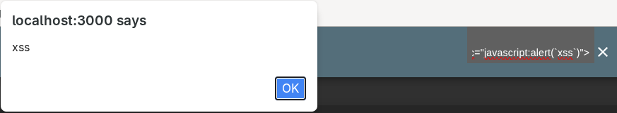
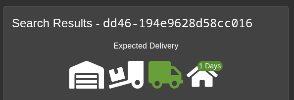
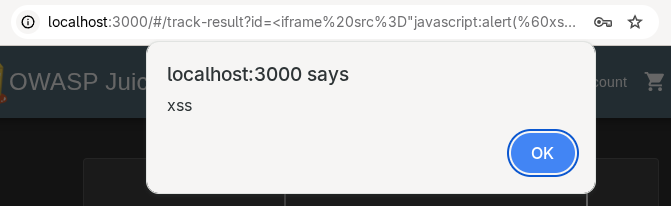
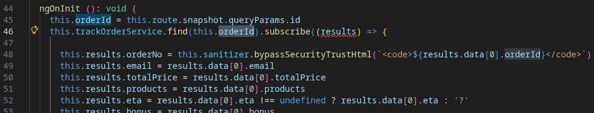

# XSS LAB REPORT

In this report, the OWASP Juice Shop webapp is used to showcase the exploitation of two XSS vulnerabilities.

## Tools

- OWASP Juice Shop
- BURP Suite Proxy
- 
## Challenge #1. DOM XSS attack

For this challenge, we will try to look for an input field where its content appears in the HTML when its form is submitted.
By examining at the main store page we notice a search bar on the top right. By pasting the payload HTML `<iframe src="javascript:alert(`xss`)">`
and performing the search, we successfully complete the challenge.

## Challenge #2. Reflected XSS attack

For this challenge, we will try to look for a url parameter where its value appears in the page it is leading to.
We begin by creating an account under the email `test@test.test`, with password `Test123!`, and security answer `test`.
We then try to go through the procedure of purchasing one of the items. Once the purchase has been completed, a page
on which to track our order will be created, in my case: http://localhost:3000/#/track-result?id=dd46-194e9628d58cc016.
As we can see, this tracking page can be accessed with a certain URL parameter, which is also displayed on the page itself.

By substituting into the URL our HTML payload, we solve the challenge.

## Observations

### 1. DOM vulnerability

By browsing the application's code, we find out in the routing module that the componen responsible for the main search
page is `search-result.component.ts`. By looking at this file we find out that when the page loads, all items are downloaded
at once, and further requests are only made for specific reasons such as retrieving the description of an item when opened.
This in turn means, and can be verified with BURP, that searching for products is an entirely local operation done by the 
client-side code.

### 2. Reflection vulnerability

By browsing the application's code, we find out in the routing module that the component responsible for managing the order tracking
is `track-result.component.ts`. By analyzing this file, we can clearly see that the URL parameter(s) get extracted
and the `orderID` directly put into the HTML unsafely, even if the ID doesn't return any valid order after querying
the database. Of course this could be fixed by either sanitizing the parameters, or only showing the ID if it's valid.

### Comparison

As we can clearly see, the main difference between these two XSS attacks is that, in the first case, the server is not affected by
any vulnerabilities, but is instead _the client responsible_ for including the user-provided payload inside the generated page.
Since everything is local, it's called a **DOM XSS** attack.
In the second case, _the server fails_ to properly sanitize the URL parameter, returning a page with the URL-provided payload inside.
Since the payload first gets sent to the vulnerable server, which embeds it in the webpage and sends it back, the attack is called
**Reflection XSS**.