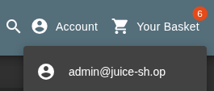
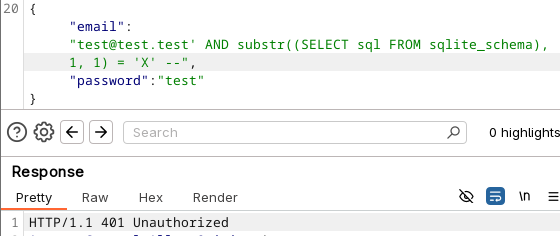
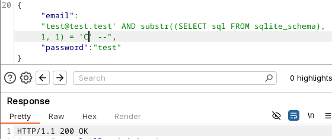

# SQLi LAB REPORT

In this report, the OWASP Juice Shop webapp is used to showcase the exploitation of two SQLi vulnerabilities.

## Tools

- OWASP Juice Shop
- BURP Suite Proxy

## Challenge #1. Authentication bypass

For this challenge, we try to find a way to [log in as administrator](https://pwning.owasp-juice.shop/companion-guide/latest/part2/injection.html#_log_in_with_the_administrators_user_account) on the web application.

We navigate to the login page of the OWASP Juice Shop web application and we try logging in as admin using a test password.
By capturing the traffic using BURP, we notice that the request contains the following data: `{"email":"admin","password":"admin"}`.
We begin by trying to detect which database is being used by the application by creating an error
using the query `{"email":"' ' --' OR '1'='1' --","password":"password"}` at the login page.

We capture the response with BURP, which contains the following piece of information in its body:
```
{
  "error": {
    "message": "SQLITE_ERROR: near \"' --'\": syntax error",
    "stack": "Error\n    at Database.<anonymous> (/juice-shop/node_modules/sequelize/lib/dialects/sqlite/query.js:185:27)\n    at /juice-shop/node_modules/sequelize/lib/dialects/sqlite/query.js:183:50\n    at new Promise (<anonymous>)\n    at Query.run (/juice-shop/node_modules/sequelize/lib/dialects/sqlite/query.js:183:12)\n    at /juice-shop/node_modules/sequelize/lib/sequelize.js:315:28\n    at process.processTicksAndRejections (node:internal/process/task_queues:105:5)",
    "name": "SequelizeDatabaseError",
    "parent": {
      "errno": 1,
      "code": "SQLITE_ERROR",
      "sql": "SELECT * FROM Users WHERE email = '' ' --' AND password = '098f6bcd4621d373cade4e832627b4f6' AND deletedAt IS NULL"
    },
    "original": {
      "errno": 1,
      "code": "SQLITE_ERROR",
      "sql": "SELECT * FROM Users WHERE email = '' ' --' AND password = '098f6bcd4621d373cade4e832627b4f6' AND deletedAt IS NULL"
    },
    "sql": "SELECT * FROM Users WHERE email = '' ' --' AND password = '098f6bcd4621d373cade4e832627b4f6' AND deletedAt IS NULL",
    "parameters": {}
  }
}
```
Thus we now know that the database engine being used by the application is **SQLite** and we clearly see parametrized query from the login
page.
We now try a basic injection query `{"email":"admin' OR '1'='1' --","password":"password"}`, which inserts an always valid condition
and comments out the rest of the query. This injection attempt works, and we log in as admin, solving the challenge.



## Challenge #2. Data extraction

For this challenge, we try to [exfiltrate Juice Shop's database schema](https://pwning.owasp-juice.shop/companion-guide/latest/part2/injection.html#_exfiltrate_the_entire_db_schema_definition_via_sql_injection).\
For data estraction, different methods can be used to probe the system depending on the level of information
we obtain back from the server.

Since we know we're dealing with SQLite, its schema can be obtained through the following query
`SELECT sql FROM sqlite_schema`. By looking at SQLite's [documentation](https://sqlite.org/schematab.html), the `sql` column
is of type `text`. SQLite has a number of default protections to prevent SQLi attacks. For example, it doesn't allow
piggybacking, and columns must be specified by name in the queries. This means that since we do not have knowledge of the
resulting table, we cannot perform a UNION based attack.
On the other hand, since we know exactly where the schema is stored and which type it is, we can use a boolean-based
attack through a substring comparison in order to deduce the content of the schema letter by letter.
This, of course, needs to be automated, so we will use BURP for this purpose.

The parametrized query is as follows: `test@test.test' AND substr((SELECT sql FROM sqlite_schema), <charposition>, <charposition>) = '<char>' --`,
where `test@test.test` is a temporary account we created so that we use a valid email.
Since most SQLite schemas start with a `CREATE` statement, we can easily see that this attack works by doing the following:




As we can clearly see, the `C` lets us log in correctly, which means it is the first letter of the schema.

Now, the only thing left to do is to automate this attack by trying every possible character incrementing by `1`
the substring index, and storing the ones that return a `200` response, thus exfiltrating
the entire schema and completing the challenge.

## Takeaways

SQL injection is not a solved problem, but it is easy to prevent in such simple cases.
It is important to use parameterized queries for all untrusted values and disable multi‑statements.
SQLite already offers by default many options for security hardening, but as we were able to see, they aren't enough.
Database roles should also be carefully tuned to give them the least privilege necessary to perform their tasks.