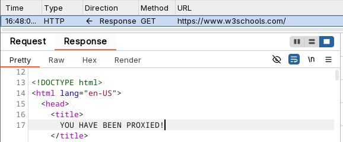
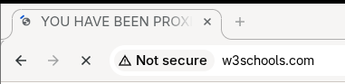
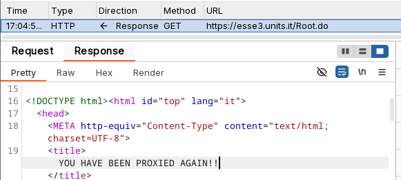
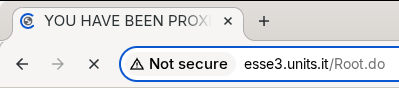
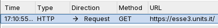
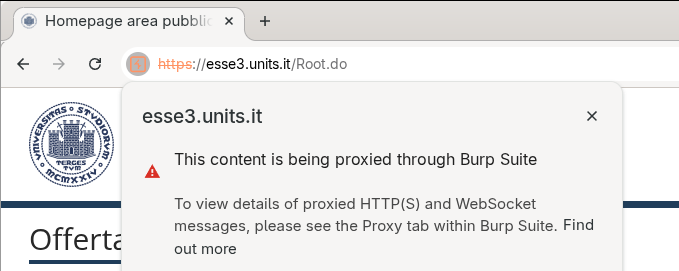
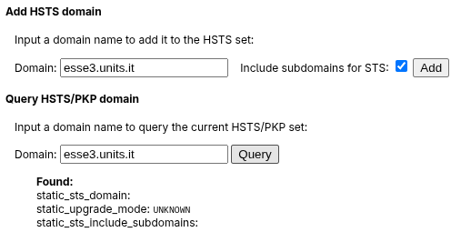

# AiTM 1 LAB REPORT

In this report, the BURP Suite is used to showcase how the SSL stripping behaves differently when HSTS is enabled.

## Threat model
SSLStrip attacks can only work if the victim tries to connect to the website using HTTP, which is why it's
important to trick the victim into following an HTTP link. If the victim tries to connect immediately using
HTTPS, the attack cannot work due to the impossibility of the proxy to serve valid certificates.

## Tools

- BURP Suite Proxy
- [Websites spreadsheet](https://docs.google.com/spreadsheets/d/1t-G4sqvYH0eFBh1VvDVtpJ6LX-Mc3ilK8K2TPuCwSsA/edit?gid=32093958#gid=32093958)
### BURP configuration
We configure BURP for SSLStrip by forcing it to use TLS for requests.

## Case A – Website does not use Strict Transport Security
We see that the website hosted at www.w3schools.com supports HTTPS but doesn't have Strict Transport Security enabled, so 
we will use it for this section.

As we can see, the proxy connects to the website using HTTPS, but only exposes an HTTP connection to the
victim's browser. This means that BURP can access in plaintext all the traffic and modify both requests
and responses between the client and the real server, as proven by the following screenshots:

 

If we disable the proxy and connect using HTTPS one time and then enable the proxy again
and connect using HTTP,nothing changes and we can still successfully perform the SSLStrip attack.

## Case B – Website does use Strict Transport Security
We see that the website hosted at [esse3.units.it](http://esse3.units.it/) supports HTTPS and Strict Transport Security,
but is not present in the browser's preloaded HSTS, so we will use it for this section.

### Case B.1 – No preloaded HSTS, first time visit

Like before, the proxy connects to the real server using HTTPS, while exposing to the client only an
HTTP connection. The website responds with the Strict-Transport-Security header to upgrade
the connection since HSTS is enabled,
but it is only honored over HTTPS. If delivered over HTTP, it is ignored by browsers. Thus,
just like before, the client is kept from using HTTPS and 
BURP can manipulate the response, as proven by the following screenshots:

### Case B.2 – No preloaded HSTS, second time visit

In this case, the AiTM has created the proxy connection _after_ the has victim already connected
to the website using HTTPS. This means that, since HSTS is enabled, the victim's browser
knows to always connect using HTTPS in the future, no matter what.

We now connect to the website, and, again, the proxy tries to serve us an HTTP connection.

This time, the proxy is forced to use HTTPS since that's what the client wants because of
HSTS. Once everything is loaded, we see that the browser shows a different tooltip
next to the website's URL:

What changed from the previous case is the following:
- esse3.units.it is in the HSTS list because the client connected to it before with HTTPS
and the website supports Strict Transport Security
- When connecting to the website, the browser expects an HTTPS connection from the very beginning
- BURP is forced to use its own certificates to proxy HTTPS
- Since we are using BURP's embedded browser, BURP is registered as a valid CA, 
thus the browser doesn't complain and the attack "works" anyway (it becomes a _trusted TLS AiTM_ attack)

**But what would have happened had we used a "normal" browser?**

In that case, BURP's
certificates wouldn't have worked and the browser would have correctly recognized that
the HTTPS connection was being manipulated by an AiTM and would dropped it, stopping the attack.

### Case B.3 – Preloaded HSTS, first time visit
But how can we protect the victim even in the case they connect to the website for the first
time? This is where preloaded HSTS can help us. To simulate this, we clear the
browser's entire history, and we add the domain to its preloaded HSTS list.

We now connect to the website and the client's behavior is exactly the same as the previous case.

What changed from the previous case is the following:
- esse3.units.it is in the preloaded HSTS list
- When connecting to the website, the browser expect an HTTPS connection from the very beginning

The rest is just like case B.2.

## Takeaways

Through this experiment we have demonstrated the following:
- If a website supports HTTPS but doesn't have Strict Transport Security enabled, a client
connecting using HTTP will always be vulnerable to SSLStrip attacks regardless of when the AiTM
starts operating the proxy.
- If a website supports HTTPS and has Strict Transport Security enabled, SSLStrip attacks are only
possible if the AiTM intercepts the very first HTTP connection to the website.
- If the domain is in the HSTS list either because it came preloaded or because the client
previously connected with HTTPS and the website supports Strict Transport Security, then the
SSLStrip attack fails.