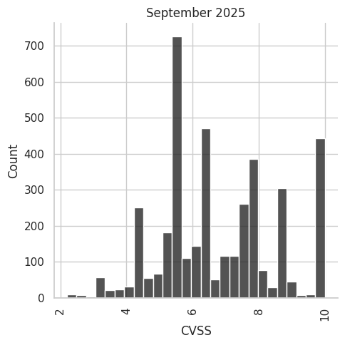
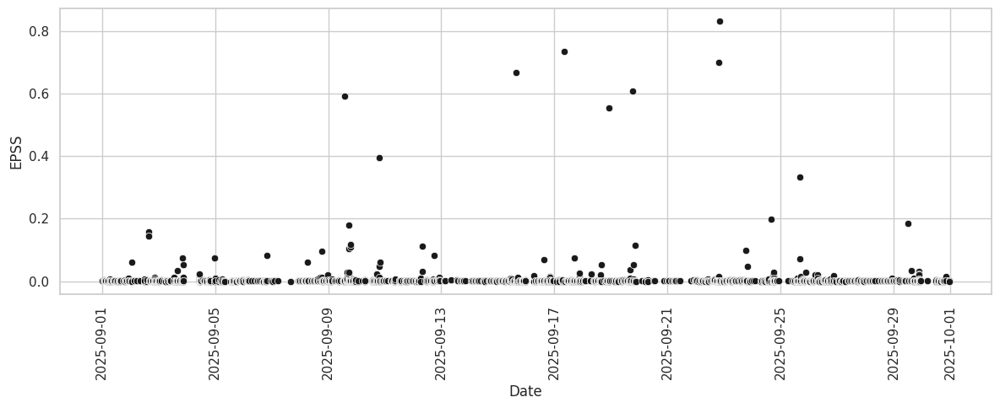
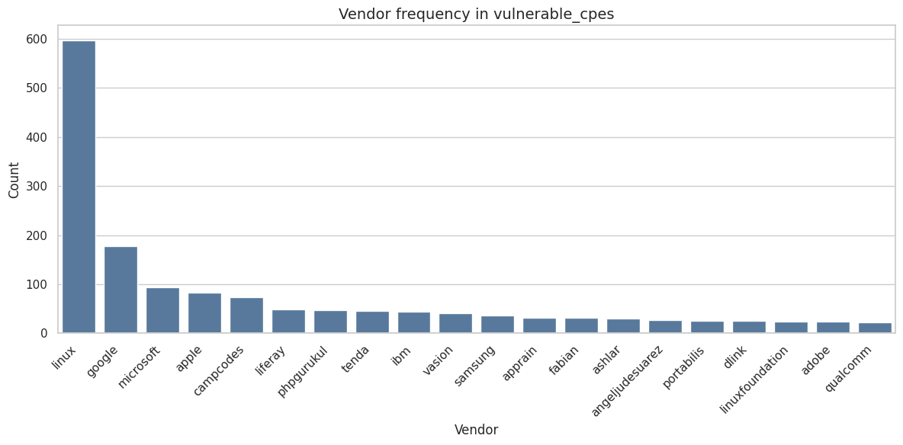
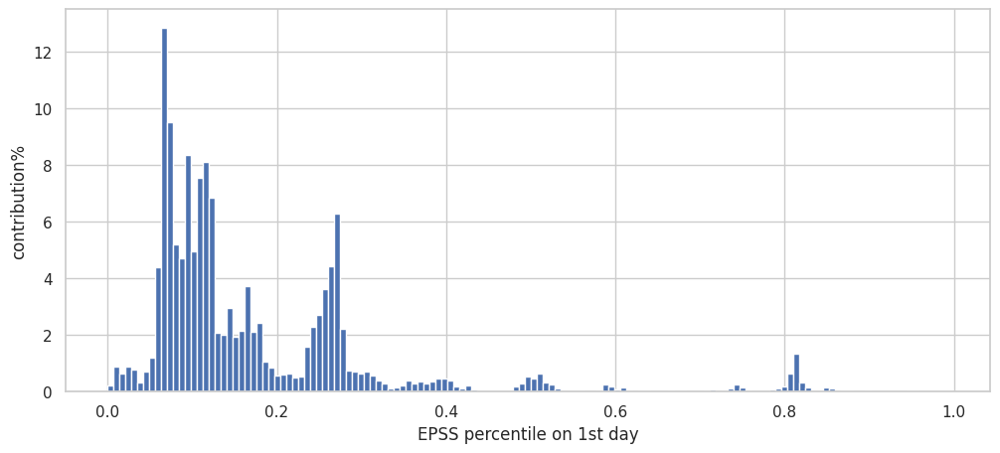
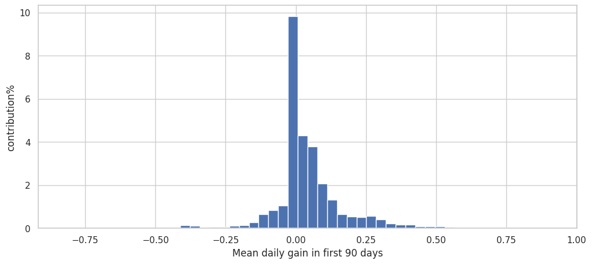
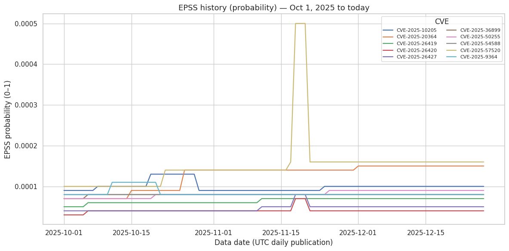

```python
import gzip
from io import BytesIO
from time import sleep

import numpy as np
import pandas
import pandas as pd
import os
import requests
import json
import csv
import shutil
from datetime import date, timedelta

from pandas import concat
from sklearn.model_selection import train_test_split
from sklearn.svm import OneClassSVM
```


```python
import seaborn as sns
import matplotlib.pyplot as plt

sns.set_theme(style="whitegrid")
```


```python
from preprocessing_utils import preprocess_NVD_data
```


```python
data_path = 'data'
if not os.path.exists(data_path):
    os.makedirs(data_path)
```

# EPSS data

Download the EPSS data from https://www.first.org/epss/data_stats into `data` folder


```python
base_url = "https://epss.empiricalsecurity.com/epss_scores-"
date_current = str(date.today() - timedelta(days=1))
epss_url = base_url + date_current + ".csv.gz"
epss_filename = "epss_scores-latest.csv"

response = requests.get(epss_url)
if response.status_code != 200:
    print("Error:", response.status_code)
else:
    with open(os.path.join(data_path, epss_filename), "wb") as f:
        f.write(gzip.decompress(response.content))
```


```python
epss_current = pd.read_csv(os.path.join(data_path, epss_filename), header=1)
epss_current  # a Python statement with a variable name at the end of a cell will display its contents below

```


<div>
<style scoped>
    .dataframe tbody tr th:only-of-type {
        vertical-align: middle;
    }

    .dataframe tbody tr th {
        vertical-align: top;
    }

    .dataframe thead th {
        text-align: right;
    }
</style>
<table border="1" class="dataframe">
  <thead>
    <tr style="text-align: right;">
      <th></th>
      <th>cve</th>
      <th>epss</th>
      <th>percentile</th>
    </tr>
  </thead>
  <tbody>
    <tr>
      <th>0</th>
      <td>CVE-1999-0001</td>
      <td>0.01151</td>
      <td>0.78020</td>
    </tr>
    <tr>
      <th>1</th>
      <td>CVE-1999-0002</td>
      <td>0.10546</td>
      <td>0.93015</td>
    </tr>
    <tr>
      <th>2</th>
      <td>CVE-1999-0003</td>
      <td>0.89352</td>
      <td>0.99521</td>
    </tr>
    <tr>
      <th>3</th>
      <td>CVE-1999-0004</td>
      <td>0.03037</td>
      <td>0.86249</td>
    </tr>
    <tr>
      <th>4</th>
      <td>CVE-1999-0005</td>
      <td>0.13652</td>
      <td>0.94021</td>
    </tr>
    <tr>
      <th>...</th>
      <td>...</td>
      <td>...</td>
      <td>...</td>
    </tr>
    <tr>
      <th>308071</th>
      <td>CVE-2025-9994</td>
      <td>0.00114</td>
      <td>0.30855</td>
    </tr>
    <tr>
      <th>308072</th>
      <td>CVE-2025-9996</td>
      <td>0.00241</td>
      <td>0.47334</td>
    </tr>
    <tr>
      <th>308073</th>
      <td>CVE-2025-9997</td>
      <td>0.00245</td>
      <td>0.47699</td>
    </tr>
    <tr>
      <th>308074</th>
      <td>CVE-2025-9998</td>
      <td>0.00022</td>
      <td>0.05357</td>
    </tr>
    <tr>
      <th>308075</th>
      <td>CVE-2025-9999</td>
      <td>0.00044</td>
      <td>0.13444</td>
    </tr>
  </tbody>
</table>
<p>308076 rows × 3 columns</p>
</div>


# NVD data


```python
base_url = "https://services.nvd.nist.gov/rest/json/cves/2.0"
date_start_NVD = '2025-09-01T00:00:00.000Z'  # Do NOT change these dates
date_end_NVD = '2025-10-01T00:00:00.000Z'  # Do NOT change these dates
start_index = 0
results_per_page = 1000
total_results = 1

candidate_cves = []
while start_index < total_results:
    params = {
        "pubStartDate": date_start_NVD,
        "pubEndDate": date_end_NVD,
        "resultsPerPage": results_per_page,
        "startIndex": start_index,
        "noRejected": ""
    }
    response = requests.get(base_url, params=params, timeout=6)
    if response.status_code != 200:
        print("Error:", response.status_code)
        break
    data = response.json()
    total_results = data.get("totalResults", 0)
    candidate_cves.extend(data.get("vulnerabilities", []))
    start_index += results_per_page
    print(start_index)
```

    1000
    2000
    3000
    4000
    5000


```python
# normalize and preprocess data
candidate_cves_df = pd.json_normalize(candidate_cves, record_path=None, sep='.', max_level=None)
candidate_cves_df = preprocess_NVD_data(candidate_cves_df)

# remove vulnerabilities marked as "reject" or "reserved"
candidate_cves_df = candidate_cves_df[
    (candidate_cves_df['cve.vulnStatus'] != 'Reserved') & (candidate_cves_df['cve.vulnStatus'] != 'Reject')]

# merge NVD and EPSS data
candidate_cves_df = candidate_cves_df.merge(epss_current, left_on="cve.id", right_on="cve", how="left")
```

# Exploratory Data Analysis

- display some examples (e.g., the first two CVE records)


```python
candidate_cves_df.head(2).T
```


<div>
<style scoped>
    .dataframe tbody tr th:only-of-type {
        vertical-align: middle;
    }

    .dataframe tbody tr th {
        vertical-align: top;
    }

    .dataframe thead th {
        text-align: right;
    }
</style>
<table border="1" class="dataframe">
  <thead>
    <tr style="text-align: right;">
      <th></th>
      <th>0</th>
      <th>1</th>
    </tr>
  </thead>
  <tbody>
    <tr>
      <th>cve.id</th>
      <td>CVE-2025-9751</td>
      <td>CVE-2025-9752</td>
    </tr>
    <tr>
      <th>cve.sourceIdentifier</th>
      <td>cna@vuldb.com</td>
      <td>cna@vuldb.com</td>
    </tr>
    <tr>
      <th>cve.published</th>
      <td>2025-09-01 00:15:34.580000</td>
      <td>2025-09-01 01:15:46.817000</td>
    </tr>
    <tr>
      <th>cve.lastModified</th>
      <td>2025-09-08 14:06:05.217000</td>
      <td>2025-09-04 18:47:25.440000</td>
    </tr>
    <tr>
      <th>cve.vulnStatus</th>
      <td>Analyzed</td>
      <td>Analyzed</td>
    </tr>
    <tr>
      <th>cve.references</th>
      <td>[{'url': 'https://github.com/HAO-RAY/HCR-CVE/i...</td>
      <td>[{'url': 'https://github.com/i-Corner/cve/issu...</td>
    </tr>
    <tr>
      <th>cve.cisaExploitAdd</th>
      <td>NaN</td>
      <td>NaN</td>
    </tr>
    <tr>
      <th>cve.cisaActionDue</th>
      <td>NaN</td>
      <td>NaN</td>
    </tr>
    <tr>
      <th>cve.cisaRequiredAction</th>
      <td>NaN</td>
      <td>NaN</td>
    </tr>
    <tr>
      <th>cve.cisaVulnerabilityName</th>
      <td>NaN</td>
      <td>NaN</td>
    </tr>
    <tr>
      <th>description</th>
      <td>A weakness has been identified in Campcodes On...</td>
      <td>A security vulnerability has been detected in ...</td>
    </tr>
    <tr>
      <th>vulnerable_cpes</th>
      <td>[cpe:2.3:a:campcodes:online_learning_managemen...</td>
      <td>[cpe:2.3:o:dlink:dir-852_firmware:1.00cn_b09:*...</td>
    </tr>
    <tr>
      <th>num_references</th>
      <td>6</td>
      <td>6</td>
    </tr>
    <tr>
      <th>cwe_list</th>
      <td>[CWE-74, CWE-89, CWE-89]</td>
      <td>[CWE-77, CWE-78, CWE-78]</td>
    </tr>
    <tr>
      <th>cvss_version</th>
      <td>3.1</td>
      <td>3.1</td>
    </tr>
    <tr>
      <th>cvss_vectorString</th>
      <td>CVSS:3.1/AV:N/AC:L/PR:N/UI:N/S:U/C:H/I:H/A:H</td>
      <td>CVSS:3.1/AV:N/AC:L/PR:N/UI:N/S:U/C:H/I:H/A:H</td>
    </tr>
    <tr>
      <th>cvss_baseScore</th>
      <td>9.8</td>
      <td>9.8</td>
    </tr>
    <tr>
      <th>cvss_baseSeverity</th>
      <td>CRITICAL</td>
      <td>CRITICAL</td>
    </tr>
    <tr>
      <th>cvss_attackVector</th>
      <td>NETWORK</td>
      <td>NETWORK</td>
    </tr>
    <tr>
      <th>cvss_attackComplexity</th>
      <td>LOW</td>
      <td>LOW</td>
    </tr>
    <tr>
      <th>cvss_privilegesRequired</th>
      <td>NONE</td>
      <td>NONE</td>
    </tr>
    <tr>
      <th>cvss_userInteraction</th>
      <td>NONE</td>
      <td>NONE</td>
    </tr>
    <tr>
      <th>cvss_scope</th>
      <td>UNCHANGED</td>
      <td>UNCHANGED</td>
    </tr>
    <tr>
      <th>cvss_confidentialityImpact</th>
      <td>HIGH</td>
      <td>HIGH</td>
    </tr>
    <tr>
      <th>cvss_integrityImpact</th>
      <td>HIGH</td>
      <td>HIGH</td>
    </tr>
    <tr>
      <th>cvss_availabilityImpact</th>
      <td>HIGH</td>
      <td>HIGH</td>
    </tr>
    <tr>
      <th>cve</th>
      <td>CVE-2025-9751</td>
      <td>CVE-2025-9752</td>
    </tr>
    <tr>
      <th>epss</th>
      <td>0.00039</td>
      <td>0.0055</td>
    </tr>
    <tr>
      <th>percentile</th>
      <td>0.11582</td>
      <td>0.67317</td>
    </tr>
  </tbody>
</table>
</div>


- show a bar plot with the daily volume of published CVEs


```python
published_counts = candidate_cves_df["cve.published"].dt.date.value_counts().sort_index()

plt.figure(figsize=(12, 5))
sns.barplot(x=published_counts.index, y=published_counts.values, color="k")
plt.xticks(rotation=90)
plt.xlabel("Date")
plt.ylabel("Number of CVEs Published")
plt.title("CVE Publications per Day")
plt.tight_layout()
plt.show()
```


    

    


- print the description of the last ten published vulnerabilities


```python
for idx, x in enumerate(candidate_cves_df.sort_values('cve.published', ascending=False)[:10].iterrows()):
    print('-' * 100)
    print(x[1]['cve.id'], x[1]['cve.published'])
    print(x[1].description)

```

    ----------------------------------------------------------------------------------------------------
    CVE-2025-61792 2025-09-30 23:15:29.700000
    Quadient DS-700 iQ devices through 2025-09-30 might have a race condition during the quick clicking of (in order) the Question Mark button, the Help Button, the About button, and the Help Button, leading to a transition out of kiosk mode into local administrative access. NOTE: the reporter indicates that the "behavior was observed sporadically" during "limited time on the client site," making it not "possible to gain more information about the specific kiosk mode crashing issue," and the only conclusion was "there appears to be some form of race condition." Accordingly, there can be doubt that a reproducible cybersecurity vulnerability was identified; sporadic software crashes can also be caused by a hardware fault on a single device (for example, transient RAM errors). The reporter also describes a variety of other issues, including initial access via USB because of the absence of a "lock-pick resistant locking solution for the External Controller PC cabinet," which is not a cybersecurity vulnerability (section 4.1.5 of the CNA Operational Rules). Finally, it is unclear whether the device or OS configuration was inappropriate, given that the risks are typically limited to insider threats within the mail operations room of a large company.
    ----------------------------------------------------------------------------------------------------
    CVE-2025-55191 2025-09-30 23:15:29.533000
    Argo CD is a declarative, GitOps continuous delivery tool for Kubernetes. Versions between 2.1.0 and 2.14.19, 3.2.0-rc1, 3.1.0-rc1 through 3.1.7, and 3.0.0-rc1 through 3.0.18 contain a race condition in the repository credentials handler that can cause the Argo CD server to panic and crash when concurrent operations are performed on the same repository URL. The vulnerability is located in numerous repository related handlers in the util/db/repository_secrets.go file. A valid API token with repositories resource permissions (create, update, or delete actions) is required to trigger the race condition. This vulnerability causes the entire Argo CD server to crash and become unavailable. Attackers can repeatedly and continuously trigger the race condition to maintain a denial-of-service state, disrupting all GitOps operations. This issue is fixed in versions 2.14.20, 3.2.0-rc2, 3.1.8 and 3.0.19.
    ----------------------------------------------------------------------------------------------------
    CVE-2025-43826 2025-09-30 23:15:29.160000
    Stored cross-site scripting (XSS) vulnerabilities in Web Content translation in Liferay Portal 7.4.0 through 7.4.3.112, and older unsupported versions, and Liferay DXP 2023.Q4.0 through 2023.Q4.8, 2023.Q3.1 through 2023.Q3.10, 7.4 GA through update 92, and older unsupported versions allow remote attackers to inject arbitrary web script or HTML via any rich text field in a web content article.
    ----------------------------------------------------------------------------------------------------
    CVE-2025-24525 2025-09-30 23:15:27.970000
    Keysight Ixia Vision has an issue with hardcoded cryptographic material 
    which may allow an attacker to intercept or decrypt payloads sent to the
     device via API calls or user authentication if the end user does not 
    replace the TLS certificate that shipped with the device. Remediation is
     available in Version 6.9.1, released on September 23, 2025.
    ----------------------------------------------------------------------------------------------------
    CVE-2025-56392 2025-09-30 20:15:39.997000
    An Insecure Direct Object Reference (IDOR) in the /dashboard/notes endpoint of Syaqui Collegetivity v1.0.0 allows attackers to impersonate other users and perform arbitrary operations via a crafted POST request.
    ----------------------------------------------------------------------------------------------------
    CVE-2025-36262 2025-09-30 20:15:37.993000
    IBM Planning Analytics Local 2.0.0 through 2.0.106 and 2.1.0 through 2.1.13 
    
    could allow a malicious privileged user to bypass the UI to gain unauthorized access to sensitive information due to the improper validation of input.
    ----------------------------------------------------------------------------------------------------
    CVE-2025-36132 2025-09-30 20:15:37.810000
    IBM Planning Analytics Local 2.0.0 through 2.0.106 and 2.1.0 through 2.1.13 is vulnerable to cross-site scripting. This vulnerability allows an authenticated user to embed arbitrary JavaScript code in the Web UI thus altering the intended functionality potentially leading to credentials disclosure within a trusted session.
    ----------------------------------------------------------------------------------------------------
    CVE-2025-10659 2025-09-30 20:15:36.450000
    The Telenium Online Web Application is vulnerable due to a PHP endpoint accessible to unauthenticated network users that improperly handles user-supplied input. This vulnerability occurs due to the insecure termination of a regular expression check within the endpoint. Because the input is not correctly validated or sanitized, an unauthenticated attacker can inject arbitrary operating system commands through a crafted HTTP request, leading to remote code execution on the server in the context of the web application service account.
    ----------------------------------------------------------------------------------------------------
    CVE-2024-55017 2025-09-30 20:15:36.100000
    Account Takeover in Corezoid 6.6.0 in the OAuth2 implementation via an open redirect in the redirect_uri parameter allows attackers to intercept authorization codes and gain unauthorized access to victim accounts.
    ----------------------------------------------------------------------------------------------------
    CVE-2025-56132 2025-09-30 19:15:37.253000
    LiquidFiles filetransfer server is vulnerable to a user enumeration issue in its password reset functionality. The application returns distinguishable responses for valid and invalid email addresses, allowing unauthenticated attackers to determine the existence of user accounts. Version 4.2 introduces user-based lockout mechanisms to mitigate brute-force attacks, user enumeration remains possible by default. In versions prior to 4.2, no such user-level protection is in place, only basic IP-based rate limiting is enforced. This IP-based protection can be bypassed by distributing requests across multiple IPs (e.g., rotating IP or proxies). Effectively bypassing both login and password reset security controls. Successful exploitation allows an attacker to enumerate valid email addresses registered for the application, increasing the risk of follow-up attacks such as password spraying.


We keep track of some information to help us later on.


```python
dropped_columns = []
```

- What is the percentage of CVEs which received a CVSS score?


```python
print(f"{(candidate_cves_df["cvss_baseScore"].count() / len(candidate_cves_df)) * 100:.02f}%")
```

    92.90%


- Report descriptive statistics of CVSS the CVSS base score and/or show its distribution


```python
candidate_cves_df.info()
```

    <class 'pandas.core.frame.DataFrame'>
    RangeIndex: 4322 entries, 0 to 4321
    Data columns (total 29 columns):
     #   Column                      Non-Null Count  Dtype         
    ---  ------                      --------------  -----         
     0   cve.id                      4322 non-null   object        
     1   cve.sourceIdentifier        4322 non-null   object        
     2   cve.published               4322 non-null   datetime64[ns]
     3   cve.lastModified            4322 non-null   datetime64[ns]
     4   cve.vulnStatus              4322 non-null   object        
     5   cve.references              4322 non-null   object        
     6   cve.cisaExploitAdd          14 non-null     object        
     7   cve.cisaActionDue           14 non-null     object        
     8   cve.cisaRequiredAction      14 non-null     object        
     9   cve.cisaVulnerabilityName   14 non-null     object        
     10  description                 4322 non-null   object        
     11  vulnerable_cpes             4322 non-null   object        
     12  num_references              4322 non-null   int64         
     13  cwe_list                    4322 non-null   object        
     14  cvss_version                4015 non-null   object        
     15  cvss_vectorString           4015 non-null   object        
     16  cvss_baseScore              4015 non-null   float64       
     17  cvss_baseSeverity           4015 non-null   category      
     18  cvss_attackVector           4015 non-null   object        
     19  cvss_attackComplexity       4015 non-null   object        
     20  cvss_privilegesRequired     4015 non-null   object        
     21  cvss_userInteraction        4015 non-null   object        
     22  cvss_scope                  4015 non-null   object        
     23  cvss_confidentialityImpact  4015 non-null   object        
     24  cvss_integrityImpact        4015 non-null   object        
     25  cvss_availabilityImpact     4015 non-null   object        
     26  cve                         4322 non-null   object        
     27  epss                        4322 non-null   float64       
     28  percentile                  4322 non-null   float64       
    dtypes: category(1), datetime64[ns](2), float64(3), int64(1), object(22)
    memory usage: 950.0+ KB


We see that feature 6, 7, 8, and 9 have a very small amount of non null values. Therefore, we drop those columns to reduce dimensionality. We also remove all CVEs withtout CVSS data.


```python
dropped_columns = ["cve.cisaExploitAdd", "cve.cisaActionDue", "cve.cisaRequiredAction", "cve.cisaVulnerabilityName"]
candidate_cves_df = candidate_cves_df.drop(columns=dropped_columns).dropna()
```

Here we print some statistics about CVSS base score and we show its distribution related to publication date.


```python
candidate_cves_df["cvss_baseScore"].describe()
```


    count    4015.000000
    mean        6.773898
    std         1.735108
    min         2.200000
    25%         5.500000
    50%         6.500000
    75%         7.800000
    max        10.000000
    Name: cvss_baseScore, dtype: float64


```python
plt.figure(figsize=(12, 5))
sns.displot(x=candidate_cves_df["cvss_baseScore"], color="k")
plt.xticks(rotation=90)
plt.xlabel("CVSS")
plt.ylabel("Count")
plt.title("September 2025")
plt.tight_layout()
plt.show()
```


    <Figure size 1200x500 with 0 Axes>


    

    


It would seem that a relatively high number of CVEs published in september 2025 have a very high CVSS.


```python
plt.figure(figsize=(12, 5))
sns.scatterplot(x=candidate_cves_df["cve.published"], y=candidate_cves_df["cvss_baseScore"], color="k")
plt.xticks(rotation=90)
plt.xlabel("Date")
plt.ylabel("CVSS")
plt.tight_layout()
plt.show()

```


    

    


- #### Report descriptive statistics of EPSS and/or show its distribution

Here we print some statistics about EPSS base score and we show its distribution related to publication date.


```python
candidate_cves_df["epss"].describe()
```


    count    4015.000000
    mean        0.002853
    std         0.030654
    min         0.000020
    25%         0.000190
    50%         0.000410
    75%         0.000570
    max         0.831590
    Name: epss, dtype: float64


```python
plt.figure(figsize=(12, 5))
sns.scatterplot(x=candidate_cves_df["cve.published"], y=candidate_cves_df["epss"], color="k")
plt.xticks(rotation=90)
plt.xlabel("Date")
plt.ylabel("EPSS")
plt.tight_layout()
plt.show()

```


    

    


It is evident that, except for a couple of outliers, on average the EPSS is extremely low.

- #### Produce a scatter plot showing CVSS vs EPSS


```python
plt.figure(figsize=(12, 5))
sns.scatterplot(x=candidate_cves_df["cvss_baseScore"], y=candidate_cves_df["epss"], color="k")
plt.xticks(rotation=90)
plt.xlabel("CVSS")
plt.ylabel("EPSS")
plt.title("September 2025")
plt.tight_layout()
plt.show()
```


    

    


As we can see, the CVSS and EPSS are not really related with each other, even though the only times the EPSS is high enough, it's in the presence of an equally high CVSS. We can further visualize this lack of correlation with a correlation matrix:


```python
plt.figure(figsize=(8, 6))
sns.heatmap(candidate_cves_df[["cvss_baseScore", "epss", "percentile"]].corr(), annot=True, cmap="coolwarm")
plt.title("September 2025")
plt.show()
```


    

    


- #### Extra analysis - Top 20 most frequent vendors


```python
vendor = (
    candidate_cves_df['vulnerable_cpes']
      .astype(str)
      .str.strip()
      .str.split(':')
      .str[3]
      .replace('', np.nan)
)


vendor_counts = (
    vendor
    .dropna()
    .value_counts(dropna=False)
    .rename_axis('vendor')
    .reset_index(name='count')
)

vendor_counts = vendor_counts.sort_values('count', ascending=False)
```


```python
plt.figure(figsize=(12, 6))
top_n = 20
plot_df = vendor_counts.head(top_n)

ax = sns.barplot(data=plot_df, x='vendor', y='count', color='#4C78A8')
ax.set_title('Vendor frequency in vulnerable_cpes', fontsize=14)
ax.set_xlabel('Vendor', fontsize=12)
ax.set_ylabel('Count', fontsize=12)
plt.xticks(rotation=45, ha='right')
plt.tight_layout()
plt.show()
```


    

    


### <font color='blue'><b><i>TODO</i></b>
- Track the EPSS of your CVEs over time


As per specification, we start by filtering the CVEs with low EPSS (<1%), removing all features we will not need, and turning the remaining ones into categorical.


```python
candidate_cves_df = candidate_cves_df[candidate_cves_df['percentile'] <= 0.01].drop(columns=["epss", "percentile", "cve", "cve.published", "cve.lastModified", "cvss_version", "cve.references", "num_references", "vulnerable_cpes"])
```


```python
cols_to_cat = ["cve.sourceIdentifier", "cve.vulnStatus", "cvss_vectorString", "cvss_baseSeverity", "cvss_attackVector",
               "cvss_attackComplexity", "cvss_privilegesRequired", "cvss_userInteraction", "cvss_scope",
               "cvss_confidentialityImpact", "cvss_integrityImpact",
               "cvss_availabilityImpact"]
candidate_cves_df[cols_to_cat] = candidate_cves_df[cols_to_cat].astype('category')
candidate_cves_df.info()
# save the final dataframe
candidate_cves_df.to_csv(os.path.join(data_path, "candidate_cves_df.csv"))
```

    <class 'pandas.core.frame.DataFrame'>
    Index: 167 entries, 20 to 4304
    Data columns (total 16 columns):
     #   Column                      Non-Null Count  Dtype   
    ---  ------                      --------------  -----   
     0   cve.id                      167 non-null    object  
     1   cve.sourceIdentifier        167 non-null    category
     2   cve.vulnStatus              167 non-null    category
     3   description                 167 non-null    object  
     4   cwe_list                    167 non-null    object  
     5   cvss_vectorString           167 non-null    category
     6   cvss_baseScore              167 non-null    float64 
     7   cvss_baseSeverity           167 non-null    category
     8   cvss_attackVector           167 non-null    category
     9   cvss_attackComplexity       167 non-null    category
     10  cvss_privilegesRequired     167 non-null    category
     11  cvss_userInteraction        167 non-null    category
     12  cvss_scope                  167 non-null    category
     13  cvss_confidentialityImpact  167 non-null    category
     14  cvss_integrityImpact        167 non-null    category
     15  cvss_availabilityImpact     167 non-null    category
    dtypes: category(12), float64(1), object(3)
    memory usage: 12.0+ KB


## Downloading NVD 2022-2025 database
We start by downloading all the CVEs that have been published between 2022 and 2024. This is because EPSS data is only available from 2021, and since we want to analyze CVEs behavior from when they were published, we need CVEs from after 2021.


```python
base_url = "https://nvd.nist.gov/feeds/json/cve/2.0/nvdcve-2.0-"
ext = ".json.gz"
NVD_API_KEY = "c13c3940-8ebd-4073-ad37-d2507719f385" # insert your key

base_url = "https://services.nvd.nist.gov/rest/json/cves/2.0"
cve_date_start = date(2022, 1, 1)
cve_date_end = date(2025, 6, 1)
cve_window_start = cve_date_start
cves = []

while cve_window_start + timedelta(days=30) <= cve_date_end:
    start_index = 0
    results_per_page = 1000
    total_results = 1
    date_start_NVD = f'{cve_window_start}T00:00:00.001Z'
    date_end_NVD = f'{cve_window_start + timedelta(days=30)}T00:00:00.000Z'
    print(f"Downloading CVEs between {date_start_NVD} and {date_end_NVD}...")
    while start_index < total_results:
        params = {
            "pubStartDate": date_start_NVD,
            "pubEndDate": date_end_NVD,
            "resultsPerPage": results_per_page,
            "startIndex": start_index,
            "noRejected": "",
            #"apiKey": NVD_API_KEY
        }
        response = requests.get(base_url, params=params, timeout=6)
        if response.status_code != 200:
            print("Error:", response.status_code)
            break
        data = response.json()
        total_results = data.get("totalResults", 0)
        cves.extend(data.get("vulnerabilities", []))
        start_index += results_per_page
        print(start_index)
        sleep(1)
    sleep(5)
    cve_window_start += timedelta(days=30)
```

    Downloading CVEs between 2022-01-01T00:00:00.001Z and 2022-01-31T00:00:00.000Z...
    1000
    2000
    Downloading CVEs between 2022-01-31T00:00:00.001Z and 2022-03-02T00:00:00.000Z...
    1000
    2000
    3000
    Downloading CVEs between 2022-03-02T00:00:00.001Z and 2022-04-01T00:00:00.000Z...
    1000
    2000
    3000
    Downloading CVEs between 2022-04-01T00:00:00.001Z and 2022-05-01T00:00:00.000Z...
    1000
    2000
    3000
    Downloading CVEs between 2022-05-01T00:00:00.001Z and 2022-05-31T00:00:00.000Z...
    1000
    2000
    Downloading CVEs between 2022-05-31T00:00:00.001Z and 2022-06-30T00:00:00.000Z...
    1000
    2000
    3000
    Downloading CVEs between 2022-06-30T00:00:00.001Z and 2022-07-30T00:00:00.000Z...
    1000
    2000
    3000
    Downloading CVEs between 2022-07-30T00:00:00.001Z and 2022-08-29T00:00:00.000Z...
    1000
    2000
    3000
    Downloading CVEs between 2022-08-29T00:00:00.001Z and 2022-09-28T00:00:00.000Z...
    1000
    2000
    3000
    Downloading CVEs between 2022-09-28T00:00:00.001Z and 2022-10-28T00:00:00.000Z...
    1000
    2000
    Downloading CVEs between 2022-10-28T00:00:00.001Z and 2022-11-27T00:00:00.000Z...
    1000
    2000
    Downloading CVEs between 2022-11-27T00:00:00.001Z and 2022-12-27T00:00:00.000Z...
    1000
    2000
    3000
    Downloading CVEs between 2022-12-27T00:00:00.001Z and 2023-01-26T00:00:00.000Z...
    1000
    2000
    3000
    Downloading CVEs between 2023-01-26T00:00:00.001Z and 2023-02-25T00:00:00.000Z...
    1000
    2000
    3000
    Downloading CVEs between 2023-02-25T00:00:00.001Z and 2023-03-27T00:00:00.000Z...
    1000
    2000
    3000
    Downloading CVEs between 2023-03-27T00:00:00.001Z and 2023-04-26T00:00:00.000Z...
    1000
    2000
    3000
    Downloading CVEs between 2023-04-26T00:00:00.001Z and 2023-05-26T00:00:00.000Z...
    1000
    2000
    3000
    Downloading CVEs between 2023-05-26T00:00:00.001Z and 2023-06-25T00:00:00.000Z...
    1000
    2000
    3000
    Downloading CVEs between 2023-06-25T00:00:00.001Z and 2023-07-25T00:00:00.000Z...
    1000
    2000
    3000
    Downloading CVEs between 2023-07-25T00:00:00.001Z and 2023-08-24T00:00:00.000Z...
    1000
    2000
    3000
    Downloading CVEs between 2023-08-24T00:00:00.001Z and 2023-09-23T00:00:00.000Z...
    1000
    2000
    3000
    Downloading CVEs between 2023-09-23T00:00:00.001Z and 2023-10-23T00:00:00.000Z...
    1000
    2000
    3000
    Downloading CVEs between 2023-10-23T00:00:00.001Z and 2023-11-22T00:00:00.000Z...
    1000
    2000
    3000
    Downloading CVEs between 2023-11-22T00:00:00.001Z and 2023-12-22T00:00:00.000Z...
    1000
    2000
    3000
    Downloading CVEs between 2023-12-22T00:00:00.001Z and 2024-01-21T00:00:00.000Z...
    1000
    2000
    3000
    Downloading CVEs between 2024-01-21T00:00:00.001Z and 2024-02-20T00:00:00.000Z...
    1000
    2000
    3000
    Downloading CVEs between 2024-02-20T00:00:00.001Z and 2024-03-21T00:00:00.000Z...
    1000
    2000
    3000
    4000
    Downloading CVEs between 2024-03-21T00:00:00.001Z and 2024-04-20T00:00:00.000Z...
    1000
    2000
    3000
    4000
    5000
    Downloading CVEs between 2024-04-20T00:00:00.001Z and 2024-05-20T00:00:00.000Z...
    1000
    2000
    3000
    4000
    5000
    Downloading CVEs between 2024-05-20T00:00:00.001Z and 2024-06-19T00:00:00.000Z...
    1000
    2000
    3000
    4000
    Downloading CVEs between 2024-06-19T00:00:00.001Z and 2024-07-19T00:00:00.000Z...
    1000
    2000
    3000
    4000
    Downloading CVEs between 2024-07-19T00:00:00.001Z and 2024-08-18T00:00:00.000Z...
    1000
    2000
    3000
    Downloading CVEs between 2024-08-18T00:00:00.001Z and 2024-09-17T00:00:00.000Z...
    1000
    2000
    3000
    Downloading CVEs between 2024-09-17T00:00:00.001Z and 2024-10-17T00:00:00.000Z...
    1000
    2000
    3000
    Downloading CVEs between 2024-10-17T00:00:00.001Z and 2024-11-16T00:00:00.000Z...
    1000
    2000
    3000
    4000
    5000
    Downloading CVEs between 2024-11-16T00:00:00.001Z and 2024-12-16T00:00:00.000Z...
    1000
    2000
    3000
    4000
    Downloading CVEs between 2024-12-16T00:00:00.001Z and 2025-01-15T00:00:00.000Z...
    1000
    2000
    3000
    4000
    Downloading CVEs between 2025-01-15T00:00:00.001Z and 2025-02-14T00:00:00.000Z...
    1000
    2000
    3000
    4000
    Downloading CVEs between 2025-02-14T00:00:00.001Z and 2025-03-16T00:00:00.000Z...
    1000
    2000
    3000
    4000
    Downloading CVEs between 2025-03-16T00:00:00.001Z and 2025-04-15T00:00:00.000Z...
    1000
    2000
    3000
    4000
    5000
    Downloading CVEs between 2025-04-15T00:00:00.001Z and 2025-05-15T00:00:00.000Z...
    1000
    2000
    3000
    4000
    Error: 429


```python
# normalize and preprocess data
cves_df = pd.json_normalize(cves, record_path=None, sep='.', max_level=None)
cves_df = preprocess_NVD_data(cves_df)
```


```python
# remove vulnerabilities marked as "reject" or "reserved"
cves_df = cves_df[(cves_df['cve.vulnStatus'] != 'Reserved') & (cves_df['cve.vulnStatus'] != 'Reject')]
```


```python
cves_df.describe()
```


<div>
<style scoped>
    .dataframe tbody tr th:only-of-type {
        vertical-align: middle;
    }

    .dataframe tbody tr th {
        vertical-align: top;
    }

    .dataframe thead th {
        text-align: right;
    }
</style>
<table border="1" class="dataframe">
  <thead>
    <tr style="text-align: right;">
      <th></th>
      <th>cve.published</th>
      <th>cve.lastModified</th>
      <th>num_references</th>
      <th>cvss_baseScore</th>
    </tr>
  </thead>
  <tbody>
    <tr>
      <th>count</th>
      <td>111888</td>
      <td>111888</td>
      <td>111888.000000</td>
      <td>111053.000000</td>
    </tr>
    <tr>
      <th>mean</th>
      <td>2023-11-29 17:34:50.145608192</td>
      <td>2025-02-08 05:55:14.759742208</td>
      <td>3.717905</td>
      <td>7.004528</td>
    </tr>
    <tr>
      <th>min</th>
      <td>2022-01-01 00:15:08.057000</td>
      <td>2024-07-31 12:57:02.300000</td>
      <td>1.000000</td>
      <td>0.000000</td>
    </tr>
    <tr>
      <th>25%</th>
      <td>2023-02-08 19:15:11.409250048</td>
      <td>2024-11-21 07:19:55.312499968</td>
      <td>2.000000</td>
      <td>5.500000</td>
    </tr>
    <tr>
      <th>50%</th>
      <td>2024-01-24 02:45:07.666500096</td>
      <td>2024-11-21 09:32:53.486500096</td>
      <td>2.000000</td>
      <td>7.100000</td>
    </tr>
    <tr>
      <th>75%</th>
      <td>2024-10-11 13:15:16.226999808</td>
      <td>2025-04-15 18:02:13.699749888</td>
      <td>4.000000</td>
      <td>8.100000</td>
    </tr>
    <tr>
      <th>max</th>
      <td>2025-05-14 20:15:21.927000</td>
      <td>2025-12-24 14:15:46.227000</td>
      <td>287.000000</td>
      <td>10.000000</td>
    </tr>
    <tr>
      <th>std</th>
      <td>NaN</td>
      <td>NaN</td>
      <td>3.660688</td>
      <td>1.704474</td>
    </tr>
  </tbody>
</table>
</div>


```python
cves_df.isnull().sum()
```


    cve.id                             0
    cve.sourceIdentifier               0
    cve.published                      0
    cve.lastModified                   0
    cve.vulnStatus                     0
    cve.references                     0
    cve.cisaExploitAdd            111365
    cve.cisaActionDue             111365
    cve.cisaRequiredAction        111365
    cve.cisaVulnerabilityName     111365
    cve.evaluatorComment          111878
    description                        0
    vulnerable_cpes                    0
    num_references                     0
    cwe_list                           0
    cvss_version                     835
    cvss_vectorString                835
    cvss_baseScore                   835
    cvss_baseSeverity                837
    cvss_attackVector                835
    cvss_attackComplexity            835
    cvss_privilegesRequired          835
    cvss_userInteraction             835
    cvss_scope                       835
    cvss_confidentialityImpact       835
    cvss_integrityImpact             835
    cvss_availabilityImpact          835
    dtype: int64


Some features have a high number of missing values, so we drop the columns directly. Due to the sheer amount of samples, we also remove all the rows that have a missing value. Since we will aggregate data from all the CVEs' histories, we also drop date-related columns.


```python
X = cves_df.drop(columns=["cve.cisaExploitAdd", "cve.evaluatorComment", "cve.cisaActionDue", "cve.cisaRequiredAction",
                          "cve.cisaVulnerabilityName", "cve.published", "cve.lastModified"]).dropna()
X.info()
```

    <class 'pandas.core.frame.DataFrame'>
    Index: 111051 entries, 0 to 111887
    Data columns (total 20 columns):
     #   Column                      Non-Null Count   Dtype   
    ---  ------                      --------------   -----   
     0   cve.id                      111051 non-null  object  
     1   cve.sourceIdentifier        111051 non-null  object  
     2   cve.vulnStatus              111051 non-null  object  
     3   cve.references              111051 non-null  object  
     4   description                 111051 non-null  object  
     5   vulnerable_cpes             111051 non-null  object  
     6   num_references              111051 non-null  int64   
     7   cwe_list                    111051 non-null  object  
     8   cvss_version                111051 non-null  object  
     9   cvss_vectorString           111051 non-null  object  
     10  cvss_baseScore              111051 non-null  float64 
     11  cvss_baseSeverity           111051 non-null  category
     12  cvss_attackVector           111051 non-null  object  
     13  cvss_attackComplexity       111051 non-null  object  
     14  cvss_privilegesRequired     111051 non-null  object  
     15  cvss_userInteraction        111051 non-null  object  
     16  cvss_scope                  111051 non-null  object  
     17  cvss_confidentialityImpact  111051 non-null  object  
     18  cvss_integrityImpact        111051 non-null  object  
     19  cvss_availabilityImpact     111051 non-null  object  
    dtypes: category(1), float64(1), int64(1), object(17)
    memory usage: 17.1+ MB


```python
X.head(3).T
```


<div>
<style scoped>
    .dataframe tbody tr th:only-of-type {
        vertical-align: middle;
    }

    .dataframe tbody tr th {
        vertical-align: top;
    }

    .dataframe thead th {
        text-align: right;
    }
</style>
<table border="1" class="dataframe">
  <thead>
    <tr style="text-align: right;">
      <th></th>
      <th>0</th>
      <th>1</th>
      <th>2</th>
    </tr>
  </thead>
  <tbody>
    <tr>
      <th>cve.id</th>
      <td>CVE-2021-45929</td>
      <td>CVE-2021-45944</td>
      <td>CVE-2021-45946</td>
    </tr>
    <tr>
      <th>cve.sourceIdentifier</th>
      <td>cve@mitre.org</td>
      <td>cve@mitre.org</td>
      <td>cve@mitre.org</td>
    </tr>
    <tr>
      <th>cve.vulnStatus</th>
      <td>Modified</td>
      <td>Modified</td>
      <td>Modified</td>
    </tr>
    <tr>
      <th>cve.references</th>
      <td>[{'url': 'https://bugs.chromium.org/p/oss-fuzz...</td>
      <td>[{'url': 'https://bugs.chromium.org/p/oss-fuzz...</td>
      <td>[{'url': 'https://bugs.chromium.org/p/oss-fuzz...</td>
    </tr>
    <tr>
      <th>description</th>
      <td>Wasm3 0.5.0 has an out-of-bounds write in Comp...</td>
      <td>Ghostscript GhostPDL 9.50 through 9.53.3 has a...</td>
      <td>Wasm3 0.5.0 has an out-of-bounds write in Comp...</td>
    </tr>
    <tr>
      <th>vulnerable_cpes</th>
      <td>[cpe:2.3:a:wasm3_project:wasm3:0.5.0:*:*:*:*:*...</td>
      <td>[cpe:2.3:a:artifex:ghostscript:*:*:*:*:*:*:*:*...</td>
      <td>[cpe:2.3:a:wasm3_project:wasm3:0.5.0:*:*:*:*:*...</td>
    </tr>
    <tr>
      <th>num_references</th>
      <td>4</td>
      <td>14</td>
      <td>4</td>
    </tr>
    <tr>
      <th>cwe_list</th>
      <td>[CWE-787]</td>
      <td>[CWE-416]</td>
      <td>[CWE-787]</td>
    </tr>
    <tr>
      <th>cvss_version</th>
      <td>3.1</td>
      <td>3.1</td>
      <td>3.1</td>
    </tr>
    <tr>
      <th>cvss_vectorString</th>
      <td>CVSS:3.1/AV:L/AC:L/PR:N/UI:R/S:U/C:N/I:N/A:H</td>
      <td>CVSS:3.1/AV:L/AC:L/PR:N/UI:R/S:U/C:N/I:N/A:H</td>
      <td>CVSS:3.1/AV:L/AC:L/PR:N/UI:R/S:U/C:N/I:N/A:H</td>
    </tr>
    <tr>
      <th>cvss_baseScore</th>
      <td>5.5</td>
      <td>5.5</td>
      <td>5.5</td>
    </tr>
    <tr>
      <th>cvss_baseSeverity</th>
      <td>MEDIUM</td>
      <td>MEDIUM</td>
      <td>MEDIUM</td>
    </tr>
    <tr>
      <th>cvss_attackVector</th>
      <td>LOCAL</td>
      <td>LOCAL</td>
      <td>LOCAL</td>
    </tr>
    <tr>
      <th>cvss_attackComplexity</th>
      <td>LOW</td>
      <td>LOW</td>
      <td>LOW</td>
    </tr>
    <tr>
      <th>cvss_privilegesRequired</th>
      <td>NONE</td>
      <td>NONE</td>
      <td>NONE</td>
    </tr>
    <tr>
      <th>cvss_userInteraction</th>
      <td>REQUIRED</td>
      <td>REQUIRED</td>
      <td>REQUIRED</td>
    </tr>
    <tr>
      <th>cvss_scope</th>
      <td>UNCHANGED</td>
      <td>UNCHANGED</td>
      <td>UNCHANGED</td>
    </tr>
    <tr>
      <th>cvss_confidentialityImpact</th>
      <td>NONE</td>
      <td>NONE</td>
      <td>NONE</td>
    </tr>
    <tr>
      <th>cvss_integrityImpact</th>
      <td>NONE</td>
      <td>NONE</td>
      <td>NONE</td>
    </tr>
    <tr>
      <th>cvss_availabilityImpact</th>
      <td>HIGH</td>
      <td>HIGH</td>
      <td>HIGH</td>
    </tr>
  </tbody>
</table>
</div>


Since all CVEs share the same CVSS version, we can remove that column from our dataset.


```python
X = X.drop(columns="cvss_version")
```

Even though the number of references and cpes could be very useful, since they refer to the status of the CVE at the moment of download and do not contain time series data, we cannot use them to asses how the CVE evolved during its first months after publication. For this reason, we drop those columns too from our dataset.


```python
X = X.drop(columns=["cve.references", "num_references", "vulnerable_cpes"])

```

We now transform all remaining variables into categorial ones.


```python
cols_to_cat = ["cve.sourceIdentifier", "cve.vulnStatus", "cvss_vectorString", "cvss_baseSeverity", "cvss_attackVector",
               "cvss_attackComplexity", "cvss_privilegesRequired", "cvss_userInteraction", "cvss_scope",
               "cvss_confidentialityImpact", "cvss_integrityImpact",
               "cvss_availabilityImpact"]
X[cols_to_cat] = X[cols_to_cat].astype('category')
```


```python
X.to_csv(os.path.join(data_path, "cves_df.csv"))
```

## Downloading historical EPSS data

For each CVE, we download its complete EPSS history. We take all CVEs that started with a percentile value < 1% and we calculate the following metrics for their first 3 months after publication:
- $\frac{\sum_{t=1}^{T}pct_{i,t}-pct_{i,0}}{T}, T = 90$
- $\text{max}_t(pct_{i,t}-pct_{i,0}), t\in[1,...,90]$


```python
window = 90

start_date = date(2022, 1, 1)
end_date = date(2025, 6, 1) + timedelta(days=window)
epss_path = os.path.join(data_path, "epss_history")
os.makedirs(epss_path, exist_ok=True)
while start_date <= end_date:
    url = "https://epss.empiricalsecurity.com/epss_scores-{:%Y-%m-%d}.csv.gz".format(start_date)
    filename = os.path.join(epss_path, f"epss_scores-{start_date:%Y-%m-%d}.csv.gz")

    # Skip if already downloaded
    if os.path.exists(filename):
        print(f"Skipping {filename} (already exists)")
    else:
        print(f"Downloading {url}...")
        response = requests.get(url)
        if response.status_code == 200:
            with open(filename, "wb") as f:
                f.write(response.content)
            print(f"Saved to {filename}")
        else:
            print(f"No file for {start_date:%Y-%m-%d} (HTTP {response.status_code})")
        sleep(1)
    start_date += timedelta(days=1)

print("Download complete.")
```

    Downloading https://epss.empiricalsecurity.com/epss_scores-2022-01-01.csv.gz...
    Saved to data/epss_history/epss_scores-2022-01-01.csv.gz
    Downloading https://epss.empiricalsecurity.com/epss_scores-2022-01-02.csv.gz...
    Saved to data/epss_history/epss_scores-2022-01-02.csv.gz
    Downloading https://epss.empiricalsecurity.com/epss_scores-2022-01-03.csv.gz...
    Saved to data/epss_history/epss_scores-2022-01-03.csv.gz
    Downloading https://epss.empiricalsecurity.com/epss_scores-2022-01-04.csv.gz...
    Saved to data/epss_history/epss_scores-2022-01-04.csv.gz
    Downloading https://epss.empiricalsecurity.com/epss_scores-2022-01-05.csv.gz...
    Saved to data/epss_history/epss_scores-2022-01-05.csv.gz
    Downloading https://epss.empiricalsecurity.com/epss_scores-2022-01-06.csv.gz...
    Saved to data/epss_history/epss_scores-2022-01-06.csv.gz
    Downloading https://epss.empiricalsecurity.com/epss_scores-2022-01-07.csv.gz...
    Saved to data/epss_history/epss_scores-2022-01-07.csv.gz
    Downloading https://epss.empiricalsecurity.com/epss_scores-2022-01-08.csv.gz...
    Saved to data/epss_history/epss_scores-2022-01-08.csv.gz
    Downloading https://epss.empiricalsecurity.com/epss_scores-2022-01-09.csv.gz...
    Saved to data/epss_history/epss_scores-2022-01-09.csv.gz
    Downloading https://epss.empiricalsecurity.com/epss_scores-2022-01-10.csv.gz...
    Saved to data/epss_history/epss_scores-2022-01-10.csv.gz
    Downloading https://epss.empiricalsecurity.com/epss_scores-2022-01-11.csv.gz...
    Saved to data/epss_history/epss_scores-2022-01-11.csv.gz
    Downloading https://epss.empiricalsecurity.com/epss_scores-2022-01-12.csv.gz...
    Saved to data/epss_history/epss_scores-2022-01-12.csv.gz
    Downloading https://epss.empiricalsecurity.com/epss_scores-2022-01-13.csv.gz...
    Saved to data/epss_history/epss_scores-2022-01-13.csv.gz
    Downloading https://epss.empiricalsecurity.com/epss_scores-2022-01-14.csv.gz...
    Saved to data/epss_history/epss_scores-2022-01-14.csv.gz
    Downloading https://epss.empiricalsecurity.com/epss_scores-2022-01-15.csv.gz...
    Saved to data/epss_history/epss_scores-2022-01-15.csv.gz
    Downloading https://epss.empiricalsecurity.com/epss_scores-2022-01-16.csv.gz...
    Saved to data/epss_history/epss_scores-2022-01-16.csv.gz
    Downloading https://epss.empiricalsecurity.com/epss_scores-2022-01-17.csv.gz...
    Saved to data/epss_history/epss_scores-2022-01-17.csv.gz
    Downloading https://epss.empiricalsecurity.com/epss_scores-2022-01-18.csv.gz...
    Saved to data/epss_history/epss_scores-2022-01-18.csv.gz
    Downloading https://epss.empiricalsecurity.com/epss_scores-2022-01-19.csv.gz...
    Saved to data/epss_history/epss_scores-2022-01-19.csv.gz
    Downloading https://epss.empiricalsecurity.com/epss_scores-2022-01-20.csv.gz...
    Saved to data/epss_history/epss_scores-2022-01-20.csv.gz
    Downloading https://epss.empiricalsecurity.com/epss_scores-2022-01-21.csv.gz...
    Saved to data/epss_history/epss_scores-2022-01-21.csv.gz
    Downloading https://epss.empiricalsecurity.com/epss_scores-2022-01-22.csv.gz...
    Saved to data/epss_history/epss_scores-2022-01-22.csv.gz
    Downloading https://epss.empiricalsecurity.com/epss_scores-2022-01-23.csv.gz...
    Saved to data/epss_history/epss_scores-2022-01-23.csv.gz
    Downloading https://epss.empiricalsecurity.com/epss_scores-2022-01-24.csv.gz...
    Saved to data/epss_history/epss_scores-2022-01-24.csv.gz
    Downloading https://epss.empiricalsecurity.com/epss_scores-2022-01-25.csv.gz...
    Saved to data/epss_history/epss_scores-2022-01-25.csv.gz
    Downloading https://epss.empiricalsecurity.com/epss_scores-2022-01-26.csv.gz...
    Saved to data/epss_history/epss_scores-2022-01-26.csv.gz
    Downloading https://epss.empiricalsecurity.com/epss_scores-2022-01-27.csv.gz...
    Saved to data/epss_history/epss_scores-2022-01-27.csv.gz
    Downloading https://epss.empiricalsecurity.com/epss_scores-2022-01-28.csv.gz...
    Saved to data/epss_history/epss_scores-2022-01-28.csv.gz
    Downloading https://epss.empiricalsecurity.com/epss_scores-2022-01-29.csv.gz...
    Saved to data/epss_history/epss_scores-2022-01-29.csv.gz
    Downloading https://epss.empiricalsecurity.com/epss_scores-2022-01-30.csv.gz...
    Saved to data/epss_history/epss_scores-2022-01-30.csv.gz
    Downloading https://epss.empiricalsecurity.com/epss_scores-2022-01-31.csv.gz...
    Saved to data/epss_history/epss_scores-2022-01-31.csv.gz
    Downloading https://epss.empiricalsecurity.com/epss_scores-2022-02-01.csv.gz...
    Saved to data/epss_history/epss_scores-2022-02-01.csv.gz
    Downloading https://epss.empiricalsecurity.com/epss_scores-2022-02-02.csv.gz...
    Saved to data/epss_history/epss_scores-2022-02-02.csv.gz
    Downloading https://epss.empiricalsecurity.com/epss_scores-2022-02-03.csv.gz...
    Saved to data/epss_history/epss_scores-2022-02-03.csv.gz
    Downloading https://epss.empiricalsecurity.com/epss_scores-2022-02-04.csv.gz...
    Saved to data/epss_history/epss_scores-2022-02-04.csv.gz
    Downloading https://epss.empiricalsecurity.com/epss_scores-2022-02-05.csv.gz...
    Saved to data/epss_history/epss_scores-2022-02-05.csv.gz
    Downloading https://epss.empiricalsecurity.com/epss_scores-2022-02-06.csv.gz...
    Saved to data/epss_history/epss_scores-2022-02-06.csv.gz
    Downloading https://epss.empiricalsecurity.com/epss_scores-2022-02-07.csv.gz...
    Saved to data/epss_history/epss_scores-2022-02-07.csv.gz
    Downloading https://epss.empiricalsecurity.com/epss_scores-2022-02-08.csv.gz...
    Saved to data/epss_history/epss_scores-2022-02-08.csv.gz
    Downloading https://epss.empiricalsecurity.com/epss_scores-2022-02-09.csv.gz...
    Saved to data/epss_history/epss_scores-2022-02-09.csv.gz
    Downloading https://epss.empiricalsecurity.com/epss_scores-2022-02-10.csv.gz...
    Saved to data/epss_history/epss_scores-2022-02-10.csv.gz
    Downloading https://epss.empiricalsecurity.com/epss_scores-2022-02-11.csv.gz...
    Saved to data/epss_history/epss_scores-2022-02-11.csv.gz
    Downloading https://epss.empiricalsecurity.com/epss_scores-2022-02-12.csv.gz...
    Saved to data/epss_history/epss_scores-2022-02-12.csv.gz
    Downloading https://epss.empiricalsecurity.com/epss_scores-2022-02-13.csv.gz...
    Saved to data/epss_history/epss_scores-2022-02-13.csv.gz
    Downloading https://epss.empiricalsecurity.com/epss_scores-2022-02-14.csv.gz...
    Saved to data/epss_history/epss_scores-2022-02-14.csv.gz
    Downloading https://epss.empiricalsecurity.com/epss_scores-2022-02-15.csv.gz...
    Saved to data/epss_history/epss_scores-2022-02-15.csv.gz
    Downloading https://epss.empiricalsecurity.com/epss_scores-2022-02-16.csv.gz...
    Saved to data/epss_history/epss_scores-2022-02-16.csv.gz
    Downloading https://epss.empiricalsecurity.com/epss_scores-2022-02-17.csv.gz...
    Saved to data/epss_history/epss_scores-2022-02-17.csv.gz
    Downloading https://epss.empiricalsecurity.com/epss_scores-2022-02-18.csv.gz...
    Saved to data/epss_history/epss_scores-2022-02-18.csv.gz
    Downloading https://epss.empiricalsecurity.com/epss_scores-2022-02-19.csv.gz...
    Saved to data/epss_history/epss_scores-2022-02-19.csv.gz
    Downloading https://epss.empiricalsecurity.com/epss_scores-2022-02-20.csv.gz...
    Saved to data/epss_history/epss_scores-2022-02-20.csv.gz
    Downloading https://epss.empiricalsecurity.com/epss_scores-2022-02-21.csv.gz...
    Saved to data/epss_history/epss_scores-2022-02-21.csv.gz
    Downloading https://epss.empiricalsecurity.com/epss_scores-2022-02-22.csv.gz...
    Saved to data/epss_history/epss_scores-2022-02-22.csv.gz
    Downloading https://epss.empiricalsecurity.com/epss_scores-2022-02-23.csv.gz...
    Saved to data/epss_history/epss_scores-2022-02-23.csv.gz
    Downloading https://epss.empiricalsecurity.com/epss_scores-2022-02-24.csv.gz...
    Saved to data/epss_history/epss_scores-2022-02-24.csv.gz
    Downloading https://epss.empiricalsecurity.com/epss_scores-2022-02-25.csv.gz...
    Saved to data/epss_history/epss_scores-2022-02-25.csv.gz
    Downloading https://epss.empiricalsecurity.com/epss_scores-2022-02-26.csv.gz...
    Saved to data/epss_history/epss_scores-2022-02-26.csv.gz
    Downloading https://epss.empiricalsecurity.com/epss_scores-2022-02-27.csv.gz...
    Saved to data/epss_history/epss_scores-2022-02-27.csv.gz
    Downloading https://epss.empiricalsecurity.com/epss_scores-2022-02-28.csv.gz...
    Saved to data/epss_history/epss_scores-2022-02-28.csv.gz
    Downloading https://epss.empiricalsecurity.com/epss_scores-2022-03-01.csv.gz...
    Saved to data/epss_history/epss_scores-2022-03-01.csv.gz
    Downloading https://epss.empiricalsecurity.com/epss_scores-2022-03-02.csv.gz...
    Saved to data/epss_history/epss_scores-2022-03-02.csv.gz
    Downloading https://epss.empiricalsecurity.com/epss_scores-2022-03-03.csv.gz...
    Saved to data/epss_history/epss_scores-2022-03-03.csv.gz
    Downloading https://epss.empiricalsecurity.com/epss_scores-2022-03-04.csv.gz...
    Saved to data/epss_history/epss_scores-2022-03-04.csv.gz
    Downloading https://epss.empiricalsecurity.com/epss_scores-2022-03-05.csv.gz...
    Saved to data/epss_history/epss_scores-2022-03-05.csv.gz
    Downloading https://epss.empiricalsecurity.com/epss_scores-2022-03-06.csv.gz...
    Saved to data/epss_history/epss_scores-2022-03-06.csv.gz
    Downloading https://epss.empiricalsecurity.com/epss_scores-2022-03-07.csv.gz...
    Saved to data/epss_history/epss_scores-2022-03-07.csv.gz
    Downloading https://epss.empiricalsecurity.com/epss_scores-2022-03-08.csv.gz...
    Saved to data/epss_history/epss_scores-2022-03-08.csv.gz
    Downloading https://epss.empiricalsecurity.com/epss_scores-2022-03-09.csv.gz...
    Saved to data/epss_history/epss_scores-2022-03-09.csv.gz
    Downloading https://epss.empiricalsecurity.com/epss_scores-2022-03-10.csv.gz...
    Saved to data/epss_history/epss_scores-2022-03-10.csv.gz
    Downloading https://epss.empiricalsecurity.com/epss_scores-2022-03-11.csv.gz...
    Saved to data/epss_history/epss_scores-2022-03-11.csv.gz
    Downloading https://epss.empiricalsecurity.com/epss_scores-2022-03-12.csv.gz...
    Saved to data/epss_history/epss_scores-2022-03-12.csv.gz
    Downloading https://epss.empiricalsecurity.com/epss_scores-2022-03-13.csv.gz...
    Saved to data/epss_history/epss_scores-2022-03-13.csv.gz
    Downloading https://epss.empiricalsecurity.com/epss_scores-2022-03-14.csv.gz...
    Saved to data/epss_history/epss_scores-2022-03-14.csv.gz
    Downloading https://epss.empiricalsecurity.com/epss_scores-2022-03-15.csv.gz...
    Saved to data/epss_history/epss_scores-2022-03-15.csv.gz
    Downloading https://epss.empiricalsecurity.com/epss_scores-2022-03-16.csv.gz...
    Saved to data/epss_history/epss_scores-2022-03-16.csv.gz
    Downloading https://epss.empiricalsecurity.com/epss_scores-2022-03-17.csv.gz...
    Saved to data/epss_history/epss_scores-2022-03-17.csv.gz
    Downloading https://epss.empiricalsecurity.com/epss_scores-2022-03-18.csv.gz...
    Saved to data/epss_history/epss_scores-2022-03-18.csv.gz
    Downloading https://epss.empiricalsecurity.com/epss_scores-2022-03-19.csv.gz...
    Saved to data/epss_history/epss_scores-2022-03-19.csv.gz
    Downloading https://epss.empiricalsecurity.com/epss_scores-2022-03-20.csv.gz...
    Saved to data/epss_history/epss_scores-2022-03-20.csv.gz
    Downloading https://epss.empiricalsecurity.com/epss_scores-2022-03-21.csv.gz...
    Saved to data/epss_history/epss_scores-2022-03-21.csv.gz
    Downloading https://epss.empiricalsecurity.com/epss_scores-2022-03-22.csv.gz...
    Saved to data/epss_history/epss_scores-2022-03-22.csv.gz
    Downloading https://epss.empiricalsecurity.com/epss_scores-2022-03-23.csv.gz...
    Saved to data/epss_history/epss_scores-2022-03-23.csv.gz
    Downloading https://epss.empiricalsecurity.com/epss_scores-2022-03-24.csv.gz...
    Saved to data/epss_history/epss_scores-2022-03-24.csv.gz
    Downloading https://epss.empiricalsecurity.com/epss_scores-2022-03-25.csv.gz...
    Saved to data/epss_history/epss_scores-2022-03-25.csv.gz
    Downloading https://epss.empiricalsecurity.com/epss_scores-2022-03-26.csv.gz...
    Saved to data/epss_history/epss_scores-2022-03-26.csv.gz
    Downloading https://epss.empiricalsecurity.com/epss_scores-2022-03-27.csv.gz...
    Saved to data/epss_history/epss_scores-2022-03-27.csv.gz
    Downloading https://epss.empiricalsecurity.com/epss_scores-2022-03-28.csv.gz...
    Saved to data/epss_history/epss_scores-2022-03-28.csv.gz
    Downloading https://epss.empiricalsecurity.com/epss_scores-2022-03-29.csv.gz...
    Saved to data/epss_history/epss_scores-2022-03-29.csv.gz
    Downloading https://epss.empiricalsecurity.com/epss_scores-2022-03-30.csv.gz...
    Saved to data/epss_history/epss_scores-2022-03-30.csv.gz
    Downloading https://epss.empiricalsecurity.com/epss_scores-2022-03-31.csv.gz...
    Saved to data/epss_history/epss_scores-2022-03-31.csv.gz
    Downloading https://epss.empiricalsecurity.com/epss_scores-2022-04-01.csv.gz...
    Saved to data/epss_history/epss_scores-2022-04-01.csv.gz
    Downloading https://epss.empiricalsecurity.com/epss_scores-2022-04-02.csv.gz...
    Saved to data/epss_history/epss_scores-2022-04-02.csv.gz
    Downloading https://epss.empiricalsecurity.com/epss_scores-2022-04-03.csv.gz...
    Saved to data/epss_history/epss_scores-2022-04-03.csv.gz
    Downloading https://epss.empiricalsecurity.com/epss_scores-2022-04-04.csv.gz...
    Saved to data/epss_history/epss_scores-2022-04-04.csv.gz
    Downloading https://epss.empiricalsecurity.com/epss_scores-2022-04-05.csv.gz...
    Saved to data/epss_history/epss_scores-2022-04-05.csv.gz
    Downloading https://epss.empiricalsecurity.com/epss_scores-2022-04-06.csv.gz...
    Saved to data/epss_history/epss_scores-2022-04-06.csv.gz
    Downloading https://epss.empiricalsecurity.com/epss_scores-2022-04-07.csv.gz...
    Saved to data/epss_history/epss_scores-2022-04-07.csv.gz
    Downloading https://epss.empiricalsecurity.com/epss_scores-2022-04-08.csv.gz...
    Saved to data/epss_history/epss_scores-2022-04-08.csv.gz
    Downloading https://epss.empiricalsecurity.com/epss_scores-2022-04-09.csv.gz...
    Saved to data/epss_history/epss_scores-2022-04-09.csv.gz
    Downloading https://epss.empiricalsecurity.com/epss_scores-2022-04-10.csv.gz...
    Saved to data/epss_history/epss_scores-2022-04-10.csv.gz
    Downloading https://epss.empiricalsecurity.com/epss_scores-2022-04-11.csv.gz...
    Saved to data/epss_history/epss_scores-2022-04-11.csv.gz
    Downloading https://epss.empiricalsecurity.com/epss_scores-2022-04-12.csv.gz...
    Saved to data/epss_history/epss_scores-2022-04-12.csv.gz
    Downloading https://epss.empiricalsecurity.com/epss_scores-2022-04-13.csv.gz...
    Saved to data/epss_history/epss_scores-2022-04-13.csv.gz
    Downloading https://epss.empiricalsecurity.com/epss_scores-2022-04-14.csv.gz...
    Saved to data/epss_history/epss_scores-2022-04-14.csv.gz
    Downloading https://epss.empiricalsecurity.com/epss_scores-2022-04-15.csv.gz...
    Saved to data/epss_history/epss_scores-2022-04-15.csv.gz
    Downloading https://epss.empiricalsecurity.com/epss_scores-2022-04-16.csv.gz...
    Saved to data/epss_history/epss_scores-2022-04-16.csv.gz
    Downloading https://epss.empiricalsecurity.com/epss_scores-2022-04-17.csv.gz...
    Saved to data/epss_history/epss_scores-2022-04-17.csv.gz
    Downloading https://epss.empiricalsecurity.com/epss_scores-2022-04-18.csv.gz...
    Saved to data/epss_history/epss_scores-2022-04-18.csv.gz
    Downloading https://epss.empiricalsecurity.com/epss_scores-2022-04-19.csv.gz...
    Saved to data/epss_history/epss_scores-2022-04-19.csv.gz
    Downloading https://epss.empiricalsecurity.com/epss_scores-2022-04-20.csv.gz...
    Saved to data/epss_history/epss_scores-2022-04-20.csv.gz
    Downloading https://epss.empiricalsecurity.com/epss_scores-2022-04-21.csv.gz...
    Saved to data/epss_history/epss_scores-2022-04-21.csv.gz
    Downloading https://epss.empiricalsecurity.com/epss_scores-2022-04-22.csv.gz...
    Saved to data/epss_history/epss_scores-2022-04-22.csv.gz
    Downloading https://epss.empiricalsecurity.com/epss_scores-2022-04-23.csv.gz...
    Saved to data/epss_history/epss_scores-2022-04-23.csv.gz
    Downloading https://epss.empiricalsecurity.com/epss_scores-2022-04-24.csv.gz...
    Saved to data/epss_history/epss_scores-2022-04-24.csv.gz
    Downloading https://epss.empiricalsecurity.com/epss_scores-2022-04-25.csv.gz...
    Saved to data/epss_history/epss_scores-2022-04-25.csv.gz
    Downloading https://epss.empiricalsecurity.com/epss_scores-2022-04-26.csv.gz...
    Saved to data/epss_history/epss_scores-2022-04-26.csv.gz
    Downloading https://epss.empiricalsecurity.com/epss_scores-2022-04-27.csv.gz...
    Saved to data/epss_history/epss_scores-2022-04-27.csv.gz
    Downloading https://epss.empiricalsecurity.com/epss_scores-2022-04-28.csv.gz...
    Saved to data/epss_history/epss_scores-2022-04-28.csv.gz
    Downloading https://epss.empiricalsecurity.com/epss_scores-2022-04-29.csv.gz...
    Saved to data/epss_history/epss_scores-2022-04-29.csv.gz
    Downloading https://epss.empiricalsecurity.com/epss_scores-2022-04-30.csv.gz...
    Saved to data/epss_history/epss_scores-2022-04-30.csv.gz
    Downloading https://epss.empiricalsecurity.com/epss_scores-2022-05-01.csv.gz...
    Saved to data/epss_history/epss_scores-2022-05-01.csv.gz
    Downloading https://epss.empiricalsecurity.com/epss_scores-2022-05-02.csv.gz...
    Saved to data/epss_history/epss_scores-2022-05-02.csv.gz
    Downloading https://epss.empiricalsecurity.com/epss_scores-2022-05-03.csv.gz...
    Saved to data/epss_history/epss_scores-2022-05-03.csv.gz
    Downloading https://epss.empiricalsecurity.com/epss_scores-2022-05-04.csv.gz...
    Saved to data/epss_history/epss_scores-2022-05-04.csv.gz
    Downloading https://epss.empiricalsecurity.com/epss_scores-2022-05-05.csv.gz...
    Saved to data/epss_history/epss_scores-2022-05-05.csv.gz
    Downloading https://epss.empiricalsecurity.com/epss_scores-2022-05-06.csv.gz...
    Saved to data/epss_history/epss_scores-2022-05-06.csv.gz
    Downloading https://epss.empiricalsecurity.com/epss_scores-2022-05-07.csv.gz...
    Saved to data/epss_history/epss_scores-2022-05-07.csv.gz
    Downloading https://epss.empiricalsecurity.com/epss_scores-2022-05-08.csv.gz...
    Saved to data/epss_history/epss_scores-2022-05-08.csv.gz
    Downloading https://epss.empiricalsecurity.com/epss_scores-2022-05-09.csv.gz...
    Saved to data/epss_history/epss_scores-2022-05-09.csv.gz
    Downloading https://epss.empiricalsecurity.com/epss_scores-2022-05-10.csv.gz...
    Saved to data/epss_history/epss_scores-2022-05-10.csv.gz
    Downloading https://epss.empiricalsecurity.com/epss_scores-2022-05-11.csv.gz...
    Saved to data/epss_history/epss_scores-2022-05-11.csv.gz
    Downloading https://epss.empiricalsecurity.com/epss_scores-2022-05-12.csv.gz...
    Saved to data/epss_history/epss_scores-2022-05-12.csv.gz
    Downloading https://epss.empiricalsecurity.com/epss_scores-2022-05-13.csv.gz...
    Saved to data/epss_history/epss_scores-2022-05-13.csv.gz
    Downloading https://epss.empiricalsecurity.com/epss_scores-2022-05-14.csv.gz...
    Saved to data/epss_history/epss_scores-2022-05-14.csv.gz
    Downloading https://epss.empiricalsecurity.com/epss_scores-2022-05-15.csv.gz...
    Saved to data/epss_history/epss_scores-2022-05-15.csv.gz
    Downloading https://epss.empiricalsecurity.com/epss_scores-2022-05-16.csv.gz...
    Saved to data/epss_history/epss_scores-2022-05-16.csv.gz
    Downloading https://epss.empiricalsecurity.com/epss_scores-2022-05-17.csv.gz...
    Saved to data/epss_history/epss_scores-2022-05-17.csv.gz
    Downloading https://epss.empiricalsecurity.com/epss_scores-2022-05-18.csv.gz...
    Saved to data/epss_history/epss_scores-2022-05-18.csv.gz
    Downloading https://epss.empiricalsecurity.com/epss_scores-2022-05-19.csv.gz...
    Saved to data/epss_history/epss_scores-2022-05-19.csv.gz
    Downloading https://epss.empiricalsecurity.com/epss_scores-2022-05-20.csv.gz...
    Saved to data/epss_history/epss_scores-2022-05-20.csv.gz
    Downloading https://epss.empiricalsecurity.com/epss_scores-2022-05-21.csv.gz...
    Saved to data/epss_history/epss_scores-2022-05-21.csv.gz
    Downloading https://epss.empiricalsecurity.com/epss_scores-2022-05-22.csv.gz...
    Saved to data/epss_history/epss_scores-2022-05-22.csv.gz
    Downloading https://epss.empiricalsecurity.com/epss_scores-2022-05-23.csv.gz...
    Saved to data/epss_history/epss_scores-2022-05-23.csv.gz
    Downloading https://epss.empiricalsecurity.com/epss_scores-2022-05-24.csv.gz...
    Saved to data/epss_history/epss_scores-2022-05-24.csv.gz
    Downloading https://epss.empiricalsecurity.com/epss_scores-2022-05-25.csv.gz...
    Saved to data/epss_history/epss_scores-2022-05-25.csv.gz
    Downloading https://epss.empiricalsecurity.com/epss_scores-2022-05-26.csv.gz...
    Saved to data/epss_history/epss_scores-2022-05-26.csv.gz
    Downloading https://epss.empiricalsecurity.com/epss_scores-2022-05-27.csv.gz...
    Saved to data/epss_history/epss_scores-2022-05-27.csv.gz
    Downloading https://epss.empiricalsecurity.com/epss_scores-2022-05-28.csv.gz...
    Saved to data/epss_history/epss_scores-2022-05-28.csv.gz
    Downloading https://epss.empiricalsecurity.com/epss_scores-2022-05-29.csv.gz...
    Saved to data/epss_history/epss_scores-2022-05-29.csv.gz
    Downloading https://epss.empiricalsecurity.com/epss_scores-2022-05-30.csv.gz...
    Saved to data/epss_history/epss_scores-2022-05-30.csv.gz
    Downloading https://epss.empiricalsecurity.com/epss_scores-2022-05-31.csv.gz...
    Saved to data/epss_history/epss_scores-2022-05-31.csv.gz
    Downloading https://epss.empiricalsecurity.com/epss_scores-2022-06-01.csv.gz...
    Saved to data/epss_history/epss_scores-2022-06-01.csv.gz
    Downloading https://epss.empiricalsecurity.com/epss_scores-2022-06-02.csv.gz...
    Saved to data/epss_history/epss_scores-2022-06-02.csv.gz
    Downloading https://epss.empiricalsecurity.com/epss_scores-2022-06-03.csv.gz...
    Saved to data/epss_history/epss_scores-2022-06-03.csv.gz
    Downloading https://epss.empiricalsecurity.com/epss_scores-2022-06-04.csv.gz...
    Saved to data/epss_history/epss_scores-2022-06-04.csv.gz
    Downloading https://epss.empiricalsecurity.com/epss_scores-2022-06-05.csv.gz...
    Saved to data/epss_history/epss_scores-2022-06-05.csv.gz
    Downloading https://epss.empiricalsecurity.com/epss_scores-2022-06-06.csv.gz...
    Saved to data/epss_history/epss_scores-2022-06-06.csv.gz
    Downloading https://epss.empiricalsecurity.com/epss_scores-2022-06-07.csv.gz...
    Saved to data/epss_history/epss_scores-2022-06-07.csv.gz
    Downloading https://epss.empiricalsecurity.com/epss_scores-2022-06-08.csv.gz...
    Saved to data/epss_history/epss_scores-2022-06-08.csv.gz
    Downloading https://epss.empiricalsecurity.com/epss_scores-2022-06-09.csv.gz...
    Saved to data/epss_history/epss_scores-2022-06-09.csv.gz
    Downloading https://epss.empiricalsecurity.com/epss_scores-2022-06-10.csv.gz...
    Saved to data/epss_history/epss_scores-2022-06-10.csv.gz
    Downloading https://epss.empiricalsecurity.com/epss_scores-2022-06-11.csv.gz...
    Saved to data/epss_history/epss_scores-2022-06-11.csv.gz
    Downloading https://epss.empiricalsecurity.com/epss_scores-2022-06-12.csv.gz...
    Saved to data/epss_history/epss_scores-2022-06-12.csv.gz
    Downloading https://epss.empiricalsecurity.com/epss_scores-2022-06-13.csv.gz...
    Saved to data/epss_history/epss_scores-2022-06-13.csv.gz
    Downloading https://epss.empiricalsecurity.com/epss_scores-2022-06-14.csv.gz...
    Saved to data/epss_history/epss_scores-2022-06-14.csv.gz
    Downloading https://epss.empiricalsecurity.com/epss_scores-2022-06-15.csv.gz...
    Saved to data/epss_history/epss_scores-2022-06-15.csv.gz
    Downloading https://epss.empiricalsecurity.com/epss_scores-2022-06-16.csv.gz...
    Saved to data/epss_history/epss_scores-2022-06-16.csv.gz
    Downloading https://epss.empiricalsecurity.com/epss_scores-2022-06-17.csv.gz...
    Saved to data/epss_history/epss_scores-2022-06-17.csv.gz
    Downloading https://epss.empiricalsecurity.com/epss_scores-2022-06-18.csv.gz...
    Saved to data/epss_history/epss_scores-2022-06-18.csv.gz
    Downloading https://epss.empiricalsecurity.com/epss_scores-2022-06-19.csv.gz...
    Saved to data/epss_history/epss_scores-2022-06-19.csv.gz
    Downloading https://epss.empiricalsecurity.com/epss_scores-2022-06-20.csv.gz...
    Saved to data/epss_history/epss_scores-2022-06-20.csv.gz
    Downloading https://epss.empiricalsecurity.com/epss_scores-2022-06-21.csv.gz...
    Saved to data/epss_history/epss_scores-2022-06-21.csv.gz
    Downloading https://epss.empiricalsecurity.com/epss_scores-2022-06-22.csv.gz...
    Saved to data/epss_history/epss_scores-2022-06-22.csv.gz
    Downloading https://epss.empiricalsecurity.com/epss_scores-2022-06-23.csv.gz...
    Saved to data/epss_history/epss_scores-2022-06-23.csv.gz
    Downloading https://epss.empiricalsecurity.com/epss_scores-2022-06-24.csv.gz...
    Saved to data/epss_history/epss_scores-2022-06-24.csv.gz
    Downloading https://epss.empiricalsecurity.com/epss_scores-2022-06-25.csv.gz...
    Saved to data/epss_history/epss_scores-2022-06-25.csv.gz
    Downloading https://epss.empiricalsecurity.com/epss_scores-2022-06-26.csv.gz...
    Saved to data/epss_history/epss_scores-2022-06-26.csv.gz
    Downloading https://epss.empiricalsecurity.com/epss_scores-2022-06-27.csv.gz...
    Saved to data/epss_history/epss_scores-2022-06-27.csv.gz
    Downloading https://epss.empiricalsecurity.com/epss_scores-2022-06-28.csv.gz...
    Saved to data/epss_history/epss_scores-2022-06-28.csv.gz
    Downloading https://epss.empiricalsecurity.com/epss_scores-2022-06-29.csv.gz...
    Saved to data/epss_history/epss_scores-2022-06-29.csv.gz
    Downloading https://epss.empiricalsecurity.com/epss_scores-2022-06-30.csv.gz...
    Saved to data/epss_history/epss_scores-2022-06-30.csv.gz
    Downloading https://epss.empiricalsecurity.com/epss_scores-2022-07-01.csv.gz...
    Saved to data/epss_history/epss_scores-2022-07-01.csv.gz
    Downloading https://epss.empiricalsecurity.com/epss_scores-2022-07-02.csv.gz...
    Saved to data/epss_history/epss_scores-2022-07-02.csv.gz
    Downloading https://epss.empiricalsecurity.com/epss_scores-2022-07-03.csv.gz...
    Saved to data/epss_history/epss_scores-2022-07-03.csv.gz
    Downloading https://epss.empiricalsecurity.com/epss_scores-2022-07-04.csv.gz...
    Saved to data/epss_history/epss_scores-2022-07-04.csv.gz
    Downloading https://epss.empiricalsecurity.com/epss_scores-2022-07-05.csv.gz...
    Saved to data/epss_history/epss_scores-2022-07-05.csv.gz
    Downloading https://epss.empiricalsecurity.com/epss_scores-2022-07-06.csv.gz...
    Saved to data/epss_history/epss_scores-2022-07-06.csv.gz
    Downloading https://epss.empiricalsecurity.com/epss_scores-2022-07-07.csv.gz...
    Saved to data/epss_history/epss_scores-2022-07-07.csv.gz
    Downloading https://epss.empiricalsecurity.com/epss_scores-2022-07-08.csv.gz...
    Saved to data/epss_history/epss_scores-2022-07-08.csv.gz
    Downloading https://epss.empiricalsecurity.com/epss_scores-2022-07-09.csv.gz...
    Saved to data/epss_history/epss_scores-2022-07-09.csv.gz
    Downloading https://epss.empiricalsecurity.com/epss_scores-2022-07-10.csv.gz...
    Saved to data/epss_history/epss_scores-2022-07-10.csv.gz
    Downloading https://epss.empiricalsecurity.com/epss_scores-2022-07-11.csv.gz...
    Saved to data/epss_history/epss_scores-2022-07-11.csv.gz
    Downloading https://epss.empiricalsecurity.com/epss_scores-2022-07-12.csv.gz...
    Saved to data/epss_history/epss_scores-2022-07-12.csv.gz
    Downloading https://epss.empiricalsecurity.com/epss_scores-2022-07-13.csv.gz...
    Saved to data/epss_history/epss_scores-2022-07-13.csv.gz
    Downloading https://epss.empiricalsecurity.com/epss_scores-2022-07-14.csv.gz...
    No file for 2022-07-14 (HTTP 403)
    Downloading https://epss.empiricalsecurity.com/epss_scores-2022-07-15.csv.gz...
    Saved to data/epss_history/epss_scores-2022-07-15.csv.gz
    Downloading https://epss.empiricalsecurity.com/epss_scores-2022-07-16.csv.gz...
    Saved to data/epss_history/epss_scores-2022-07-16.csv.gz
    Downloading https://epss.empiricalsecurity.com/epss_scores-2022-07-17.csv.gz...
    Saved to data/epss_history/epss_scores-2022-07-17.csv.gz
    Downloading https://epss.empiricalsecurity.com/epss_scores-2022-07-18.csv.gz...
    Saved to data/epss_history/epss_scores-2022-07-18.csv.gz
    Downloading https://epss.empiricalsecurity.com/epss_scores-2022-07-19.csv.gz...
    Saved to data/epss_history/epss_scores-2022-07-19.csv.gz
    Downloading https://epss.empiricalsecurity.com/epss_scores-2022-07-20.csv.gz...
    Saved to data/epss_history/epss_scores-2022-07-20.csv.gz
    Downloading https://epss.empiricalsecurity.com/epss_scores-2022-07-21.csv.gz...
    Saved to data/epss_history/epss_scores-2022-07-21.csv.gz
    Downloading https://epss.empiricalsecurity.com/epss_scores-2022-07-22.csv.gz...
    Saved to data/epss_history/epss_scores-2022-07-22.csv.gz
    Downloading https://epss.empiricalsecurity.com/epss_scores-2022-07-23.csv.gz...
    Saved to data/epss_history/epss_scores-2022-07-23.csv.gz
    Downloading https://epss.empiricalsecurity.com/epss_scores-2022-07-24.csv.gz...
    Saved to data/epss_history/epss_scores-2022-07-24.csv.gz
    Downloading https://epss.empiricalsecurity.com/epss_scores-2022-07-25.csv.gz...
    Saved to data/epss_history/epss_scores-2022-07-25.csv.gz
    Downloading https://epss.empiricalsecurity.com/epss_scores-2022-07-26.csv.gz...
    Saved to data/epss_history/epss_scores-2022-07-26.csv.gz
    Downloading https://epss.empiricalsecurity.com/epss_scores-2022-07-27.csv.gz...
    Saved to data/epss_history/epss_scores-2022-07-27.csv.gz
    Downloading https://epss.empiricalsecurity.com/epss_scores-2022-07-28.csv.gz...
    Saved to data/epss_history/epss_scores-2022-07-28.csv.gz
    Downloading https://epss.empiricalsecurity.com/epss_scores-2022-07-29.csv.gz...
    Saved to data/epss_history/epss_scores-2022-07-29.csv.gz
    Downloading https://epss.empiricalsecurity.com/epss_scores-2022-07-30.csv.gz...
    Saved to data/epss_history/epss_scores-2022-07-30.csv.gz
    Downloading https://epss.empiricalsecurity.com/epss_scores-2022-07-31.csv.gz...
    Saved to data/epss_history/epss_scores-2022-07-31.csv.gz
    Downloading https://epss.empiricalsecurity.com/epss_scores-2022-08-01.csv.gz...
    Saved to data/epss_history/epss_scores-2022-08-01.csv.gz
    Downloading https://epss.empiricalsecurity.com/epss_scores-2022-08-02.csv.gz...
    Saved to data/epss_history/epss_scores-2022-08-02.csv.gz
    Downloading https://epss.empiricalsecurity.com/epss_scores-2022-08-03.csv.gz...
    Saved to data/epss_history/epss_scores-2022-08-03.csv.gz
    Downloading https://epss.empiricalsecurity.com/epss_scores-2022-08-04.csv.gz...
    Saved to data/epss_history/epss_scores-2022-08-04.csv.gz
    Downloading https://epss.empiricalsecurity.com/epss_scores-2022-08-05.csv.gz...
    Saved to data/epss_history/epss_scores-2022-08-05.csv.gz
    Downloading https://epss.empiricalsecurity.com/epss_scores-2022-08-06.csv.gz...
    Saved to data/epss_history/epss_scores-2022-08-06.csv.gz
    Downloading https://epss.empiricalsecurity.com/epss_scores-2022-08-07.csv.gz...
    Saved to data/epss_history/epss_scores-2022-08-07.csv.gz
    Downloading https://epss.empiricalsecurity.com/epss_scores-2022-08-08.csv.gz...
    Saved to data/epss_history/epss_scores-2022-08-08.csv.gz
    Downloading https://epss.empiricalsecurity.com/epss_scores-2022-08-09.csv.gz...
    Saved to data/epss_history/epss_scores-2022-08-09.csv.gz
    Downloading https://epss.empiricalsecurity.com/epss_scores-2022-08-10.csv.gz...
    Saved to data/epss_history/epss_scores-2022-08-10.csv.gz
    Downloading https://epss.empiricalsecurity.com/epss_scores-2022-08-11.csv.gz...
    Saved to data/epss_history/epss_scores-2022-08-11.csv.gz
    Downloading https://epss.empiricalsecurity.com/epss_scores-2022-08-12.csv.gz...
    Saved to data/epss_history/epss_scores-2022-08-12.csv.gz
    Downloading https://epss.empiricalsecurity.com/epss_scores-2022-08-13.csv.gz...
    Saved to data/epss_history/epss_scores-2022-08-13.csv.gz
    Downloading https://epss.empiricalsecurity.com/epss_scores-2022-08-14.csv.gz...
    Saved to data/epss_history/epss_scores-2022-08-14.csv.gz
    Downloading https://epss.empiricalsecurity.com/epss_scores-2022-08-15.csv.gz...
    Saved to data/epss_history/epss_scores-2022-08-15.csv.gz
    Downloading https://epss.empiricalsecurity.com/epss_scores-2022-08-16.csv.gz...
    Saved to data/epss_history/epss_scores-2022-08-16.csv.gz
    Downloading https://epss.empiricalsecurity.com/epss_scores-2022-08-17.csv.gz...
    Saved to data/epss_history/epss_scores-2022-08-17.csv.gz
    Downloading https://epss.empiricalsecurity.com/epss_scores-2022-08-18.csv.gz...
    Saved to data/epss_history/epss_scores-2022-08-18.csv.gz
    Downloading https://epss.empiricalsecurity.com/epss_scores-2022-08-19.csv.gz...
    Saved to data/epss_history/epss_scores-2022-08-19.csv.gz
    Downloading https://epss.empiricalsecurity.com/epss_scores-2022-08-20.csv.gz...
    Saved to data/epss_history/epss_scores-2022-08-20.csv.gz
    Downloading https://epss.empiricalsecurity.com/epss_scores-2022-08-21.csv.gz...
    Saved to data/epss_history/epss_scores-2022-08-21.csv.gz
    Downloading https://epss.empiricalsecurity.com/epss_scores-2022-08-22.csv.gz...
    Saved to data/epss_history/epss_scores-2022-08-22.csv.gz
    Downloading https://epss.empiricalsecurity.com/epss_scores-2022-08-23.csv.gz...
    Saved to data/epss_history/epss_scores-2022-08-23.csv.gz
    Downloading https://epss.empiricalsecurity.com/epss_scores-2022-08-24.csv.gz...
    Saved to data/epss_history/epss_scores-2022-08-24.csv.gz
    Downloading https://epss.empiricalsecurity.com/epss_scores-2022-08-25.csv.gz...
    Saved to data/epss_history/epss_scores-2022-08-25.csv.gz
    Downloading https://epss.empiricalsecurity.com/epss_scores-2022-08-26.csv.gz...
    Saved to data/epss_history/epss_scores-2022-08-26.csv.gz
    Downloading https://epss.empiricalsecurity.com/epss_scores-2022-08-27.csv.gz...
    Saved to data/epss_history/epss_scores-2022-08-27.csv.gz
    Downloading https://epss.empiricalsecurity.com/epss_scores-2022-08-28.csv.gz...
    Saved to data/epss_history/epss_scores-2022-08-28.csv.gz
    Downloading https://epss.empiricalsecurity.com/epss_scores-2022-08-29.csv.gz...
    Saved to data/epss_history/epss_scores-2022-08-29.csv.gz
    Downloading https://epss.empiricalsecurity.com/epss_scores-2022-08-30.csv.gz...
    Saved to data/epss_history/epss_scores-2022-08-30.csv.gz
    Downloading https://epss.empiricalsecurity.com/epss_scores-2022-08-31.csv.gz...
    Saved to data/epss_history/epss_scores-2022-08-31.csv.gz
    Downloading https://epss.empiricalsecurity.com/epss_scores-2022-09-01.csv.gz...
    Saved to data/epss_history/epss_scores-2022-09-01.csv.gz
    Downloading https://epss.empiricalsecurity.com/epss_scores-2022-09-02.csv.gz...
    Saved to data/epss_history/epss_scores-2022-09-02.csv.gz
    Downloading https://epss.empiricalsecurity.com/epss_scores-2022-09-03.csv.gz...
    Saved to data/epss_history/epss_scores-2022-09-03.csv.gz
    Downloading https://epss.empiricalsecurity.com/epss_scores-2022-09-04.csv.gz...
    Saved to data/epss_history/epss_scores-2022-09-04.csv.gz
    Downloading https://epss.empiricalsecurity.com/epss_scores-2022-09-05.csv.gz...
    Saved to data/epss_history/epss_scores-2022-09-05.csv.gz
    Downloading https://epss.empiricalsecurity.com/epss_scores-2022-09-06.csv.gz...
    Saved to data/epss_history/epss_scores-2022-09-06.csv.gz
    Downloading https://epss.empiricalsecurity.com/epss_scores-2022-09-07.csv.gz...
    Saved to data/epss_history/epss_scores-2022-09-07.csv.gz
    Downloading https://epss.empiricalsecurity.com/epss_scores-2022-09-08.csv.gz...
    Saved to data/epss_history/epss_scores-2022-09-08.csv.gz
    Downloading https://epss.empiricalsecurity.com/epss_scores-2022-09-09.csv.gz...
    Saved to data/epss_history/epss_scores-2022-09-09.csv.gz
    Downloading https://epss.empiricalsecurity.com/epss_scores-2022-09-10.csv.gz...
    Saved to data/epss_history/epss_scores-2022-09-10.csv.gz
    Downloading https://epss.empiricalsecurity.com/epss_scores-2022-09-11.csv.gz...
    Saved to data/epss_history/epss_scores-2022-09-11.csv.gz
    Downloading https://epss.empiricalsecurity.com/epss_scores-2022-09-12.csv.gz...
    Saved to data/epss_history/epss_scores-2022-09-12.csv.gz
    Downloading https://epss.empiricalsecurity.com/epss_scores-2022-09-13.csv.gz...
    Saved to data/epss_history/epss_scores-2022-09-13.csv.gz
    Downloading https://epss.empiricalsecurity.com/epss_scores-2022-09-14.csv.gz...
    Saved to data/epss_history/epss_scores-2022-09-14.csv.gz
    Downloading https://epss.empiricalsecurity.com/epss_scores-2022-09-15.csv.gz...
    Saved to data/epss_history/epss_scores-2022-09-15.csv.gz
    Downloading https://epss.empiricalsecurity.com/epss_scores-2022-09-16.csv.gz...
    Saved to data/epss_history/epss_scores-2022-09-16.csv.gz
    Downloading https://epss.empiricalsecurity.com/epss_scores-2022-09-17.csv.gz...
    Saved to data/epss_history/epss_scores-2022-09-17.csv.gz
    Downloading https://epss.empiricalsecurity.com/epss_scores-2022-09-18.csv.gz...
    Saved to data/epss_history/epss_scores-2022-09-18.csv.gz
    Downloading https://epss.empiricalsecurity.com/epss_scores-2022-09-19.csv.gz...
    Saved to data/epss_history/epss_scores-2022-09-19.csv.gz
    Downloading https://epss.empiricalsecurity.com/epss_scores-2022-09-20.csv.gz...
    Saved to data/epss_history/epss_scores-2022-09-20.csv.gz
    Downloading https://epss.empiricalsecurity.com/epss_scores-2022-09-21.csv.gz...
    Saved to data/epss_history/epss_scores-2022-09-21.csv.gz
    Downloading https://epss.empiricalsecurity.com/epss_scores-2022-09-22.csv.gz...
    Saved to data/epss_history/epss_scores-2022-09-22.csv.gz
    Downloading https://epss.empiricalsecurity.com/epss_scores-2022-09-23.csv.gz...
    Saved to data/epss_history/epss_scores-2022-09-23.csv.gz
    Downloading https://epss.empiricalsecurity.com/epss_scores-2022-09-24.csv.gz...
    Saved to data/epss_history/epss_scores-2022-09-24.csv.gz
    Downloading https://epss.empiricalsecurity.com/epss_scores-2022-09-25.csv.gz...
    Saved to data/epss_history/epss_scores-2022-09-25.csv.gz
    Downloading https://epss.empiricalsecurity.com/epss_scores-2022-09-26.csv.gz...
    Saved to data/epss_history/epss_scores-2022-09-26.csv.gz
    Downloading https://epss.empiricalsecurity.com/epss_scores-2022-09-27.csv.gz...
    Saved to data/epss_history/epss_scores-2022-09-27.csv.gz
    Downloading https://epss.empiricalsecurity.com/epss_scores-2022-09-28.csv.gz...
    Saved to data/epss_history/epss_scores-2022-09-28.csv.gz
    Downloading https://epss.empiricalsecurity.com/epss_scores-2022-09-29.csv.gz...
    Saved to data/epss_history/epss_scores-2022-09-29.csv.gz
    Downloading https://epss.empiricalsecurity.com/epss_scores-2022-09-30.csv.gz...
    Saved to data/epss_history/epss_scores-2022-09-30.csv.gz
    Downloading https://epss.empiricalsecurity.com/epss_scores-2022-10-01.csv.gz...
    Saved to data/epss_history/epss_scores-2022-10-01.csv.gz
    Downloading https://epss.empiricalsecurity.com/epss_scores-2022-10-02.csv.gz...
    Saved to data/epss_history/epss_scores-2022-10-02.csv.gz
    Downloading https://epss.empiricalsecurity.com/epss_scores-2022-10-03.csv.gz...
    Saved to data/epss_history/epss_scores-2022-10-03.csv.gz
    Downloading https://epss.empiricalsecurity.com/epss_scores-2022-10-04.csv.gz...
    Saved to data/epss_history/epss_scores-2022-10-04.csv.gz
    Downloading https://epss.empiricalsecurity.com/epss_scores-2022-10-05.csv.gz...
    Saved to data/epss_history/epss_scores-2022-10-05.csv.gz
    Downloading https://epss.empiricalsecurity.com/epss_scores-2022-10-06.csv.gz...
    Saved to data/epss_history/epss_scores-2022-10-06.csv.gz
    Downloading https://epss.empiricalsecurity.com/epss_scores-2022-10-07.csv.gz...
    Saved to data/epss_history/epss_scores-2022-10-07.csv.gz
    Downloading https://epss.empiricalsecurity.com/epss_scores-2022-10-08.csv.gz...
    Saved to data/epss_history/epss_scores-2022-10-08.csv.gz
    Downloading https://epss.empiricalsecurity.com/epss_scores-2022-10-09.csv.gz...
    Saved to data/epss_history/epss_scores-2022-10-09.csv.gz
    Downloading https://epss.empiricalsecurity.com/epss_scores-2022-10-10.csv.gz...
    Saved to data/epss_history/epss_scores-2022-10-10.csv.gz
    Downloading https://epss.empiricalsecurity.com/epss_scores-2022-10-11.csv.gz...
    Saved to data/epss_history/epss_scores-2022-10-11.csv.gz
    Downloading https://epss.empiricalsecurity.com/epss_scores-2022-10-12.csv.gz...
    Saved to data/epss_history/epss_scores-2022-10-12.csv.gz
    Downloading https://epss.empiricalsecurity.com/epss_scores-2022-10-13.csv.gz...
    Saved to data/epss_history/epss_scores-2022-10-13.csv.gz
    Downloading https://epss.empiricalsecurity.com/epss_scores-2022-10-14.csv.gz...
    Saved to data/epss_history/epss_scores-2022-10-14.csv.gz
    Downloading https://epss.empiricalsecurity.com/epss_scores-2022-10-15.csv.gz...
    Saved to data/epss_history/epss_scores-2022-10-15.csv.gz
    Downloading https://epss.empiricalsecurity.com/epss_scores-2022-10-16.csv.gz...
    Saved to data/epss_history/epss_scores-2022-10-16.csv.gz
    Downloading https://epss.empiricalsecurity.com/epss_scores-2022-10-17.csv.gz...
    Saved to data/epss_history/epss_scores-2022-10-17.csv.gz
    Downloading https://epss.empiricalsecurity.com/epss_scores-2022-10-18.csv.gz...
    Saved to data/epss_history/epss_scores-2022-10-18.csv.gz
    Downloading https://epss.empiricalsecurity.com/epss_scores-2022-10-19.csv.gz...
    Saved to data/epss_history/epss_scores-2022-10-19.csv.gz
    Downloading https://epss.empiricalsecurity.com/epss_scores-2022-10-20.csv.gz...
    Saved to data/epss_history/epss_scores-2022-10-20.csv.gz
    Downloading https://epss.empiricalsecurity.com/epss_scores-2022-10-21.csv.gz...
    Saved to data/epss_history/epss_scores-2022-10-21.csv.gz
    Downloading https://epss.empiricalsecurity.com/epss_scores-2022-10-22.csv.gz...
    Saved to data/epss_history/epss_scores-2022-10-22.csv.gz
    Downloading https://epss.empiricalsecurity.com/epss_scores-2022-10-23.csv.gz...
    Saved to data/epss_history/epss_scores-2022-10-23.csv.gz
    Downloading https://epss.empiricalsecurity.com/epss_scores-2022-10-24.csv.gz...
    Saved to data/epss_history/epss_scores-2022-10-24.csv.gz
    Downloading https://epss.empiricalsecurity.com/epss_scores-2022-10-25.csv.gz...
    Saved to data/epss_history/epss_scores-2022-10-25.csv.gz
    Downloading https://epss.empiricalsecurity.com/epss_scores-2022-10-26.csv.gz...
    Saved to data/epss_history/epss_scores-2022-10-26.csv.gz
    Downloading https://epss.empiricalsecurity.com/epss_scores-2022-10-27.csv.gz...
    Saved to data/epss_history/epss_scores-2022-10-27.csv.gz
    Downloading https://epss.empiricalsecurity.com/epss_scores-2022-10-28.csv.gz...
    Saved to data/epss_history/epss_scores-2022-10-28.csv.gz
    Downloading https://epss.empiricalsecurity.com/epss_scores-2022-10-29.csv.gz...
    Saved to data/epss_history/epss_scores-2022-10-29.csv.gz
    Downloading https://epss.empiricalsecurity.com/epss_scores-2022-10-30.csv.gz...
    Saved to data/epss_history/epss_scores-2022-10-30.csv.gz
    Downloading https://epss.empiricalsecurity.com/epss_scores-2022-10-31.csv.gz...
    Saved to data/epss_history/epss_scores-2022-10-31.csv.gz
    Downloading https://epss.empiricalsecurity.com/epss_scores-2022-11-01.csv.gz...
    Saved to data/epss_history/epss_scores-2022-11-01.csv.gz
    Downloading https://epss.empiricalsecurity.com/epss_scores-2022-11-02.csv.gz...
    Saved to data/epss_history/epss_scores-2022-11-02.csv.gz
    Downloading https://epss.empiricalsecurity.com/epss_scores-2022-11-03.csv.gz...
    Saved to data/epss_history/epss_scores-2022-11-03.csv.gz
    Downloading https://epss.empiricalsecurity.com/epss_scores-2022-11-04.csv.gz...
    Saved to data/epss_history/epss_scores-2022-11-04.csv.gz
    Downloading https://epss.empiricalsecurity.com/epss_scores-2022-11-05.csv.gz...
    Saved to data/epss_history/epss_scores-2022-11-05.csv.gz
    Downloading https://epss.empiricalsecurity.com/epss_scores-2022-11-06.csv.gz...
    Saved to data/epss_history/epss_scores-2022-11-06.csv.gz
    Downloading https://epss.empiricalsecurity.com/epss_scores-2022-11-07.csv.gz...
    Saved to data/epss_history/epss_scores-2022-11-07.csv.gz
    Downloading https://epss.empiricalsecurity.com/epss_scores-2022-11-08.csv.gz...
    Saved to data/epss_history/epss_scores-2022-11-08.csv.gz
    Downloading https://epss.empiricalsecurity.com/epss_scores-2022-11-09.csv.gz...
    Saved to data/epss_history/epss_scores-2022-11-09.csv.gz
    Downloading https://epss.empiricalsecurity.com/epss_scores-2022-11-10.csv.gz...
    Saved to data/epss_history/epss_scores-2022-11-10.csv.gz
    Downloading https://epss.empiricalsecurity.com/epss_scores-2022-11-11.csv.gz...
    Saved to data/epss_history/epss_scores-2022-11-11.csv.gz
    Downloading https://epss.empiricalsecurity.com/epss_scores-2022-11-12.csv.gz...
    Saved to data/epss_history/epss_scores-2022-11-12.csv.gz
    Downloading https://epss.empiricalsecurity.com/epss_scores-2022-11-13.csv.gz...
    Saved to data/epss_history/epss_scores-2022-11-13.csv.gz
    Downloading https://epss.empiricalsecurity.com/epss_scores-2022-11-14.csv.gz...
    Saved to data/epss_history/epss_scores-2022-11-14.csv.gz
    Downloading https://epss.empiricalsecurity.com/epss_scores-2022-11-15.csv.gz...
    Saved to data/epss_history/epss_scores-2022-11-15.csv.gz
    Downloading https://epss.empiricalsecurity.com/epss_scores-2022-11-16.csv.gz...
    Saved to data/epss_history/epss_scores-2022-11-16.csv.gz
    Downloading https://epss.empiricalsecurity.com/epss_scores-2022-11-17.csv.gz...
    Saved to data/epss_history/epss_scores-2022-11-17.csv.gz
    Downloading https://epss.empiricalsecurity.com/epss_scores-2022-11-18.csv.gz...
    Saved to data/epss_history/epss_scores-2022-11-18.csv.gz
    Downloading https://epss.empiricalsecurity.com/epss_scores-2022-11-19.csv.gz...
    Saved to data/epss_history/epss_scores-2022-11-19.csv.gz
    Downloading https://epss.empiricalsecurity.com/epss_scores-2022-11-20.csv.gz...
    Saved to data/epss_history/epss_scores-2022-11-20.csv.gz
    Downloading https://epss.empiricalsecurity.com/epss_scores-2022-11-21.csv.gz...
    Saved to data/epss_history/epss_scores-2022-11-21.csv.gz
    Downloading https://epss.empiricalsecurity.com/epss_scores-2022-11-22.csv.gz...
    Saved to data/epss_history/epss_scores-2022-11-22.csv.gz
    Downloading https://epss.empiricalsecurity.com/epss_scores-2022-11-23.csv.gz...
    Saved to data/epss_history/epss_scores-2022-11-23.csv.gz
    Downloading https://epss.empiricalsecurity.com/epss_scores-2022-11-24.csv.gz...
    Saved to data/epss_history/epss_scores-2022-11-24.csv.gz
    Downloading https://epss.empiricalsecurity.com/epss_scores-2022-11-25.csv.gz...
    Saved to data/epss_history/epss_scores-2022-11-25.csv.gz
    Downloading https://epss.empiricalsecurity.com/epss_scores-2022-11-26.csv.gz...
    Saved to data/epss_history/epss_scores-2022-11-26.csv.gz
    Downloading https://epss.empiricalsecurity.com/epss_scores-2022-11-27.csv.gz...
    Saved to data/epss_history/epss_scores-2022-11-27.csv.gz
    Downloading https://epss.empiricalsecurity.com/epss_scores-2022-11-28.csv.gz...
    Saved to data/epss_history/epss_scores-2022-11-28.csv.gz
    Downloading https://epss.empiricalsecurity.com/epss_scores-2022-11-29.csv.gz...
    Saved to data/epss_history/epss_scores-2022-11-29.csv.gz
    Downloading https://epss.empiricalsecurity.com/epss_scores-2022-11-30.csv.gz...
    Saved to data/epss_history/epss_scores-2022-11-30.csv.gz
    Downloading https://epss.empiricalsecurity.com/epss_scores-2022-12-01.csv.gz...
    Saved to data/epss_history/epss_scores-2022-12-01.csv.gz
    Downloading https://epss.empiricalsecurity.com/epss_scores-2022-12-02.csv.gz...
    Saved to data/epss_history/epss_scores-2022-12-02.csv.gz
    Downloading https://epss.empiricalsecurity.com/epss_scores-2022-12-03.csv.gz...
    Saved to data/epss_history/epss_scores-2022-12-03.csv.gz
    Downloading https://epss.empiricalsecurity.com/epss_scores-2022-12-04.csv.gz...
    Saved to data/epss_history/epss_scores-2022-12-04.csv.gz
    Downloading https://epss.empiricalsecurity.com/epss_scores-2022-12-05.csv.gz...
    Saved to data/epss_history/epss_scores-2022-12-05.csv.gz
    Downloading https://epss.empiricalsecurity.com/epss_scores-2022-12-06.csv.gz...
    Saved to data/epss_history/epss_scores-2022-12-06.csv.gz
    Downloading https://epss.empiricalsecurity.com/epss_scores-2022-12-07.csv.gz...
    Saved to data/epss_history/epss_scores-2022-12-07.csv.gz
    Downloading https://epss.empiricalsecurity.com/epss_scores-2022-12-08.csv.gz...
    Saved to data/epss_history/epss_scores-2022-12-08.csv.gz
    Downloading https://epss.empiricalsecurity.com/epss_scores-2022-12-09.csv.gz...
    Saved to data/epss_history/epss_scores-2022-12-09.csv.gz
    Downloading https://epss.empiricalsecurity.com/epss_scores-2022-12-10.csv.gz...
    Saved to data/epss_history/epss_scores-2022-12-10.csv.gz
    Downloading https://epss.empiricalsecurity.com/epss_scores-2022-12-11.csv.gz...
    Saved to data/epss_history/epss_scores-2022-12-11.csv.gz
    Downloading https://epss.empiricalsecurity.com/epss_scores-2022-12-12.csv.gz...
    Saved to data/epss_history/epss_scores-2022-12-12.csv.gz
    Downloading https://epss.empiricalsecurity.com/epss_scores-2022-12-13.csv.gz...
    Saved to data/epss_history/epss_scores-2022-12-13.csv.gz
    Downloading https://epss.empiricalsecurity.com/epss_scores-2022-12-14.csv.gz...
    Saved to data/epss_history/epss_scores-2022-12-14.csv.gz
    Downloading https://epss.empiricalsecurity.com/epss_scores-2022-12-15.csv.gz...
    Saved to data/epss_history/epss_scores-2022-12-15.csv.gz
    Downloading https://epss.empiricalsecurity.com/epss_scores-2022-12-16.csv.gz...
    Saved to data/epss_history/epss_scores-2022-12-16.csv.gz
    Downloading https://epss.empiricalsecurity.com/epss_scores-2022-12-17.csv.gz...
    Saved to data/epss_history/epss_scores-2022-12-17.csv.gz
    Downloading https://epss.empiricalsecurity.com/epss_scores-2022-12-18.csv.gz...
    Saved to data/epss_history/epss_scores-2022-12-18.csv.gz
    Downloading https://epss.empiricalsecurity.com/epss_scores-2022-12-19.csv.gz...
    Saved to data/epss_history/epss_scores-2022-12-19.csv.gz
    Downloading https://epss.empiricalsecurity.com/epss_scores-2022-12-20.csv.gz...
    Saved to data/epss_history/epss_scores-2022-12-20.csv.gz
    Downloading https://epss.empiricalsecurity.com/epss_scores-2022-12-21.csv.gz...
    Saved to data/epss_history/epss_scores-2022-12-21.csv.gz
    Downloading https://epss.empiricalsecurity.com/epss_scores-2022-12-22.csv.gz...
    Saved to data/epss_history/epss_scores-2022-12-22.csv.gz
    Downloading https://epss.empiricalsecurity.com/epss_scores-2022-12-23.csv.gz...
    Saved to data/epss_history/epss_scores-2022-12-23.csv.gz
    Downloading https://epss.empiricalsecurity.com/epss_scores-2022-12-24.csv.gz...
    Saved to data/epss_history/epss_scores-2022-12-24.csv.gz
    Downloading https://epss.empiricalsecurity.com/epss_scores-2022-12-25.csv.gz...
    Saved to data/epss_history/epss_scores-2022-12-25.csv.gz
    Downloading https://epss.empiricalsecurity.com/epss_scores-2022-12-26.csv.gz...
    Saved to data/epss_history/epss_scores-2022-12-26.csv.gz
    Downloading https://epss.empiricalsecurity.com/epss_scores-2022-12-27.csv.gz...
    Saved to data/epss_history/epss_scores-2022-12-27.csv.gz
    Downloading https://epss.empiricalsecurity.com/epss_scores-2022-12-28.csv.gz...
    Saved to data/epss_history/epss_scores-2022-12-28.csv.gz
    Downloading https://epss.empiricalsecurity.com/epss_scores-2022-12-29.csv.gz...
    Saved to data/epss_history/epss_scores-2022-12-29.csv.gz
    Downloading https://epss.empiricalsecurity.com/epss_scores-2022-12-30.csv.gz...
    Saved to data/epss_history/epss_scores-2022-12-30.csv.gz
    Downloading https://epss.empiricalsecurity.com/epss_scores-2022-12-31.csv.gz...
    Saved to data/epss_history/epss_scores-2022-12-31.csv.gz
    Downloading https://epss.empiricalsecurity.com/epss_scores-2023-01-01.csv.gz...
    Saved to data/epss_history/epss_scores-2023-01-01.csv.gz
    Downloading https://epss.empiricalsecurity.com/epss_scores-2023-01-02.csv.gz...
    Saved to data/epss_history/epss_scores-2023-01-02.csv.gz
    Downloading https://epss.empiricalsecurity.com/epss_scores-2023-01-03.csv.gz...
    Saved to data/epss_history/epss_scores-2023-01-03.csv.gz
    Downloading https://epss.empiricalsecurity.com/epss_scores-2023-01-04.csv.gz...
    Saved to data/epss_history/epss_scores-2023-01-04.csv.gz
    Downloading https://epss.empiricalsecurity.com/epss_scores-2023-01-05.csv.gz...
    Saved to data/epss_history/epss_scores-2023-01-05.csv.gz
    Downloading https://epss.empiricalsecurity.com/epss_scores-2023-01-06.csv.gz...
    Saved to data/epss_history/epss_scores-2023-01-06.csv.gz
    Downloading https://epss.empiricalsecurity.com/epss_scores-2023-01-07.csv.gz...
    Saved to data/epss_history/epss_scores-2023-01-07.csv.gz
    Downloading https://epss.empiricalsecurity.com/epss_scores-2023-01-08.csv.gz...
    Saved to data/epss_history/epss_scores-2023-01-08.csv.gz
    Downloading https://epss.empiricalsecurity.com/epss_scores-2023-01-09.csv.gz...
    Saved to data/epss_history/epss_scores-2023-01-09.csv.gz
    Downloading https://epss.empiricalsecurity.com/epss_scores-2023-01-10.csv.gz...
    Saved to data/epss_history/epss_scores-2023-01-10.csv.gz
    Downloading https://epss.empiricalsecurity.com/epss_scores-2023-01-11.csv.gz...
    Saved to data/epss_history/epss_scores-2023-01-11.csv.gz
    Downloading https://epss.empiricalsecurity.com/epss_scores-2023-01-12.csv.gz...
    Saved to data/epss_history/epss_scores-2023-01-12.csv.gz
    Downloading https://epss.empiricalsecurity.com/epss_scores-2023-01-13.csv.gz...
    Saved to data/epss_history/epss_scores-2023-01-13.csv.gz
    Downloading https://epss.empiricalsecurity.com/epss_scores-2023-01-14.csv.gz...
    Saved to data/epss_history/epss_scores-2023-01-14.csv.gz
    Downloading https://epss.empiricalsecurity.com/epss_scores-2023-01-15.csv.gz...
    Saved to data/epss_history/epss_scores-2023-01-15.csv.gz
    Downloading https://epss.empiricalsecurity.com/epss_scores-2023-01-16.csv.gz...
    Saved to data/epss_history/epss_scores-2023-01-16.csv.gz
    Downloading https://epss.empiricalsecurity.com/epss_scores-2023-01-17.csv.gz...
    Saved to data/epss_history/epss_scores-2023-01-17.csv.gz
    Downloading https://epss.empiricalsecurity.com/epss_scores-2023-01-18.csv.gz...
    Saved to data/epss_history/epss_scores-2023-01-18.csv.gz
    Downloading https://epss.empiricalsecurity.com/epss_scores-2023-01-19.csv.gz...
    Saved to data/epss_history/epss_scores-2023-01-19.csv.gz
    Downloading https://epss.empiricalsecurity.com/epss_scores-2023-01-20.csv.gz...
    Saved to data/epss_history/epss_scores-2023-01-20.csv.gz
    Downloading https://epss.empiricalsecurity.com/epss_scores-2023-01-21.csv.gz...
    Saved to data/epss_history/epss_scores-2023-01-21.csv.gz
    Downloading https://epss.empiricalsecurity.com/epss_scores-2023-01-22.csv.gz...
    Saved to data/epss_history/epss_scores-2023-01-22.csv.gz
    Downloading https://epss.empiricalsecurity.com/epss_scores-2023-01-23.csv.gz...
    Saved to data/epss_history/epss_scores-2023-01-23.csv.gz
    Downloading https://epss.empiricalsecurity.com/epss_scores-2023-01-24.csv.gz...
    Saved to data/epss_history/epss_scores-2023-01-24.csv.gz
    Downloading https://epss.empiricalsecurity.com/epss_scores-2023-01-25.csv.gz...
    Saved to data/epss_history/epss_scores-2023-01-25.csv.gz
    Downloading https://epss.empiricalsecurity.com/epss_scores-2023-01-26.csv.gz...
    Saved to data/epss_history/epss_scores-2023-01-26.csv.gz
    Downloading https://epss.empiricalsecurity.com/epss_scores-2023-01-27.csv.gz...
    Saved to data/epss_history/epss_scores-2023-01-27.csv.gz
    Downloading https://epss.empiricalsecurity.com/epss_scores-2023-01-28.csv.gz...
    Saved to data/epss_history/epss_scores-2023-01-28.csv.gz
    Downloading https://epss.empiricalsecurity.com/epss_scores-2023-01-29.csv.gz...
    Saved to data/epss_history/epss_scores-2023-01-29.csv.gz
    Downloading https://epss.empiricalsecurity.com/epss_scores-2023-01-30.csv.gz...
    Saved to data/epss_history/epss_scores-2023-01-30.csv.gz
    Downloading https://epss.empiricalsecurity.com/epss_scores-2023-01-31.csv.gz...
    Saved to data/epss_history/epss_scores-2023-01-31.csv.gz
    Downloading https://epss.empiricalsecurity.com/epss_scores-2023-02-01.csv.gz...
    Saved to data/epss_history/epss_scores-2023-02-01.csv.gz
    Downloading https://epss.empiricalsecurity.com/epss_scores-2023-02-02.csv.gz...
    Saved to data/epss_history/epss_scores-2023-02-02.csv.gz
    Downloading https://epss.empiricalsecurity.com/epss_scores-2023-02-03.csv.gz...
    Saved to data/epss_history/epss_scores-2023-02-03.csv.gz
    Downloading https://epss.empiricalsecurity.com/epss_scores-2023-02-04.csv.gz...
    Saved to data/epss_history/epss_scores-2023-02-04.csv.gz
    Downloading https://epss.empiricalsecurity.com/epss_scores-2023-02-05.csv.gz...
    Saved to data/epss_history/epss_scores-2023-02-05.csv.gz
    Downloading https://epss.empiricalsecurity.com/epss_scores-2023-02-06.csv.gz...
    Saved to data/epss_history/epss_scores-2023-02-06.csv.gz
    Downloading https://epss.empiricalsecurity.com/epss_scores-2023-02-07.csv.gz...
    Saved to data/epss_history/epss_scores-2023-02-07.csv.gz
    Downloading https://epss.empiricalsecurity.com/epss_scores-2023-02-08.csv.gz...
    Saved to data/epss_history/epss_scores-2023-02-08.csv.gz
    Downloading https://epss.empiricalsecurity.com/epss_scores-2023-02-09.csv.gz...
    Saved to data/epss_history/epss_scores-2023-02-09.csv.gz
    Downloading https://epss.empiricalsecurity.com/epss_scores-2023-02-10.csv.gz...
    Saved to data/epss_history/epss_scores-2023-02-10.csv.gz
    Downloading https://epss.empiricalsecurity.com/epss_scores-2023-02-11.csv.gz...
    Saved to data/epss_history/epss_scores-2023-02-11.csv.gz
    Downloading https://epss.empiricalsecurity.com/epss_scores-2023-02-12.csv.gz...
    Saved to data/epss_history/epss_scores-2023-02-12.csv.gz
    Downloading https://epss.empiricalsecurity.com/epss_scores-2023-02-13.csv.gz...
    Saved to data/epss_history/epss_scores-2023-02-13.csv.gz
    Downloading https://epss.empiricalsecurity.com/epss_scores-2023-02-14.csv.gz...
    Saved to data/epss_history/epss_scores-2023-02-14.csv.gz
    Downloading https://epss.empiricalsecurity.com/epss_scores-2023-02-15.csv.gz...
    Saved to data/epss_history/epss_scores-2023-02-15.csv.gz
    Downloading https://epss.empiricalsecurity.com/epss_scores-2023-02-16.csv.gz...
    Saved to data/epss_history/epss_scores-2023-02-16.csv.gz
    Downloading https://epss.empiricalsecurity.com/epss_scores-2023-02-17.csv.gz...
    Saved to data/epss_history/epss_scores-2023-02-17.csv.gz
    Downloading https://epss.empiricalsecurity.com/epss_scores-2023-02-18.csv.gz...
    Saved to data/epss_history/epss_scores-2023-02-18.csv.gz
    Downloading https://epss.empiricalsecurity.com/epss_scores-2023-02-19.csv.gz...
    Saved to data/epss_history/epss_scores-2023-02-19.csv.gz
    Downloading https://epss.empiricalsecurity.com/epss_scores-2023-02-20.csv.gz...
    Saved to data/epss_history/epss_scores-2023-02-20.csv.gz
    Downloading https://epss.empiricalsecurity.com/epss_scores-2023-02-21.csv.gz...
    Saved to data/epss_history/epss_scores-2023-02-21.csv.gz
    Downloading https://epss.empiricalsecurity.com/epss_scores-2023-02-22.csv.gz...
    Saved to data/epss_history/epss_scores-2023-02-22.csv.gz
    Downloading https://epss.empiricalsecurity.com/epss_scores-2023-02-23.csv.gz...
    Saved to data/epss_history/epss_scores-2023-02-23.csv.gz
    Downloading https://epss.empiricalsecurity.com/epss_scores-2023-02-24.csv.gz...
    Saved to data/epss_history/epss_scores-2023-02-24.csv.gz
    Downloading https://epss.empiricalsecurity.com/epss_scores-2023-02-25.csv.gz...
    Saved to data/epss_history/epss_scores-2023-02-25.csv.gz
    Downloading https://epss.empiricalsecurity.com/epss_scores-2023-02-26.csv.gz...
    Saved to data/epss_history/epss_scores-2023-02-26.csv.gz
    Downloading https://epss.empiricalsecurity.com/epss_scores-2023-02-27.csv.gz...
    Saved to data/epss_history/epss_scores-2023-02-27.csv.gz
    Downloading https://epss.empiricalsecurity.com/epss_scores-2023-02-28.csv.gz...
    Saved to data/epss_history/epss_scores-2023-02-28.csv.gz
    Downloading https://epss.empiricalsecurity.com/epss_scores-2023-03-01.csv.gz...
    Saved to data/epss_history/epss_scores-2023-03-01.csv.gz
    Downloading https://epss.empiricalsecurity.com/epss_scores-2023-03-02.csv.gz...
    Saved to data/epss_history/epss_scores-2023-03-02.csv.gz
    Downloading https://epss.empiricalsecurity.com/epss_scores-2023-03-03.csv.gz...
    Saved to data/epss_history/epss_scores-2023-03-03.csv.gz
    Downloading https://epss.empiricalsecurity.com/epss_scores-2023-03-04.csv.gz...
    Saved to data/epss_history/epss_scores-2023-03-04.csv.gz
    Downloading https://epss.empiricalsecurity.com/epss_scores-2023-03-05.csv.gz...
    Saved to data/epss_history/epss_scores-2023-03-05.csv.gz
    Downloading https://epss.empiricalsecurity.com/epss_scores-2023-03-06.csv.gz...
    Saved to data/epss_history/epss_scores-2023-03-06.csv.gz
    Downloading https://epss.empiricalsecurity.com/epss_scores-2023-03-07.csv.gz...
    Saved to data/epss_history/epss_scores-2023-03-07.csv.gz
    Downloading https://epss.empiricalsecurity.com/epss_scores-2023-03-08.csv.gz...
    Saved to data/epss_history/epss_scores-2023-03-08.csv.gz
    Downloading https://epss.empiricalsecurity.com/epss_scores-2023-03-09.csv.gz...
    Saved to data/epss_history/epss_scores-2023-03-09.csv.gz
    Downloading https://epss.empiricalsecurity.com/epss_scores-2023-03-10.csv.gz...
    Saved to data/epss_history/epss_scores-2023-03-10.csv.gz
    Downloading https://epss.empiricalsecurity.com/epss_scores-2023-03-11.csv.gz...
    Saved to data/epss_history/epss_scores-2023-03-11.csv.gz
    Downloading https://epss.empiricalsecurity.com/epss_scores-2023-03-12.csv.gz...
    Saved to data/epss_history/epss_scores-2023-03-12.csv.gz
    Downloading https://epss.empiricalsecurity.com/epss_scores-2023-03-13.csv.gz...
    Saved to data/epss_history/epss_scores-2023-03-13.csv.gz
    Downloading https://epss.empiricalsecurity.com/epss_scores-2023-03-14.csv.gz...
    Saved to data/epss_history/epss_scores-2023-03-14.csv.gz
    Downloading https://epss.empiricalsecurity.com/epss_scores-2023-03-15.csv.gz...
    Saved to data/epss_history/epss_scores-2023-03-15.csv.gz
    Downloading https://epss.empiricalsecurity.com/epss_scores-2023-03-16.csv.gz...
    Saved to data/epss_history/epss_scores-2023-03-16.csv.gz
    Downloading https://epss.empiricalsecurity.com/epss_scores-2023-03-17.csv.gz...
    Saved to data/epss_history/epss_scores-2023-03-17.csv.gz
    Downloading https://epss.empiricalsecurity.com/epss_scores-2023-03-18.csv.gz...
    Saved to data/epss_history/epss_scores-2023-03-18.csv.gz
    Downloading https://epss.empiricalsecurity.com/epss_scores-2023-03-19.csv.gz...
    Saved to data/epss_history/epss_scores-2023-03-19.csv.gz
    Downloading https://epss.empiricalsecurity.com/epss_scores-2023-03-20.csv.gz...
    Saved to data/epss_history/epss_scores-2023-03-20.csv.gz
    Downloading https://epss.empiricalsecurity.com/epss_scores-2023-03-21.csv.gz...
    Saved to data/epss_history/epss_scores-2023-03-21.csv.gz
    Downloading https://epss.empiricalsecurity.com/epss_scores-2023-03-22.csv.gz...
    Saved to data/epss_history/epss_scores-2023-03-22.csv.gz
    Downloading https://epss.empiricalsecurity.com/epss_scores-2023-03-23.csv.gz...
    Saved to data/epss_history/epss_scores-2023-03-23.csv.gz
    Downloading https://epss.empiricalsecurity.com/epss_scores-2023-03-24.csv.gz...
    Saved to data/epss_history/epss_scores-2023-03-24.csv.gz
    Downloading https://epss.empiricalsecurity.com/epss_scores-2023-03-25.csv.gz...
    Saved to data/epss_history/epss_scores-2023-03-25.csv.gz
    Downloading https://epss.empiricalsecurity.com/epss_scores-2023-03-26.csv.gz...
    Saved to data/epss_history/epss_scores-2023-03-26.csv.gz
    Downloading https://epss.empiricalsecurity.com/epss_scores-2023-03-27.csv.gz...
    Saved to data/epss_history/epss_scores-2023-03-27.csv.gz
    Downloading https://epss.empiricalsecurity.com/epss_scores-2023-03-28.csv.gz...
    Saved to data/epss_history/epss_scores-2023-03-28.csv.gz
    Downloading https://epss.empiricalsecurity.com/epss_scores-2023-03-29.csv.gz...
    Saved to data/epss_history/epss_scores-2023-03-29.csv.gz
    Downloading https://epss.empiricalsecurity.com/epss_scores-2023-03-30.csv.gz...
    Saved to data/epss_history/epss_scores-2023-03-30.csv.gz
    Downloading https://epss.empiricalsecurity.com/epss_scores-2023-03-31.csv.gz...
    Saved to data/epss_history/epss_scores-2023-03-31.csv.gz
    Downloading https://epss.empiricalsecurity.com/epss_scores-2023-04-01.csv.gz...
    Saved to data/epss_history/epss_scores-2023-04-01.csv.gz
    Downloading https://epss.empiricalsecurity.com/epss_scores-2023-04-02.csv.gz...
    Saved to data/epss_history/epss_scores-2023-04-02.csv.gz
    Downloading https://epss.empiricalsecurity.com/epss_scores-2023-04-03.csv.gz...
    Saved to data/epss_history/epss_scores-2023-04-03.csv.gz
    Downloading https://epss.empiricalsecurity.com/epss_scores-2023-04-04.csv.gz...
    Saved to data/epss_history/epss_scores-2023-04-04.csv.gz
    Downloading https://epss.empiricalsecurity.com/epss_scores-2023-04-05.csv.gz...
    Saved to data/epss_history/epss_scores-2023-04-05.csv.gz
    Downloading https://epss.empiricalsecurity.com/epss_scores-2023-04-06.csv.gz...
    Saved to data/epss_history/epss_scores-2023-04-06.csv.gz
    Downloading https://epss.empiricalsecurity.com/epss_scores-2023-04-07.csv.gz...
    Saved to data/epss_history/epss_scores-2023-04-07.csv.gz
    Downloading https://epss.empiricalsecurity.com/epss_scores-2023-04-08.csv.gz...
    Saved to data/epss_history/epss_scores-2023-04-08.csv.gz
    Downloading https://epss.empiricalsecurity.com/epss_scores-2023-04-09.csv.gz...
    Saved to data/epss_history/epss_scores-2023-04-09.csv.gz
    Downloading https://epss.empiricalsecurity.com/epss_scores-2023-04-10.csv.gz...
    Saved to data/epss_history/epss_scores-2023-04-10.csv.gz
    Downloading https://epss.empiricalsecurity.com/epss_scores-2023-04-11.csv.gz...
    Saved to data/epss_history/epss_scores-2023-04-11.csv.gz
    Downloading https://epss.empiricalsecurity.com/epss_scores-2023-04-12.csv.gz...
    Saved to data/epss_history/epss_scores-2023-04-12.csv.gz
    Downloading https://epss.empiricalsecurity.com/epss_scores-2023-04-13.csv.gz...
    Saved to data/epss_history/epss_scores-2023-04-13.csv.gz
    Downloading https://epss.empiricalsecurity.com/epss_scores-2023-04-14.csv.gz...
    Saved to data/epss_history/epss_scores-2023-04-14.csv.gz
    Downloading https://epss.empiricalsecurity.com/epss_scores-2023-04-15.csv.gz...
    Saved to data/epss_history/epss_scores-2023-04-15.csv.gz
    Downloading https://epss.empiricalsecurity.com/epss_scores-2023-04-16.csv.gz...
    Saved to data/epss_history/epss_scores-2023-04-16.csv.gz
    Downloading https://epss.empiricalsecurity.com/epss_scores-2023-04-17.csv.gz...
    Saved to data/epss_history/epss_scores-2023-04-17.csv.gz
    Downloading https://epss.empiricalsecurity.com/epss_scores-2023-04-18.csv.gz...
    Saved to data/epss_history/epss_scores-2023-04-18.csv.gz
    Downloading https://epss.empiricalsecurity.com/epss_scores-2023-04-19.csv.gz...
    Saved to data/epss_history/epss_scores-2023-04-19.csv.gz
    Downloading https://epss.empiricalsecurity.com/epss_scores-2023-04-20.csv.gz...
    Saved to data/epss_history/epss_scores-2023-04-20.csv.gz
    Downloading https://epss.empiricalsecurity.com/epss_scores-2023-04-21.csv.gz...
    Saved to data/epss_history/epss_scores-2023-04-21.csv.gz
    Downloading https://epss.empiricalsecurity.com/epss_scores-2023-04-22.csv.gz...
    Saved to data/epss_history/epss_scores-2023-04-22.csv.gz
    Downloading https://epss.empiricalsecurity.com/epss_scores-2023-04-23.csv.gz...
    Saved to data/epss_history/epss_scores-2023-04-23.csv.gz
    Downloading https://epss.empiricalsecurity.com/epss_scores-2023-04-24.csv.gz...
    Saved to data/epss_history/epss_scores-2023-04-24.csv.gz
    Downloading https://epss.empiricalsecurity.com/epss_scores-2023-04-25.csv.gz...
    Saved to data/epss_history/epss_scores-2023-04-25.csv.gz
    Downloading https://epss.empiricalsecurity.com/epss_scores-2023-04-26.csv.gz...
    Saved to data/epss_history/epss_scores-2023-04-26.csv.gz
    Downloading https://epss.empiricalsecurity.com/epss_scores-2023-04-27.csv.gz...
    Saved to data/epss_history/epss_scores-2023-04-27.csv.gz
    Downloading https://epss.empiricalsecurity.com/epss_scores-2023-04-28.csv.gz...
    Saved to data/epss_history/epss_scores-2023-04-28.csv.gz
    Downloading https://epss.empiricalsecurity.com/epss_scores-2023-04-29.csv.gz...
    Saved to data/epss_history/epss_scores-2023-04-29.csv.gz
    Downloading https://epss.empiricalsecurity.com/epss_scores-2023-04-30.csv.gz...
    Saved to data/epss_history/epss_scores-2023-04-30.csv.gz
    Downloading https://epss.empiricalsecurity.com/epss_scores-2023-05-01.csv.gz...
    Saved to data/epss_history/epss_scores-2023-05-01.csv.gz
    Downloading https://epss.empiricalsecurity.com/epss_scores-2023-05-02.csv.gz...
    Saved to data/epss_history/epss_scores-2023-05-02.csv.gz
    Downloading https://epss.empiricalsecurity.com/epss_scores-2023-05-03.csv.gz...
    Saved to data/epss_history/epss_scores-2023-05-03.csv.gz
    Downloading https://epss.empiricalsecurity.com/epss_scores-2023-05-04.csv.gz...
    Saved to data/epss_history/epss_scores-2023-05-04.csv.gz
    Downloading https://epss.empiricalsecurity.com/epss_scores-2023-05-05.csv.gz...
    Saved to data/epss_history/epss_scores-2023-05-05.csv.gz
    Downloading https://epss.empiricalsecurity.com/epss_scores-2023-05-06.csv.gz...
    Saved to data/epss_history/epss_scores-2023-05-06.csv.gz
    Downloading https://epss.empiricalsecurity.com/epss_scores-2023-05-07.csv.gz...
    Saved to data/epss_history/epss_scores-2023-05-07.csv.gz
    Downloading https://epss.empiricalsecurity.com/epss_scores-2023-05-08.csv.gz...
    Saved to data/epss_history/epss_scores-2023-05-08.csv.gz
    Downloading https://epss.empiricalsecurity.com/epss_scores-2023-05-09.csv.gz...
    Saved to data/epss_history/epss_scores-2023-05-09.csv.gz
    Downloading https://epss.empiricalsecurity.com/epss_scores-2023-05-10.csv.gz...
    Saved to data/epss_history/epss_scores-2023-05-10.csv.gz
    Downloading https://epss.empiricalsecurity.com/epss_scores-2023-05-11.csv.gz...
    Saved to data/epss_history/epss_scores-2023-05-11.csv.gz
    Downloading https://epss.empiricalsecurity.com/epss_scores-2023-05-12.csv.gz...
    Saved to data/epss_history/epss_scores-2023-05-12.csv.gz
    Downloading https://epss.empiricalsecurity.com/epss_scores-2023-05-13.csv.gz...
    Saved to data/epss_history/epss_scores-2023-05-13.csv.gz
    Downloading https://epss.empiricalsecurity.com/epss_scores-2023-05-14.csv.gz...
    Saved to data/epss_history/epss_scores-2023-05-14.csv.gz
    Downloading https://epss.empiricalsecurity.com/epss_scores-2023-05-15.csv.gz...
    Saved to data/epss_history/epss_scores-2023-05-15.csv.gz
    Downloading https://epss.empiricalsecurity.com/epss_scores-2023-05-16.csv.gz...
    Saved to data/epss_history/epss_scores-2023-05-16.csv.gz
    Downloading https://epss.empiricalsecurity.com/epss_scores-2023-05-17.csv.gz...
    Saved to data/epss_history/epss_scores-2023-05-17.csv.gz
    Downloading https://epss.empiricalsecurity.com/epss_scores-2023-05-18.csv.gz...
    Saved to data/epss_history/epss_scores-2023-05-18.csv.gz
    Downloading https://epss.empiricalsecurity.com/epss_scores-2023-05-19.csv.gz...
    Saved to data/epss_history/epss_scores-2023-05-19.csv.gz
    Downloading https://epss.empiricalsecurity.com/epss_scores-2023-05-20.csv.gz...
    Saved to data/epss_history/epss_scores-2023-05-20.csv.gz
    Downloading https://epss.empiricalsecurity.com/epss_scores-2023-05-21.csv.gz...
    Saved to data/epss_history/epss_scores-2023-05-21.csv.gz
    Downloading https://epss.empiricalsecurity.com/epss_scores-2023-05-22.csv.gz...
    Saved to data/epss_history/epss_scores-2023-05-22.csv.gz
    Downloading https://epss.empiricalsecurity.com/epss_scores-2023-05-23.csv.gz...
    Saved to data/epss_history/epss_scores-2023-05-23.csv.gz
    Downloading https://epss.empiricalsecurity.com/epss_scores-2023-05-24.csv.gz...
    Saved to data/epss_history/epss_scores-2023-05-24.csv.gz
    Downloading https://epss.empiricalsecurity.com/epss_scores-2023-05-25.csv.gz...
    Saved to data/epss_history/epss_scores-2023-05-25.csv.gz
    Downloading https://epss.empiricalsecurity.com/epss_scores-2023-05-26.csv.gz...
    Saved to data/epss_history/epss_scores-2023-05-26.csv.gz
    Downloading https://epss.empiricalsecurity.com/epss_scores-2023-05-27.csv.gz...
    Saved to data/epss_history/epss_scores-2023-05-27.csv.gz
    Downloading https://epss.empiricalsecurity.com/epss_scores-2023-05-28.csv.gz...
    Saved to data/epss_history/epss_scores-2023-05-28.csv.gz
    Downloading https://epss.empiricalsecurity.com/epss_scores-2023-05-29.csv.gz...
    Saved to data/epss_history/epss_scores-2023-05-29.csv.gz
    Downloading https://epss.empiricalsecurity.com/epss_scores-2023-05-30.csv.gz...
    Saved to data/epss_history/epss_scores-2023-05-30.csv.gz
    Downloading https://epss.empiricalsecurity.com/epss_scores-2023-05-31.csv.gz...
    Saved to data/epss_history/epss_scores-2023-05-31.csv.gz
    Downloading https://epss.empiricalsecurity.com/epss_scores-2023-06-01.csv.gz...
    Saved to data/epss_history/epss_scores-2023-06-01.csv.gz
    Downloading https://epss.empiricalsecurity.com/epss_scores-2023-06-02.csv.gz...
    Saved to data/epss_history/epss_scores-2023-06-02.csv.gz
    Downloading https://epss.empiricalsecurity.com/epss_scores-2023-06-03.csv.gz...
    Saved to data/epss_history/epss_scores-2023-06-03.csv.gz
    Downloading https://epss.empiricalsecurity.com/epss_scores-2023-06-04.csv.gz...
    Saved to data/epss_history/epss_scores-2023-06-04.csv.gz
    Downloading https://epss.empiricalsecurity.com/epss_scores-2023-06-05.csv.gz...
    Saved to data/epss_history/epss_scores-2023-06-05.csv.gz
    Downloading https://epss.empiricalsecurity.com/epss_scores-2023-06-06.csv.gz...
    Saved to data/epss_history/epss_scores-2023-06-06.csv.gz
    Downloading https://epss.empiricalsecurity.com/epss_scores-2023-06-07.csv.gz...
    Saved to data/epss_history/epss_scores-2023-06-07.csv.gz
    Downloading https://epss.empiricalsecurity.com/epss_scores-2023-06-08.csv.gz...
    Saved to data/epss_history/epss_scores-2023-06-08.csv.gz
    Downloading https://epss.empiricalsecurity.com/epss_scores-2023-06-09.csv.gz...
    Saved to data/epss_history/epss_scores-2023-06-09.csv.gz
    Downloading https://epss.empiricalsecurity.com/epss_scores-2023-06-10.csv.gz...
    Saved to data/epss_history/epss_scores-2023-06-10.csv.gz
    Downloading https://epss.empiricalsecurity.com/epss_scores-2023-06-11.csv.gz...
    Saved to data/epss_history/epss_scores-2023-06-11.csv.gz
    Downloading https://epss.empiricalsecurity.com/epss_scores-2023-06-12.csv.gz...
    Saved to data/epss_history/epss_scores-2023-06-12.csv.gz
    Downloading https://epss.empiricalsecurity.com/epss_scores-2023-06-13.csv.gz...
    Saved to data/epss_history/epss_scores-2023-06-13.csv.gz
    Downloading https://epss.empiricalsecurity.com/epss_scores-2023-06-14.csv.gz...
    Saved to data/epss_history/epss_scores-2023-06-14.csv.gz
    Downloading https://epss.empiricalsecurity.com/epss_scores-2023-06-15.csv.gz...
    Saved to data/epss_history/epss_scores-2023-06-15.csv.gz
    Downloading https://epss.empiricalsecurity.com/epss_scores-2023-06-16.csv.gz...
    Saved to data/epss_history/epss_scores-2023-06-16.csv.gz
    Downloading https://epss.empiricalsecurity.com/epss_scores-2023-06-17.csv.gz...
    Saved to data/epss_history/epss_scores-2023-06-17.csv.gz
    Downloading https://epss.empiricalsecurity.com/epss_scores-2023-06-18.csv.gz...
    Saved to data/epss_history/epss_scores-2023-06-18.csv.gz
    Downloading https://epss.empiricalsecurity.com/epss_scores-2023-06-19.csv.gz...
    Saved to data/epss_history/epss_scores-2023-06-19.csv.gz
    Downloading https://epss.empiricalsecurity.com/epss_scores-2023-06-20.csv.gz...
    Saved to data/epss_history/epss_scores-2023-06-20.csv.gz
    Downloading https://epss.empiricalsecurity.com/epss_scores-2023-06-21.csv.gz...
    Saved to data/epss_history/epss_scores-2023-06-21.csv.gz
    Downloading https://epss.empiricalsecurity.com/epss_scores-2023-06-22.csv.gz...
    Saved to data/epss_history/epss_scores-2023-06-22.csv.gz
    Downloading https://epss.empiricalsecurity.com/epss_scores-2023-06-23.csv.gz...
    Saved to data/epss_history/epss_scores-2023-06-23.csv.gz
    Downloading https://epss.empiricalsecurity.com/epss_scores-2023-06-24.csv.gz...
    Saved to data/epss_history/epss_scores-2023-06-24.csv.gz
    Downloading https://epss.empiricalsecurity.com/epss_scores-2023-06-25.csv.gz...
    Saved to data/epss_history/epss_scores-2023-06-25.csv.gz
    Downloading https://epss.empiricalsecurity.com/epss_scores-2023-06-26.csv.gz...
    Saved to data/epss_history/epss_scores-2023-06-26.csv.gz
    Downloading https://epss.empiricalsecurity.com/epss_scores-2023-06-27.csv.gz...
    Saved to data/epss_history/epss_scores-2023-06-27.csv.gz
    Downloading https://epss.empiricalsecurity.com/epss_scores-2023-06-28.csv.gz...
    Saved to data/epss_history/epss_scores-2023-06-28.csv.gz
    Downloading https://epss.empiricalsecurity.com/epss_scores-2023-06-29.csv.gz...
    Saved to data/epss_history/epss_scores-2023-06-29.csv.gz
    Downloading https://epss.empiricalsecurity.com/epss_scores-2023-06-30.csv.gz...
    Saved to data/epss_history/epss_scores-2023-06-30.csv.gz
    Downloading https://epss.empiricalsecurity.com/epss_scores-2023-07-01.csv.gz...
    Saved to data/epss_history/epss_scores-2023-07-01.csv.gz
    Downloading https://epss.empiricalsecurity.com/epss_scores-2023-07-02.csv.gz...
    Saved to data/epss_history/epss_scores-2023-07-02.csv.gz
    Downloading https://epss.empiricalsecurity.com/epss_scores-2023-07-03.csv.gz...
    Saved to data/epss_history/epss_scores-2023-07-03.csv.gz
    Downloading https://epss.empiricalsecurity.com/epss_scores-2023-07-04.csv.gz...
    Saved to data/epss_history/epss_scores-2023-07-04.csv.gz
    Downloading https://epss.empiricalsecurity.com/epss_scores-2023-07-05.csv.gz...
    Saved to data/epss_history/epss_scores-2023-07-05.csv.gz
    Downloading https://epss.empiricalsecurity.com/epss_scores-2023-07-06.csv.gz...
    Saved to data/epss_history/epss_scores-2023-07-06.csv.gz
    Downloading https://epss.empiricalsecurity.com/epss_scores-2023-07-07.csv.gz...
    Saved to data/epss_history/epss_scores-2023-07-07.csv.gz
    Downloading https://epss.empiricalsecurity.com/epss_scores-2023-07-08.csv.gz...
    Saved to data/epss_history/epss_scores-2023-07-08.csv.gz
    Downloading https://epss.empiricalsecurity.com/epss_scores-2023-07-09.csv.gz...
    Saved to data/epss_history/epss_scores-2023-07-09.csv.gz
    Downloading https://epss.empiricalsecurity.com/epss_scores-2023-07-10.csv.gz...
    Saved to data/epss_history/epss_scores-2023-07-10.csv.gz
    Downloading https://epss.empiricalsecurity.com/epss_scores-2023-07-11.csv.gz...
    Saved to data/epss_history/epss_scores-2023-07-11.csv.gz
    Downloading https://epss.empiricalsecurity.com/epss_scores-2023-07-12.csv.gz...
    Saved to data/epss_history/epss_scores-2023-07-12.csv.gz
    Downloading https://epss.empiricalsecurity.com/epss_scores-2023-07-13.csv.gz...
    Saved to data/epss_history/epss_scores-2023-07-13.csv.gz
    Downloading https://epss.empiricalsecurity.com/epss_scores-2023-07-14.csv.gz...
    Saved to data/epss_history/epss_scores-2023-07-14.csv.gz
    Downloading https://epss.empiricalsecurity.com/epss_scores-2023-07-15.csv.gz...
    Saved to data/epss_history/epss_scores-2023-07-15.csv.gz
    Downloading https://epss.empiricalsecurity.com/epss_scores-2023-07-16.csv.gz...
    Saved to data/epss_history/epss_scores-2023-07-16.csv.gz
    Downloading https://epss.empiricalsecurity.com/epss_scores-2023-07-17.csv.gz...
    Saved to data/epss_history/epss_scores-2023-07-17.csv.gz
    Downloading https://epss.empiricalsecurity.com/epss_scores-2023-07-18.csv.gz...
    Saved to data/epss_history/epss_scores-2023-07-18.csv.gz
    Downloading https://epss.empiricalsecurity.com/epss_scores-2023-07-19.csv.gz...
    Saved to data/epss_history/epss_scores-2023-07-19.csv.gz
    Downloading https://epss.empiricalsecurity.com/epss_scores-2023-07-20.csv.gz...
    Saved to data/epss_history/epss_scores-2023-07-20.csv.gz
    Downloading https://epss.empiricalsecurity.com/epss_scores-2023-07-21.csv.gz...
    Saved to data/epss_history/epss_scores-2023-07-21.csv.gz
    Downloading https://epss.empiricalsecurity.com/epss_scores-2023-07-22.csv.gz...
    Saved to data/epss_history/epss_scores-2023-07-22.csv.gz
    Downloading https://epss.empiricalsecurity.com/epss_scores-2023-07-23.csv.gz...
    Saved to data/epss_history/epss_scores-2023-07-23.csv.gz
    Downloading https://epss.empiricalsecurity.com/epss_scores-2023-07-24.csv.gz...
    Saved to data/epss_history/epss_scores-2023-07-24.csv.gz
    Downloading https://epss.empiricalsecurity.com/epss_scores-2023-07-25.csv.gz...
    Saved to data/epss_history/epss_scores-2023-07-25.csv.gz
    Downloading https://epss.empiricalsecurity.com/epss_scores-2023-07-26.csv.gz...
    Saved to data/epss_history/epss_scores-2023-07-26.csv.gz
    Downloading https://epss.empiricalsecurity.com/epss_scores-2023-07-27.csv.gz...
    Saved to data/epss_history/epss_scores-2023-07-27.csv.gz
    Downloading https://epss.empiricalsecurity.com/epss_scores-2023-07-28.csv.gz...
    Saved to data/epss_history/epss_scores-2023-07-28.csv.gz
    Downloading https://epss.empiricalsecurity.com/epss_scores-2023-07-29.csv.gz...
    Saved to data/epss_history/epss_scores-2023-07-29.csv.gz
    Downloading https://epss.empiricalsecurity.com/epss_scores-2023-07-30.csv.gz...
    Saved to data/epss_history/epss_scores-2023-07-30.csv.gz
    Downloading https://epss.empiricalsecurity.com/epss_scores-2023-07-31.csv.gz...
    Saved to data/epss_history/epss_scores-2023-07-31.csv.gz
    Downloading https://epss.empiricalsecurity.com/epss_scores-2023-08-01.csv.gz...
    Saved to data/epss_history/epss_scores-2023-08-01.csv.gz
    Downloading https://epss.empiricalsecurity.com/epss_scores-2023-08-02.csv.gz...
    Saved to data/epss_history/epss_scores-2023-08-02.csv.gz
    Downloading https://epss.empiricalsecurity.com/epss_scores-2023-08-03.csv.gz...
    Saved to data/epss_history/epss_scores-2023-08-03.csv.gz
    Downloading https://epss.empiricalsecurity.com/epss_scores-2023-08-04.csv.gz...
    Saved to data/epss_history/epss_scores-2023-08-04.csv.gz
    Downloading https://epss.empiricalsecurity.com/epss_scores-2023-08-05.csv.gz...
    Saved to data/epss_history/epss_scores-2023-08-05.csv.gz
    Downloading https://epss.empiricalsecurity.com/epss_scores-2023-08-06.csv.gz...
    Saved to data/epss_history/epss_scores-2023-08-06.csv.gz
    Downloading https://epss.empiricalsecurity.com/epss_scores-2023-08-07.csv.gz...
    Saved to data/epss_history/epss_scores-2023-08-07.csv.gz
    Downloading https://epss.empiricalsecurity.com/epss_scores-2023-08-08.csv.gz...
    Saved to data/epss_history/epss_scores-2023-08-08.csv.gz
    Downloading https://epss.empiricalsecurity.com/epss_scores-2023-08-09.csv.gz...
    Saved to data/epss_history/epss_scores-2023-08-09.csv.gz
    Downloading https://epss.empiricalsecurity.com/epss_scores-2023-08-10.csv.gz...
    Saved to data/epss_history/epss_scores-2023-08-10.csv.gz
    Downloading https://epss.empiricalsecurity.com/epss_scores-2023-08-11.csv.gz...
    Saved to data/epss_history/epss_scores-2023-08-11.csv.gz
    Downloading https://epss.empiricalsecurity.com/epss_scores-2023-08-12.csv.gz...
    Saved to data/epss_history/epss_scores-2023-08-12.csv.gz
    Downloading https://epss.empiricalsecurity.com/epss_scores-2023-08-13.csv.gz...
    Saved to data/epss_history/epss_scores-2023-08-13.csv.gz
    Downloading https://epss.empiricalsecurity.com/epss_scores-2023-08-14.csv.gz...
    Saved to data/epss_history/epss_scores-2023-08-14.csv.gz
    Downloading https://epss.empiricalsecurity.com/epss_scores-2023-08-15.csv.gz...
    Saved to data/epss_history/epss_scores-2023-08-15.csv.gz
    Downloading https://epss.empiricalsecurity.com/epss_scores-2023-08-16.csv.gz...
    Saved to data/epss_history/epss_scores-2023-08-16.csv.gz
    Downloading https://epss.empiricalsecurity.com/epss_scores-2023-08-17.csv.gz...
    Saved to data/epss_history/epss_scores-2023-08-17.csv.gz
    Downloading https://epss.empiricalsecurity.com/epss_scores-2023-08-18.csv.gz...
    Saved to data/epss_history/epss_scores-2023-08-18.csv.gz
    Downloading https://epss.empiricalsecurity.com/epss_scores-2023-08-19.csv.gz...
    Saved to data/epss_history/epss_scores-2023-08-19.csv.gz
    Downloading https://epss.empiricalsecurity.com/epss_scores-2023-08-20.csv.gz...
    Saved to data/epss_history/epss_scores-2023-08-20.csv.gz
    Downloading https://epss.empiricalsecurity.com/epss_scores-2023-08-21.csv.gz...
    Saved to data/epss_history/epss_scores-2023-08-21.csv.gz
    Downloading https://epss.empiricalsecurity.com/epss_scores-2023-08-22.csv.gz...
    Saved to data/epss_history/epss_scores-2023-08-22.csv.gz
    Downloading https://epss.empiricalsecurity.com/epss_scores-2023-08-23.csv.gz...
    Saved to data/epss_history/epss_scores-2023-08-23.csv.gz
    Downloading https://epss.empiricalsecurity.com/epss_scores-2023-08-24.csv.gz...
    Saved to data/epss_history/epss_scores-2023-08-24.csv.gz
    Downloading https://epss.empiricalsecurity.com/epss_scores-2023-08-25.csv.gz...
    Saved to data/epss_history/epss_scores-2023-08-25.csv.gz
    Downloading https://epss.empiricalsecurity.com/epss_scores-2023-08-26.csv.gz...
    Saved to data/epss_history/epss_scores-2023-08-26.csv.gz
    Downloading https://epss.empiricalsecurity.com/epss_scores-2023-08-27.csv.gz...
    Saved to data/epss_history/epss_scores-2023-08-27.csv.gz
    Downloading https://epss.empiricalsecurity.com/epss_scores-2023-08-28.csv.gz...
    Saved to data/epss_history/epss_scores-2023-08-28.csv.gz
    Downloading https://epss.empiricalsecurity.com/epss_scores-2023-08-29.csv.gz...
    Saved to data/epss_history/epss_scores-2023-08-29.csv.gz
    Downloading https://epss.empiricalsecurity.com/epss_scores-2023-08-30.csv.gz...
    Saved to data/epss_history/epss_scores-2023-08-30.csv.gz
    Downloading https://epss.empiricalsecurity.com/epss_scores-2023-08-31.csv.gz...
    Saved to data/epss_history/epss_scores-2023-08-31.csv.gz
    Downloading https://epss.empiricalsecurity.com/epss_scores-2023-09-01.csv.gz...
    Saved to data/epss_history/epss_scores-2023-09-01.csv.gz
    Downloading https://epss.empiricalsecurity.com/epss_scores-2023-09-02.csv.gz...
    Saved to data/epss_history/epss_scores-2023-09-02.csv.gz
    Downloading https://epss.empiricalsecurity.com/epss_scores-2023-09-03.csv.gz...
    Saved to data/epss_history/epss_scores-2023-09-03.csv.gz
    Downloading https://epss.empiricalsecurity.com/epss_scores-2023-09-04.csv.gz...
    Saved to data/epss_history/epss_scores-2023-09-04.csv.gz
    Downloading https://epss.empiricalsecurity.com/epss_scores-2023-09-05.csv.gz...
    Saved to data/epss_history/epss_scores-2023-09-05.csv.gz
    Downloading https://epss.empiricalsecurity.com/epss_scores-2023-09-06.csv.gz...
    Saved to data/epss_history/epss_scores-2023-09-06.csv.gz
    Downloading https://epss.empiricalsecurity.com/epss_scores-2023-09-07.csv.gz...
    Saved to data/epss_history/epss_scores-2023-09-07.csv.gz
    Downloading https://epss.empiricalsecurity.com/epss_scores-2023-09-08.csv.gz...
    Saved to data/epss_history/epss_scores-2023-09-08.csv.gz
    Downloading https://epss.empiricalsecurity.com/epss_scores-2023-09-09.csv.gz...
    Saved to data/epss_history/epss_scores-2023-09-09.csv.gz
    Downloading https://epss.empiricalsecurity.com/epss_scores-2023-09-10.csv.gz...
    Saved to data/epss_history/epss_scores-2023-09-10.csv.gz
    Downloading https://epss.empiricalsecurity.com/epss_scores-2023-09-11.csv.gz...
    Saved to data/epss_history/epss_scores-2023-09-11.csv.gz
    Downloading https://epss.empiricalsecurity.com/epss_scores-2023-09-12.csv.gz...
    Saved to data/epss_history/epss_scores-2023-09-12.csv.gz
    Downloading https://epss.empiricalsecurity.com/epss_scores-2023-09-13.csv.gz...
    Saved to data/epss_history/epss_scores-2023-09-13.csv.gz
    Downloading https://epss.empiricalsecurity.com/epss_scores-2023-09-14.csv.gz...
    Saved to data/epss_history/epss_scores-2023-09-14.csv.gz
    Downloading https://epss.empiricalsecurity.com/epss_scores-2023-09-15.csv.gz...
    Saved to data/epss_history/epss_scores-2023-09-15.csv.gz
    Downloading https://epss.empiricalsecurity.com/epss_scores-2023-09-16.csv.gz...
    Saved to data/epss_history/epss_scores-2023-09-16.csv.gz
    Downloading https://epss.empiricalsecurity.com/epss_scores-2023-09-17.csv.gz...
    Saved to data/epss_history/epss_scores-2023-09-17.csv.gz
    Downloading https://epss.empiricalsecurity.com/epss_scores-2023-09-18.csv.gz...
    Saved to data/epss_history/epss_scores-2023-09-18.csv.gz
    Downloading https://epss.empiricalsecurity.com/epss_scores-2023-09-19.csv.gz...
    Saved to data/epss_history/epss_scores-2023-09-19.csv.gz
    Downloading https://epss.empiricalsecurity.com/epss_scores-2023-09-20.csv.gz...
    Saved to data/epss_history/epss_scores-2023-09-20.csv.gz
    Downloading https://epss.empiricalsecurity.com/epss_scores-2023-09-21.csv.gz...
    Saved to data/epss_history/epss_scores-2023-09-21.csv.gz
    Downloading https://epss.empiricalsecurity.com/epss_scores-2023-09-22.csv.gz...
    Saved to data/epss_history/epss_scores-2023-09-22.csv.gz
    Downloading https://epss.empiricalsecurity.com/epss_scores-2023-09-23.csv.gz...
    Saved to data/epss_history/epss_scores-2023-09-23.csv.gz
    Downloading https://epss.empiricalsecurity.com/epss_scores-2023-09-24.csv.gz...
    Saved to data/epss_history/epss_scores-2023-09-24.csv.gz
    Downloading https://epss.empiricalsecurity.com/epss_scores-2023-09-25.csv.gz...
    Saved to data/epss_history/epss_scores-2023-09-25.csv.gz
    Downloading https://epss.empiricalsecurity.com/epss_scores-2023-09-26.csv.gz...
    Saved to data/epss_history/epss_scores-2023-09-26.csv.gz
    Downloading https://epss.empiricalsecurity.com/epss_scores-2023-09-27.csv.gz...
    Saved to data/epss_history/epss_scores-2023-09-27.csv.gz
    Downloading https://epss.empiricalsecurity.com/epss_scores-2023-09-28.csv.gz...
    Saved to data/epss_history/epss_scores-2023-09-28.csv.gz
    Downloading https://epss.empiricalsecurity.com/epss_scores-2023-09-29.csv.gz...
    Saved to data/epss_history/epss_scores-2023-09-29.csv.gz
    Downloading https://epss.empiricalsecurity.com/epss_scores-2023-09-30.csv.gz...
    Saved to data/epss_history/epss_scores-2023-09-30.csv.gz
    Downloading https://epss.empiricalsecurity.com/epss_scores-2023-10-01.csv.gz...
    Saved to data/epss_history/epss_scores-2023-10-01.csv.gz
    Downloading https://epss.empiricalsecurity.com/epss_scores-2023-10-02.csv.gz...
    Saved to data/epss_history/epss_scores-2023-10-02.csv.gz
    Downloading https://epss.empiricalsecurity.com/epss_scores-2023-10-03.csv.gz...
    Saved to data/epss_history/epss_scores-2023-10-03.csv.gz
    Downloading https://epss.empiricalsecurity.com/epss_scores-2023-10-04.csv.gz...
    Saved to data/epss_history/epss_scores-2023-10-04.csv.gz
    Downloading https://epss.empiricalsecurity.com/epss_scores-2023-10-05.csv.gz...
    Saved to data/epss_history/epss_scores-2023-10-05.csv.gz
    Downloading https://epss.empiricalsecurity.com/epss_scores-2023-10-06.csv.gz...
    Saved to data/epss_history/epss_scores-2023-10-06.csv.gz
    Downloading https://epss.empiricalsecurity.com/epss_scores-2023-10-07.csv.gz...
    Saved to data/epss_history/epss_scores-2023-10-07.csv.gz
    Downloading https://epss.empiricalsecurity.com/epss_scores-2023-10-08.csv.gz...
    Saved to data/epss_history/epss_scores-2023-10-08.csv.gz
    Downloading https://epss.empiricalsecurity.com/epss_scores-2023-10-09.csv.gz...
    Saved to data/epss_history/epss_scores-2023-10-09.csv.gz
    Downloading https://epss.empiricalsecurity.com/epss_scores-2023-10-10.csv.gz...
    Saved to data/epss_history/epss_scores-2023-10-10.csv.gz
    Downloading https://epss.empiricalsecurity.com/epss_scores-2023-10-11.csv.gz...
    Saved to data/epss_history/epss_scores-2023-10-11.csv.gz
    Downloading https://epss.empiricalsecurity.com/epss_scores-2023-10-12.csv.gz...
    Saved to data/epss_history/epss_scores-2023-10-12.csv.gz
    Downloading https://epss.empiricalsecurity.com/epss_scores-2023-10-13.csv.gz...
    Saved to data/epss_history/epss_scores-2023-10-13.csv.gz
    Downloading https://epss.empiricalsecurity.com/epss_scores-2023-10-14.csv.gz...
    Saved to data/epss_history/epss_scores-2023-10-14.csv.gz
    Downloading https://epss.empiricalsecurity.com/epss_scores-2023-10-15.csv.gz...
    Saved to data/epss_history/epss_scores-2023-10-15.csv.gz
    Downloading https://epss.empiricalsecurity.com/epss_scores-2023-10-16.csv.gz...
    Saved to data/epss_history/epss_scores-2023-10-16.csv.gz
    Downloading https://epss.empiricalsecurity.com/epss_scores-2023-10-17.csv.gz...
    Saved to data/epss_history/epss_scores-2023-10-17.csv.gz
    Downloading https://epss.empiricalsecurity.com/epss_scores-2023-10-18.csv.gz...
    Saved to data/epss_history/epss_scores-2023-10-18.csv.gz
    Downloading https://epss.empiricalsecurity.com/epss_scores-2023-10-19.csv.gz...
    Saved to data/epss_history/epss_scores-2023-10-19.csv.gz
    Downloading https://epss.empiricalsecurity.com/epss_scores-2023-10-20.csv.gz...
    Saved to data/epss_history/epss_scores-2023-10-20.csv.gz
    Downloading https://epss.empiricalsecurity.com/epss_scores-2023-10-21.csv.gz...
    Saved to data/epss_history/epss_scores-2023-10-21.csv.gz
    Downloading https://epss.empiricalsecurity.com/epss_scores-2023-10-22.csv.gz...
    Saved to data/epss_history/epss_scores-2023-10-22.csv.gz
    Downloading https://epss.empiricalsecurity.com/epss_scores-2023-10-23.csv.gz...
    Saved to data/epss_history/epss_scores-2023-10-23.csv.gz
    Downloading https://epss.empiricalsecurity.com/epss_scores-2023-10-24.csv.gz...
    Saved to data/epss_history/epss_scores-2023-10-24.csv.gz
    Downloading https://epss.empiricalsecurity.com/epss_scores-2023-10-25.csv.gz...
    Saved to data/epss_history/epss_scores-2023-10-25.csv.gz
    Downloading https://epss.empiricalsecurity.com/epss_scores-2023-10-26.csv.gz...
    Saved to data/epss_history/epss_scores-2023-10-26.csv.gz
    Downloading https://epss.empiricalsecurity.com/epss_scores-2023-10-27.csv.gz...
    Saved to data/epss_history/epss_scores-2023-10-27.csv.gz
    Downloading https://epss.empiricalsecurity.com/epss_scores-2023-10-28.csv.gz...
    Saved to data/epss_history/epss_scores-2023-10-28.csv.gz
    Downloading https://epss.empiricalsecurity.com/epss_scores-2023-10-29.csv.gz...
    Saved to data/epss_history/epss_scores-2023-10-29.csv.gz
    Downloading https://epss.empiricalsecurity.com/epss_scores-2023-10-30.csv.gz...
    Saved to data/epss_history/epss_scores-2023-10-30.csv.gz
    Downloading https://epss.empiricalsecurity.com/epss_scores-2023-10-31.csv.gz...
    Saved to data/epss_history/epss_scores-2023-10-31.csv.gz
    Downloading https://epss.empiricalsecurity.com/epss_scores-2023-11-01.csv.gz...
    Saved to data/epss_history/epss_scores-2023-11-01.csv.gz
    Downloading https://epss.empiricalsecurity.com/epss_scores-2023-11-02.csv.gz...
    Saved to data/epss_history/epss_scores-2023-11-02.csv.gz
    Downloading https://epss.empiricalsecurity.com/epss_scores-2023-11-03.csv.gz...
    Saved to data/epss_history/epss_scores-2023-11-03.csv.gz
    Downloading https://epss.empiricalsecurity.com/epss_scores-2023-11-04.csv.gz...
    Saved to data/epss_history/epss_scores-2023-11-04.csv.gz
    Downloading https://epss.empiricalsecurity.com/epss_scores-2023-11-05.csv.gz...
    Saved to data/epss_history/epss_scores-2023-11-05.csv.gz
    Downloading https://epss.empiricalsecurity.com/epss_scores-2023-11-06.csv.gz...
    Saved to data/epss_history/epss_scores-2023-11-06.csv.gz
    Downloading https://epss.empiricalsecurity.com/epss_scores-2023-11-07.csv.gz...
    Saved to data/epss_history/epss_scores-2023-11-07.csv.gz
    Downloading https://epss.empiricalsecurity.com/epss_scores-2023-11-08.csv.gz...
    Saved to data/epss_history/epss_scores-2023-11-08.csv.gz
    Downloading https://epss.empiricalsecurity.com/epss_scores-2023-11-09.csv.gz...
    Saved to data/epss_history/epss_scores-2023-11-09.csv.gz
    Downloading https://epss.empiricalsecurity.com/epss_scores-2023-11-10.csv.gz...
    Saved to data/epss_history/epss_scores-2023-11-10.csv.gz
    Downloading https://epss.empiricalsecurity.com/epss_scores-2023-11-11.csv.gz...
    Saved to data/epss_history/epss_scores-2023-11-11.csv.gz
    Downloading https://epss.empiricalsecurity.com/epss_scores-2023-11-12.csv.gz...
    Saved to data/epss_history/epss_scores-2023-11-12.csv.gz
    Downloading https://epss.empiricalsecurity.com/epss_scores-2023-11-13.csv.gz...
    Saved to data/epss_history/epss_scores-2023-11-13.csv.gz
    Downloading https://epss.empiricalsecurity.com/epss_scores-2023-11-14.csv.gz...
    Saved to data/epss_history/epss_scores-2023-11-14.csv.gz
    Downloading https://epss.empiricalsecurity.com/epss_scores-2023-11-15.csv.gz...
    Saved to data/epss_history/epss_scores-2023-11-15.csv.gz
    Downloading https://epss.empiricalsecurity.com/epss_scores-2023-11-16.csv.gz...
    Saved to data/epss_history/epss_scores-2023-11-16.csv.gz
    Downloading https://epss.empiricalsecurity.com/epss_scores-2023-11-17.csv.gz...
    Saved to data/epss_history/epss_scores-2023-11-17.csv.gz
    Downloading https://epss.empiricalsecurity.com/epss_scores-2023-11-18.csv.gz...
    Saved to data/epss_history/epss_scores-2023-11-18.csv.gz
    Downloading https://epss.empiricalsecurity.com/epss_scores-2023-11-19.csv.gz...
    Saved to data/epss_history/epss_scores-2023-11-19.csv.gz
    Downloading https://epss.empiricalsecurity.com/epss_scores-2023-11-20.csv.gz...
    Saved to data/epss_history/epss_scores-2023-11-20.csv.gz
    Downloading https://epss.empiricalsecurity.com/epss_scores-2023-11-21.csv.gz...
    Saved to data/epss_history/epss_scores-2023-11-21.csv.gz
    Downloading https://epss.empiricalsecurity.com/epss_scores-2023-11-22.csv.gz...
    Saved to data/epss_history/epss_scores-2023-11-22.csv.gz
    Downloading https://epss.empiricalsecurity.com/epss_scores-2023-11-23.csv.gz...
    Saved to data/epss_history/epss_scores-2023-11-23.csv.gz
    Downloading https://epss.empiricalsecurity.com/epss_scores-2023-11-24.csv.gz...
    Saved to data/epss_history/epss_scores-2023-11-24.csv.gz
    Downloading https://epss.empiricalsecurity.com/epss_scores-2023-11-25.csv.gz...
    Saved to data/epss_history/epss_scores-2023-11-25.csv.gz
    Downloading https://epss.empiricalsecurity.com/epss_scores-2023-11-26.csv.gz...
    Saved to data/epss_history/epss_scores-2023-11-26.csv.gz
    Downloading https://epss.empiricalsecurity.com/epss_scores-2023-11-27.csv.gz...
    Saved to data/epss_history/epss_scores-2023-11-27.csv.gz
    Downloading https://epss.empiricalsecurity.com/epss_scores-2023-11-28.csv.gz...
    Saved to data/epss_history/epss_scores-2023-11-28.csv.gz
    Downloading https://epss.empiricalsecurity.com/epss_scores-2023-11-29.csv.gz...
    Saved to data/epss_history/epss_scores-2023-11-29.csv.gz
    Downloading https://epss.empiricalsecurity.com/epss_scores-2023-11-30.csv.gz...
    Saved to data/epss_history/epss_scores-2023-11-30.csv.gz
    Downloading https://epss.empiricalsecurity.com/epss_scores-2023-12-01.csv.gz...
    Saved to data/epss_history/epss_scores-2023-12-01.csv.gz
    Downloading https://epss.empiricalsecurity.com/epss_scores-2023-12-02.csv.gz...
    Saved to data/epss_history/epss_scores-2023-12-02.csv.gz
    Downloading https://epss.empiricalsecurity.com/epss_scores-2023-12-03.csv.gz...
    Saved to data/epss_history/epss_scores-2023-12-03.csv.gz
    Downloading https://epss.empiricalsecurity.com/epss_scores-2023-12-04.csv.gz...
    Saved to data/epss_history/epss_scores-2023-12-04.csv.gz
    Downloading https://epss.empiricalsecurity.com/epss_scores-2023-12-05.csv.gz...
    Saved to data/epss_history/epss_scores-2023-12-05.csv.gz
    Downloading https://epss.empiricalsecurity.com/epss_scores-2023-12-06.csv.gz...
    Saved to data/epss_history/epss_scores-2023-12-06.csv.gz
    Downloading https://epss.empiricalsecurity.com/epss_scores-2023-12-07.csv.gz...
    Saved to data/epss_history/epss_scores-2023-12-07.csv.gz
    Downloading https://epss.empiricalsecurity.com/epss_scores-2023-12-08.csv.gz...
    Saved to data/epss_history/epss_scores-2023-12-08.csv.gz
    Downloading https://epss.empiricalsecurity.com/epss_scores-2023-12-09.csv.gz...
    Saved to data/epss_history/epss_scores-2023-12-09.csv.gz
    Downloading https://epss.empiricalsecurity.com/epss_scores-2023-12-10.csv.gz...
    Saved to data/epss_history/epss_scores-2023-12-10.csv.gz
    Downloading https://epss.empiricalsecurity.com/epss_scores-2023-12-11.csv.gz...
    Saved to data/epss_history/epss_scores-2023-12-11.csv.gz
    Downloading https://epss.empiricalsecurity.com/epss_scores-2023-12-12.csv.gz...
    Saved to data/epss_history/epss_scores-2023-12-12.csv.gz
    Downloading https://epss.empiricalsecurity.com/epss_scores-2023-12-13.csv.gz...
    Saved to data/epss_history/epss_scores-2023-12-13.csv.gz
    Downloading https://epss.empiricalsecurity.com/epss_scores-2023-12-14.csv.gz...
    Saved to data/epss_history/epss_scores-2023-12-14.csv.gz
    Downloading https://epss.empiricalsecurity.com/epss_scores-2023-12-15.csv.gz...
    Saved to data/epss_history/epss_scores-2023-12-15.csv.gz
    Downloading https://epss.empiricalsecurity.com/epss_scores-2023-12-16.csv.gz...
    Saved to data/epss_history/epss_scores-2023-12-16.csv.gz
    Downloading https://epss.empiricalsecurity.com/epss_scores-2023-12-17.csv.gz...
    Saved to data/epss_history/epss_scores-2023-12-17.csv.gz
    Downloading https://epss.empiricalsecurity.com/epss_scores-2023-12-18.csv.gz...
    Saved to data/epss_history/epss_scores-2023-12-18.csv.gz
    Downloading https://epss.empiricalsecurity.com/epss_scores-2023-12-19.csv.gz...
    Saved to data/epss_history/epss_scores-2023-12-19.csv.gz
    Downloading https://epss.empiricalsecurity.com/epss_scores-2023-12-20.csv.gz...
    Saved to data/epss_history/epss_scores-2023-12-20.csv.gz
    Downloading https://epss.empiricalsecurity.com/epss_scores-2023-12-21.csv.gz...
    Saved to data/epss_history/epss_scores-2023-12-21.csv.gz
    Downloading https://epss.empiricalsecurity.com/epss_scores-2023-12-22.csv.gz...
    Saved to data/epss_history/epss_scores-2023-12-22.csv.gz
    Downloading https://epss.empiricalsecurity.com/epss_scores-2023-12-23.csv.gz...
    Saved to data/epss_history/epss_scores-2023-12-23.csv.gz
    Downloading https://epss.empiricalsecurity.com/epss_scores-2023-12-24.csv.gz...
    Saved to data/epss_history/epss_scores-2023-12-24.csv.gz
    Downloading https://epss.empiricalsecurity.com/epss_scores-2023-12-25.csv.gz...
    Saved to data/epss_history/epss_scores-2023-12-25.csv.gz
    Downloading https://epss.empiricalsecurity.com/epss_scores-2023-12-26.csv.gz...
    Saved to data/epss_history/epss_scores-2023-12-26.csv.gz
    Downloading https://epss.empiricalsecurity.com/epss_scores-2023-12-27.csv.gz...
    Saved to data/epss_history/epss_scores-2023-12-27.csv.gz
    Downloading https://epss.empiricalsecurity.com/epss_scores-2023-12-28.csv.gz...
    Saved to data/epss_history/epss_scores-2023-12-28.csv.gz
    Downloading https://epss.empiricalsecurity.com/epss_scores-2023-12-29.csv.gz...
    Saved to data/epss_history/epss_scores-2023-12-29.csv.gz
    Downloading https://epss.empiricalsecurity.com/epss_scores-2023-12-30.csv.gz...
    Saved to data/epss_history/epss_scores-2023-12-30.csv.gz
    Downloading https://epss.empiricalsecurity.com/epss_scores-2023-12-31.csv.gz...
    Saved to data/epss_history/epss_scores-2023-12-31.csv.gz
    Downloading https://epss.empiricalsecurity.com/epss_scores-2024-01-01.csv.gz...
    Saved to data/epss_history/epss_scores-2024-01-01.csv.gz
    Downloading https://epss.empiricalsecurity.com/epss_scores-2024-01-02.csv.gz...
    Saved to data/epss_history/epss_scores-2024-01-02.csv.gz
    Downloading https://epss.empiricalsecurity.com/epss_scores-2024-01-03.csv.gz...
    Saved to data/epss_history/epss_scores-2024-01-03.csv.gz
    Downloading https://epss.empiricalsecurity.com/epss_scores-2024-01-04.csv.gz...
    Saved to data/epss_history/epss_scores-2024-01-04.csv.gz
    Downloading https://epss.empiricalsecurity.com/epss_scores-2024-01-05.csv.gz...
    Saved to data/epss_history/epss_scores-2024-01-05.csv.gz
    Downloading https://epss.empiricalsecurity.com/epss_scores-2024-01-06.csv.gz...
    Saved to data/epss_history/epss_scores-2024-01-06.csv.gz
    Downloading https://epss.empiricalsecurity.com/epss_scores-2024-01-07.csv.gz...
    Saved to data/epss_history/epss_scores-2024-01-07.csv.gz
    Downloading https://epss.empiricalsecurity.com/epss_scores-2024-01-08.csv.gz...
    Saved to data/epss_history/epss_scores-2024-01-08.csv.gz
    Downloading https://epss.empiricalsecurity.com/epss_scores-2024-01-09.csv.gz...
    Saved to data/epss_history/epss_scores-2024-01-09.csv.gz
    Downloading https://epss.empiricalsecurity.com/epss_scores-2024-01-10.csv.gz...
    Saved to data/epss_history/epss_scores-2024-01-10.csv.gz
    Downloading https://epss.empiricalsecurity.com/epss_scores-2024-01-11.csv.gz...
    Saved to data/epss_history/epss_scores-2024-01-11.csv.gz
    Downloading https://epss.empiricalsecurity.com/epss_scores-2024-01-12.csv.gz...
    Saved to data/epss_history/epss_scores-2024-01-12.csv.gz
    Downloading https://epss.empiricalsecurity.com/epss_scores-2024-01-13.csv.gz...
    Saved to data/epss_history/epss_scores-2024-01-13.csv.gz
    Downloading https://epss.empiricalsecurity.com/epss_scores-2024-01-14.csv.gz...
    Saved to data/epss_history/epss_scores-2024-01-14.csv.gz
    Downloading https://epss.empiricalsecurity.com/epss_scores-2024-01-15.csv.gz...
    Saved to data/epss_history/epss_scores-2024-01-15.csv.gz
    Downloading https://epss.empiricalsecurity.com/epss_scores-2024-01-16.csv.gz...
    Saved to data/epss_history/epss_scores-2024-01-16.csv.gz
    Downloading https://epss.empiricalsecurity.com/epss_scores-2024-01-17.csv.gz...
    Saved to data/epss_history/epss_scores-2024-01-17.csv.gz
    Downloading https://epss.empiricalsecurity.com/epss_scores-2024-01-18.csv.gz...
    Saved to data/epss_history/epss_scores-2024-01-18.csv.gz
    Downloading https://epss.empiricalsecurity.com/epss_scores-2024-01-19.csv.gz...
    Saved to data/epss_history/epss_scores-2024-01-19.csv.gz
    Downloading https://epss.empiricalsecurity.com/epss_scores-2024-01-20.csv.gz...
    Saved to data/epss_history/epss_scores-2024-01-20.csv.gz
    Downloading https://epss.empiricalsecurity.com/epss_scores-2024-01-21.csv.gz...
    Saved to data/epss_history/epss_scores-2024-01-21.csv.gz
    Downloading https://epss.empiricalsecurity.com/epss_scores-2024-01-22.csv.gz...
    Saved to data/epss_history/epss_scores-2024-01-22.csv.gz
    Downloading https://epss.empiricalsecurity.com/epss_scores-2024-01-23.csv.gz...
    Saved to data/epss_history/epss_scores-2024-01-23.csv.gz
    Downloading https://epss.empiricalsecurity.com/epss_scores-2024-01-24.csv.gz...
    Saved to data/epss_history/epss_scores-2024-01-24.csv.gz
    Downloading https://epss.empiricalsecurity.com/epss_scores-2024-01-25.csv.gz...
    Saved to data/epss_history/epss_scores-2024-01-25.csv.gz
    Downloading https://epss.empiricalsecurity.com/epss_scores-2024-01-26.csv.gz...
    Saved to data/epss_history/epss_scores-2024-01-26.csv.gz
    Downloading https://epss.empiricalsecurity.com/epss_scores-2024-01-27.csv.gz...
    Saved to data/epss_history/epss_scores-2024-01-27.csv.gz
    Downloading https://epss.empiricalsecurity.com/epss_scores-2024-01-28.csv.gz...
    Saved to data/epss_history/epss_scores-2024-01-28.csv.gz
    Downloading https://epss.empiricalsecurity.com/epss_scores-2024-01-29.csv.gz...
    Saved to data/epss_history/epss_scores-2024-01-29.csv.gz
    Downloading https://epss.empiricalsecurity.com/epss_scores-2024-01-30.csv.gz...
    Saved to data/epss_history/epss_scores-2024-01-30.csv.gz
    Downloading https://epss.empiricalsecurity.com/epss_scores-2024-01-31.csv.gz...
    Saved to data/epss_history/epss_scores-2024-01-31.csv.gz
    Downloading https://epss.empiricalsecurity.com/epss_scores-2024-02-01.csv.gz...
    Saved to data/epss_history/epss_scores-2024-02-01.csv.gz
    Downloading https://epss.empiricalsecurity.com/epss_scores-2024-02-02.csv.gz...
    Saved to data/epss_history/epss_scores-2024-02-02.csv.gz
    Downloading https://epss.empiricalsecurity.com/epss_scores-2024-02-03.csv.gz...
    Saved to data/epss_history/epss_scores-2024-02-03.csv.gz
    Downloading https://epss.empiricalsecurity.com/epss_scores-2024-02-04.csv.gz...
    Saved to data/epss_history/epss_scores-2024-02-04.csv.gz
    Downloading https://epss.empiricalsecurity.com/epss_scores-2024-02-05.csv.gz...
    Saved to data/epss_history/epss_scores-2024-02-05.csv.gz
    Downloading https://epss.empiricalsecurity.com/epss_scores-2024-02-06.csv.gz...
    Saved to data/epss_history/epss_scores-2024-02-06.csv.gz
    Downloading https://epss.empiricalsecurity.com/epss_scores-2024-02-07.csv.gz...
    Saved to data/epss_history/epss_scores-2024-02-07.csv.gz
    Downloading https://epss.empiricalsecurity.com/epss_scores-2024-02-08.csv.gz...
    Saved to data/epss_history/epss_scores-2024-02-08.csv.gz
    Downloading https://epss.empiricalsecurity.com/epss_scores-2024-02-09.csv.gz...
    Saved to data/epss_history/epss_scores-2024-02-09.csv.gz
    Downloading https://epss.empiricalsecurity.com/epss_scores-2024-02-10.csv.gz...
    Saved to data/epss_history/epss_scores-2024-02-10.csv.gz
    Downloading https://epss.empiricalsecurity.com/epss_scores-2024-02-11.csv.gz...
    Saved to data/epss_history/epss_scores-2024-02-11.csv.gz
    Downloading https://epss.empiricalsecurity.com/epss_scores-2024-02-12.csv.gz...
    Saved to data/epss_history/epss_scores-2024-02-12.csv.gz
    Downloading https://epss.empiricalsecurity.com/epss_scores-2024-02-13.csv.gz...
    Saved to data/epss_history/epss_scores-2024-02-13.csv.gz
    Downloading https://epss.empiricalsecurity.com/epss_scores-2024-02-14.csv.gz...
    Saved to data/epss_history/epss_scores-2024-02-14.csv.gz
    Downloading https://epss.empiricalsecurity.com/epss_scores-2024-02-15.csv.gz...
    Saved to data/epss_history/epss_scores-2024-02-15.csv.gz
    Downloading https://epss.empiricalsecurity.com/epss_scores-2024-02-16.csv.gz...
    Saved to data/epss_history/epss_scores-2024-02-16.csv.gz
    Downloading https://epss.empiricalsecurity.com/epss_scores-2024-02-17.csv.gz...
    Saved to data/epss_history/epss_scores-2024-02-17.csv.gz
    Downloading https://epss.empiricalsecurity.com/epss_scores-2024-02-18.csv.gz...
    Saved to data/epss_history/epss_scores-2024-02-18.csv.gz
    Downloading https://epss.empiricalsecurity.com/epss_scores-2024-02-19.csv.gz...
    Saved to data/epss_history/epss_scores-2024-02-19.csv.gz
    Downloading https://epss.empiricalsecurity.com/epss_scores-2024-02-20.csv.gz...
    Saved to data/epss_history/epss_scores-2024-02-20.csv.gz
    Downloading https://epss.empiricalsecurity.com/epss_scores-2024-02-21.csv.gz...
    Saved to data/epss_history/epss_scores-2024-02-21.csv.gz
    Downloading https://epss.empiricalsecurity.com/epss_scores-2024-02-22.csv.gz...
    Saved to data/epss_history/epss_scores-2024-02-22.csv.gz
    Downloading https://epss.empiricalsecurity.com/epss_scores-2024-02-23.csv.gz...
    Saved to data/epss_history/epss_scores-2024-02-23.csv.gz
    Downloading https://epss.empiricalsecurity.com/epss_scores-2024-02-24.csv.gz...
    Saved to data/epss_history/epss_scores-2024-02-24.csv.gz
    Downloading https://epss.empiricalsecurity.com/epss_scores-2024-02-25.csv.gz...
    Saved to data/epss_history/epss_scores-2024-02-25.csv.gz
    Downloading https://epss.empiricalsecurity.com/epss_scores-2024-02-26.csv.gz...
    Saved to data/epss_history/epss_scores-2024-02-26.csv.gz
    Downloading https://epss.empiricalsecurity.com/epss_scores-2024-02-27.csv.gz...
    Saved to data/epss_history/epss_scores-2024-02-27.csv.gz
    Downloading https://epss.empiricalsecurity.com/epss_scores-2024-02-28.csv.gz...
    Saved to data/epss_history/epss_scores-2024-02-28.csv.gz
    Downloading https://epss.empiricalsecurity.com/epss_scores-2024-02-29.csv.gz...
    Saved to data/epss_history/epss_scores-2024-02-29.csv.gz
    Downloading https://epss.empiricalsecurity.com/epss_scores-2024-03-01.csv.gz...
    Saved to data/epss_history/epss_scores-2024-03-01.csv.gz
    Downloading https://epss.empiricalsecurity.com/epss_scores-2024-03-02.csv.gz...
    Saved to data/epss_history/epss_scores-2024-03-02.csv.gz
    Downloading https://epss.empiricalsecurity.com/epss_scores-2024-03-03.csv.gz...
    Saved to data/epss_history/epss_scores-2024-03-03.csv.gz
    Downloading https://epss.empiricalsecurity.com/epss_scores-2024-03-04.csv.gz...
    Saved to data/epss_history/epss_scores-2024-03-04.csv.gz
    Downloading https://epss.empiricalsecurity.com/epss_scores-2024-03-05.csv.gz...
    Saved to data/epss_history/epss_scores-2024-03-05.csv.gz
    Downloading https://epss.empiricalsecurity.com/epss_scores-2024-03-06.csv.gz...
    Saved to data/epss_history/epss_scores-2024-03-06.csv.gz
    Downloading https://epss.empiricalsecurity.com/epss_scores-2024-03-07.csv.gz...
    Saved to data/epss_history/epss_scores-2024-03-07.csv.gz
    Downloading https://epss.empiricalsecurity.com/epss_scores-2024-03-08.csv.gz...
    Saved to data/epss_history/epss_scores-2024-03-08.csv.gz
    Downloading https://epss.empiricalsecurity.com/epss_scores-2024-03-09.csv.gz...
    Saved to data/epss_history/epss_scores-2024-03-09.csv.gz
    Downloading https://epss.empiricalsecurity.com/epss_scores-2024-03-10.csv.gz...
    Saved to data/epss_history/epss_scores-2024-03-10.csv.gz
    Downloading https://epss.empiricalsecurity.com/epss_scores-2024-03-11.csv.gz...
    Saved to data/epss_history/epss_scores-2024-03-11.csv.gz
    Downloading https://epss.empiricalsecurity.com/epss_scores-2024-03-12.csv.gz...
    Saved to data/epss_history/epss_scores-2024-03-12.csv.gz
    Downloading https://epss.empiricalsecurity.com/epss_scores-2024-03-13.csv.gz...
    Saved to data/epss_history/epss_scores-2024-03-13.csv.gz
    Downloading https://epss.empiricalsecurity.com/epss_scores-2024-03-14.csv.gz...
    Saved to data/epss_history/epss_scores-2024-03-14.csv.gz
    Downloading https://epss.empiricalsecurity.com/epss_scores-2024-03-15.csv.gz...
    Saved to data/epss_history/epss_scores-2024-03-15.csv.gz
    Downloading https://epss.empiricalsecurity.com/epss_scores-2024-03-16.csv.gz...
    Saved to data/epss_history/epss_scores-2024-03-16.csv.gz
    Downloading https://epss.empiricalsecurity.com/epss_scores-2024-03-17.csv.gz...
    Saved to data/epss_history/epss_scores-2024-03-17.csv.gz
    Downloading https://epss.empiricalsecurity.com/epss_scores-2024-03-18.csv.gz...
    Saved to data/epss_history/epss_scores-2024-03-18.csv.gz
    Downloading https://epss.empiricalsecurity.com/epss_scores-2024-03-19.csv.gz...
    Saved to data/epss_history/epss_scores-2024-03-19.csv.gz
    Downloading https://epss.empiricalsecurity.com/epss_scores-2024-03-20.csv.gz...
    Saved to data/epss_history/epss_scores-2024-03-20.csv.gz
    Downloading https://epss.empiricalsecurity.com/epss_scores-2024-03-21.csv.gz...
    Saved to data/epss_history/epss_scores-2024-03-21.csv.gz
    Downloading https://epss.empiricalsecurity.com/epss_scores-2024-03-22.csv.gz...
    Saved to data/epss_history/epss_scores-2024-03-22.csv.gz
    Downloading https://epss.empiricalsecurity.com/epss_scores-2024-03-23.csv.gz...
    Saved to data/epss_history/epss_scores-2024-03-23.csv.gz
    Downloading https://epss.empiricalsecurity.com/epss_scores-2024-03-24.csv.gz...
    Saved to data/epss_history/epss_scores-2024-03-24.csv.gz
    Downloading https://epss.empiricalsecurity.com/epss_scores-2024-03-25.csv.gz...
    Saved to data/epss_history/epss_scores-2024-03-25.csv.gz
    Downloading https://epss.empiricalsecurity.com/epss_scores-2024-03-26.csv.gz...
    Saved to data/epss_history/epss_scores-2024-03-26.csv.gz
    Downloading https://epss.empiricalsecurity.com/epss_scores-2024-03-27.csv.gz...
    Saved to data/epss_history/epss_scores-2024-03-27.csv.gz
    Downloading https://epss.empiricalsecurity.com/epss_scores-2024-03-28.csv.gz...
    Saved to data/epss_history/epss_scores-2024-03-28.csv.gz
    Downloading https://epss.empiricalsecurity.com/epss_scores-2024-03-29.csv.gz...
    Saved to data/epss_history/epss_scores-2024-03-29.csv.gz
    Downloading https://epss.empiricalsecurity.com/epss_scores-2024-03-30.csv.gz...
    Saved to data/epss_history/epss_scores-2024-03-30.csv.gz
    Downloading https://epss.empiricalsecurity.com/epss_scores-2024-03-31.csv.gz...
    Saved to data/epss_history/epss_scores-2024-03-31.csv.gz
    Downloading https://epss.empiricalsecurity.com/epss_scores-2024-04-01.csv.gz...
    Saved to data/epss_history/epss_scores-2024-04-01.csv.gz
    Downloading https://epss.empiricalsecurity.com/epss_scores-2024-04-02.csv.gz...
    Saved to data/epss_history/epss_scores-2024-04-02.csv.gz
    Downloading https://epss.empiricalsecurity.com/epss_scores-2024-04-03.csv.gz...
    Saved to data/epss_history/epss_scores-2024-04-03.csv.gz
    Downloading https://epss.empiricalsecurity.com/epss_scores-2024-04-04.csv.gz...
    Saved to data/epss_history/epss_scores-2024-04-04.csv.gz
    Downloading https://epss.empiricalsecurity.com/epss_scores-2024-04-05.csv.gz...
    Saved to data/epss_history/epss_scores-2024-04-05.csv.gz
    Downloading https://epss.empiricalsecurity.com/epss_scores-2024-04-06.csv.gz...
    Saved to data/epss_history/epss_scores-2024-04-06.csv.gz
    Downloading https://epss.empiricalsecurity.com/epss_scores-2024-04-07.csv.gz...
    Saved to data/epss_history/epss_scores-2024-04-07.csv.gz
    Downloading https://epss.empiricalsecurity.com/epss_scores-2024-04-08.csv.gz...
    Saved to data/epss_history/epss_scores-2024-04-08.csv.gz
    Downloading https://epss.empiricalsecurity.com/epss_scores-2024-04-09.csv.gz...
    Saved to data/epss_history/epss_scores-2024-04-09.csv.gz
    Downloading https://epss.empiricalsecurity.com/epss_scores-2024-04-10.csv.gz...
    Saved to data/epss_history/epss_scores-2024-04-10.csv.gz
    Downloading https://epss.empiricalsecurity.com/epss_scores-2024-04-11.csv.gz...
    Saved to data/epss_history/epss_scores-2024-04-11.csv.gz
    Downloading https://epss.empiricalsecurity.com/epss_scores-2024-04-12.csv.gz...
    Saved to data/epss_history/epss_scores-2024-04-12.csv.gz
    Downloading https://epss.empiricalsecurity.com/epss_scores-2024-04-13.csv.gz...
    Saved to data/epss_history/epss_scores-2024-04-13.csv.gz
    Downloading https://epss.empiricalsecurity.com/epss_scores-2024-04-14.csv.gz...
    Saved to data/epss_history/epss_scores-2024-04-14.csv.gz
    Downloading https://epss.empiricalsecurity.com/epss_scores-2024-04-15.csv.gz...
    Saved to data/epss_history/epss_scores-2024-04-15.csv.gz
    Downloading https://epss.empiricalsecurity.com/epss_scores-2024-04-16.csv.gz...
    Saved to data/epss_history/epss_scores-2024-04-16.csv.gz
    Downloading https://epss.empiricalsecurity.com/epss_scores-2024-04-17.csv.gz...
    Saved to data/epss_history/epss_scores-2024-04-17.csv.gz
    Downloading https://epss.empiricalsecurity.com/epss_scores-2024-04-18.csv.gz...
    Saved to data/epss_history/epss_scores-2024-04-18.csv.gz
    Downloading https://epss.empiricalsecurity.com/epss_scores-2024-04-19.csv.gz...
    Saved to data/epss_history/epss_scores-2024-04-19.csv.gz
    Downloading https://epss.empiricalsecurity.com/epss_scores-2024-04-20.csv.gz...
    Saved to data/epss_history/epss_scores-2024-04-20.csv.gz
    Downloading https://epss.empiricalsecurity.com/epss_scores-2024-04-21.csv.gz...
    Saved to data/epss_history/epss_scores-2024-04-21.csv.gz
    Downloading https://epss.empiricalsecurity.com/epss_scores-2024-04-22.csv.gz...
    Saved to data/epss_history/epss_scores-2024-04-22.csv.gz
    Downloading https://epss.empiricalsecurity.com/epss_scores-2024-04-23.csv.gz...
    Saved to data/epss_history/epss_scores-2024-04-23.csv.gz
    Downloading https://epss.empiricalsecurity.com/epss_scores-2024-04-24.csv.gz...
    Saved to data/epss_history/epss_scores-2024-04-24.csv.gz
    Downloading https://epss.empiricalsecurity.com/epss_scores-2024-04-25.csv.gz...
    Saved to data/epss_history/epss_scores-2024-04-25.csv.gz
    Downloading https://epss.empiricalsecurity.com/epss_scores-2024-04-26.csv.gz...
    Saved to data/epss_history/epss_scores-2024-04-26.csv.gz
    Downloading https://epss.empiricalsecurity.com/epss_scores-2024-04-27.csv.gz...
    Saved to data/epss_history/epss_scores-2024-04-27.csv.gz
    Downloading https://epss.empiricalsecurity.com/epss_scores-2024-04-28.csv.gz...
    Saved to data/epss_history/epss_scores-2024-04-28.csv.gz
    Downloading https://epss.empiricalsecurity.com/epss_scores-2024-04-29.csv.gz...
    Saved to data/epss_history/epss_scores-2024-04-29.csv.gz
    Downloading https://epss.empiricalsecurity.com/epss_scores-2024-04-30.csv.gz...
    Saved to data/epss_history/epss_scores-2024-04-30.csv.gz
    Downloading https://epss.empiricalsecurity.com/epss_scores-2024-05-01.csv.gz...
    Saved to data/epss_history/epss_scores-2024-05-01.csv.gz
    Downloading https://epss.empiricalsecurity.com/epss_scores-2024-05-02.csv.gz...
    Saved to data/epss_history/epss_scores-2024-05-02.csv.gz
    Downloading https://epss.empiricalsecurity.com/epss_scores-2024-05-03.csv.gz...
    Saved to data/epss_history/epss_scores-2024-05-03.csv.gz
    Downloading https://epss.empiricalsecurity.com/epss_scores-2024-05-04.csv.gz...
    Saved to data/epss_history/epss_scores-2024-05-04.csv.gz
    Downloading https://epss.empiricalsecurity.com/epss_scores-2024-05-05.csv.gz...
    Saved to data/epss_history/epss_scores-2024-05-05.csv.gz
    Downloading https://epss.empiricalsecurity.com/epss_scores-2024-05-06.csv.gz...
    Saved to data/epss_history/epss_scores-2024-05-06.csv.gz
    Downloading https://epss.empiricalsecurity.com/epss_scores-2024-05-07.csv.gz...
    Saved to data/epss_history/epss_scores-2024-05-07.csv.gz
    Downloading https://epss.empiricalsecurity.com/epss_scores-2024-05-08.csv.gz...
    Saved to data/epss_history/epss_scores-2024-05-08.csv.gz
    Downloading https://epss.empiricalsecurity.com/epss_scores-2024-05-09.csv.gz...
    Saved to data/epss_history/epss_scores-2024-05-09.csv.gz
    Downloading https://epss.empiricalsecurity.com/epss_scores-2024-05-10.csv.gz...
    Saved to data/epss_history/epss_scores-2024-05-10.csv.gz
    Downloading https://epss.empiricalsecurity.com/epss_scores-2024-05-11.csv.gz...
    Saved to data/epss_history/epss_scores-2024-05-11.csv.gz
    Downloading https://epss.empiricalsecurity.com/epss_scores-2024-05-12.csv.gz...
    Saved to data/epss_history/epss_scores-2024-05-12.csv.gz
    Downloading https://epss.empiricalsecurity.com/epss_scores-2024-05-13.csv.gz...
    Saved to data/epss_history/epss_scores-2024-05-13.csv.gz
    Downloading https://epss.empiricalsecurity.com/epss_scores-2024-05-14.csv.gz...
    Saved to data/epss_history/epss_scores-2024-05-14.csv.gz
    Downloading https://epss.empiricalsecurity.com/epss_scores-2024-05-15.csv.gz...
    Saved to data/epss_history/epss_scores-2024-05-15.csv.gz
    Downloading https://epss.empiricalsecurity.com/epss_scores-2024-05-16.csv.gz...
    Saved to data/epss_history/epss_scores-2024-05-16.csv.gz
    Downloading https://epss.empiricalsecurity.com/epss_scores-2024-05-17.csv.gz...
    Saved to data/epss_history/epss_scores-2024-05-17.csv.gz
    Downloading https://epss.empiricalsecurity.com/epss_scores-2024-05-18.csv.gz...
    Saved to data/epss_history/epss_scores-2024-05-18.csv.gz
    Downloading https://epss.empiricalsecurity.com/epss_scores-2024-05-19.csv.gz...
    Saved to data/epss_history/epss_scores-2024-05-19.csv.gz
    Downloading https://epss.empiricalsecurity.com/epss_scores-2024-05-20.csv.gz...
    Saved to data/epss_history/epss_scores-2024-05-20.csv.gz
    Downloading https://epss.empiricalsecurity.com/epss_scores-2024-05-21.csv.gz...
    Saved to data/epss_history/epss_scores-2024-05-21.csv.gz
    Downloading https://epss.empiricalsecurity.com/epss_scores-2024-05-22.csv.gz...
    Saved to data/epss_history/epss_scores-2024-05-22.csv.gz
    Downloading https://epss.empiricalsecurity.com/epss_scores-2024-05-23.csv.gz...
    Saved to data/epss_history/epss_scores-2024-05-23.csv.gz
    Downloading https://epss.empiricalsecurity.com/epss_scores-2024-05-24.csv.gz...
    Saved to data/epss_history/epss_scores-2024-05-24.csv.gz
    Downloading https://epss.empiricalsecurity.com/epss_scores-2024-05-25.csv.gz...
    Saved to data/epss_history/epss_scores-2024-05-25.csv.gz
    Downloading https://epss.empiricalsecurity.com/epss_scores-2024-05-26.csv.gz...
    Saved to data/epss_history/epss_scores-2024-05-26.csv.gz
    Downloading https://epss.empiricalsecurity.com/epss_scores-2024-05-27.csv.gz...
    Saved to data/epss_history/epss_scores-2024-05-27.csv.gz
    Downloading https://epss.empiricalsecurity.com/epss_scores-2024-05-28.csv.gz...
    Saved to data/epss_history/epss_scores-2024-05-28.csv.gz
    Downloading https://epss.empiricalsecurity.com/epss_scores-2024-05-29.csv.gz...
    Saved to data/epss_history/epss_scores-2024-05-29.csv.gz
    Downloading https://epss.empiricalsecurity.com/epss_scores-2024-05-30.csv.gz...
    Saved to data/epss_history/epss_scores-2024-05-30.csv.gz
    Downloading https://epss.empiricalsecurity.com/epss_scores-2024-05-31.csv.gz...
    Saved to data/epss_history/epss_scores-2024-05-31.csv.gz
    Downloading https://epss.empiricalsecurity.com/epss_scores-2024-06-01.csv.gz...
    Saved to data/epss_history/epss_scores-2024-06-01.csv.gz
    Downloading https://epss.empiricalsecurity.com/epss_scores-2024-06-02.csv.gz...
    Saved to data/epss_history/epss_scores-2024-06-02.csv.gz
    Downloading https://epss.empiricalsecurity.com/epss_scores-2024-06-03.csv.gz...
    Saved to data/epss_history/epss_scores-2024-06-03.csv.gz
    Downloading https://epss.empiricalsecurity.com/epss_scores-2024-06-04.csv.gz...
    Saved to data/epss_history/epss_scores-2024-06-04.csv.gz
    Downloading https://epss.empiricalsecurity.com/epss_scores-2024-06-05.csv.gz...
    Saved to data/epss_history/epss_scores-2024-06-05.csv.gz
    Downloading https://epss.empiricalsecurity.com/epss_scores-2024-06-06.csv.gz...
    Saved to data/epss_history/epss_scores-2024-06-06.csv.gz
    Downloading https://epss.empiricalsecurity.com/epss_scores-2024-06-07.csv.gz...
    Saved to data/epss_history/epss_scores-2024-06-07.csv.gz
    Downloading https://epss.empiricalsecurity.com/epss_scores-2024-06-08.csv.gz...
    Saved to data/epss_history/epss_scores-2024-06-08.csv.gz
    Downloading https://epss.empiricalsecurity.com/epss_scores-2024-06-09.csv.gz...
    Saved to data/epss_history/epss_scores-2024-06-09.csv.gz
    Downloading https://epss.empiricalsecurity.com/epss_scores-2024-06-10.csv.gz...
    Saved to data/epss_history/epss_scores-2024-06-10.csv.gz
    Downloading https://epss.empiricalsecurity.com/epss_scores-2024-06-11.csv.gz...
    Saved to data/epss_history/epss_scores-2024-06-11.csv.gz
    Downloading https://epss.empiricalsecurity.com/epss_scores-2024-06-12.csv.gz...
    Saved to data/epss_history/epss_scores-2024-06-12.csv.gz
    Downloading https://epss.empiricalsecurity.com/epss_scores-2024-06-13.csv.gz...
    Saved to data/epss_history/epss_scores-2024-06-13.csv.gz
    Downloading https://epss.empiricalsecurity.com/epss_scores-2024-06-14.csv.gz...
    Saved to data/epss_history/epss_scores-2024-06-14.csv.gz
    Downloading https://epss.empiricalsecurity.com/epss_scores-2024-06-15.csv.gz...
    Saved to data/epss_history/epss_scores-2024-06-15.csv.gz
    Downloading https://epss.empiricalsecurity.com/epss_scores-2024-06-16.csv.gz...
    Saved to data/epss_history/epss_scores-2024-06-16.csv.gz
    Downloading https://epss.empiricalsecurity.com/epss_scores-2024-06-17.csv.gz...
    Saved to data/epss_history/epss_scores-2024-06-17.csv.gz
    Downloading https://epss.empiricalsecurity.com/epss_scores-2024-06-18.csv.gz...
    Saved to data/epss_history/epss_scores-2024-06-18.csv.gz
    Downloading https://epss.empiricalsecurity.com/epss_scores-2024-06-19.csv.gz...
    Saved to data/epss_history/epss_scores-2024-06-19.csv.gz
    Downloading https://epss.empiricalsecurity.com/epss_scores-2024-06-20.csv.gz...
    Saved to data/epss_history/epss_scores-2024-06-20.csv.gz
    Downloading https://epss.empiricalsecurity.com/epss_scores-2024-06-21.csv.gz...
    Saved to data/epss_history/epss_scores-2024-06-21.csv.gz
    Downloading https://epss.empiricalsecurity.com/epss_scores-2024-06-22.csv.gz...
    Saved to data/epss_history/epss_scores-2024-06-22.csv.gz
    Downloading https://epss.empiricalsecurity.com/epss_scores-2024-06-23.csv.gz...
    Saved to data/epss_history/epss_scores-2024-06-23.csv.gz
    Downloading https://epss.empiricalsecurity.com/epss_scores-2024-06-24.csv.gz...
    Saved to data/epss_history/epss_scores-2024-06-24.csv.gz
    Downloading https://epss.empiricalsecurity.com/epss_scores-2024-06-25.csv.gz...
    Saved to data/epss_history/epss_scores-2024-06-25.csv.gz
    Downloading https://epss.empiricalsecurity.com/epss_scores-2024-06-26.csv.gz...
    Saved to data/epss_history/epss_scores-2024-06-26.csv.gz
    Downloading https://epss.empiricalsecurity.com/epss_scores-2024-06-27.csv.gz...
    Saved to data/epss_history/epss_scores-2024-06-27.csv.gz
    Downloading https://epss.empiricalsecurity.com/epss_scores-2024-06-28.csv.gz...
    Saved to data/epss_history/epss_scores-2024-06-28.csv.gz
    Downloading https://epss.empiricalsecurity.com/epss_scores-2024-06-29.csv.gz...
    Saved to data/epss_history/epss_scores-2024-06-29.csv.gz
    Downloading https://epss.empiricalsecurity.com/epss_scores-2024-06-30.csv.gz...
    Saved to data/epss_history/epss_scores-2024-06-30.csv.gz
    Downloading https://epss.empiricalsecurity.com/epss_scores-2024-07-01.csv.gz...
    Saved to data/epss_history/epss_scores-2024-07-01.csv.gz
    Downloading https://epss.empiricalsecurity.com/epss_scores-2024-07-02.csv.gz...
    Saved to data/epss_history/epss_scores-2024-07-02.csv.gz
    Downloading https://epss.empiricalsecurity.com/epss_scores-2024-07-03.csv.gz...
    Saved to data/epss_history/epss_scores-2024-07-03.csv.gz
    Downloading https://epss.empiricalsecurity.com/epss_scores-2024-07-04.csv.gz...
    Saved to data/epss_history/epss_scores-2024-07-04.csv.gz
    Downloading https://epss.empiricalsecurity.com/epss_scores-2024-07-05.csv.gz...
    Saved to data/epss_history/epss_scores-2024-07-05.csv.gz
    Downloading https://epss.empiricalsecurity.com/epss_scores-2024-07-06.csv.gz...
    Saved to data/epss_history/epss_scores-2024-07-06.csv.gz
    Downloading https://epss.empiricalsecurity.com/epss_scores-2024-07-07.csv.gz...
    Saved to data/epss_history/epss_scores-2024-07-07.csv.gz
    Downloading https://epss.empiricalsecurity.com/epss_scores-2024-07-08.csv.gz...
    Saved to data/epss_history/epss_scores-2024-07-08.csv.gz
    Downloading https://epss.empiricalsecurity.com/epss_scores-2024-07-09.csv.gz...
    Saved to data/epss_history/epss_scores-2024-07-09.csv.gz
    Downloading https://epss.empiricalsecurity.com/epss_scores-2024-07-10.csv.gz...
    Saved to data/epss_history/epss_scores-2024-07-10.csv.gz
    Downloading https://epss.empiricalsecurity.com/epss_scores-2024-07-11.csv.gz...
    Saved to data/epss_history/epss_scores-2024-07-11.csv.gz
    Downloading https://epss.empiricalsecurity.com/epss_scores-2024-07-12.csv.gz...
    Saved to data/epss_history/epss_scores-2024-07-12.csv.gz
    Downloading https://epss.empiricalsecurity.com/epss_scores-2024-07-13.csv.gz...
    Saved to data/epss_history/epss_scores-2024-07-13.csv.gz
    Downloading https://epss.empiricalsecurity.com/epss_scores-2024-07-14.csv.gz...
    Saved to data/epss_history/epss_scores-2024-07-14.csv.gz
    Downloading https://epss.empiricalsecurity.com/epss_scores-2024-07-15.csv.gz...
    Saved to data/epss_history/epss_scores-2024-07-15.csv.gz
    Downloading https://epss.empiricalsecurity.com/epss_scores-2024-07-16.csv.gz...
    Saved to data/epss_history/epss_scores-2024-07-16.csv.gz
    Downloading https://epss.empiricalsecurity.com/epss_scores-2024-07-17.csv.gz...
    Saved to data/epss_history/epss_scores-2024-07-17.csv.gz
    Downloading https://epss.empiricalsecurity.com/epss_scores-2024-07-18.csv.gz...
    Saved to data/epss_history/epss_scores-2024-07-18.csv.gz
    Downloading https://epss.empiricalsecurity.com/epss_scores-2024-07-19.csv.gz...
    Saved to data/epss_history/epss_scores-2024-07-19.csv.gz
    Downloading https://epss.empiricalsecurity.com/epss_scores-2024-07-20.csv.gz...
    Saved to data/epss_history/epss_scores-2024-07-20.csv.gz
    Downloading https://epss.empiricalsecurity.com/epss_scores-2024-07-21.csv.gz...
    Saved to data/epss_history/epss_scores-2024-07-21.csv.gz
    Downloading https://epss.empiricalsecurity.com/epss_scores-2024-07-22.csv.gz...
    Saved to data/epss_history/epss_scores-2024-07-22.csv.gz
    Downloading https://epss.empiricalsecurity.com/epss_scores-2024-07-23.csv.gz...
    Saved to data/epss_history/epss_scores-2024-07-23.csv.gz
    Downloading https://epss.empiricalsecurity.com/epss_scores-2024-07-24.csv.gz...
    Saved to data/epss_history/epss_scores-2024-07-24.csv.gz
    Downloading https://epss.empiricalsecurity.com/epss_scores-2024-07-25.csv.gz...
    Saved to data/epss_history/epss_scores-2024-07-25.csv.gz
    Downloading https://epss.empiricalsecurity.com/epss_scores-2024-07-26.csv.gz...
    Saved to data/epss_history/epss_scores-2024-07-26.csv.gz
    Downloading https://epss.empiricalsecurity.com/epss_scores-2024-07-27.csv.gz...
    Saved to data/epss_history/epss_scores-2024-07-27.csv.gz
    Downloading https://epss.empiricalsecurity.com/epss_scores-2024-07-28.csv.gz...
    Saved to data/epss_history/epss_scores-2024-07-28.csv.gz
    Downloading https://epss.empiricalsecurity.com/epss_scores-2024-07-29.csv.gz...
    Saved to data/epss_history/epss_scores-2024-07-29.csv.gz
    Downloading https://epss.empiricalsecurity.com/epss_scores-2024-07-30.csv.gz...
    Saved to data/epss_history/epss_scores-2024-07-30.csv.gz
    Downloading https://epss.empiricalsecurity.com/epss_scores-2024-07-31.csv.gz...
    Saved to data/epss_history/epss_scores-2024-07-31.csv.gz
    Downloading https://epss.empiricalsecurity.com/epss_scores-2024-08-01.csv.gz...
    Saved to data/epss_history/epss_scores-2024-08-01.csv.gz
    Downloading https://epss.empiricalsecurity.com/epss_scores-2024-08-02.csv.gz...
    Saved to data/epss_history/epss_scores-2024-08-02.csv.gz
    Downloading https://epss.empiricalsecurity.com/epss_scores-2024-08-03.csv.gz...
    Saved to data/epss_history/epss_scores-2024-08-03.csv.gz
    Downloading https://epss.empiricalsecurity.com/epss_scores-2024-08-04.csv.gz...
    Saved to data/epss_history/epss_scores-2024-08-04.csv.gz
    Downloading https://epss.empiricalsecurity.com/epss_scores-2024-08-05.csv.gz...
    Saved to data/epss_history/epss_scores-2024-08-05.csv.gz
    Downloading https://epss.empiricalsecurity.com/epss_scores-2024-08-06.csv.gz...
    Saved to data/epss_history/epss_scores-2024-08-06.csv.gz
    Downloading https://epss.empiricalsecurity.com/epss_scores-2024-08-07.csv.gz...
    Saved to data/epss_history/epss_scores-2024-08-07.csv.gz
    Downloading https://epss.empiricalsecurity.com/epss_scores-2024-08-08.csv.gz...
    Saved to data/epss_history/epss_scores-2024-08-08.csv.gz
    Downloading https://epss.empiricalsecurity.com/epss_scores-2024-08-09.csv.gz...
    Saved to data/epss_history/epss_scores-2024-08-09.csv.gz
    Downloading https://epss.empiricalsecurity.com/epss_scores-2024-08-10.csv.gz...
    Saved to data/epss_history/epss_scores-2024-08-10.csv.gz
    Downloading https://epss.empiricalsecurity.com/epss_scores-2024-08-11.csv.gz...
    Saved to data/epss_history/epss_scores-2024-08-11.csv.gz
    Downloading https://epss.empiricalsecurity.com/epss_scores-2024-08-12.csv.gz...
    Saved to data/epss_history/epss_scores-2024-08-12.csv.gz
    Downloading https://epss.empiricalsecurity.com/epss_scores-2024-08-13.csv.gz...
    Saved to data/epss_history/epss_scores-2024-08-13.csv.gz
    Downloading https://epss.empiricalsecurity.com/epss_scores-2024-08-14.csv.gz...
    Saved to data/epss_history/epss_scores-2024-08-14.csv.gz
    Downloading https://epss.empiricalsecurity.com/epss_scores-2024-08-15.csv.gz...
    Saved to data/epss_history/epss_scores-2024-08-15.csv.gz
    Downloading https://epss.empiricalsecurity.com/epss_scores-2024-08-16.csv.gz...
    Saved to data/epss_history/epss_scores-2024-08-16.csv.gz
    Downloading https://epss.empiricalsecurity.com/epss_scores-2024-08-17.csv.gz...
    Saved to data/epss_history/epss_scores-2024-08-17.csv.gz
    Downloading https://epss.empiricalsecurity.com/epss_scores-2024-08-18.csv.gz...
    Saved to data/epss_history/epss_scores-2024-08-18.csv.gz
    Downloading https://epss.empiricalsecurity.com/epss_scores-2024-08-19.csv.gz...
    Saved to data/epss_history/epss_scores-2024-08-19.csv.gz
    Downloading https://epss.empiricalsecurity.com/epss_scores-2024-08-20.csv.gz...
    Saved to data/epss_history/epss_scores-2024-08-20.csv.gz
    Downloading https://epss.empiricalsecurity.com/epss_scores-2024-08-21.csv.gz...
    Saved to data/epss_history/epss_scores-2024-08-21.csv.gz
    Downloading https://epss.empiricalsecurity.com/epss_scores-2024-08-22.csv.gz...
    Saved to data/epss_history/epss_scores-2024-08-22.csv.gz
    Downloading https://epss.empiricalsecurity.com/epss_scores-2024-08-23.csv.gz...
    Saved to data/epss_history/epss_scores-2024-08-23.csv.gz
    Downloading https://epss.empiricalsecurity.com/epss_scores-2024-08-24.csv.gz...
    Saved to data/epss_history/epss_scores-2024-08-24.csv.gz
    Downloading https://epss.empiricalsecurity.com/epss_scores-2024-08-25.csv.gz...
    Saved to data/epss_history/epss_scores-2024-08-25.csv.gz
    Downloading https://epss.empiricalsecurity.com/epss_scores-2024-08-26.csv.gz...
    Saved to data/epss_history/epss_scores-2024-08-26.csv.gz
    Downloading https://epss.empiricalsecurity.com/epss_scores-2024-08-27.csv.gz...
    Saved to data/epss_history/epss_scores-2024-08-27.csv.gz
    Downloading https://epss.empiricalsecurity.com/epss_scores-2024-08-28.csv.gz...
    Saved to data/epss_history/epss_scores-2024-08-28.csv.gz
    Downloading https://epss.empiricalsecurity.com/epss_scores-2024-08-29.csv.gz...
    Saved to data/epss_history/epss_scores-2024-08-29.csv.gz
    Downloading https://epss.empiricalsecurity.com/epss_scores-2024-08-30.csv.gz...
    Saved to data/epss_history/epss_scores-2024-08-30.csv.gz
    Downloading https://epss.empiricalsecurity.com/epss_scores-2024-08-31.csv.gz...
    Saved to data/epss_history/epss_scores-2024-08-31.csv.gz
    Downloading https://epss.empiricalsecurity.com/epss_scores-2024-09-01.csv.gz...
    Saved to data/epss_history/epss_scores-2024-09-01.csv.gz
    Downloading https://epss.empiricalsecurity.com/epss_scores-2024-09-02.csv.gz...
    Saved to data/epss_history/epss_scores-2024-09-02.csv.gz
    Downloading https://epss.empiricalsecurity.com/epss_scores-2024-09-03.csv.gz...
    Saved to data/epss_history/epss_scores-2024-09-03.csv.gz
    Downloading https://epss.empiricalsecurity.com/epss_scores-2024-09-04.csv.gz...
    Saved to data/epss_history/epss_scores-2024-09-04.csv.gz
    Downloading https://epss.empiricalsecurity.com/epss_scores-2024-09-05.csv.gz...
    Saved to data/epss_history/epss_scores-2024-09-05.csv.gz
    Downloading https://epss.empiricalsecurity.com/epss_scores-2024-09-06.csv.gz...
    Saved to data/epss_history/epss_scores-2024-09-06.csv.gz
    Downloading https://epss.empiricalsecurity.com/epss_scores-2024-09-07.csv.gz...
    Saved to data/epss_history/epss_scores-2024-09-07.csv.gz
    Downloading https://epss.empiricalsecurity.com/epss_scores-2024-09-08.csv.gz...
    Saved to data/epss_history/epss_scores-2024-09-08.csv.gz
    Downloading https://epss.empiricalsecurity.com/epss_scores-2024-09-09.csv.gz...
    Saved to data/epss_history/epss_scores-2024-09-09.csv.gz
    Downloading https://epss.empiricalsecurity.com/epss_scores-2024-09-10.csv.gz...
    Saved to data/epss_history/epss_scores-2024-09-10.csv.gz
    Downloading https://epss.empiricalsecurity.com/epss_scores-2024-09-11.csv.gz...
    Saved to data/epss_history/epss_scores-2024-09-11.csv.gz
    Downloading https://epss.empiricalsecurity.com/epss_scores-2024-09-12.csv.gz...
    Saved to data/epss_history/epss_scores-2024-09-12.csv.gz
    Downloading https://epss.empiricalsecurity.com/epss_scores-2024-09-13.csv.gz...
    Saved to data/epss_history/epss_scores-2024-09-13.csv.gz
    Downloading https://epss.empiricalsecurity.com/epss_scores-2024-09-14.csv.gz...
    Saved to data/epss_history/epss_scores-2024-09-14.csv.gz
    Downloading https://epss.empiricalsecurity.com/epss_scores-2024-09-15.csv.gz...
    Saved to data/epss_history/epss_scores-2024-09-15.csv.gz
    Downloading https://epss.empiricalsecurity.com/epss_scores-2024-09-16.csv.gz...
    Saved to data/epss_history/epss_scores-2024-09-16.csv.gz
    Downloading https://epss.empiricalsecurity.com/epss_scores-2024-09-17.csv.gz...
    Saved to data/epss_history/epss_scores-2024-09-17.csv.gz
    Downloading https://epss.empiricalsecurity.com/epss_scores-2024-09-18.csv.gz...
    Saved to data/epss_history/epss_scores-2024-09-18.csv.gz
    Downloading https://epss.empiricalsecurity.com/epss_scores-2024-09-19.csv.gz...
    Saved to data/epss_history/epss_scores-2024-09-19.csv.gz
    Downloading https://epss.empiricalsecurity.com/epss_scores-2024-09-20.csv.gz...
    Saved to data/epss_history/epss_scores-2024-09-20.csv.gz
    Downloading https://epss.empiricalsecurity.com/epss_scores-2024-09-21.csv.gz...
    Saved to data/epss_history/epss_scores-2024-09-21.csv.gz
    Downloading https://epss.empiricalsecurity.com/epss_scores-2024-09-22.csv.gz...
    Saved to data/epss_history/epss_scores-2024-09-22.csv.gz
    Downloading https://epss.empiricalsecurity.com/epss_scores-2024-09-23.csv.gz...
    Saved to data/epss_history/epss_scores-2024-09-23.csv.gz
    Downloading https://epss.empiricalsecurity.com/epss_scores-2024-09-24.csv.gz...
    Saved to data/epss_history/epss_scores-2024-09-24.csv.gz
    Downloading https://epss.empiricalsecurity.com/epss_scores-2024-09-25.csv.gz...
    Saved to data/epss_history/epss_scores-2024-09-25.csv.gz
    Downloading https://epss.empiricalsecurity.com/epss_scores-2024-09-26.csv.gz...
    Saved to data/epss_history/epss_scores-2024-09-26.csv.gz
    Downloading https://epss.empiricalsecurity.com/epss_scores-2024-09-27.csv.gz...
    Saved to data/epss_history/epss_scores-2024-09-27.csv.gz
    Downloading https://epss.empiricalsecurity.com/epss_scores-2024-09-28.csv.gz...
    Saved to data/epss_history/epss_scores-2024-09-28.csv.gz
    Downloading https://epss.empiricalsecurity.com/epss_scores-2024-09-29.csv.gz...
    Saved to data/epss_history/epss_scores-2024-09-29.csv.gz
    Downloading https://epss.empiricalsecurity.com/epss_scores-2024-09-30.csv.gz...
    Saved to data/epss_history/epss_scores-2024-09-30.csv.gz
    Downloading https://epss.empiricalsecurity.com/epss_scores-2024-10-01.csv.gz...
    Saved to data/epss_history/epss_scores-2024-10-01.csv.gz
    Downloading https://epss.empiricalsecurity.com/epss_scores-2024-10-02.csv.gz...
    Saved to data/epss_history/epss_scores-2024-10-02.csv.gz
    Downloading https://epss.empiricalsecurity.com/epss_scores-2024-10-03.csv.gz...
    Saved to data/epss_history/epss_scores-2024-10-03.csv.gz
    Downloading https://epss.empiricalsecurity.com/epss_scores-2024-10-04.csv.gz...
    Saved to data/epss_history/epss_scores-2024-10-04.csv.gz
    Downloading https://epss.empiricalsecurity.com/epss_scores-2024-10-05.csv.gz...
    Saved to data/epss_history/epss_scores-2024-10-05.csv.gz
    Downloading https://epss.empiricalsecurity.com/epss_scores-2024-10-06.csv.gz...
    Saved to data/epss_history/epss_scores-2024-10-06.csv.gz
    Downloading https://epss.empiricalsecurity.com/epss_scores-2024-10-07.csv.gz...
    Saved to data/epss_history/epss_scores-2024-10-07.csv.gz
    Downloading https://epss.empiricalsecurity.com/epss_scores-2024-10-08.csv.gz...
    Saved to data/epss_history/epss_scores-2024-10-08.csv.gz
    Downloading https://epss.empiricalsecurity.com/epss_scores-2024-10-09.csv.gz...
    Saved to data/epss_history/epss_scores-2024-10-09.csv.gz
    Downloading https://epss.empiricalsecurity.com/epss_scores-2024-10-10.csv.gz...
    Saved to data/epss_history/epss_scores-2024-10-10.csv.gz
    Downloading https://epss.empiricalsecurity.com/epss_scores-2024-10-11.csv.gz...
    Saved to data/epss_history/epss_scores-2024-10-11.csv.gz
    Downloading https://epss.empiricalsecurity.com/epss_scores-2024-10-12.csv.gz...
    Saved to data/epss_history/epss_scores-2024-10-12.csv.gz
    Downloading https://epss.empiricalsecurity.com/epss_scores-2024-10-13.csv.gz...
    Saved to data/epss_history/epss_scores-2024-10-13.csv.gz
    Downloading https://epss.empiricalsecurity.com/epss_scores-2024-10-14.csv.gz...
    Saved to data/epss_history/epss_scores-2024-10-14.csv.gz
    Downloading https://epss.empiricalsecurity.com/epss_scores-2024-10-15.csv.gz...
    Saved to data/epss_history/epss_scores-2024-10-15.csv.gz
    Downloading https://epss.empiricalsecurity.com/epss_scores-2024-10-16.csv.gz...
    Saved to data/epss_history/epss_scores-2024-10-16.csv.gz
    Downloading https://epss.empiricalsecurity.com/epss_scores-2024-10-17.csv.gz...
    Saved to data/epss_history/epss_scores-2024-10-17.csv.gz
    Downloading https://epss.empiricalsecurity.com/epss_scores-2024-10-18.csv.gz...
    Saved to data/epss_history/epss_scores-2024-10-18.csv.gz
    Downloading https://epss.empiricalsecurity.com/epss_scores-2024-10-19.csv.gz...
    Saved to data/epss_history/epss_scores-2024-10-19.csv.gz
    Downloading https://epss.empiricalsecurity.com/epss_scores-2024-10-20.csv.gz...
    Saved to data/epss_history/epss_scores-2024-10-20.csv.gz
    Downloading https://epss.empiricalsecurity.com/epss_scores-2024-10-21.csv.gz...
    Saved to data/epss_history/epss_scores-2024-10-21.csv.gz
    Downloading https://epss.empiricalsecurity.com/epss_scores-2024-10-22.csv.gz...
    Saved to data/epss_history/epss_scores-2024-10-22.csv.gz
    Downloading https://epss.empiricalsecurity.com/epss_scores-2024-10-23.csv.gz...
    Saved to data/epss_history/epss_scores-2024-10-23.csv.gz
    Downloading https://epss.empiricalsecurity.com/epss_scores-2024-10-24.csv.gz...
    Saved to data/epss_history/epss_scores-2024-10-24.csv.gz
    Downloading https://epss.empiricalsecurity.com/epss_scores-2024-10-25.csv.gz...
    Saved to data/epss_history/epss_scores-2024-10-25.csv.gz
    Downloading https://epss.empiricalsecurity.com/epss_scores-2024-10-26.csv.gz...
    Saved to data/epss_history/epss_scores-2024-10-26.csv.gz
    Downloading https://epss.empiricalsecurity.com/epss_scores-2024-10-27.csv.gz...
    Saved to data/epss_history/epss_scores-2024-10-27.csv.gz
    Downloading https://epss.empiricalsecurity.com/epss_scores-2024-10-28.csv.gz...
    Saved to data/epss_history/epss_scores-2024-10-28.csv.gz
    Downloading https://epss.empiricalsecurity.com/epss_scores-2024-10-29.csv.gz...
    Saved to data/epss_history/epss_scores-2024-10-29.csv.gz
    Downloading https://epss.empiricalsecurity.com/epss_scores-2024-10-30.csv.gz...
    Saved to data/epss_history/epss_scores-2024-10-30.csv.gz
    Downloading https://epss.empiricalsecurity.com/epss_scores-2024-10-31.csv.gz...
    Saved to data/epss_history/epss_scores-2024-10-31.csv.gz
    Downloading https://epss.empiricalsecurity.com/epss_scores-2024-11-01.csv.gz...
    Saved to data/epss_history/epss_scores-2024-11-01.csv.gz
    Downloading https://epss.empiricalsecurity.com/epss_scores-2024-11-02.csv.gz...
    Saved to data/epss_history/epss_scores-2024-11-02.csv.gz
    Downloading https://epss.empiricalsecurity.com/epss_scores-2024-11-03.csv.gz...
    Saved to data/epss_history/epss_scores-2024-11-03.csv.gz
    Downloading https://epss.empiricalsecurity.com/epss_scores-2024-11-04.csv.gz...
    Saved to data/epss_history/epss_scores-2024-11-04.csv.gz
    Downloading https://epss.empiricalsecurity.com/epss_scores-2024-11-05.csv.gz...
    Saved to data/epss_history/epss_scores-2024-11-05.csv.gz
    Downloading https://epss.empiricalsecurity.com/epss_scores-2024-11-06.csv.gz...
    Saved to data/epss_history/epss_scores-2024-11-06.csv.gz
    Downloading https://epss.empiricalsecurity.com/epss_scores-2024-11-07.csv.gz...
    Saved to data/epss_history/epss_scores-2024-11-07.csv.gz
    Downloading https://epss.empiricalsecurity.com/epss_scores-2024-11-08.csv.gz...
    Saved to data/epss_history/epss_scores-2024-11-08.csv.gz
    Downloading https://epss.empiricalsecurity.com/epss_scores-2024-11-09.csv.gz...
    Saved to data/epss_history/epss_scores-2024-11-09.csv.gz
    Downloading https://epss.empiricalsecurity.com/epss_scores-2024-11-10.csv.gz...
    Saved to data/epss_history/epss_scores-2024-11-10.csv.gz
    Downloading https://epss.empiricalsecurity.com/epss_scores-2024-11-11.csv.gz...
    Saved to data/epss_history/epss_scores-2024-11-11.csv.gz
    Downloading https://epss.empiricalsecurity.com/epss_scores-2024-11-12.csv.gz...
    Saved to data/epss_history/epss_scores-2024-11-12.csv.gz
    Downloading https://epss.empiricalsecurity.com/epss_scores-2024-11-13.csv.gz...
    Saved to data/epss_history/epss_scores-2024-11-13.csv.gz
    Downloading https://epss.empiricalsecurity.com/epss_scores-2024-11-14.csv.gz...
    Saved to data/epss_history/epss_scores-2024-11-14.csv.gz
    Downloading https://epss.empiricalsecurity.com/epss_scores-2024-11-15.csv.gz...
    Saved to data/epss_history/epss_scores-2024-11-15.csv.gz
    Downloading https://epss.empiricalsecurity.com/epss_scores-2024-11-16.csv.gz...
    Saved to data/epss_history/epss_scores-2024-11-16.csv.gz
    Downloading https://epss.empiricalsecurity.com/epss_scores-2024-11-17.csv.gz...
    Saved to data/epss_history/epss_scores-2024-11-17.csv.gz
    Downloading https://epss.empiricalsecurity.com/epss_scores-2024-11-18.csv.gz...
    Saved to data/epss_history/epss_scores-2024-11-18.csv.gz
    Downloading https://epss.empiricalsecurity.com/epss_scores-2024-11-19.csv.gz...
    Saved to data/epss_history/epss_scores-2024-11-19.csv.gz
    Downloading https://epss.empiricalsecurity.com/epss_scores-2024-11-20.csv.gz...
    Saved to data/epss_history/epss_scores-2024-11-20.csv.gz
    Downloading https://epss.empiricalsecurity.com/epss_scores-2024-11-21.csv.gz...
    Saved to data/epss_history/epss_scores-2024-11-21.csv.gz
    Downloading https://epss.empiricalsecurity.com/epss_scores-2024-11-22.csv.gz...
    Saved to data/epss_history/epss_scores-2024-11-22.csv.gz
    Downloading https://epss.empiricalsecurity.com/epss_scores-2024-11-23.csv.gz...
    Saved to data/epss_history/epss_scores-2024-11-23.csv.gz
    Downloading https://epss.empiricalsecurity.com/epss_scores-2024-11-24.csv.gz...
    Saved to data/epss_history/epss_scores-2024-11-24.csv.gz
    Downloading https://epss.empiricalsecurity.com/epss_scores-2024-11-25.csv.gz...
    Saved to data/epss_history/epss_scores-2024-11-25.csv.gz
    Downloading https://epss.empiricalsecurity.com/epss_scores-2024-11-26.csv.gz...
    Saved to data/epss_history/epss_scores-2024-11-26.csv.gz
    Downloading https://epss.empiricalsecurity.com/epss_scores-2024-11-27.csv.gz...
    Saved to data/epss_history/epss_scores-2024-11-27.csv.gz
    Downloading https://epss.empiricalsecurity.com/epss_scores-2024-11-28.csv.gz...
    Saved to data/epss_history/epss_scores-2024-11-28.csv.gz
    Downloading https://epss.empiricalsecurity.com/epss_scores-2024-11-29.csv.gz...
    Saved to data/epss_history/epss_scores-2024-11-29.csv.gz
    Downloading https://epss.empiricalsecurity.com/epss_scores-2024-11-30.csv.gz...
    Saved to data/epss_history/epss_scores-2024-11-30.csv.gz
    Downloading https://epss.empiricalsecurity.com/epss_scores-2024-12-01.csv.gz...
    No file for 2024-12-01 (HTTP 403)
    Downloading https://epss.empiricalsecurity.com/epss_scores-2024-12-02.csv.gz...
    Saved to data/epss_history/epss_scores-2024-12-02.csv.gz
    Downloading https://epss.empiricalsecurity.com/epss_scores-2024-12-03.csv.gz...
    Saved to data/epss_history/epss_scores-2024-12-03.csv.gz
    Downloading https://epss.empiricalsecurity.com/epss_scores-2024-12-04.csv.gz...
    Saved to data/epss_history/epss_scores-2024-12-04.csv.gz
    Downloading https://epss.empiricalsecurity.com/epss_scores-2024-12-05.csv.gz...
    Saved to data/epss_history/epss_scores-2024-12-05.csv.gz
    Downloading https://epss.empiricalsecurity.com/epss_scores-2024-12-06.csv.gz...
    Saved to data/epss_history/epss_scores-2024-12-06.csv.gz
    Downloading https://epss.empiricalsecurity.com/epss_scores-2024-12-07.csv.gz...
    Saved to data/epss_history/epss_scores-2024-12-07.csv.gz
    Downloading https://epss.empiricalsecurity.com/epss_scores-2024-12-08.csv.gz...
    Saved to data/epss_history/epss_scores-2024-12-08.csv.gz
    Downloading https://epss.empiricalsecurity.com/epss_scores-2024-12-09.csv.gz...
    Saved to data/epss_history/epss_scores-2024-12-09.csv.gz
    Downloading https://epss.empiricalsecurity.com/epss_scores-2024-12-10.csv.gz...
    Saved to data/epss_history/epss_scores-2024-12-10.csv.gz
    Downloading https://epss.empiricalsecurity.com/epss_scores-2024-12-11.csv.gz...
    Saved to data/epss_history/epss_scores-2024-12-11.csv.gz
    Downloading https://epss.empiricalsecurity.com/epss_scores-2024-12-12.csv.gz...
    Saved to data/epss_history/epss_scores-2024-12-12.csv.gz
    Downloading https://epss.empiricalsecurity.com/epss_scores-2024-12-13.csv.gz...
    Saved to data/epss_history/epss_scores-2024-12-13.csv.gz
    Downloading https://epss.empiricalsecurity.com/epss_scores-2024-12-14.csv.gz...
    Saved to data/epss_history/epss_scores-2024-12-14.csv.gz
    Downloading https://epss.empiricalsecurity.com/epss_scores-2024-12-15.csv.gz...
    Saved to data/epss_history/epss_scores-2024-12-15.csv.gz
    Downloading https://epss.empiricalsecurity.com/epss_scores-2024-12-16.csv.gz...
    Saved to data/epss_history/epss_scores-2024-12-16.csv.gz
    Downloading https://epss.empiricalsecurity.com/epss_scores-2024-12-17.csv.gz...
    Saved to data/epss_history/epss_scores-2024-12-17.csv.gz
    Downloading https://epss.empiricalsecurity.com/epss_scores-2024-12-18.csv.gz...
    Saved to data/epss_history/epss_scores-2024-12-18.csv.gz
    Downloading https://epss.empiricalsecurity.com/epss_scores-2024-12-19.csv.gz...
    Saved to data/epss_history/epss_scores-2024-12-19.csv.gz
    Downloading https://epss.empiricalsecurity.com/epss_scores-2024-12-20.csv.gz...
    Saved to data/epss_history/epss_scores-2024-12-20.csv.gz
    Downloading https://epss.empiricalsecurity.com/epss_scores-2024-12-21.csv.gz...
    Saved to data/epss_history/epss_scores-2024-12-21.csv.gz
    Downloading https://epss.empiricalsecurity.com/epss_scores-2024-12-22.csv.gz...
    Saved to data/epss_history/epss_scores-2024-12-22.csv.gz
    Downloading https://epss.empiricalsecurity.com/epss_scores-2024-12-23.csv.gz...
    Saved to data/epss_history/epss_scores-2024-12-23.csv.gz
    Downloading https://epss.empiricalsecurity.com/epss_scores-2024-12-24.csv.gz...
    Saved to data/epss_history/epss_scores-2024-12-24.csv.gz
    Downloading https://epss.empiricalsecurity.com/epss_scores-2024-12-25.csv.gz...
    Saved to data/epss_history/epss_scores-2024-12-25.csv.gz
    Downloading https://epss.empiricalsecurity.com/epss_scores-2024-12-26.csv.gz...
    Saved to data/epss_history/epss_scores-2024-12-26.csv.gz
    Downloading https://epss.empiricalsecurity.com/epss_scores-2024-12-27.csv.gz...
    Saved to data/epss_history/epss_scores-2024-12-27.csv.gz
    Downloading https://epss.empiricalsecurity.com/epss_scores-2024-12-28.csv.gz...
    Saved to data/epss_history/epss_scores-2024-12-28.csv.gz
    Downloading https://epss.empiricalsecurity.com/epss_scores-2024-12-29.csv.gz...
    Saved to data/epss_history/epss_scores-2024-12-29.csv.gz
    Downloading https://epss.empiricalsecurity.com/epss_scores-2024-12-30.csv.gz...
    Saved to data/epss_history/epss_scores-2024-12-30.csv.gz
    Downloading https://epss.empiricalsecurity.com/epss_scores-2024-12-31.csv.gz...
    Saved to data/epss_history/epss_scores-2024-12-31.csv.gz
    Downloading https://epss.empiricalsecurity.com/epss_scores-2025-01-01.csv.gz...
    Saved to data/epss_history/epss_scores-2025-01-01.csv.gz
    Downloading https://epss.empiricalsecurity.com/epss_scores-2025-01-02.csv.gz...
    Saved to data/epss_history/epss_scores-2025-01-02.csv.gz
    Downloading https://epss.empiricalsecurity.com/epss_scores-2025-01-03.csv.gz...
    Saved to data/epss_history/epss_scores-2025-01-03.csv.gz
    Downloading https://epss.empiricalsecurity.com/epss_scores-2025-01-04.csv.gz...
    Saved to data/epss_history/epss_scores-2025-01-04.csv.gz
    Downloading https://epss.empiricalsecurity.com/epss_scores-2025-01-05.csv.gz...
    Saved to data/epss_history/epss_scores-2025-01-05.csv.gz
    Downloading https://epss.empiricalsecurity.com/epss_scores-2025-01-06.csv.gz...
    Saved to data/epss_history/epss_scores-2025-01-06.csv.gz
    Downloading https://epss.empiricalsecurity.com/epss_scores-2025-01-07.csv.gz...
    Saved to data/epss_history/epss_scores-2025-01-07.csv.gz
    Downloading https://epss.empiricalsecurity.com/epss_scores-2025-01-08.csv.gz...
    Saved to data/epss_history/epss_scores-2025-01-08.csv.gz
    Downloading https://epss.empiricalsecurity.com/epss_scores-2025-01-09.csv.gz...
    Saved to data/epss_history/epss_scores-2025-01-09.csv.gz
    Downloading https://epss.empiricalsecurity.com/epss_scores-2025-01-10.csv.gz...
    Saved to data/epss_history/epss_scores-2025-01-10.csv.gz
    Downloading https://epss.empiricalsecurity.com/epss_scores-2025-01-11.csv.gz...
    Saved to data/epss_history/epss_scores-2025-01-11.csv.gz
    Downloading https://epss.empiricalsecurity.com/epss_scores-2025-01-12.csv.gz...
    Saved to data/epss_history/epss_scores-2025-01-12.csv.gz
    Downloading https://epss.empiricalsecurity.com/epss_scores-2025-01-13.csv.gz...
    Saved to data/epss_history/epss_scores-2025-01-13.csv.gz
    Downloading https://epss.empiricalsecurity.com/epss_scores-2025-01-14.csv.gz...
    Saved to data/epss_history/epss_scores-2025-01-14.csv.gz
    Downloading https://epss.empiricalsecurity.com/epss_scores-2025-01-15.csv.gz...
    Saved to data/epss_history/epss_scores-2025-01-15.csv.gz
    Downloading https://epss.empiricalsecurity.com/epss_scores-2025-01-16.csv.gz...
    Saved to data/epss_history/epss_scores-2025-01-16.csv.gz
    Downloading https://epss.empiricalsecurity.com/epss_scores-2025-01-17.csv.gz...
    Saved to data/epss_history/epss_scores-2025-01-17.csv.gz
    Downloading https://epss.empiricalsecurity.com/epss_scores-2025-01-18.csv.gz...
    Saved to data/epss_history/epss_scores-2025-01-18.csv.gz
    Downloading https://epss.empiricalsecurity.com/epss_scores-2025-01-19.csv.gz...
    Saved to data/epss_history/epss_scores-2025-01-19.csv.gz
    Downloading https://epss.empiricalsecurity.com/epss_scores-2025-01-20.csv.gz...
    Saved to data/epss_history/epss_scores-2025-01-20.csv.gz
    Downloading https://epss.empiricalsecurity.com/epss_scores-2025-01-21.csv.gz...
    Saved to data/epss_history/epss_scores-2025-01-21.csv.gz
    Downloading https://epss.empiricalsecurity.com/epss_scores-2025-01-22.csv.gz...
    Saved to data/epss_history/epss_scores-2025-01-22.csv.gz
    Downloading https://epss.empiricalsecurity.com/epss_scores-2025-01-23.csv.gz...
    Saved to data/epss_history/epss_scores-2025-01-23.csv.gz
    Downloading https://epss.empiricalsecurity.com/epss_scores-2025-01-24.csv.gz...
    Saved to data/epss_history/epss_scores-2025-01-24.csv.gz
    Downloading https://epss.empiricalsecurity.com/epss_scores-2025-01-25.csv.gz...
    Saved to data/epss_history/epss_scores-2025-01-25.csv.gz
    Downloading https://epss.empiricalsecurity.com/epss_scores-2025-01-26.csv.gz...
    Saved to data/epss_history/epss_scores-2025-01-26.csv.gz
    Downloading https://epss.empiricalsecurity.com/epss_scores-2025-01-27.csv.gz...
    Saved to data/epss_history/epss_scores-2025-01-27.csv.gz
    Downloading https://epss.empiricalsecurity.com/epss_scores-2025-01-28.csv.gz...
    Saved to data/epss_history/epss_scores-2025-01-28.csv.gz
    Downloading https://epss.empiricalsecurity.com/epss_scores-2025-01-29.csv.gz...
    Saved to data/epss_history/epss_scores-2025-01-29.csv.gz
    Downloading https://epss.empiricalsecurity.com/epss_scores-2025-01-30.csv.gz...
    Saved to data/epss_history/epss_scores-2025-01-30.csv.gz
    Downloading https://epss.empiricalsecurity.com/epss_scores-2025-01-31.csv.gz...
    Saved to data/epss_history/epss_scores-2025-01-31.csv.gz
    Downloading https://epss.empiricalsecurity.com/epss_scores-2025-02-01.csv.gz...
    Saved to data/epss_history/epss_scores-2025-02-01.csv.gz
    Downloading https://epss.empiricalsecurity.com/epss_scores-2025-02-02.csv.gz...
    Saved to data/epss_history/epss_scores-2025-02-02.csv.gz
    Downloading https://epss.empiricalsecurity.com/epss_scores-2025-02-03.csv.gz...
    Saved to data/epss_history/epss_scores-2025-02-03.csv.gz
    Downloading https://epss.empiricalsecurity.com/epss_scores-2025-02-04.csv.gz...
    Saved to data/epss_history/epss_scores-2025-02-04.csv.gz
    Downloading https://epss.empiricalsecurity.com/epss_scores-2025-02-05.csv.gz...
    Saved to data/epss_history/epss_scores-2025-02-05.csv.gz
    Downloading https://epss.empiricalsecurity.com/epss_scores-2025-02-06.csv.gz...
    Saved to data/epss_history/epss_scores-2025-02-06.csv.gz
    Downloading https://epss.empiricalsecurity.com/epss_scores-2025-02-07.csv.gz...
    Saved to data/epss_history/epss_scores-2025-02-07.csv.gz
    Downloading https://epss.empiricalsecurity.com/epss_scores-2025-02-08.csv.gz...
    Saved to data/epss_history/epss_scores-2025-02-08.csv.gz
    Downloading https://epss.empiricalsecurity.com/epss_scores-2025-02-09.csv.gz...
    Saved to data/epss_history/epss_scores-2025-02-09.csv.gz
    Downloading https://epss.empiricalsecurity.com/epss_scores-2025-02-10.csv.gz...
    Saved to data/epss_history/epss_scores-2025-02-10.csv.gz
    Downloading https://epss.empiricalsecurity.com/epss_scores-2025-02-11.csv.gz...
    Saved to data/epss_history/epss_scores-2025-02-11.csv.gz
    Downloading https://epss.empiricalsecurity.com/epss_scores-2025-02-12.csv.gz...
    Saved to data/epss_history/epss_scores-2025-02-12.csv.gz
    Downloading https://epss.empiricalsecurity.com/epss_scores-2025-02-13.csv.gz...
    Saved to data/epss_history/epss_scores-2025-02-13.csv.gz
    Downloading https://epss.empiricalsecurity.com/epss_scores-2025-02-14.csv.gz...
    Saved to data/epss_history/epss_scores-2025-02-14.csv.gz
    Downloading https://epss.empiricalsecurity.com/epss_scores-2025-02-15.csv.gz...
    Saved to data/epss_history/epss_scores-2025-02-15.csv.gz
    Downloading https://epss.empiricalsecurity.com/epss_scores-2025-02-16.csv.gz...
    Saved to data/epss_history/epss_scores-2025-02-16.csv.gz
    Downloading https://epss.empiricalsecurity.com/epss_scores-2025-02-17.csv.gz...
    Saved to data/epss_history/epss_scores-2025-02-17.csv.gz
    Downloading https://epss.empiricalsecurity.com/epss_scores-2025-02-18.csv.gz...
    Saved to data/epss_history/epss_scores-2025-02-18.csv.gz
    Downloading https://epss.empiricalsecurity.com/epss_scores-2025-02-19.csv.gz...
    Saved to data/epss_history/epss_scores-2025-02-19.csv.gz
    Downloading https://epss.empiricalsecurity.com/epss_scores-2025-02-20.csv.gz...
    Saved to data/epss_history/epss_scores-2025-02-20.csv.gz
    Downloading https://epss.empiricalsecurity.com/epss_scores-2025-02-21.csv.gz...
    Saved to data/epss_history/epss_scores-2025-02-21.csv.gz
    Downloading https://epss.empiricalsecurity.com/epss_scores-2025-02-22.csv.gz...
    Saved to data/epss_history/epss_scores-2025-02-22.csv.gz
    Downloading https://epss.empiricalsecurity.com/epss_scores-2025-02-23.csv.gz...
    Saved to data/epss_history/epss_scores-2025-02-23.csv.gz
    Downloading https://epss.empiricalsecurity.com/epss_scores-2025-02-24.csv.gz...
    Saved to data/epss_history/epss_scores-2025-02-24.csv.gz
    Downloading https://epss.empiricalsecurity.com/epss_scores-2025-02-25.csv.gz...
    Saved to data/epss_history/epss_scores-2025-02-25.csv.gz
    Downloading https://epss.empiricalsecurity.com/epss_scores-2025-02-26.csv.gz...
    Saved to data/epss_history/epss_scores-2025-02-26.csv.gz
    Downloading https://epss.empiricalsecurity.com/epss_scores-2025-02-27.csv.gz...
    Saved to data/epss_history/epss_scores-2025-02-27.csv.gz
    Downloading https://epss.empiricalsecurity.com/epss_scores-2025-02-28.csv.gz...
    Saved to data/epss_history/epss_scores-2025-02-28.csv.gz
    Downloading https://epss.empiricalsecurity.com/epss_scores-2025-03-01.csv.gz...
    Saved to data/epss_history/epss_scores-2025-03-01.csv.gz
    Downloading https://epss.empiricalsecurity.com/epss_scores-2025-03-02.csv.gz...
    Saved to data/epss_history/epss_scores-2025-03-02.csv.gz
    Downloading https://epss.empiricalsecurity.com/epss_scores-2025-03-03.csv.gz...
    Saved to data/epss_history/epss_scores-2025-03-03.csv.gz
    Downloading https://epss.empiricalsecurity.com/epss_scores-2025-03-04.csv.gz...
    Saved to data/epss_history/epss_scores-2025-03-04.csv.gz
    Downloading https://epss.empiricalsecurity.com/epss_scores-2025-03-05.csv.gz...
    Saved to data/epss_history/epss_scores-2025-03-05.csv.gz
    Downloading https://epss.empiricalsecurity.com/epss_scores-2025-03-06.csv.gz...
    Saved to data/epss_history/epss_scores-2025-03-06.csv.gz
    Downloading https://epss.empiricalsecurity.com/epss_scores-2025-03-07.csv.gz...
    Saved to data/epss_history/epss_scores-2025-03-07.csv.gz
    Downloading https://epss.empiricalsecurity.com/epss_scores-2025-03-08.csv.gz...
    Saved to data/epss_history/epss_scores-2025-03-08.csv.gz
    Downloading https://epss.empiricalsecurity.com/epss_scores-2025-03-09.csv.gz...
    Saved to data/epss_history/epss_scores-2025-03-09.csv.gz
    Downloading https://epss.empiricalsecurity.com/epss_scores-2025-03-10.csv.gz...
    Saved to data/epss_history/epss_scores-2025-03-10.csv.gz
    Downloading https://epss.empiricalsecurity.com/epss_scores-2025-03-11.csv.gz...
    Saved to data/epss_history/epss_scores-2025-03-11.csv.gz
    Downloading https://epss.empiricalsecurity.com/epss_scores-2025-03-12.csv.gz...
    Saved to data/epss_history/epss_scores-2025-03-12.csv.gz
    Downloading https://epss.empiricalsecurity.com/epss_scores-2025-03-13.csv.gz...
    Saved to data/epss_history/epss_scores-2025-03-13.csv.gz
    Downloading https://epss.empiricalsecurity.com/epss_scores-2025-03-14.csv.gz...
    Saved to data/epss_history/epss_scores-2025-03-14.csv.gz
    Downloading https://epss.empiricalsecurity.com/epss_scores-2025-03-15.csv.gz...
    Saved to data/epss_history/epss_scores-2025-03-15.csv.gz
    Downloading https://epss.empiricalsecurity.com/epss_scores-2025-03-16.csv.gz...
    Saved to data/epss_history/epss_scores-2025-03-16.csv.gz
    Downloading https://epss.empiricalsecurity.com/epss_scores-2025-03-17.csv.gz...
    Saved to data/epss_history/epss_scores-2025-03-17.csv.gz
    Downloading https://epss.empiricalsecurity.com/epss_scores-2025-03-18.csv.gz...
    Saved to data/epss_history/epss_scores-2025-03-18.csv.gz
    Downloading https://epss.empiricalsecurity.com/epss_scores-2025-03-19.csv.gz...
    Saved to data/epss_history/epss_scores-2025-03-19.csv.gz
    Downloading https://epss.empiricalsecurity.com/epss_scores-2025-03-20.csv.gz...
    Saved to data/epss_history/epss_scores-2025-03-20.csv.gz
    Downloading https://epss.empiricalsecurity.com/epss_scores-2025-03-21.csv.gz...
    Saved to data/epss_history/epss_scores-2025-03-21.csv.gz
    Downloading https://epss.empiricalsecurity.com/epss_scores-2025-03-22.csv.gz...
    Saved to data/epss_history/epss_scores-2025-03-22.csv.gz
    Downloading https://epss.empiricalsecurity.com/epss_scores-2025-03-23.csv.gz...
    Saved to data/epss_history/epss_scores-2025-03-23.csv.gz
    Downloading https://epss.empiricalsecurity.com/epss_scores-2025-03-24.csv.gz...
    Saved to data/epss_history/epss_scores-2025-03-24.csv.gz
    Downloading https://epss.empiricalsecurity.com/epss_scores-2025-03-25.csv.gz...
    Saved to data/epss_history/epss_scores-2025-03-25.csv.gz
    Downloading https://epss.empiricalsecurity.com/epss_scores-2025-03-26.csv.gz...
    Saved to data/epss_history/epss_scores-2025-03-26.csv.gz
    Downloading https://epss.empiricalsecurity.com/epss_scores-2025-03-27.csv.gz...
    Saved to data/epss_history/epss_scores-2025-03-27.csv.gz
    Downloading https://epss.empiricalsecurity.com/epss_scores-2025-03-28.csv.gz...
    Saved to data/epss_history/epss_scores-2025-03-28.csv.gz
    Downloading https://epss.empiricalsecurity.com/epss_scores-2025-03-29.csv.gz...
    Saved to data/epss_history/epss_scores-2025-03-29.csv.gz
    Downloading https://epss.empiricalsecurity.com/epss_scores-2025-03-30.csv.gz...
    Saved to data/epss_history/epss_scores-2025-03-30.csv.gz
    Downloading https://epss.empiricalsecurity.com/epss_scores-2025-03-31.csv.gz...
    Saved to data/epss_history/epss_scores-2025-03-31.csv.gz
    Downloading https://epss.empiricalsecurity.com/epss_scores-2025-04-01.csv.gz...
    Saved to data/epss_history/epss_scores-2025-04-01.csv.gz
    Downloading https://epss.empiricalsecurity.com/epss_scores-2025-04-02.csv.gz...
    Saved to data/epss_history/epss_scores-2025-04-02.csv.gz
    Downloading https://epss.empiricalsecurity.com/epss_scores-2025-04-03.csv.gz...
    Saved to data/epss_history/epss_scores-2025-04-03.csv.gz
    Downloading https://epss.empiricalsecurity.com/epss_scores-2025-04-04.csv.gz...
    Saved to data/epss_history/epss_scores-2025-04-04.csv.gz
    Downloading https://epss.empiricalsecurity.com/epss_scores-2025-04-05.csv.gz...
    Saved to data/epss_history/epss_scores-2025-04-05.csv.gz
    Downloading https://epss.empiricalsecurity.com/epss_scores-2025-04-06.csv.gz...
    Saved to data/epss_history/epss_scores-2025-04-06.csv.gz
    Downloading https://epss.empiricalsecurity.com/epss_scores-2025-04-07.csv.gz...
    Saved to data/epss_history/epss_scores-2025-04-07.csv.gz
    Downloading https://epss.empiricalsecurity.com/epss_scores-2025-04-08.csv.gz...
    Saved to data/epss_history/epss_scores-2025-04-08.csv.gz
    Downloading https://epss.empiricalsecurity.com/epss_scores-2025-04-09.csv.gz...
    Saved to data/epss_history/epss_scores-2025-04-09.csv.gz
    Downloading https://epss.empiricalsecurity.com/epss_scores-2025-04-10.csv.gz...
    Saved to data/epss_history/epss_scores-2025-04-10.csv.gz
    Downloading https://epss.empiricalsecurity.com/epss_scores-2025-04-11.csv.gz...
    Saved to data/epss_history/epss_scores-2025-04-11.csv.gz
    Downloading https://epss.empiricalsecurity.com/epss_scores-2025-04-12.csv.gz...
    Saved to data/epss_history/epss_scores-2025-04-12.csv.gz
    Downloading https://epss.empiricalsecurity.com/epss_scores-2025-04-13.csv.gz...
    Saved to data/epss_history/epss_scores-2025-04-13.csv.gz
    Downloading https://epss.empiricalsecurity.com/epss_scores-2025-04-14.csv.gz...
    Saved to data/epss_history/epss_scores-2025-04-14.csv.gz
    Downloading https://epss.empiricalsecurity.com/epss_scores-2025-04-15.csv.gz...
    Saved to data/epss_history/epss_scores-2025-04-15.csv.gz
    Downloading https://epss.empiricalsecurity.com/epss_scores-2025-04-16.csv.gz...
    Saved to data/epss_history/epss_scores-2025-04-16.csv.gz
    Downloading https://epss.empiricalsecurity.com/epss_scores-2025-04-17.csv.gz...
    Saved to data/epss_history/epss_scores-2025-04-17.csv.gz
    Downloading https://epss.empiricalsecurity.com/epss_scores-2025-04-18.csv.gz...
    Saved to data/epss_history/epss_scores-2025-04-18.csv.gz
    Downloading https://epss.empiricalsecurity.com/epss_scores-2025-04-19.csv.gz...
    Saved to data/epss_history/epss_scores-2025-04-19.csv.gz
    Downloading https://epss.empiricalsecurity.com/epss_scores-2025-04-20.csv.gz...
    Saved to data/epss_history/epss_scores-2025-04-20.csv.gz
    Downloading https://epss.empiricalsecurity.com/epss_scores-2025-04-21.csv.gz...
    Saved to data/epss_history/epss_scores-2025-04-21.csv.gz
    Downloading https://epss.empiricalsecurity.com/epss_scores-2025-04-22.csv.gz...
    Saved to data/epss_history/epss_scores-2025-04-22.csv.gz
    Downloading https://epss.empiricalsecurity.com/epss_scores-2025-04-23.csv.gz...
    Saved to data/epss_history/epss_scores-2025-04-23.csv.gz
    Downloading https://epss.empiricalsecurity.com/epss_scores-2025-04-24.csv.gz...
    Saved to data/epss_history/epss_scores-2025-04-24.csv.gz
    Downloading https://epss.empiricalsecurity.com/epss_scores-2025-04-25.csv.gz...
    Saved to data/epss_history/epss_scores-2025-04-25.csv.gz
    Downloading https://epss.empiricalsecurity.com/epss_scores-2025-04-26.csv.gz...
    Saved to data/epss_history/epss_scores-2025-04-26.csv.gz
    Downloading https://epss.empiricalsecurity.com/epss_scores-2025-04-27.csv.gz...
    Saved to data/epss_history/epss_scores-2025-04-27.csv.gz
    Downloading https://epss.empiricalsecurity.com/epss_scores-2025-04-28.csv.gz...
    Saved to data/epss_history/epss_scores-2025-04-28.csv.gz
    Downloading https://epss.empiricalsecurity.com/epss_scores-2025-04-29.csv.gz...
    Saved to data/epss_history/epss_scores-2025-04-29.csv.gz
    Downloading https://epss.empiricalsecurity.com/epss_scores-2025-04-30.csv.gz...
    Saved to data/epss_history/epss_scores-2025-04-30.csv.gz
    Downloading https://epss.empiricalsecurity.com/epss_scores-2025-05-01.csv.gz...
    Saved to data/epss_history/epss_scores-2025-05-01.csv.gz
    Downloading https://epss.empiricalsecurity.com/epss_scores-2025-05-02.csv.gz...
    Saved to data/epss_history/epss_scores-2025-05-02.csv.gz
    Downloading https://epss.empiricalsecurity.com/epss_scores-2025-05-03.csv.gz...
    Saved to data/epss_history/epss_scores-2025-05-03.csv.gz
    Downloading https://epss.empiricalsecurity.com/epss_scores-2025-05-04.csv.gz...
    Saved to data/epss_history/epss_scores-2025-05-04.csv.gz
    Downloading https://epss.empiricalsecurity.com/epss_scores-2025-05-05.csv.gz...
    Saved to data/epss_history/epss_scores-2025-05-05.csv.gz
    Downloading https://epss.empiricalsecurity.com/epss_scores-2025-05-06.csv.gz...
    Saved to data/epss_history/epss_scores-2025-05-06.csv.gz
    Downloading https://epss.empiricalsecurity.com/epss_scores-2025-05-07.csv.gz...
    Saved to data/epss_history/epss_scores-2025-05-07.csv.gz
    Downloading https://epss.empiricalsecurity.com/epss_scores-2025-05-08.csv.gz...
    Saved to data/epss_history/epss_scores-2025-05-08.csv.gz
    Downloading https://epss.empiricalsecurity.com/epss_scores-2025-05-09.csv.gz...
    Saved to data/epss_history/epss_scores-2025-05-09.csv.gz
    Downloading https://epss.empiricalsecurity.com/epss_scores-2025-05-10.csv.gz...
    Saved to data/epss_history/epss_scores-2025-05-10.csv.gz
    Downloading https://epss.empiricalsecurity.com/epss_scores-2025-05-11.csv.gz...
    Saved to data/epss_history/epss_scores-2025-05-11.csv.gz
    Downloading https://epss.empiricalsecurity.com/epss_scores-2025-05-12.csv.gz...
    Saved to data/epss_history/epss_scores-2025-05-12.csv.gz
    Downloading https://epss.empiricalsecurity.com/epss_scores-2025-05-13.csv.gz...
    Saved to data/epss_history/epss_scores-2025-05-13.csv.gz
    Downloading https://epss.empiricalsecurity.com/epss_scores-2025-05-14.csv.gz...
    Saved to data/epss_history/epss_scores-2025-05-14.csv.gz
    Downloading https://epss.empiricalsecurity.com/epss_scores-2025-05-15.csv.gz...
    Saved to data/epss_history/epss_scores-2025-05-15.csv.gz
    Downloading https://epss.empiricalsecurity.com/epss_scores-2025-05-16.csv.gz...
    Saved to data/epss_history/epss_scores-2025-05-16.csv.gz
    Downloading https://epss.empiricalsecurity.com/epss_scores-2025-05-17.csv.gz...
    Saved to data/epss_history/epss_scores-2025-05-17.csv.gz
    Downloading https://epss.empiricalsecurity.com/epss_scores-2025-05-18.csv.gz...
    Saved to data/epss_history/epss_scores-2025-05-18.csv.gz
    Downloading https://epss.empiricalsecurity.com/epss_scores-2025-05-19.csv.gz...
    Saved to data/epss_history/epss_scores-2025-05-19.csv.gz
    Downloading https://epss.empiricalsecurity.com/epss_scores-2025-05-20.csv.gz...
    Saved to data/epss_history/epss_scores-2025-05-20.csv.gz
    Downloading https://epss.empiricalsecurity.com/epss_scores-2025-05-21.csv.gz...
    Saved to data/epss_history/epss_scores-2025-05-21.csv.gz
    Downloading https://epss.empiricalsecurity.com/epss_scores-2025-05-22.csv.gz...
    Saved to data/epss_history/epss_scores-2025-05-22.csv.gz
    Downloading https://epss.empiricalsecurity.com/epss_scores-2025-05-23.csv.gz...
    Saved to data/epss_history/epss_scores-2025-05-23.csv.gz
    Downloading https://epss.empiricalsecurity.com/epss_scores-2025-05-24.csv.gz...
    Saved to data/epss_history/epss_scores-2025-05-24.csv.gz
    Downloading https://epss.empiricalsecurity.com/epss_scores-2025-05-25.csv.gz...
    Saved to data/epss_history/epss_scores-2025-05-25.csv.gz
    Downloading https://epss.empiricalsecurity.com/epss_scores-2025-05-26.csv.gz...
    Saved to data/epss_history/epss_scores-2025-05-26.csv.gz
    Downloading https://epss.empiricalsecurity.com/epss_scores-2025-05-27.csv.gz...
    Saved to data/epss_history/epss_scores-2025-05-27.csv.gz
    Downloading https://epss.empiricalsecurity.com/epss_scores-2025-05-28.csv.gz...
    Saved to data/epss_history/epss_scores-2025-05-28.csv.gz
    Downloading https://epss.empiricalsecurity.com/epss_scores-2025-05-29.csv.gz...
    Saved to data/epss_history/epss_scores-2025-05-29.csv.gz
    Downloading https://epss.empiricalsecurity.com/epss_scores-2025-05-30.csv.gz...
    Saved to data/epss_history/epss_scores-2025-05-30.csv.gz
    Downloading https://epss.empiricalsecurity.com/epss_scores-2025-05-31.csv.gz...
    Saved to data/epss_history/epss_scores-2025-05-31.csv.gz
    Downloading https://epss.empiricalsecurity.com/epss_scores-2025-06-01.csv.gz...
    Saved to data/epss_history/epss_scores-2025-06-01.csv.gz
    Downloading https://epss.empiricalsecurity.com/epss_scores-2025-06-02.csv.gz...
    Saved to data/epss_history/epss_scores-2025-06-02.csv.gz
    Downloading https://epss.empiricalsecurity.com/epss_scores-2025-06-03.csv.gz...
    Saved to data/epss_history/epss_scores-2025-06-03.csv.gz
    Downloading https://epss.empiricalsecurity.com/epss_scores-2025-06-04.csv.gz...
    Saved to data/epss_history/epss_scores-2025-06-04.csv.gz
    Downloading https://epss.empiricalsecurity.com/epss_scores-2025-06-05.csv.gz...
    Saved to data/epss_history/epss_scores-2025-06-05.csv.gz
    Downloading https://epss.empiricalsecurity.com/epss_scores-2025-06-06.csv.gz...
    Saved to data/epss_history/epss_scores-2025-06-06.csv.gz
    Downloading https://epss.empiricalsecurity.com/epss_scores-2025-06-07.csv.gz...
    Saved to data/epss_history/epss_scores-2025-06-07.csv.gz
    Downloading https://epss.empiricalsecurity.com/epss_scores-2025-06-08.csv.gz...
    Saved to data/epss_history/epss_scores-2025-06-08.csv.gz
    Downloading https://epss.empiricalsecurity.com/epss_scores-2025-06-09.csv.gz...
    Saved to data/epss_history/epss_scores-2025-06-09.csv.gz
    Downloading https://epss.empiricalsecurity.com/epss_scores-2025-06-10.csv.gz...
    Saved to data/epss_history/epss_scores-2025-06-10.csv.gz
    Downloading https://epss.empiricalsecurity.com/epss_scores-2025-06-11.csv.gz...
    Saved to data/epss_history/epss_scores-2025-06-11.csv.gz
    Downloading https://epss.empiricalsecurity.com/epss_scores-2025-06-12.csv.gz...
    Saved to data/epss_history/epss_scores-2025-06-12.csv.gz
    Downloading https://epss.empiricalsecurity.com/epss_scores-2025-06-13.csv.gz...
    Saved to data/epss_history/epss_scores-2025-06-13.csv.gz
    Downloading https://epss.empiricalsecurity.com/epss_scores-2025-06-14.csv.gz...
    Saved to data/epss_history/epss_scores-2025-06-14.csv.gz
    Downloading https://epss.empiricalsecurity.com/epss_scores-2025-06-15.csv.gz...
    Saved to data/epss_history/epss_scores-2025-06-15.csv.gz
    Downloading https://epss.empiricalsecurity.com/epss_scores-2025-06-16.csv.gz...
    Saved to data/epss_history/epss_scores-2025-06-16.csv.gz
    Downloading https://epss.empiricalsecurity.com/epss_scores-2025-06-17.csv.gz...
    Saved to data/epss_history/epss_scores-2025-06-17.csv.gz
    Downloading https://epss.empiricalsecurity.com/epss_scores-2025-06-18.csv.gz...
    Saved to data/epss_history/epss_scores-2025-06-18.csv.gz
    Downloading https://epss.empiricalsecurity.com/epss_scores-2025-06-19.csv.gz...
    Saved to data/epss_history/epss_scores-2025-06-19.csv.gz
    Downloading https://epss.empiricalsecurity.com/epss_scores-2025-06-20.csv.gz...
    Saved to data/epss_history/epss_scores-2025-06-20.csv.gz
    Downloading https://epss.empiricalsecurity.com/epss_scores-2025-06-21.csv.gz...
    Saved to data/epss_history/epss_scores-2025-06-21.csv.gz
    Downloading https://epss.empiricalsecurity.com/epss_scores-2025-06-22.csv.gz...
    Saved to data/epss_history/epss_scores-2025-06-22.csv.gz
    Downloading https://epss.empiricalsecurity.com/epss_scores-2025-06-23.csv.gz...
    Saved to data/epss_history/epss_scores-2025-06-23.csv.gz
    Downloading https://epss.empiricalsecurity.com/epss_scores-2025-06-24.csv.gz...
    Saved to data/epss_history/epss_scores-2025-06-24.csv.gz
    Downloading https://epss.empiricalsecurity.com/epss_scores-2025-06-25.csv.gz...
    Saved to data/epss_history/epss_scores-2025-06-25.csv.gz
    Downloading https://epss.empiricalsecurity.com/epss_scores-2025-06-26.csv.gz...
    Saved to data/epss_history/epss_scores-2025-06-26.csv.gz
    Downloading https://epss.empiricalsecurity.com/epss_scores-2025-06-27.csv.gz...
    Saved to data/epss_history/epss_scores-2025-06-27.csv.gz
    Downloading https://epss.empiricalsecurity.com/epss_scores-2025-06-28.csv.gz...
    Saved to data/epss_history/epss_scores-2025-06-28.csv.gz
    Downloading https://epss.empiricalsecurity.com/epss_scores-2025-06-29.csv.gz...
    Saved to data/epss_history/epss_scores-2025-06-29.csv.gz
    Downloading https://epss.empiricalsecurity.com/epss_scores-2025-06-30.csv.gz...
    Saved to data/epss_history/epss_scores-2025-06-30.csv.gz
    Downloading https://epss.empiricalsecurity.com/epss_scores-2025-07-01.csv.gz...
    Saved to data/epss_history/epss_scores-2025-07-01.csv.gz
    Downloading https://epss.empiricalsecurity.com/epss_scores-2025-07-02.csv.gz...
    Saved to data/epss_history/epss_scores-2025-07-02.csv.gz
    Downloading https://epss.empiricalsecurity.com/epss_scores-2025-07-03.csv.gz...
    Saved to data/epss_history/epss_scores-2025-07-03.csv.gz
    Downloading https://epss.empiricalsecurity.com/epss_scores-2025-07-04.csv.gz...
    Saved to data/epss_history/epss_scores-2025-07-04.csv.gz
    Downloading https://epss.empiricalsecurity.com/epss_scores-2025-07-05.csv.gz...
    Saved to data/epss_history/epss_scores-2025-07-05.csv.gz
    Downloading https://epss.empiricalsecurity.com/epss_scores-2025-07-06.csv.gz...
    Saved to data/epss_history/epss_scores-2025-07-06.csv.gz
    Downloading https://epss.empiricalsecurity.com/epss_scores-2025-07-07.csv.gz...
    Saved to data/epss_history/epss_scores-2025-07-07.csv.gz
    Downloading https://epss.empiricalsecurity.com/epss_scores-2025-07-08.csv.gz...
    Saved to data/epss_history/epss_scores-2025-07-08.csv.gz
    Downloading https://epss.empiricalsecurity.com/epss_scores-2025-07-09.csv.gz...
    Saved to data/epss_history/epss_scores-2025-07-09.csv.gz
    Downloading https://epss.empiricalsecurity.com/epss_scores-2025-07-10.csv.gz...
    Saved to data/epss_history/epss_scores-2025-07-10.csv.gz
    Downloading https://epss.empiricalsecurity.com/epss_scores-2025-07-11.csv.gz...
    Saved to data/epss_history/epss_scores-2025-07-11.csv.gz
    Downloading https://epss.empiricalsecurity.com/epss_scores-2025-07-12.csv.gz...
    Saved to data/epss_history/epss_scores-2025-07-12.csv.gz
    Downloading https://epss.empiricalsecurity.com/epss_scores-2025-07-13.csv.gz...
    Saved to data/epss_history/epss_scores-2025-07-13.csv.gz
    Downloading https://epss.empiricalsecurity.com/epss_scores-2025-07-14.csv.gz...
    Saved to data/epss_history/epss_scores-2025-07-14.csv.gz
    Downloading https://epss.empiricalsecurity.com/epss_scores-2025-07-15.csv.gz...
    Saved to data/epss_history/epss_scores-2025-07-15.csv.gz
    Downloading https://epss.empiricalsecurity.com/epss_scores-2025-07-16.csv.gz...
    Saved to data/epss_history/epss_scores-2025-07-16.csv.gz
    Downloading https://epss.empiricalsecurity.com/epss_scores-2025-07-17.csv.gz...
    Saved to data/epss_history/epss_scores-2025-07-17.csv.gz
    Downloading https://epss.empiricalsecurity.com/epss_scores-2025-07-18.csv.gz...
    Saved to data/epss_history/epss_scores-2025-07-18.csv.gz
    Downloading https://epss.empiricalsecurity.com/epss_scores-2025-07-19.csv.gz...
    Saved to data/epss_history/epss_scores-2025-07-19.csv.gz
    Downloading https://epss.empiricalsecurity.com/epss_scores-2025-07-20.csv.gz...
    Saved to data/epss_history/epss_scores-2025-07-20.csv.gz
    Downloading https://epss.empiricalsecurity.com/epss_scores-2025-07-21.csv.gz...
    Saved to data/epss_history/epss_scores-2025-07-21.csv.gz
    Downloading https://epss.empiricalsecurity.com/epss_scores-2025-07-22.csv.gz...
    Saved to data/epss_history/epss_scores-2025-07-22.csv.gz
    Downloading https://epss.empiricalsecurity.com/epss_scores-2025-07-23.csv.gz...
    Saved to data/epss_history/epss_scores-2025-07-23.csv.gz
    Downloading https://epss.empiricalsecurity.com/epss_scores-2025-07-24.csv.gz...
    Saved to data/epss_history/epss_scores-2025-07-24.csv.gz
    Downloading https://epss.empiricalsecurity.com/epss_scores-2025-07-25.csv.gz...
    Saved to data/epss_history/epss_scores-2025-07-25.csv.gz
    Downloading https://epss.empiricalsecurity.com/epss_scores-2025-07-26.csv.gz...
    Saved to data/epss_history/epss_scores-2025-07-26.csv.gz
    Downloading https://epss.empiricalsecurity.com/epss_scores-2025-07-27.csv.gz...
    Saved to data/epss_history/epss_scores-2025-07-27.csv.gz
    Downloading https://epss.empiricalsecurity.com/epss_scores-2025-07-28.csv.gz...
    Saved to data/epss_history/epss_scores-2025-07-28.csv.gz
    Downloading https://epss.empiricalsecurity.com/epss_scores-2025-07-29.csv.gz...
    Saved to data/epss_history/epss_scores-2025-07-29.csv.gz
    Downloading https://epss.empiricalsecurity.com/epss_scores-2025-07-30.csv.gz...
    Saved to data/epss_history/epss_scores-2025-07-30.csv.gz
    Downloading https://epss.empiricalsecurity.com/epss_scores-2025-07-31.csv.gz...
    Saved to data/epss_history/epss_scores-2025-07-31.csv.gz
    Downloading https://epss.empiricalsecurity.com/epss_scores-2025-08-01.csv.gz...
    Saved to data/epss_history/epss_scores-2025-08-01.csv.gz
    Downloading https://epss.empiricalsecurity.com/epss_scores-2025-08-02.csv.gz...
    Saved to data/epss_history/epss_scores-2025-08-02.csv.gz
    Downloading https://epss.empiricalsecurity.com/epss_scores-2025-08-03.csv.gz...
    Saved to data/epss_history/epss_scores-2025-08-03.csv.gz
    Downloading https://epss.empiricalsecurity.com/epss_scores-2025-08-04.csv.gz...
    Saved to data/epss_history/epss_scores-2025-08-04.csv.gz
    Downloading https://epss.empiricalsecurity.com/epss_scores-2025-08-05.csv.gz...
    Saved to data/epss_history/epss_scores-2025-08-05.csv.gz
    Downloading https://epss.empiricalsecurity.com/epss_scores-2025-08-06.csv.gz...
    Saved to data/epss_history/epss_scores-2025-08-06.csv.gz
    Downloading https://epss.empiricalsecurity.com/epss_scores-2025-08-07.csv.gz...
    Saved to data/epss_history/epss_scores-2025-08-07.csv.gz
    Downloading https://epss.empiricalsecurity.com/epss_scores-2025-08-08.csv.gz...
    Saved to data/epss_history/epss_scores-2025-08-08.csv.gz
    Downloading https://epss.empiricalsecurity.com/epss_scores-2025-08-09.csv.gz...
    Saved to data/epss_history/epss_scores-2025-08-09.csv.gz
    Downloading https://epss.empiricalsecurity.com/epss_scores-2025-08-10.csv.gz...
    Saved to data/epss_history/epss_scores-2025-08-10.csv.gz
    Downloading https://epss.empiricalsecurity.com/epss_scores-2025-08-11.csv.gz...
    Saved to data/epss_history/epss_scores-2025-08-11.csv.gz
    Downloading https://epss.empiricalsecurity.com/epss_scores-2025-08-12.csv.gz...
    Saved to data/epss_history/epss_scores-2025-08-12.csv.gz
    Downloading https://epss.empiricalsecurity.com/epss_scores-2025-08-13.csv.gz...
    Saved to data/epss_history/epss_scores-2025-08-13.csv.gz
    Downloading https://epss.empiricalsecurity.com/epss_scores-2025-08-14.csv.gz...
    Saved to data/epss_history/epss_scores-2025-08-14.csv.gz
    Downloading https://epss.empiricalsecurity.com/epss_scores-2025-08-15.csv.gz...
    Saved to data/epss_history/epss_scores-2025-08-15.csv.gz
    Downloading https://epss.empiricalsecurity.com/epss_scores-2025-08-16.csv.gz...
    Saved to data/epss_history/epss_scores-2025-08-16.csv.gz
    Downloading https://epss.empiricalsecurity.com/epss_scores-2025-08-17.csv.gz...
    Saved to data/epss_history/epss_scores-2025-08-17.csv.gz
    Downloading https://epss.empiricalsecurity.com/epss_scores-2025-08-18.csv.gz...
    Saved to data/epss_history/epss_scores-2025-08-18.csv.gz
    Downloading https://epss.empiricalsecurity.com/epss_scores-2025-08-19.csv.gz...
    Saved to data/epss_history/epss_scores-2025-08-19.csv.gz
    Downloading https://epss.empiricalsecurity.com/epss_scores-2025-08-20.csv.gz...
    Saved to data/epss_history/epss_scores-2025-08-20.csv.gz
    Downloading https://epss.empiricalsecurity.com/epss_scores-2025-08-21.csv.gz...
    Saved to data/epss_history/epss_scores-2025-08-21.csv.gz
    Downloading https://epss.empiricalsecurity.com/epss_scores-2025-08-22.csv.gz...
    Saved to data/epss_history/epss_scores-2025-08-22.csv.gz
    Downloading https://epss.empiricalsecurity.com/epss_scores-2025-08-23.csv.gz...
    Saved to data/epss_history/epss_scores-2025-08-23.csv.gz
    Downloading https://epss.empiricalsecurity.com/epss_scores-2025-08-24.csv.gz...
    Saved to data/epss_history/epss_scores-2025-08-24.csv.gz
    Downloading https://epss.empiricalsecurity.com/epss_scores-2025-08-25.csv.gz...
    Saved to data/epss_history/epss_scores-2025-08-25.csv.gz
    Downloading https://epss.empiricalsecurity.com/epss_scores-2025-08-26.csv.gz...
    Saved to data/epss_history/epss_scores-2025-08-26.csv.gz
    Downloading https://epss.empiricalsecurity.com/epss_scores-2025-08-27.csv.gz...
    Saved to data/epss_history/epss_scores-2025-08-27.csv.gz
    Downloading https://epss.empiricalsecurity.com/epss_scores-2025-08-28.csv.gz...
    Saved to data/epss_history/epss_scores-2025-08-28.csv.gz
    Downloading https://epss.empiricalsecurity.com/epss_scores-2025-08-29.csv.gz...
    Saved to data/epss_history/epss_scores-2025-08-29.csv.gz
    Downloading https://epss.empiricalsecurity.com/epss_scores-2025-08-30.csv.gz...
    Saved to data/epss_history/epss_scores-2025-08-30.csv.gz
    Download complete.


```python
# Loop through all .gz files
for filename in os.listdir(epss_path):
    gz_path = os.path.join(epss_path, filename)
    csv_path = os.path.join(epss_path, filename[:-3])  # Remove .gz
    if filename.endswith(".csv.gz") and not os.path.exists(csv_path):
        print(f"Unzipping {gz_path} -> {csv_path}")
        with gzip.open(gz_path, "rb") as f_in:
            with open(csv_path, "wb") as f_out:
                shutil.copyfileobj(f_in, f_out)

print("All files unzipped successfully.")
```

    Unzipping data/epss_history/epss_scores-2022-01-01.csv.gz -> data/epss_history/epss_scores-2022-01-01.csv
    Unzipping data/epss_history/epss_scores-2022-01-02.csv.gz -> data/epss_history/epss_scores-2022-01-02.csv
    Unzipping data/epss_history/epss_scores-2022-01-03.csv.gz -> data/epss_history/epss_scores-2022-01-03.csv
    Unzipping data/epss_history/epss_scores-2022-01-04.csv.gz -> data/epss_history/epss_scores-2022-01-04.csv
    Unzipping data/epss_history/epss_scores-2022-01-05.csv.gz -> data/epss_history/epss_scores-2022-01-05.csv
    Unzipping data/epss_history/epss_scores-2022-01-06.csv.gz -> data/epss_history/epss_scores-2022-01-06.csv
    Unzipping data/epss_history/epss_scores-2022-01-07.csv.gz -> data/epss_history/epss_scores-2022-01-07.csv
    Unzipping data/epss_history/epss_scores-2022-01-08.csv.gz -> data/epss_history/epss_scores-2022-01-08.csv
    Unzipping data/epss_history/epss_scores-2022-01-09.csv.gz -> data/epss_history/epss_scores-2022-01-09.csv
    Unzipping data/epss_history/epss_scores-2022-01-10.csv.gz -> data/epss_history/epss_scores-2022-01-10.csv
    Unzipping data/epss_history/epss_scores-2022-01-11.csv.gz -> data/epss_history/epss_scores-2022-01-11.csv
    Unzipping data/epss_history/epss_scores-2022-01-12.csv.gz -> data/epss_history/epss_scores-2022-01-12.csv
    Unzipping data/epss_history/epss_scores-2022-01-13.csv.gz -> data/epss_history/epss_scores-2022-01-13.csv
    Unzipping data/epss_history/epss_scores-2022-01-14.csv.gz -> data/epss_history/epss_scores-2022-01-14.csv
    Unzipping data/epss_history/epss_scores-2022-01-15.csv.gz -> data/epss_history/epss_scores-2022-01-15.csv
    Unzipping data/epss_history/epss_scores-2022-01-16.csv.gz -> data/epss_history/epss_scores-2022-01-16.csv
    Unzipping data/epss_history/epss_scores-2022-01-17.csv.gz -> data/epss_history/epss_scores-2022-01-17.csv
    Unzipping data/epss_history/epss_scores-2022-01-18.csv.gz -> data/epss_history/epss_scores-2022-01-18.csv
    Unzipping data/epss_history/epss_scores-2022-01-19.csv.gz -> data/epss_history/epss_scores-2022-01-19.csv
    Unzipping data/epss_history/epss_scores-2022-01-20.csv.gz -> data/epss_history/epss_scores-2022-01-20.csv
    Unzipping data/epss_history/epss_scores-2022-01-21.csv.gz -> data/epss_history/epss_scores-2022-01-21.csv
    Unzipping data/epss_history/epss_scores-2022-01-22.csv.gz -> data/epss_history/epss_scores-2022-01-22.csv
    Unzipping data/epss_history/epss_scores-2022-01-23.csv.gz -> data/epss_history/epss_scores-2022-01-23.csv
    Unzipping data/epss_history/epss_scores-2022-01-24.csv.gz -> data/epss_history/epss_scores-2022-01-24.csv
    Unzipping data/epss_history/epss_scores-2022-01-25.csv.gz -> data/epss_history/epss_scores-2022-01-25.csv
    Unzipping data/epss_history/epss_scores-2022-01-26.csv.gz -> data/epss_history/epss_scores-2022-01-26.csv
    Unzipping data/epss_history/epss_scores-2022-01-27.csv.gz -> data/epss_history/epss_scores-2022-01-27.csv
    Unzipping data/epss_history/epss_scores-2022-01-28.csv.gz -> data/epss_history/epss_scores-2022-01-28.csv
    Unzipping data/epss_history/epss_scores-2022-01-29.csv.gz -> data/epss_history/epss_scores-2022-01-29.csv
    Unzipping data/epss_history/epss_scores-2022-01-30.csv.gz -> data/epss_history/epss_scores-2022-01-30.csv
    Unzipping data/epss_history/epss_scores-2022-01-31.csv.gz -> data/epss_history/epss_scores-2022-01-31.csv
    Unzipping data/epss_history/epss_scores-2022-02-01.csv.gz -> data/epss_history/epss_scores-2022-02-01.csv
    Unzipping data/epss_history/epss_scores-2022-02-02.csv.gz -> data/epss_history/epss_scores-2022-02-02.csv
    Unzipping data/epss_history/epss_scores-2022-02-03.csv.gz -> data/epss_history/epss_scores-2022-02-03.csv
    Unzipping data/epss_history/epss_scores-2022-02-04.csv.gz -> data/epss_history/epss_scores-2022-02-04.csv
    Unzipping data/epss_history/epss_scores-2022-02-05.csv.gz -> data/epss_history/epss_scores-2022-02-05.csv
    Unzipping data/epss_history/epss_scores-2022-02-06.csv.gz -> data/epss_history/epss_scores-2022-02-06.csv
    Unzipping data/epss_history/epss_scores-2022-02-07.csv.gz -> data/epss_history/epss_scores-2022-02-07.csv
    Unzipping data/epss_history/epss_scores-2022-02-08.csv.gz -> data/epss_history/epss_scores-2022-02-08.csv
    Unzipping data/epss_history/epss_scores-2022-02-09.csv.gz -> data/epss_history/epss_scores-2022-02-09.csv
    Unzipping data/epss_history/epss_scores-2022-02-10.csv.gz -> data/epss_history/epss_scores-2022-02-10.csv
    Unzipping data/epss_history/epss_scores-2022-02-11.csv.gz -> data/epss_history/epss_scores-2022-02-11.csv
    Unzipping data/epss_history/epss_scores-2022-02-12.csv.gz -> data/epss_history/epss_scores-2022-02-12.csv
    Unzipping data/epss_history/epss_scores-2022-02-13.csv.gz -> data/epss_history/epss_scores-2022-02-13.csv
    Unzipping data/epss_history/epss_scores-2022-02-14.csv.gz -> data/epss_history/epss_scores-2022-02-14.csv
    Unzipping data/epss_history/epss_scores-2022-02-15.csv.gz -> data/epss_history/epss_scores-2022-02-15.csv
    Unzipping data/epss_history/epss_scores-2022-02-16.csv.gz -> data/epss_history/epss_scores-2022-02-16.csv
    Unzipping data/epss_history/epss_scores-2022-02-17.csv.gz -> data/epss_history/epss_scores-2022-02-17.csv
    Unzipping data/epss_history/epss_scores-2022-02-18.csv.gz -> data/epss_history/epss_scores-2022-02-18.csv
    Unzipping data/epss_history/epss_scores-2022-02-19.csv.gz -> data/epss_history/epss_scores-2022-02-19.csv
    Unzipping data/epss_history/epss_scores-2022-02-20.csv.gz -> data/epss_history/epss_scores-2022-02-20.csv
    Unzipping data/epss_history/epss_scores-2022-02-21.csv.gz -> data/epss_history/epss_scores-2022-02-21.csv
    Unzipping data/epss_history/epss_scores-2022-02-22.csv.gz -> data/epss_history/epss_scores-2022-02-22.csv
    Unzipping data/epss_history/epss_scores-2022-02-23.csv.gz -> data/epss_history/epss_scores-2022-02-23.csv
    Unzipping data/epss_history/epss_scores-2022-02-24.csv.gz -> data/epss_history/epss_scores-2022-02-24.csv
    Unzipping data/epss_history/epss_scores-2022-02-25.csv.gz -> data/epss_history/epss_scores-2022-02-25.csv
    Unzipping data/epss_history/epss_scores-2022-02-26.csv.gz -> data/epss_history/epss_scores-2022-02-26.csv
    Unzipping data/epss_history/epss_scores-2022-02-27.csv.gz -> data/epss_history/epss_scores-2022-02-27.csv
    Unzipping data/epss_history/epss_scores-2022-02-28.csv.gz -> data/epss_history/epss_scores-2022-02-28.csv
    Unzipping data/epss_history/epss_scores-2022-03-01.csv.gz -> data/epss_history/epss_scores-2022-03-01.csv
    Unzipping data/epss_history/epss_scores-2022-03-02.csv.gz -> data/epss_history/epss_scores-2022-03-02.csv
    Unzipping data/epss_history/epss_scores-2022-03-03.csv.gz -> data/epss_history/epss_scores-2022-03-03.csv
    Unzipping data/epss_history/epss_scores-2022-03-04.csv.gz -> data/epss_history/epss_scores-2022-03-04.csv
    Unzipping data/epss_history/epss_scores-2022-03-05.csv.gz -> data/epss_history/epss_scores-2022-03-05.csv
    Unzipping data/epss_history/epss_scores-2022-03-06.csv.gz -> data/epss_history/epss_scores-2022-03-06.csv
    Unzipping data/epss_history/epss_scores-2022-03-07.csv.gz -> data/epss_history/epss_scores-2022-03-07.csv
    Unzipping data/epss_history/epss_scores-2022-03-08.csv.gz -> data/epss_history/epss_scores-2022-03-08.csv
    Unzipping data/epss_history/epss_scores-2022-03-09.csv.gz -> data/epss_history/epss_scores-2022-03-09.csv
    Unzipping data/epss_history/epss_scores-2022-03-10.csv.gz -> data/epss_history/epss_scores-2022-03-10.csv
    Unzipping data/epss_history/epss_scores-2022-03-11.csv.gz -> data/epss_history/epss_scores-2022-03-11.csv
    Unzipping data/epss_history/epss_scores-2022-03-12.csv.gz -> data/epss_history/epss_scores-2022-03-12.csv
    Unzipping data/epss_history/epss_scores-2022-03-13.csv.gz -> data/epss_history/epss_scores-2022-03-13.csv
    Unzipping data/epss_history/epss_scores-2022-03-14.csv.gz -> data/epss_history/epss_scores-2022-03-14.csv
    Unzipping data/epss_history/epss_scores-2022-03-15.csv.gz -> data/epss_history/epss_scores-2022-03-15.csv
    Unzipping data/epss_history/epss_scores-2022-03-16.csv.gz -> data/epss_history/epss_scores-2022-03-16.csv
    Unzipping data/epss_history/epss_scores-2022-03-17.csv.gz -> data/epss_history/epss_scores-2022-03-17.csv
    Unzipping data/epss_history/epss_scores-2022-03-18.csv.gz -> data/epss_history/epss_scores-2022-03-18.csv
    Unzipping data/epss_history/epss_scores-2022-03-19.csv.gz -> data/epss_history/epss_scores-2022-03-19.csv
    Unzipping data/epss_history/epss_scores-2022-03-20.csv.gz -> data/epss_history/epss_scores-2022-03-20.csv
    Unzipping data/epss_history/epss_scores-2022-03-21.csv.gz -> data/epss_history/epss_scores-2022-03-21.csv
    Unzipping data/epss_history/epss_scores-2022-03-22.csv.gz -> data/epss_history/epss_scores-2022-03-22.csv
    Unzipping data/epss_history/epss_scores-2022-03-23.csv.gz -> data/epss_history/epss_scores-2022-03-23.csv
    Unzipping data/epss_history/epss_scores-2022-03-24.csv.gz -> data/epss_history/epss_scores-2022-03-24.csv
    Unzipping data/epss_history/epss_scores-2022-03-25.csv.gz -> data/epss_history/epss_scores-2022-03-25.csv
    Unzipping data/epss_history/epss_scores-2022-03-26.csv.gz -> data/epss_history/epss_scores-2022-03-26.csv
    Unzipping data/epss_history/epss_scores-2022-03-27.csv.gz -> data/epss_history/epss_scores-2022-03-27.csv
    Unzipping data/epss_history/epss_scores-2022-03-28.csv.gz -> data/epss_history/epss_scores-2022-03-28.csv
    Unzipping data/epss_history/epss_scores-2022-03-29.csv.gz -> data/epss_history/epss_scores-2022-03-29.csv
    Unzipping data/epss_history/epss_scores-2022-03-30.csv.gz -> data/epss_history/epss_scores-2022-03-30.csv
    Unzipping data/epss_history/epss_scores-2022-03-31.csv.gz -> data/epss_history/epss_scores-2022-03-31.csv
    Unzipping data/epss_history/epss_scores-2022-04-01.csv.gz -> data/epss_history/epss_scores-2022-04-01.csv
    Unzipping data/epss_history/epss_scores-2022-04-02.csv.gz -> data/epss_history/epss_scores-2022-04-02.csv
    Unzipping data/epss_history/epss_scores-2022-04-03.csv.gz -> data/epss_history/epss_scores-2022-04-03.csv
    Unzipping data/epss_history/epss_scores-2022-04-04.csv.gz -> data/epss_history/epss_scores-2022-04-04.csv
    Unzipping data/epss_history/epss_scores-2022-04-05.csv.gz -> data/epss_history/epss_scores-2022-04-05.csv
    Unzipping data/epss_history/epss_scores-2022-04-06.csv.gz -> data/epss_history/epss_scores-2022-04-06.csv
    Unzipping data/epss_history/epss_scores-2022-04-07.csv.gz -> data/epss_history/epss_scores-2022-04-07.csv
    Unzipping data/epss_history/epss_scores-2022-04-08.csv.gz -> data/epss_history/epss_scores-2022-04-08.csv
    Unzipping data/epss_history/epss_scores-2022-04-09.csv.gz -> data/epss_history/epss_scores-2022-04-09.csv
    Unzipping data/epss_history/epss_scores-2022-04-10.csv.gz -> data/epss_history/epss_scores-2022-04-10.csv
    Unzipping data/epss_history/epss_scores-2022-04-11.csv.gz -> data/epss_history/epss_scores-2022-04-11.csv
    Unzipping data/epss_history/epss_scores-2022-04-12.csv.gz -> data/epss_history/epss_scores-2022-04-12.csv
    Unzipping data/epss_history/epss_scores-2022-04-13.csv.gz -> data/epss_history/epss_scores-2022-04-13.csv
    Unzipping data/epss_history/epss_scores-2022-04-14.csv.gz -> data/epss_history/epss_scores-2022-04-14.csv
    Unzipping data/epss_history/epss_scores-2022-04-15.csv.gz -> data/epss_history/epss_scores-2022-04-15.csv
    Unzipping data/epss_history/epss_scores-2022-04-16.csv.gz -> data/epss_history/epss_scores-2022-04-16.csv
    Unzipping data/epss_history/epss_scores-2022-04-17.csv.gz -> data/epss_history/epss_scores-2022-04-17.csv
    Unzipping data/epss_history/epss_scores-2022-04-18.csv.gz -> data/epss_history/epss_scores-2022-04-18.csv
    Unzipping data/epss_history/epss_scores-2022-04-19.csv.gz -> data/epss_history/epss_scores-2022-04-19.csv
    Unzipping data/epss_history/epss_scores-2022-04-20.csv.gz -> data/epss_history/epss_scores-2022-04-20.csv
    Unzipping data/epss_history/epss_scores-2022-04-21.csv.gz -> data/epss_history/epss_scores-2022-04-21.csv
    Unzipping data/epss_history/epss_scores-2022-04-22.csv.gz -> data/epss_history/epss_scores-2022-04-22.csv
    Unzipping data/epss_history/epss_scores-2022-04-23.csv.gz -> data/epss_history/epss_scores-2022-04-23.csv
    Unzipping data/epss_history/epss_scores-2022-04-24.csv.gz -> data/epss_history/epss_scores-2022-04-24.csv
    Unzipping data/epss_history/epss_scores-2022-04-25.csv.gz -> data/epss_history/epss_scores-2022-04-25.csv
    Unzipping data/epss_history/epss_scores-2022-04-26.csv.gz -> data/epss_history/epss_scores-2022-04-26.csv
    Unzipping data/epss_history/epss_scores-2022-04-27.csv.gz -> data/epss_history/epss_scores-2022-04-27.csv
    Unzipping data/epss_history/epss_scores-2022-04-28.csv.gz -> data/epss_history/epss_scores-2022-04-28.csv
    Unzipping data/epss_history/epss_scores-2022-04-29.csv.gz -> data/epss_history/epss_scores-2022-04-29.csv
    Unzipping data/epss_history/epss_scores-2022-04-30.csv.gz -> data/epss_history/epss_scores-2022-04-30.csv
    Unzipping data/epss_history/epss_scores-2022-05-01.csv.gz -> data/epss_history/epss_scores-2022-05-01.csv
    Unzipping data/epss_history/epss_scores-2022-05-02.csv.gz -> data/epss_history/epss_scores-2022-05-02.csv
    Unzipping data/epss_history/epss_scores-2022-05-03.csv.gz -> data/epss_history/epss_scores-2022-05-03.csv
    Unzipping data/epss_history/epss_scores-2022-05-04.csv.gz -> data/epss_history/epss_scores-2022-05-04.csv
    Unzipping data/epss_history/epss_scores-2022-05-05.csv.gz -> data/epss_history/epss_scores-2022-05-05.csv
    Unzipping data/epss_history/epss_scores-2022-05-06.csv.gz -> data/epss_history/epss_scores-2022-05-06.csv
    Unzipping data/epss_history/epss_scores-2022-05-07.csv.gz -> data/epss_history/epss_scores-2022-05-07.csv
    Unzipping data/epss_history/epss_scores-2022-05-08.csv.gz -> data/epss_history/epss_scores-2022-05-08.csv
    Unzipping data/epss_history/epss_scores-2022-05-09.csv.gz -> data/epss_history/epss_scores-2022-05-09.csv
    Unzipping data/epss_history/epss_scores-2022-05-10.csv.gz -> data/epss_history/epss_scores-2022-05-10.csv
    Unzipping data/epss_history/epss_scores-2022-05-11.csv.gz -> data/epss_history/epss_scores-2022-05-11.csv
    Unzipping data/epss_history/epss_scores-2022-05-12.csv.gz -> data/epss_history/epss_scores-2022-05-12.csv
    Unzipping data/epss_history/epss_scores-2022-05-13.csv.gz -> data/epss_history/epss_scores-2022-05-13.csv
    Unzipping data/epss_history/epss_scores-2022-05-14.csv.gz -> data/epss_history/epss_scores-2022-05-14.csv
    Unzipping data/epss_history/epss_scores-2022-05-15.csv.gz -> data/epss_history/epss_scores-2022-05-15.csv
    Unzipping data/epss_history/epss_scores-2022-05-16.csv.gz -> data/epss_history/epss_scores-2022-05-16.csv
    Unzipping data/epss_history/epss_scores-2022-05-17.csv.gz -> data/epss_history/epss_scores-2022-05-17.csv
    Unzipping data/epss_history/epss_scores-2022-05-18.csv.gz -> data/epss_history/epss_scores-2022-05-18.csv
    Unzipping data/epss_history/epss_scores-2022-05-19.csv.gz -> data/epss_history/epss_scores-2022-05-19.csv
    Unzipping data/epss_history/epss_scores-2022-05-20.csv.gz -> data/epss_history/epss_scores-2022-05-20.csv
    Unzipping data/epss_history/epss_scores-2022-05-21.csv.gz -> data/epss_history/epss_scores-2022-05-21.csv
    Unzipping data/epss_history/epss_scores-2022-05-22.csv.gz -> data/epss_history/epss_scores-2022-05-22.csv
    Unzipping data/epss_history/epss_scores-2022-05-23.csv.gz -> data/epss_history/epss_scores-2022-05-23.csv
    Unzipping data/epss_history/epss_scores-2022-05-24.csv.gz -> data/epss_history/epss_scores-2022-05-24.csv
    Unzipping data/epss_history/epss_scores-2022-05-25.csv.gz -> data/epss_history/epss_scores-2022-05-25.csv
    Unzipping data/epss_history/epss_scores-2022-05-26.csv.gz -> data/epss_history/epss_scores-2022-05-26.csv
    Unzipping data/epss_history/epss_scores-2022-05-27.csv.gz -> data/epss_history/epss_scores-2022-05-27.csv
    Unzipping data/epss_history/epss_scores-2022-05-28.csv.gz -> data/epss_history/epss_scores-2022-05-28.csv
    Unzipping data/epss_history/epss_scores-2022-05-29.csv.gz -> data/epss_history/epss_scores-2022-05-29.csv
    Unzipping data/epss_history/epss_scores-2022-05-30.csv.gz -> data/epss_history/epss_scores-2022-05-30.csv
    Unzipping data/epss_history/epss_scores-2022-05-31.csv.gz -> data/epss_history/epss_scores-2022-05-31.csv
    Unzipping data/epss_history/epss_scores-2022-06-01.csv.gz -> data/epss_history/epss_scores-2022-06-01.csv
    Unzipping data/epss_history/epss_scores-2022-06-02.csv.gz -> data/epss_history/epss_scores-2022-06-02.csv
    Unzipping data/epss_history/epss_scores-2022-06-03.csv.gz -> data/epss_history/epss_scores-2022-06-03.csv
    Unzipping data/epss_history/epss_scores-2022-06-04.csv.gz -> data/epss_history/epss_scores-2022-06-04.csv
    Unzipping data/epss_history/epss_scores-2022-06-05.csv.gz -> data/epss_history/epss_scores-2022-06-05.csv
    Unzipping data/epss_history/epss_scores-2022-06-06.csv.gz -> data/epss_history/epss_scores-2022-06-06.csv
    Unzipping data/epss_history/epss_scores-2022-06-07.csv.gz -> data/epss_history/epss_scores-2022-06-07.csv
    Unzipping data/epss_history/epss_scores-2022-06-08.csv.gz -> data/epss_history/epss_scores-2022-06-08.csv
    Unzipping data/epss_history/epss_scores-2022-06-09.csv.gz -> data/epss_history/epss_scores-2022-06-09.csv
    Unzipping data/epss_history/epss_scores-2022-06-10.csv.gz -> data/epss_history/epss_scores-2022-06-10.csv
    Unzipping data/epss_history/epss_scores-2022-06-11.csv.gz -> data/epss_history/epss_scores-2022-06-11.csv
    Unzipping data/epss_history/epss_scores-2022-06-12.csv.gz -> data/epss_history/epss_scores-2022-06-12.csv
    Unzipping data/epss_history/epss_scores-2022-06-13.csv.gz -> data/epss_history/epss_scores-2022-06-13.csv
    Unzipping data/epss_history/epss_scores-2022-06-14.csv.gz -> data/epss_history/epss_scores-2022-06-14.csv
    Unzipping data/epss_history/epss_scores-2022-06-15.csv.gz -> data/epss_history/epss_scores-2022-06-15.csv
    Unzipping data/epss_history/epss_scores-2022-06-16.csv.gz -> data/epss_history/epss_scores-2022-06-16.csv
    Unzipping data/epss_history/epss_scores-2022-06-17.csv.gz -> data/epss_history/epss_scores-2022-06-17.csv
    Unzipping data/epss_history/epss_scores-2022-06-18.csv.gz -> data/epss_history/epss_scores-2022-06-18.csv
    Unzipping data/epss_history/epss_scores-2022-06-19.csv.gz -> data/epss_history/epss_scores-2022-06-19.csv
    Unzipping data/epss_history/epss_scores-2022-06-20.csv.gz -> data/epss_history/epss_scores-2022-06-20.csv
    Unzipping data/epss_history/epss_scores-2022-06-21.csv.gz -> data/epss_history/epss_scores-2022-06-21.csv
    Unzipping data/epss_history/epss_scores-2022-06-22.csv.gz -> data/epss_history/epss_scores-2022-06-22.csv
    Unzipping data/epss_history/epss_scores-2022-06-23.csv.gz -> data/epss_history/epss_scores-2022-06-23.csv
    Unzipping data/epss_history/epss_scores-2022-06-24.csv.gz -> data/epss_history/epss_scores-2022-06-24.csv
    Unzipping data/epss_history/epss_scores-2022-06-25.csv.gz -> data/epss_history/epss_scores-2022-06-25.csv
    Unzipping data/epss_history/epss_scores-2022-06-26.csv.gz -> data/epss_history/epss_scores-2022-06-26.csv
    Unzipping data/epss_history/epss_scores-2022-06-27.csv.gz -> data/epss_history/epss_scores-2022-06-27.csv
    Unzipping data/epss_history/epss_scores-2022-06-28.csv.gz -> data/epss_history/epss_scores-2022-06-28.csv
    Unzipping data/epss_history/epss_scores-2022-06-29.csv.gz -> data/epss_history/epss_scores-2022-06-29.csv
    Unzipping data/epss_history/epss_scores-2022-06-30.csv.gz -> data/epss_history/epss_scores-2022-06-30.csv
    Unzipping data/epss_history/epss_scores-2022-07-01.csv.gz -> data/epss_history/epss_scores-2022-07-01.csv
    Unzipping data/epss_history/epss_scores-2022-07-02.csv.gz -> data/epss_history/epss_scores-2022-07-02.csv
    Unzipping data/epss_history/epss_scores-2022-07-03.csv.gz -> data/epss_history/epss_scores-2022-07-03.csv
    Unzipping data/epss_history/epss_scores-2022-07-04.csv.gz -> data/epss_history/epss_scores-2022-07-04.csv
    Unzipping data/epss_history/epss_scores-2022-07-05.csv.gz -> data/epss_history/epss_scores-2022-07-05.csv
    Unzipping data/epss_history/epss_scores-2022-07-06.csv.gz -> data/epss_history/epss_scores-2022-07-06.csv
    Unzipping data/epss_history/epss_scores-2022-07-07.csv.gz -> data/epss_history/epss_scores-2022-07-07.csv
    Unzipping data/epss_history/epss_scores-2022-07-08.csv.gz -> data/epss_history/epss_scores-2022-07-08.csv
    Unzipping data/epss_history/epss_scores-2022-07-09.csv.gz -> data/epss_history/epss_scores-2022-07-09.csv
    Unzipping data/epss_history/epss_scores-2022-07-10.csv.gz -> data/epss_history/epss_scores-2022-07-10.csv
    Unzipping data/epss_history/epss_scores-2022-07-11.csv.gz -> data/epss_history/epss_scores-2022-07-11.csv
    Unzipping data/epss_history/epss_scores-2022-07-12.csv.gz -> data/epss_history/epss_scores-2022-07-12.csv
    Unzipping data/epss_history/epss_scores-2022-07-13.csv.gz -> data/epss_history/epss_scores-2022-07-13.csv
    Unzipping data/epss_history/epss_scores-2022-07-15.csv.gz -> data/epss_history/epss_scores-2022-07-15.csv
    Unzipping data/epss_history/epss_scores-2022-07-16.csv.gz -> data/epss_history/epss_scores-2022-07-16.csv
    Unzipping data/epss_history/epss_scores-2022-07-17.csv.gz -> data/epss_history/epss_scores-2022-07-17.csv
    Unzipping data/epss_history/epss_scores-2022-07-18.csv.gz -> data/epss_history/epss_scores-2022-07-18.csv
    Unzipping data/epss_history/epss_scores-2022-07-19.csv.gz -> data/epss_history/epss_scores-2022-07-19.csv
    Unzipping data/epss_history/epss_scores-2022-07-20.csv.gz -> data/epss_history/epss_scores-2022-07-20.csv
    Unzipping data/epss_history/epss_scores-2022-07-21.csv.gz -> data/epss_history/epss_scores-2022-07-21.csv
    Unzipping data/epss_history/epss_scores-2022-07-22.csv.gz -> data/epss_history/epss_scores-2022-07-22.csv
    Unzipping data/epss_history/epss_scores-2022-07-23.csv.gz -> data/epss_history/epss_scores-2022-07-23.csv
    Unzipping data/epss_history/epss_scores-2022-07-24.csv.gz -> data/epss_history/epss_scores-2022-07-24.csv
    Unzipping data/epss_history/epss_scores-2022-07-25.csv.gz -> data/epss_history/epss_scores-2022-07-25.csv
    Unzipping data/epss_history/epss_scores-2022-07-26.csv.gz -> data/epss_history/epss_scores-2022-07-26.csv
    Unzipping data/epss_history/epss_scores-2022-07-27.csv.gz -> data/epss_history/epss_scores-2022-07-27.csv
    Unzipping data/epss_history/epss_scores-2022-07-28.csv.gz -> data/epss_history/epss_scores-2022-07-28.csv
    Unzipping data/epss_history/epss_scores-2022-07-29.csv.gz -> data/epss_history/epss_scores-2022-07-29.csv
    Unzipping data/epss_history/epss_scores-2022-07-30.csv.gz -> data/epss_history/epss_scores-2022-07-30.csv
    Unzipping data/epss_history/epss_scores-2022-07-31.csv.gz -> data/epss_history/epss_scores-2022-07-31.csv
    Unzipping data/epss_history/epss_scores-2022-08-01.csv.gz -> data/epss_history/epss_scores-2022-08-01.csv
    Unzipping data/epss_history/epss_scores-2022-08-02.csv.gz -> data/epss_history/epss_scores-2022-08-02.csv
    Unzipping data/epss_history/epss_scores-2022-08-03.csv.gz -> data/epss_history/epss_scores-2022-08-03.csv
    Unzipping data/epss_history/epss_scores-2022-08-04.csv.gz -> data/epss_history/epss_scores-2022-08-04.csv
    Unzipping data/epss_history/epss_scores-2022-08-05.csv.gz -> data/epss_history/epss_scores-2022-08-05.csv
    Unzipping data/epss_history/epss_scores-2022-08-06.csv.gz -> data/epss_history/epss_scores-2022-08-06.csv
    Unzipping data/epss_history/epss_scores-2022-08-07.csv.gz -> data/epss_history/epss_scores-2022-08-07.csv
    Unzipping data/epss_history/epss_scores-2022-08-08.csv.gz -> data/epss_history/epss_scores-2022-08-08.csv
    Unzipping data/epss_history/epss_scores-2022-08-09.csv.gz -> data/epss_history/epss_scores-2022-08-09.csv
    Unzipping data/epss_history/epss_scores-2022-08-10.csv.gz -> data/epss_history/epss_scores-2022-08-10.csv
    Unzipping data/epss_history/epss_scores-2022-08-11.csv.gz -> data/epss_history/epss_scores-2022-08-11.csv
    Unzipping data/epss_history/epss_scores-2022-08-12.csv.gz -> data/epss_history/epss_scores-2022-08-12.csv
    Unzipping data/epss_history/epss_scores-2022-08-13.csv.gz -> data/epss_history/epss_scores-2022-08-13.csv
    Unzipping data/epss_history/epss_scores-2022-08-14.csv.gz -> data/epss_history/epss_scores-2022-08-14.csv
    Unzipping data/epss_history/epss_scores-2022-08-15.csv.gz -> data/epss_history/epss_scores-2022-08-15.csv
    Unzipping data/epss_history/epss_scores-2022-08-16.csv.gz -> data/epss_history/epss_scores-2022-08-16.csv
    Unzipping data/epss_history/epss_scores-2022-08-17.csv.gz -> data/epss_history/epss_scores-2022-08-17.csv
    Unzipping data/epss_history/epss_scores-2022-08-18.csv.gz -> data/epss_history/epss_scores-2022-08-18.csv
    Unzipping data/epss_history/epss_scores-2022-08-19.csv.gz -> data/epss_history/epss_scores-2022-08-19.csv
    Unzipping data/epss_history/epss_scores-2022-08-20.csv.gz -> data/epss_history/epss_scores-2022-08-20.csv
    Unzipping data/epss_history/epss_scores-2022-08-21.csv.gz -> data/epss_history/epss_scores-2022-08-21.csv
    Unzipping data/epss_history/epss_scores-2022-08-22.csv.gz -> data/epss_history/epss_scores-2022-08-22.csv
    Unzipping data/epss_history/epss_scores-2022-08-23.csv.gz -> data/epss_history/epss_scores-2022-08-23.csv
    Unzipping data/epss_history/epss_scores-2022-08-24.csv.gz -> data/epss_history/epss_scores-2022-08-24.csv
    Unzipping data/epss_history/epss_scores-2022-08-25.csv.gz -> data/epss_history/epss_scores-2022-08-25.csv
    Unzipping data/epss_history/epss_scores-2022-08-26.csv.gz -> data/epss_history/epss_scores-2022-08-26.csv
    Unzipping data/epss_history/epss_scores-2022-08-27.csv.gz -> data/epss_history/epss_scores-2022-08-27.csv
    Unzipping data/epss_history/epss_scores-2022-08-28.csv.gz -> data/epss_history/epss_scores-2022-08-28.csv
    Unzipping data/epss_history/epss_scores-2022-08-29.csv.gz -> data/epss_history/epss_scores-2022-08-29.csv
    Unzipping data/epss_history/epss_scores-2022-08-30.csv.gz -> data/epss_history/epss_scores-2022-08-30.csv
    Unzipping data/epss_history/epss_scores-2022-08-31.csv.gz -> data/epss_history/epss_scores-2022-08-31.csv
    Unzipping data/epss_history/epss_scores-2022-09-01.csv.gz -> data/epss_history/epss_scores-2022-09-01.csv
    Unzipping data/epss_history/epss_scores-2022-09-02.csv.gz -> data/epss_history/epss_scores-2022-09-02.csv
    Unzipping data/epss_history/epss_scores-2022-09-03.csv.gz -> data/epss_history/epss_scores-2022-09-03.csv
    Unzipping data/epss_history/epss_scores-2022-09-04.csv.gz -> data/epss_history/epss_scores-2022-09-04.csv
    Unzipping data/epss_history/epss_scores-2022-09-05.csv.gz -> data/epss_history/epss_scores-2022-09-05.csv
    Unzipping data/epss_history/epss_scores-2022-09-06.csv.gz -> data/epss_history/epss_scores-2022-09-06.csv
    Unzipping data/epss_history/epss_scores-2022-09-07.csv.gz -> data/epss_history/epss_scores-2022-09-07.csv
    Unzipping data/epss_history/epss_scores-2022-09-08.csv.gz -> data/epss_history/epss_scores-2022-09-08.csv
    Unzipping data/epss_history/epss_scores-2022-09-09.csv.gz -> data/epss_history/epss_scores-2022-09-09.csv
    Unzipping data/epss_history/epss_scores-2022-09-10.csv.gz -> data/epss_history/epss_scores-2022-09-10.csv
    Unzipping data/epss_history/epss_scores-2022-09-11.csv.gz -> data/epss_history/epss_scores-2022-09-11.csv
    Unzipping data/epss_history/epss_scores-2022-09-12.csv.gz -> data/epss_history/epss_scores-2022-09-12.csv
    Unzipping data/epss_history/epss_scores-2022-09-13.csv.gz -> data/epss_history/epss_scores-2022-09-13.csv
    Unzipping data/epss_history/epss_scores-2022-09-14.csv.gz -> data/epss_history/epss_scores-2022-09-14.csv
    Unzipping data/epss_history/epss_scores-2022-09-15.csv.gz -> data/epss_history/epss_scores-2022-09-15.csv
    Unzipping data/epss_history/epss_scores-2022-09-16.csv.gz -> data/epss_history/epss_scores-2022-09-16.csv
    Unzipping data/epss_history/epss_scores-2022-09-17.csv.gz -> data/epss_history/epss_scores-2022-09-17.csv
    Unzipping data/epss_history/epss_scores-2022-09-18.csv.gz -> data/epss_history/epss_scores-2022-09-18.csv
    Unzipping data/epss_history/epss_scores-2022-09-19.csv.gz -> data/epss_history/epss_scores-2022-09-19.csv
    Unzipping data/epss_history/epss_scores-2022-09-20.csv.gz -> data/epss_history/epss_scores-2022-09-20.csv
    Unzipping data/epss_history/epss_scores-2022-09-21.csv.gz -> data/epss_history/epss_scores-2022-09-21.csv
    Unzipping data/epss_history/epss_scores-2022-09-22.csv.gz -> data/epss_history/epss_scores-2022-09-22.csv
    Unzipping data/epss_history/epss_scores-2022-09-23.csv.gz -> data/epss_history/epss_scores-2022-09-23.csv
    Unzipping data/epss_history/epss_scores-2022-09-24.csv.gz -> data/epss_history/epss_scores-2022-09-24.csv
    Unzipping data/epss_history/epss_scores-2022-09-25.csv.gz -> data/epss_history/epss_scores-2022-09-25.csv
    Unzipping data/epss_history/epss_scores-2022-09-26.csv.gz -> data/epss_history/epss_scores-2022-09-26.csv
    Unzipping data/epss_history/epss_scores-2022-09-27.csv.gz -> data/epss_history/epss_scores-2022-09-27.csv
    Unzipping data/epss_history/epss_scores-2022-09-28.csv.gz -> data/epss_history/epss_scores-2022-09-28.csv
    Unzipping data/epss_history/epss_scores-2022-09-29.csv.gz -> data/epss_history/epss_scores-2022-09-29.csv
    Unzipping data/epss_history/epss_scores-2022-09-30.csv.gz -> data/epss_history/epss_scores-2022-09-30.csv
    Unzipping data/epss_history/epss_scores-2022-10-01.csv.gz -> data/epss_history/epss_scores-2022-10-01.csv
    Unzipping data/epss_history/epss_scores-2022-10-02.csv.gz -> data/epss_history/epss_scores-2022-10-02.csv
    Unzipping data/epss_history/epss_scores-2022-10-03.csv.gz -> data/epss_history/epss_scores-2022-10-03.csv
    Unzipping data/epss_history/epss_scores-2022-10-04.csv.gz -> data/epss_history/epss_scores-2022-10-04.csv
    Unzipping data/epss_history/epss_scores-2022-10-05.csv.gz -> data/epss_history/epss_scores-2022-10-05.csv
    Unzipping data/epss_history/epss_scores-2022-10-06.csv.gz -> data/epss_history/epss_scores-2022-10-06.csv
    Unzipping data/epss_history/epss_scores-2022-10-07.csv.gz -> data/epss_history/epss_scores-2022-10-07.csv
    Unzipping data/epss_history/epss_scores-2022-10-08.csv.gz -> data/epss_history/epss_scores-2022-10-08.csv
    Unzipping data/epss_history/epss_scores-2022-10-09.csv.gz -> data/epss_history/epss_scores-2022-10-09.csv
    Unzipping data/epss_history/epss_scores-2022-10-10.csv.gz -> data/epss_history/epss_scores-2022-10-10.csv
    Unzipping data/epss_history/epss_scores-2022-10-11.csv.gz -> data/epss_history/epss_scores-2022-10-11.csv
    Unzipping data/epss_history/epss_scores-2022-10-12.csv.gz -> data/epss_history/epss_scores-2022-10-12.csv
    Unzipping data/epss_history/epss_scores-2022-10-13.csv.gz -> data/epss_history/epss_scores-2022-10-13.csv
    Unzipping data/epss_history/epss_scores-2022-10-14.csv.gz -> data/epss_history/epss_scores-2022-10-14.csv
    Unzipping data/epss_history/epss_scores-2022-10-15.csv.gz -> data/epss_history/epss_scores-2022-10-15.csv
    Unzipping data/epss_history/epss_scores-2022-10-16.csv.gz -> data/epss_history/epss_scores-2022-10-16.csv
    Unzipping data/epss_history/epss_scores-2022-10-17.csv.gz -> data/epss_history/epss_scores-2022-10-17.csv
    Unzipping data/epss_history/epss_scores-2022-10-18.csv.gz -> data/epss_history/epss_scores-2022-10-18.csv
    Unzipping data/epss_history/epss_scores-2022-10-19.csv.gz -> data/epss_history/epss_scores-2022-10-19.csv
    Unzipping data/epss_history/epss_scores-2022-10-20.csv.gz -> data/epss_history/epss_scores-2022-10-20.csv
    Unzipping data/epss_history/epss_scores-2022-10-21.csv.gz -> data/epss_history/epss_scores-2022-10-21.csv
    Unzipping data/epss_history/epss_scores-2022-10-22.csv.gz -> data/epss_history/epss_scores-2022-10-22.csv
    Unzipping data/epss_history/epss_scores-2022-10-23.csv.gz -> data/epss_history/epss_scores-2022-10-23.csv
    Unzipping data/epss_history/epss_scores-2022-10-24.csv.gz -> data/epss_history/epss_scores-2022-10-24.csv
    Unzipping data/epss_history/epss_scores-2022-10-25.csv.gz -> data/epss_history/epss_scores-2022-10-25.csv
    Unzipping data/epss_history/epss_scores-2022-10-26.csv.gz -> data/epss_history/epss_scores-2022-10-26.csv
    Unzipping data/epss_history/epss_scores-2022-10-27.csv.gz -> data/epss_history/epss_scores-2022-10-27.csv
    Unzipping data/epss_history/epss_scores-2022-10-28.csv.gz -> data/epss_history/epss_scores-2022-10-28.csv
    Unzipping data/epss_history/epss_scores-2022-10-29.csv.gz -> data/epss_history/epss_scores-2022-10-29.csv
    Unzipping data/epss_history/epss_scores-2022-10-30.csv.gz -> data/epss_history/epss_scores-2022-10-30.csv
    Unzipping data/epss_history/epss_scores-2022-10-31.csv.gz -> data/epss_history/epss_scores-2022-10-31.csv
    Unzipping data/epss_history/epss_scores-2022-11-01.csv.gz -> data/epss_history/epss_scores-2022-11-01.csv
    Unzipping data/epss_history/epss_scores-2022-11-02.csv.gz -> data/epss_history/epss_scores-2022-11-02.csv
    Unzipping data/epss_history/epss_scores-2022-11-03.csv.gz -> data/epss_history/epss_scores-2022-11-03.csv
    Unzipping data/epss_history/epss_scores-2022-11-04.csv.gz -> data/epss_history/epss_scores-2022-11-04.csv
    Unzipping data/epss_history/epss_scores-2022-11-05.csv.gz -> data/epss_history/epss_scores-2022-11-05.csv
    Unzipping data/epss_history/epss_scores-2022-11-06.csv.gz -> data/epss_history/epss_scores-2022-11-06.csv
    Unzipping data/epss_history/epss_scores-2022-11-07.csv.gz -> data/epss_history/epss_scores-2022-11-07.csv
    Unzipping data/epss_history/epss_scores-2022-11-08.csv.gz -> data/epss_history/epss_scores-2022-11-08.csv
    Unzipping data/epss_history/epss_scores-2022-11-09.csv.gz -> data/epss_history/epss_scores-2022-11-09.csv
    Unzipping data/epss_history/epss_scores-2022-11-10.csv.gz -> data/epss_history/epss_scores-2022-11-10.csv
    Unzipping data/epss_history/epss_scores-2022-11-11.csv.gz -> data/epss_history/epss_scores-2022-11-11.csv
    Unzipping data/epss_history/epss_scores-2022-11-12.csv.gz -> data/epss_history/epss_scores-2022-11-12.csv
    Unzipping data/epss_history/epss_scores-2022-11-13.csv.gz -> data/epss_history/epss_scores-2022-11-13.csv
    Unzipping data/epss_history/epss_scores-2022-11-14.csv.gz -> data/epss_history/epss_scores-2022-11-14.csv
    Unzipping data/epss_history/epss_scores-2022-11-15.csv.gz -> data/epss_history/epss_scores-2022-11-15.csv
    Unzipping data/epss_history/epss_scores-2022-11-16.csv.gz -> data/epss_history/epss_scores-2022-11-16.csv
    Unzipping data/epss_history/epss_scores-2022-11-17.csv.gz -> data/epss_history/epss_scores-2022-11-17.csv
    Unzipping data/epss_history/epss_scores-2022-11-18.csv.gz -> data/epss_history/epss_scores-2022-11-18.csv
    Unzipping data/epss_history/epss_scores-2022-11-19.csv.gz -> data/epss_history/epss_scores-2022-11-19.csv
    Unzipping data/epss_history/epss_scores-2022-11-20.csv.gz -> data/epss_history/epss_scores-2022-11-20.csv
    Unzipping data/epss_history/epss_scores-2022-11-21.csv.gz -> data/epss_history/epss_scores-2022-11-21.csv
    Unzipping data/epss_history/epss_scores-2022-11-22.csv.gz -> data/epss_history/epss_scores-2022-11-22.csv
    Unzipping data/epss_history/epss_scores-2022-11-23.csv.gz -> data/epss_history/epss_scores-2022-11-23.csv
    Unzipping data/epss_history/epss_scores-2022-11-24.csv.gz -> data/epss_history/epss_scores-2022-11-24.csv
    Unzipping data/epss_history/epss_scores-2022-11-25.csv.gz -> data/epss_history/epss_scores-2022-11-25.csv
    Unzipping data/epss_history/epss_scores-2022-11-26.csv.gz -> data/epss_history/epss_scores-2022-11-26.csv
    Unzipping data/epss_history/epss_scores-2022-11-27.csv.gz -> data/epss_history/epss_scores-2022-11-27.csv
    Unzipping data/epss_history/epss_scores-2022-11-28.csv.gz -> data/epss_history/epss_scores-2022-11-28.csv
    Unzipping data/epss_history/epss_scores-2022-11-29.csv.gz -> data/epss_history/epss_scores-2022-11-29.csv
    Unzipping data/epss_history/epss_scores-2022-11-30.csv.gz -> data/epss_history/epss_scores-2022-11-30.csv
    Unzipping data/epss_history/epss_scores-2022-12-01.csv.gz -> data/epss_history/epss_scores-2022-12-01.csv
    Unzipping data/epss_history/epss_scores-2022-12-02.csv.gz -> data/epss_history/epss_scores-2022-12-02.csv
    Unzipping data/epss_history/epss_scores-2022-12-03.csv.gz -> data/epss_history/epss_scores-2022-12-03.csv
    Unzipping data/epss_history/epss_scores-2022-12-04.csv.gz -> data/epss_history/epss_scores-2022-12-04.csv
    Unzipping data/epss_history/epss_scores-2022-12-05.csv.gz -> data/epss_history/epss_scores-2022-12-05.csv
    Unzipping data/epss_history/epss_scores-2022-12-06.csv.gz -> data/epss_history/epss_scores-2022-12-06.csv
    Unzipping data/epss_history/epss_scores-2022-12-07.csv.gz -> data/epss_history/epss_scores-2022-12-07.csv
    Unzipping data/epss_history/epss_scores-2022-12-08.csv.gz -> data/epss_history/epss_scores-2022-12-08.csv
    Unzipping data/epss_history/epss_scores-2022-12-09.csv.gz -> data/epss_history/epss_scores-2022-12-09.csv
    Unzipping data/epss_history/epss_scores-2022-12-10.csv.gz -> data/epss_history/epss_scores-2022-12-10.csv
    Unzipping data/epss_history/epss_scores-2022-12-11.csv.gz -> data/epss_history/epss_scores-2022-12-11.csv
    Unzipping data/epss_history/epss_scores-2022-12-12.csv.gz -> data/epss_history/epss_scores-2022-12-12.csv
    Unzipping data/epss_history/epss_scores-2022-12-13.csv.gz -> data/epss_history/epss_scores-2022-12-13.csv
    Unzipping data/epss_history/epss_scores-2022-12-14.csv.gz -> data/epss_history/epss_scores-2022-12-14.csv
    Unzipping data/epss_history/epss_scores-2022-12-15.csv.gz -> data/epss_history/epss_scores-2022-12-15.csv
    Unzipping data/epss_history/epss_scores-2022-12-16.csv.gz -> data/epss_history/epss_scores-2022-12-16.csv
    Unzipping data/epss_history/epss_scores-2022-12-17.csv.gz -> data/epss_history/epss_scores-2022-12-17.csv
    Unzipping data/epss_history/epss_scores-2022-12-18.csv.gz -> data/epss_history/epss_scores-2022-12-18.csv
    Unzipping data/epss_history/epss_scores-2022-12-19.csv.gz -> data/epss_history/epss_scores-2022-12-19.csv
    Unzipping data/epss_history/epss_scores-2022-12-20.csv.gz -> data/epss_history/epss_scores-2022-12-20.csv
    Unzipping data/epss_history/epss_scores-2022-12-21.csv.gz -> data/epss_history/epss_scores-2022-12-21.csv
    Unzipping data/epss_history/epss_scores-2022-12-22.csv.gz -> data/epss_history/epss_scores-2022-12-22.csv
    Unzipping data/epss_history/epss_scores-2022-12-23.csv.gz -> data/epss_history/epss_scores-2022-12-23.csv
    Unzipping data/epss_history/epss_scores-2022-12-24.csv.gz -> data/epss_history/epss_scores-2022-12-24.csv
    Unzipping data/epss_history/epss_scores-2022-12-25.csv.gz -> data/epss_history/epss_scores-2022-12-25.csv
    Unzipping data/epss_history/epss_scores-2022-12-26.csv.gz -> data/epss_history/epss_scores-2022-12-26.csv
    Unzipping data/epss_history/epss_scores-2022-12-27.csv.gz -> data/epss_history/epss_scores-2022-12-27.csv
    Unzipping data/epss_history/epss_scores-2022-12-28.csv.gz -> data/epss_history/epss_scores-2022-12-28.csv
    Unzipping data/epss_history/epss_scores-2022-12-29.csv.gz -> data/epss_history/epss_scores-2022-12-29.csv
    Unzipping data/epss_history/epss_scores-2022-12-30.csv.gz -> data/epss_history/epss_scores-2022-12-30.csv
    Unzipping data/epss_history/epss_scores-2022-12-31.csv.gz -> data/epss_history/epss_scores-2022-12-31.csv
    Unzipping data/epss_history/epss_scores-2023-01-01.csv.gz -> data/epss_history/epss_scores-2023-01-01.csv
    Unzipping data/epss_history/epss_scores-2023-01-02.csv.gz -> data/epss_history/epss_scores-2023-01-02.csv
    Unzipping data/epss_history/epss_scores-2023-01-03.csv.gz -> data/epss_history/epss_scores-2023-01-03.csv
    Unzipping data/epss_history/epss_scores-2023-01-04.csv.gz -> data/epss_history/epss_scores-2023-01-04.csv
    Unzipping data/epss_history/epss_scores-2023-01-05.csv.gz -> data/epss_history/epss_scores-2023-01-05.csv
    Unzipping data/epss_history/epss_scores-2023-01-06.csv.gz -> data/epss_history/epss_scores-2023-01-06.csv
    Unzipping data/epss_history/epss_scores-2023-01-07.csv.gz -> data/epss_history/epss_scores-2023-01-07.csv
    Unzipping data/epss_history/epss_scores-2023-01-08.csv.gz -> data/epss_history/epss_scores-2023-01-08.csv
    Unzipping data/epss_history/epss_scores-2023-01-09.csv.gz -> data/epss_history/epss_scores-2023-01-09.csv
    Unzipping data/epss_history/epss_scores-2023-01-10.csv.gz -> data/epss_history/epss_scores-2023-01-10.csv
    Unzipping data/epss_history/epss_scores-2023-01-11.csv.gz -> data/epss_history/epss_scores-2023-01-11.csv
    Unzipping data/epss_history/epss_scores-2023-01-12.csv.gz -> data/epss_history/epss_scores-2023-01-12.csv
    Unzipping data/epss_history/epss_scores-2023-01-13.csv.gz -> data/epss_history/epss_scores-2023-01-13.csv
    Unzipping data/epss_history/epss_scores-2023-01-14.csv.gz -> data/epss_history/epss_scores-2023-01-14.csv
    Unzipping data/epss_history/epss_scores-2023-01-15.csv.gz -> data/epss_history/epss_scores-2023-01-15.csv
    Unzipping data/epss_history/epss_scores-2023-01-16.csv.gz -> data/epss_history/epss_scores-2023-01-16.csv
    Unzipping data/epss_history/epss_scores-2023-01-17.csv.gz -> data/epss_history/epss_scores-2023-01-17.csv
    Unzipping data/epss_history/epss_scores-2023-01-18.csv.gz -> data/epss_history/epss_scores-2023-01-18.csv
    Unzipping data/epss_history/epss_scores-2023-01-19.csv.gz -> data/epss_history/epss_scores-2023-01-19.csv
    Unzipping data/epss_history/epss_scores-2023-01-20.csv.gz -> data/epss_history/epss_scores-2023-01-20.csv
    Unzipping data/epss_history/epss_scores-2023-01-21.csv.gz -> data/epss_history/epss_scores-2023-01-21.csv
    Unzipping data/epss_history/epss_scores-2023-01-22.csv.gz -> data/epss_history/epss_scores-2023-01-22.csv
    Unzipping data/epss_history/epss_scores-2023-01-23.csv.gz -> data/epss_history/epss_scores-2023-01-23.csv
    Unzipping data/epss_history/epss_scores-2023-01-24.csv.gz -> data/epss_history/epss_scores-2023-01-24.csv
    Unzipping data/epss_history/epss_scores-2023-01-25.csv.gz -> data/epss_history/epss_scores-2023-01-25.csv
    Unzipping data/epss_history/epss_scores-2023-01-26.csv.gz -> data/epss_history/epss_scores-2023-01-26.csv
    Unzipping data/epss_history/epss_scores-2023-01-27.csv.gz -> data/epss_history/epss_scores-2023-01-27.csv
    Unzipping data/epss_history/epss_scores-2023-01-28.csv.gz -> data/epss_history/epss_scores-2023-01-28.csv
    Unzipping data/epss_history/epss_scores-2023-01-29.csv.gz -> data/epss_history/epss_scores-2023-01-29.csv
    Unzipping data/epss_history/epss_scores-2023-01-30.csv.gz -> data/epss_history/epss_scores-2023-01-30.csv
    Unzipping data/epss_history/epss_scores-2023-01-31.csv.gz -> data/epss_history/epss_scores-2023-01-31.csv
    Unzipping data/epss_history/epss_scores-2023-02-01.csv.gz -> data/epss_history/epss_scores-2023-02-01.csv
    Unzipping data/epss_history/epss_scores-2023-02-02.csv.gz -> data/epss_history/epss_scores-2023-02-02.csv
    Unzipping data/epss_history/epss_scores-2023-02-03.csv.gz -> data/epss_history/epss_scores-2023-02-03.csv
    Unzipping data/epss_history/epss_scores-2023-02-04.csv.gz -> data/epss_history/epss_scores-2023-02-04.csv
    Unzipping data/epss_history/epss_scores-2023-02-05.csv.gz -> data/epss_history/epss_scores-2023-02-05.csv
    Unzipping data/epss_history/epss_scores-2023-02-06.csv.gz -> data/epss_history/epss_scores-2023-02-06.csv
    Unzipping data/epss_history/epss_scores-2023-02-07.csv.gz -> data/epss_history/epss_scores-2023-02-07.csv
    Unzipping data/epss_history/epss_scores-2023-02-08.csv.gz -> data/epss_history/epss_scores-2023-02-08.csv
    Unzipping data/epss_history/epss_scores-2023-02-09.csv.gz -> data/epss_history/epss_scores-2023-02-09.csv
    Unzipping data/epss_history/epss_scores-2023-02-10.csv.gz -> data/epss_history/epss_scores-2023-02-10.csv
    Unzipping data/epss_history/epss_scores-2023-02-11.csv.gz -> data/epss_history/epss_scores-2023-02-11.csv
    Unzipping data/epss_history/epss_scores-2023-02-12.csv.gz -> data/epss_history/epss_scores-2023-02-12.csv
    Unzipping data/epss_history/epss_scores-2023-02-13.csv.gz -> data/epss_history/epss_scores-2023-02-13.csv
    Unzipping data/epss_history/epss_scores-2023-02-14.csv.gz -> data/epss_history/epss_scores-2023-02-14.csv
    Unzipping data/epss_history/epss_scores-2023-02-15.csv.gz -> data/epss_history/epss_scores-2023-02-15.csv
    Unzipping data/epss_history/epss_scores-2023-02-16.csv.gz -> data/epss_history/epss_scores-2023-02-16.csv
    Unzipping data/epss_history/epss_scores-2023-02-17.csv.gz -> data/epss_history/epss_scores-2023-02-17.csv
    Unzipping data/epss_history/epss_scores-2023-02-18.csv.gz -> data/epss_history/epss_scores-2023-02-18.csv
    Unzipping data/epss_history/epss_scores-2023-02-19.csv.gz -> data/epss_history/epss_scores-2023-02-19.csv
    Unzipping data/epss_history/epss_scores-2023-02-20.csv.gz -> data/epss_history/epss_scores-2023-02-20.csv
    Unzipping data/epss_history/epss_scores-2023-02-21.csv.gz -> data/epss_history/epss_scores-2023-02-21.csv
    Unzipping data/epss_history/epss_scores-2023-02-22.csv.gz -> data/epss_history/epss_scores-2023-02-22.csv
    Unzipping data/epss_history/epss_scores-2023-02-23.csv.gz -> data/epss_history/epss_scores-2023-02-23.csv
    Unzipping data/epss_history/epss_scores-2023-02-24.csv.gz -> data/epss_history/epss_scores-2023-02-24.csv
    Unzipping data/epss_history/epss_scores-2023-02-25.csv.gz -> data/epss_history/epss_scores-2023-02-25.csv
    Unzipping data/epss_history/epss_scores-2023-02-26.csv.gz -> data/epss_history/epss_scores-2023-02-26.csv
    Unzipping data/epss_history/epss_scores-2023-02-27.csv.gz -> data/epss_history/epss_scores-2023-02-27.csv
    Unzipping data/epss_history/epss_scores-2023-02-28.csv.gz -> data/epss_history/epss_scores-2023-02-28.csv
    Unzipping data/epss_history/epss_scores-2023-03-01.csv.gz -> data/epss_history/epss_scores-2023-03-01.csv
    Unzipping data/epss_history/epss_scores-2023-03-02.csv.gz -> data/epss_history/epss_scores-2023-03-02.csv
    Unzipping data/epss_history/epss_scores-2023-03-03.csv.gz -> data/epss_history/epss_scores-2023-03-03.csv
    Unzipping data/epss_history/epss_scores-2023-03-04.csv.gz -> data/epss_history/epss_scores-2023-03-04.csv
    Unzipping data/epss_history/epss_scores-2023-03-05.csv.gz -> data/epss_history/epss_scores-2023-03-05.csv
    Unzipping data/epss_history/epss_scores-2023-03-06.csv.gz -> data/epss_history/epss_scores-2023-03-06.csv
    Unzipping data/epss_history/epss_scores-2023-03-07.csv.gz -> data/epss_history/epss_scores-2023-03-07.csv
    Unzipping data/epss_history/epss_scores-2023-03-08.csv.gz -> data/epss_history/epss_scores-2023-03-08.csv
    Unzipping data/epss_history/epss_scores-2023-03-09.csv.gz -> data/epss_history/epss_scores-2023-03-09.csv
    Unzipping data/epss_history/epss_scores-2023-03-10.csv.gz -> data/epss_history/epss_scores-2023-03-10.csv
    Unzipping data/epss_history/epss_scores-2023-03-11.csv.gz -> data/epss_history/epss_scores-2023-03-11.csv
    Unzipping data/epss_history/epss_scores-2023-03-12.csv.gz -> data/epss_history/epss_scores-2023-03-12.csv
    Unzipping data/epss_history/epss_scores-2023-03-13.csv.gz -> data/epss_history/epss_scores-2023-03-13.csv
    Unzipping data/epss_history/epss_scores-2023-03-14.csv.gz -> data/epss_history/epss_scores-2023-03-14.csv
    Unzipping data/epss_history/epss_scores-2023-03-15.csv.gz -> data/epss_history/epss_scores-2023-03-15.csv
    Unzipping data/epss_history/epss_scores-2023-03-16.csv.gz -> data/epss_history/epss_scores-2023-03-16.csv
    Unzipping data/epss_history/epss_scores-2023-03-17.csv.gz -> data/epss_history/epss_scores-2023-03-17.csv
    Unzipping data/epss_history/epss_scores-2023-03-18.csv.gz -> data/epss_history/epss_scores-2023-03-18.csv
    Unzipping data/epss_history/epss_scores-2023-03-19.csv.gz -> data/epss_history/epss_scores-2023-03-19.csv
    Unzipping data/epss_history/epss_scores-2023-03-20.csv.gz -> data/epss_history/epss_scores-2023-03-20.csv
    Unzipping data/epss_history/epss_scores-2023-03-21.csv.gz -> data/epss_history/epss_scores-2023-03-21.csv
    Unzipping data/epss_history/epss_scores-2023-03-22.csv.gz -> data/epss_history/epss_scores-2023-03-22.csv
    Unzipping data/epss_history/epss_scores-2023-03-23.csv.gz -> data/epss_history/epss_scores-2023-03-23.csv
    Unzipping data/epss_history/epss_scores-2023-03-24.csv.gz -> data/epss_history/epss_scores-2023-03-24.csv
    Unzipping data/epss_history/epss_scores-2023-03-25.csv.gz -> data/epss_history/epss_scores-2023-03-25.csv
    Unzipping data/epss_history/epss_scores-2023-03-26.csv.gz -> data/epss_history/epss_scores-2023-03-26.csv
    Unzipping data/epss_history/epss_scores-2023-03-27.csv.gz -> data/epss_history/epss_scores-2023-03-27.csv
    Unzipping data/epss_history/epss_scores-2023-03-28.csv.gz -> data/epss_history/epss_scores-2023-03-28.csv
    Unzipping data/epss_history/epss_scores-2023-03-29.csv.gz -> data/epss_history/epss_scores-2023-03-29.csv
    Unzipping data/epss_history/epss_scores-2023-03-30.csv.gz -> data/epss_history/epss_scores-2023-03-30.csv
    Unzipping data/epss_history/epss_scores-2023-03-31.csv.gz -> data/epss_history/epss_scores-2023-03-31.csv
    Unzipping data/epss_history/epss_scores-2023-04-01.csv.gz -> data/epss_history/epss_scores-2023-04-01.csv
    Unzipping data/epss_history/epss_scores-2023-04-02.csv.gz -> data/epss_history/epss_scores-2023-04-02.csv
    Unzipping data/epss_history/epss_scores-2023-04-03.csv.gz -> data/epss_history/epss_scores-2023-04-03.csv
    Unzipping data/epss_history/epss_scores-2023-04-04.csv.gz -> data/epss_history/epss_scores-2023-04-04.csv
    Unzipping data/epss_history/epss_scores-2023-04-05.csv.gz -> data/epss_history/epss_scores-2023-04-05.csv
    Unzipping data/epss_history/epss_scores-2023-04-06.csv.gz -> data/epss_history/epss_scores-2023-04-06.csv
    Unzipping data/epss_history/epss_scores-2023-04-07.csv.gz -> data/epss_history/epss_scores-2023-04-07.csv
    Unzipping data/epss_history/epss_scores-2023-04-08.csv.gz -> data/epss_history/epss_scores-2023-04-08.csv
    Unzipping data/epss_history/epss_scores-2023-04-09.csv.gz -> data/epss_history/epss_scores-2023-04-09.csv
    Unzipping data/epss_history/epss_scores-2023-04-10.csv.gz -> data/epss_history/epss_scores-2023-04-10.csv
    Unzipping data/epss_history/epss_scores-2023-04-11.csv.gz -> data/epss_history/epss_scores-2023-04-11.csv
    Unzipping data/epss_history/epss_scores-2023-04-12.csv.gz -> data/epss_history/epss_scores-2023-04-12.csv
    Unzipping data/epss_history/epss_scores-2023-04-13.csv.gz -> data/epss_history/epss_scores-2023-04-13.csv
    Unzipping data/epss_history/epss_scores-2023-04-14.csv.gz -> data/epss_history/epss_scores-2023-04-14.csv
    Unzipping data/epss_history/epss_scores-2023-04-15.csv.gz -> data/epss_history/epss_scores-2023-04-15.csv
    Unzipping data/epss_history/epss_scores-2023-04-16.csv.gz -> data/epss_history/epss_scores-2023-04-16.csv
    Unzipping data/epss_history/epss_scores-2023-04-17.csv.gz -> data/epss_history/epss_scores-2023-04-17.csv
    Unzipping data/epss_history/epss_scores-2023-04-18.csv.gz -> data/epss_history/epss_scores-2023-04-18.csv
    Unzipping data/epss_history/epss_scores-2023-04-19.csv.gz -> data/epss_history/epss_scores-2023-04-19.csv
    Unzipping data/epss_history/epss_scores-2023-04-20.csv.gz -> data/epss_history/epss_scores-2023-04-20.csv
    Unzipping data/epss_history/epss_scores-2023-04-21.csv.gz -> data/epss_history/epss_scores-2023-04-21.csv
    Unzipping data/epss_history/epss_scores-2023-04-22.csv.gz -> data/epss_history/epss_scores-2023-04-22.csv
    Unzipping data/epss_history/epss_scores-2023-04-23.csv.gz -> data/epss_history/epss_scores-2023-04-23.csv
    Unzipping data/epss_history/epss_scores-2023-04-24.csv.gz -> data/epss_history/epss_scores-2023-04-24.csv
    Unzipping data/epss_history/epss_scores-2023-04-25.csv.gz -> data/epss_history/epss_scores-2023-04-25.csv
    Unzipping data/epss_history/epss_scores-2023-04-26.csv.gz -> data/epss_history/epss_scores-2023-04-26.csv
    Unzipping data/epss_history/epss_scores-2023-04-27.csv.gz -> data/epss_history/epss_scores-2023-04-27.csv
    Unzipping data/epss_history/epss_scores-2023-04-28.csv.gz -> data/epss_history/epss_scores-2023-04-28.csv
    Unzipping data/epss_history/epss_scores-2023-04-29.csv.gz -> data/epss_history/epss_scores-2023-04-29.csv
    Unzipping data/epss_history/epss_scores-2023-04-30.csv.gz -> data/epss_history/epss_scores-2023-04-30.csv
    Unzipping data/epss_history/epss_scores-2023-05-01.csv.gz -> data/epss_history/epss_scores-2023-05-01.csv
    Unzipping data/epss_history/epss_scores-2023-05-02.csv.gz -> data/epss_history/epss_scores-2023-05-02.csv
    Unzipping data/epss_history/epss_scores-2023-05-03.csv.gz -> data/epss_history/epss_scores-2023-05-03.csv
    Unzipping data/epss_history/epss_scores-2023-05-04.csv.gz -> data/epss_history/epss_scores-2023-05-04.csv
    Unzipping data/epss_history/epss_scores-2023-05-05.csv.gz -> data/epss_history/epss_scores-2023-05-05.csv
    Unzipping data/epss_history/epss_scores-2023-05-06.csv.gz -> data/epss_history/epss_scores-2023-05-06.csv
    Unzipping data/epss_history/epss_scores-2023-05-07.csv.gz -> data/epss_history/epss_scores-2023-05-07.csv
    Unzipping data/epss_history/epss_scores-2023-05-08.csv.gz -> data/epss_history/epss_scores-2023-05-08.csv
    Unzipping data/epss_history/epss_scores-2023-05-09.csv.gz -> data/epss_history/epss_scores-2023-05-09.csv
    Unzipping data/epss_history/epss_scores-2023-05-10.csv.gz -> data/epss_history/epss_scores-2023-05-10.csv
    Unzipping data/epss_history/epss_scores-2023-05-11.csv.gz -> data/epss_history/epss_scores-2023-05-11.csv
    Unzipping data/epss_history/epss_scores-2023-05-12.csv.gz -> data/epss_history/epss_scores-2023-05-12.csv
    Unzipping data/epss_history/epss_scores-2023-05-13.csv.gz -> data/epss_history/epss_scores-2023-05-13.csv
    Unzipping data/epss_history/epss_scores-2023-05-14.csv.gz -> data/epss_history/epss_scores-2023-05-14.csv
    Unzipping data/epss_history/epss_scores-2023-05-15.csv.gz -> data/epss_history/epss_scores-2023-05-15.csv
    Unzipping data/epss_history/epss_scores-2023-05-16.csv.gz -> data/epss_history/epss_scores-2023-05-16.csv
    Unzipping data/epss_history/epss_scores-2023-05-17.csv.gz -> data/epss_history/epss_scores-2023-05-17.csv
    Unzipping data/epss_history/epss_scores-2023-05-18.csv.gz -> data/epss_history/epss_scores-2023-05-18.csv
    Unzipping data/epss_history/epss_scores-2023-05-19.csv.gz -> data/epss_history/epss_scores-2023-05-19.csv
    Unzipping data/epss_history/epss_scores-2023-05-20.csv.gz -> data/epss_history/epss_scores-2023-05-20.csv
    Unzipping data/epss_history/epss_scores-2023-05-21.csv.gz -> data/epss_history/epss_scores-2023-05-21.csv
    Unzipping data/epss_history/epss_scores-2023-05-22.csv.gz -> data/epss_history/epss_scores-2023-05-22.csv
    Unzipping data/epss_history/epss_scores-2023-05-23.csv.gz -> data/epss_history/epss_scores-2023-05-23.csv
    Unzipping data/epss_history/epss_scores-2023-05-24.csv.gz -> data/epss_history/epss_scores-2023-05-24.csv
    Unzipping data/epss_history/epss_scores-2023-05-25.csv.gz -> data/epss_history/epss_scores-2023-05-25.csv
    Unzipping data/epss_history/epss_scores-2023-05-26.csv.gz -> data/epss_history/epss_scores-2023-05-26.csv
    Unzipping data/epss_history/epss_scores-2023-05-27.csv.gz -> data/epss_history/epss_scores-2023-05-27.csv
    Unzipping data/epss_history/epss_scores-2023-05-28.csv.gz -> data/epss_history/epss_scores-2023-05-28.csv
    Unzipping data/epss_history/epss_scores-2023-05-29.csv.gz -> data/epss_history/epss_scores-2023-05-29.csv
    Unzipping data/epss_history/epss_scores-2023-05-30.csv.gz -> data/epss_history/epss_scores-2023-05-30.csv
    Unzipping data/epss_history/epss_scores-2023-05-31.csv.gz -> data/epss_history/epss_scores-2023-05-31.csv
    Unzipping data/epss_history/epss_scores-2023-06-01.csv.gz -> data/epss_history/epss_scores-2023-06-01.csv
    Unzipping data/epss_history/epss_scores-2023-06-02.csv.gz -> data/epss_history/epss_scores-2023-06-02.csv
    Unzipping data/epss_history/epss_scores-2023-06-03.csv.gz -> data/epss_history/epss_scores-2023-06-03.csv
    Unzipping data/epss_history/epss_scores-2023-06-04.csv.gz -> data/epss_history/epss_scores-2023-06-04.csv
    Unzipping data/epss_history/epss_scores-2023-06-05.csv.gz -> data/epss_history/epss_scores-2023-06-05.csv
    Unzipping data/epss_history/epss_scores-2023-06-06.csv.gz -> data/epss_history/epss_scores-2023-06-06.csv
    Unzipping data/epss_history/epss_scores-2023-06-07.csv.gz -> data/epss_history/epss_scores-2023-06-07.csv
    Unzipping data/epss_history/epss_scores-2023-06-08.csv.gz -> data/epss_history/epss_scores-2023-06-08.csv
    Unzipping data/epss_history/epss_scores-2023-06-09.csv.gz -> data/epss_history/epss_scores-2023-06-09.csv
    Unzipping data/epss_history/epss_scores-2023-06-10.csv.gz -> data/epss_history/epss_scores-2023-06-10.csv
    Unzipping data/epss_history/epss_scores-2023-06-11.csv.gz -> data/epss_history/epss_scores-2023-06-11.csv
    Unzipping data/epss_history/epss_scores-2023-06-12.csv.gz -> data/epss_history/epss_scores-2023-06-12.csv
    Unzipping data/epss_history/epss_scores-2023-06-13.csv.gz -> data/epss_history/epss_scores-2023-06-13.csv
    Unzipping data/epss_history/epss_scores-2023-06-14.csv.gz -> data/epss_history/epss_scores-2023-06-14.csv
    Unzipping data/epss_history/epss_scores-2023-06-15.csv.gz -> data/epss_history/epss_scores-2023-06-15.csv
    Unzipping data/epss_history/epss_scores-2023-06-16.csv.gz -> data/epss_history/epss_scores-2023-06-16.csv
    Unzipping data/epss_history/epss_scores-2023-06-17.csv.gz -> data/epss_history/epss_scores-2023-06-17.csv
    Unzipping data/epss_history/epss_scores-2023-06-18.csv.gz -> data/epss_history/epss_scores-2023-06-18.csv
    Unzipping data/epss_history/epss_scores-2023-06-19.csv.gz -> data/epss_history/epss_scores-2023-06-19.csv
    Unzipping data/epss_history/epss_scores-2023-06-20.csv.gz -> data/epss_history/epss_scores-2023-06-20.csv
    Unzipping data/epss_history/epss_scores-2023-06-21.csv.gz -> data/epss_history/epss_scores-2023-06-21.csv
    Unzipping data/epss_history/epss_scores-2023-06-22.csv.gz -> data/epss_history/epss_scores-2023-06-22.csv
    Unzipping data/epss_history/epss_scores-2023-06-23.csv.gz -> data/epss_history/epss_scores-2023-06-23.csv
    Unzipping data/epss_history/epss_scores-2023-06-24.csv.gz -> data/epss_history/epss_scores-2023-06-24.csv
    Unzipping data/epss_history/epss_scores-2023-06-25.csv.gz -> data/epss_history/epss_scores-2023-06-25.csv
    Unzipping data/epss_history/epss_scores-2023-06-26.csv.gz -> data/epss_history/epss_scores-2023-06-26.csv
    Unzipping data/epss_history/epss_scores-2023-06-27.csv.gz -> data/epss_history/epss_scores-2023-06-27.csv
    Unzipping data/epss_history/epss_scores-2023-06-28.csv.gz -> data/epss_history/epss_scores-2023-06-28.csv
    Unzipping data/epss_history/epss_scores-2023-06-29.csv.gz -> data/epss_history/epss_scores-2023-06-29.csv
    Unzipping data/epss_history/epss_scores-2023-06-30.csv.gz -> data/epss_history/epss_scores-2023-06-30.csv
    Unzipping data/epss_history/epss_scores-2023-07-01.csv.gz -> data/epss_history/epss_scores-2023-07-01.csv
    Unzipping data/epss_history/epss_scores-2023-07-02.csv.gz -> data/epss_history/epss_scores-2023-07-02.csv
    Unzipping data/epss_history/epss_scores-2023-07-03.csv.gz -> data/epss_history/epss_scores-2023-07-03.csv
    Unzipping data/epss_history/epss_scores-2023-07-04.csv.gz -> data/epss_history/epss_scores-2023-07-04.csv
    Unzipping data/epss_history/epss_scores-2023-07-05.csv.gz -> data/epss_history/epss_scores-2023-07-05.csv
    Unzipping data/epss_history/epss_scores-2023-07-06.csv.gz -> data/epss_history/epss_scores-2023-07-06.csv
    Unzipping data/epss_history/epss_scores-2023-07-07.csv.gz -> data/epss_history/epss_scores-2023-07-07.csv
    Unzipping data/epss_history/epss_scores-2023-07-08.csv.gz -> data/epss_history/epss_scores-2023-07-08.csv
    Unzipping data/epss_history/epss_scores-2023-07-09.csv.gz -> data/epss_history/epss_scores-2023-07-09.csv
    Unzipping data/epss_history/epss_scores-2023-07-10.csv.gz -> data/epss_history/epss_scores-2023-07-10.csv
    Unzipping data/epss_history/epss_scores-2023-07-11.csv.gz -> data/epss_history/epss_scores-2023-07-11.csv
    Unzipping data/epss_history/epss_scores-2023-07-12.csv.gz -> data/epss_history/epss_scores-2023-07-12.csv
    Unzipping data/epss_history/epss_scores-2023-07-13.csv.gz -> data/epss_history/epss_scores-2023-07-13.csv
    Unzipping data/epss_history/epss_scores-2023-07-14.csv.gz -> data/epss_history/epss_scores-2023-07-14.csv
    Unzipping data/epss_history/epss_scores-2023-07-15.csv.gz -> data/epss_history/epss_scores-2023-07-15.csv
    Unzipping data/epss_history/epss_scores-2023-07-16.csv.gz -> data/epss_history/epss_scores-2023-07-16.csv
    Unzipping data/epss_history/epss_scores-2023-07-17.csv.gz -> data/epss_history/epss_scores-2023-07-17.csv
    Unzipping data/epss_history/epss_scores-2023-07-18.csv.gz -> data/epss_history/epss_scores-2023-07-18.csv
    Unzipping data/epss_history/epss_scores-2023-07-19.csv.gz -> data/epss_history/epss_scores-2023-07-19.csv
    Unzipping data/epss_history/epss_scores-2023-07-20.csv.gz -> data/epss_history/epss_scores-2023-07-20.csv
    Unzipping data/epss_history/epss_scores-2023-07-21.csv.gz -> data/epss_history/epss_scores-2023-07-21.csv
    Unzipping data/epss_history/epss_scores-2023-07-22.csv.gz -> data/epss_history/epss_scores-2023-07-22.csv
    Unzipping data/epss_history/epss_scores-2023-07-23.csv.gz -> data/epss_history/epss_scores-2023-07-23.csv
    Unzipping data/epss_history/epss_scores-2023-07-24.csv.gz -> data/epss_history/epss_scores-2023-07-24.csv
    Unzipping data/epss_history/epss_scores-2023-07-25.csv.gz -> data/epss_history/epss_scores-2023-07-25.csv
    Unzipping data/epss_history/epss_scores-2023-07-26.csv.gz -> data/epss_history/epss_scores-2023-07-26.csv
    Unzipping data/epss_history/epss_scores-2023-07-27.csv.gz -> data/epss_history/epss_scores-2023-07-27.csv
    Unzipping data/epss_history/epss_scores-2023-07-28.csv.gz -> data/epss_history/epss_scores-2023-07-28.csv
    Unzipping data/epss_history/epss_scores-2023-07-29.csv.gz -> data/epss_history/epss_scores-2023-07-29.csv
    Unzipping data/epss_history/epss_scores-2023-07-30.csv.gz -> data/epss_history/epss_scores-2023-07-30.csv
    Unzipping data/epss_history/epss_scores-2023-07-31.csv.gz -> data/epss_history/epss_scores-2023-07-31.csv
    Unzipping data/epss_history/epss_scores-2023-08-01.csv.gz -> data/epss_history/epss_scores-2023-08-01.csv
    Unzipping data/epss_history/epss_scores-2023-08-02.csv.gz -> data/epss_history/epss_scores-2023-08-02.csv
    Unzipping data/epss_history/epss_scores-2023-08-03.csv.gz -> data/epss_history/epss_scores-2023-08-03.csv
    Unzipping data/epss_history/epss_scores-2023-08-04.csv.gz -> data/epss_history/epss_scores-2023-08-04.csv
    Unzipping data/epss_history/epss_scores-2023-08-05.csv.gz -> data/epss_history/epss_scores-2023-08-05.csv
    Unzipping data/epss_history/epss_scores-2023-08-06.csv.gz -> data/epss_history/epss_scores-2023-08-06.csv
    Unzipping data/epss_history/epss_scores-2023-08-07.csv.gz -> data/epss_history/epss_scores-2023-08-07.csv
    Unzipping data/epss_history/epss_scores-2023-08-08.csv.gz -> data/epss_history/epss_scores-2023-08-08.csv
    Unzipping data/epss_history/epss_scores-2023-08-09.csv.gz -> data/epss_history/epss_scores-2023-08-09.csv
    Unzipping data/epss_history/epss_scores-2023-08-10.csv.gz -> data/epss_history/epss_scores-2023-08-10.csv
    Unzipping data/epss_history/epss_scores-2023-08-11.csv.gz -> data/epss_history/epss_scores-2023-08-11.csv
    Unzipping data/epss_history/epss_scores-2023-08-12.csv.gz -> data/epss_history/epss_scores-2023-08-12.csv
    Unzipping data/epss_history/epss_scores-2023-08-13.csv.gz -> data/epss_history/epss_scores-2023-08-13.csv
    Unzipping data/epss_history/epss_scores-2023-08-14.csv.gz -> data/epss_history/epss_scores-2023-08-14.csv
    Unzipping data/epss_history/epss_scores-2023-08-15.csv.gz -> data/epss_history/epss_scores-2023-08-15.csv
    Unzipping data/epss_history/epss_scores-2023-08-16.csv.gz -> data/epss_history/epss_scores-2023-08-16.csv
    Unzipping data/epss_history/epss_scores-2023-08-17.csv.gz -> data/epss_history/epss_scores-2023-08-17.csv
    Unzipping data/epss_history/epss_scores-2023-08-18.csv.gz -> data/epss_history/epss_scores-2023-08-18.csv
    Unzipping data/epss_history/epss_scores-2023-08-19.csv.gz -> data/epss_history/epss_scores-2023-08-19.csv
    Unzipping data/epss_history/epss_scores-2023-08-20.csv.gz -> data/epss_history/epss_scores-2023-08-20.csv
    Unzipping data/epss_history/epss_scores-2023-08-21.csv.gz -> data/epss_history/epss_scores-2023-08-21.csv
    Unzipping data/epss_history/epss_scores-2023-08-22.csv.gz -> data/epss_history/epss_scores-2023-08-22.csv
    Unzipping data/epss_history/epss_scores-2023-08-23.csv.gz -> data/epss_history/epss_scores-2023-08-23.csv
    Unzipping data/epss_history/epss_scores-2023-08-24.csv.gz -> data/epss_history/epss_scores-2023-08-24.csv
    Unzipping data/epss_history/epss_scores-2023-08-25.csv.gz -> data/epss_history/epss_scores-2023-08-25.csv
    Unzipping data/epss_history/epss_scores-2023-08-26.csv.gz -> data/epss_history/epss_scores-2023-08-26.csv
    Unzipping data/epss_history/epss_scores-2023-08-27.csv.gz -> data/epss_history/epss_scores-2023-08-27.csv
    Unzipping data/epss_history/epss_scores-2023-08-28.csv.gz -> data/epss_history/epss_scores-2023-08-28.csv
    Unzipping data/epss_history/epss_scores-2023-08-29.csv.gz -> data/epss_history/epss_scores-2023-08-29.csv
    Unzipping data/epss_history/epss_scores-2023-08-30.csv.gz -> data/epss_history/epss_scores-2023-08-30.csv
    Unzipping data/epss_history/epss_scores-2023-08-31.csv.gz -> data/epss_history/epss_scores-2023-08-31.csv
    Unzipping data/epss_history/epss_scores-2023-09-01.csv.gz -> data/epss_history/epss_scores-2023-09-01.csv
    Unzipping data/epss_history/epss_scores-2023-09-02.csv.gz -> data/epss_history/epss_scores-2023-09-02.csv
    Unzipping data/epss_history/epss_scores-2023-09-03.csv.gz -> data/epss_history/epss_scores-2023-09-03.csv
    Unzipping data/epss_history/epss_scores-2023-09-04.csv.gz -> data/epss_history/epss_scores-2023-09-04.csv
    Unzipping data/epss_history/epss_scores-2023-09-05.csv.gz -> data/epss_history/epss_scores-2023-09-05.csv
    Unzipping data/epss_history/epss_scores-2023-09-06.csv.gz -> data/epss_history/epss_scores-2023-09-06.csv
    Unzipping data/epss_history/epss_scores-2023-09-07.csv.gz -> data/epss_history/epss_scores-2023-09-07.csv
    Unzipping data/epss_history/epss_scores-2023-09-08.csv.gz -> data/epss_history/epss_scores-2023-09-08.csv
    Unzipping data/epss_history/epss_scores-2023-09-09.csv.gz -> data/epss_history/epss_scores-2023-09-09.csv
    Unzipping data/epss_history/epss_scores-2023-09-10.csv.gz -> data/epss_history/epss_scores-2023-09-10.csv
    Unzipping data/epss_history/epss_scores-2023-09-11.csv.gz -> data/epss_history/epss_scores-2023-09-11.csv
    Unzipping data/epss_history/epss_scores-2023-09-12.csv.gz -> data/epss_history/epss_scores-2023-09-12.csv
    Unzipping data/epss_history/epss_scores-2023-09-13.csv.gz -> data/epss_history/epss_scores-2023-09-13.csv
    Unzipping data/epss_history/epss_scores-2023-09-14.csv.gz -> data/epss_history/epss_scores-2023-09-14.csv
    Unzipping data/epss_history/epss_scores-2023-09-15.csv.gz -> data/epss_history/epss_scores-2023-09-15.csv
    Unzipping data/epss_history/epss_scores-2023-09-16.csv.gz -> data/epss_history/epss_scores-2023-09-16.csv
    Unzipping data/epss_history/epss_scores-2023-09-17.csv.gz -> data/epss_history/epss_scores-2023-09-17.csv
    Unzipping data/epss_history/epss_scores-2023-09-18.csv.gz -> data/epss_history/epss_scores-2023-09-18.csv
    Unzipping data/epss_history/epss_scores-2023-09-19.csv.gz -> data/epss_history/epss_scores-2023-09-19.csv
    Unzipping data/epss_history/epss_scores-2023-09-20.csv.gz -> data/epss_history/epss_scores-2023-09-20.csv
    Unzipping data/epss_history/epss_scores-2023-09-21.csv.gz -> data/epss_history/epss_scores-2023-09-21.csv
    Unzipping data/epss_history/epss_scores-2023-09-22.csv.gz -> data/epss_history/epss_scores-2023-09-22.csv
    Unzipping data/epss_history/epss_scores-2023-09-23.csv.gz -> data/epss_history/epss_scores-2023-09-23.csv
    Unzipping data/epss_history/epss_scores-2023-09-24.csv.gz -> data/epss_history/epss_scores-2023-09-24.csv
    Unzipping data/epss_history/epss_scores-2023-09-25.csv.gz -> data/epss_history/epss_scores-2023-09-25.csv
    Unzipping data/epss_history/epss_scores-2023-09-26.csv.gz -> data/epss_history/epss_scores-2023-09-26.csv
    Unzipping data/epss_history/epss_scores-2023-09-27.csv.gz -> data/epss_history/epss_scores-2023-09-27.csv
    Unzipping data/epss_history/epss_scores-2023-09-28.csv.gz -> data/epss_history/epss_scores-2023-09-28.csv
    Unzipping data/epss_history/epss_scores-2023-09-29.csv.gz -> data/epss_history/epss_scores-2023-09-29.csv
    Unzipping data/epss_history/epss_scores-2023-09-30.csv.gz -> data/epss_history/epss_scores-2023-09-30.csv
    Unzipping data/epss_history/epss_scores-2023-10-01.csv.gz -> data/epss_history/epss_scores-2023-10-01.csv
    Unzipping data/epss_history/epss_scores-2023-10-02.csv.gz -> data/epss_history/epss_scores-2023-10-02.csv
    Unzipping data/epss_history/epss_scores-2023-10-03.csv.gz -> data/epss_history/epss_scores-2023-10-03.csv
    Unzipping data/epss_history/epss_scores-2023-10-04.csv.gz -> data/epss_history/epss_scores-2023-10-04.csv
    Unzipping data/epss_history/epss_scores-2023-10-05.csv.gz -> data/epss_history/epss_scores-2023-10-05.csv
    Unzipping data/epss_history/epss_scores-2023-10-06.csv.gz -> data/epss_history/epss_scores-2023-10-06.csv
    Unzipping data/epss_history/epss_scores-2023-10-07.csv.gz -> data/epss_history/epss_scores-2023-10-07.csv
    Unzipping data/epss_history/epss_scores-2023-10-08.csv.gz -> data/epss_history/epss_scores-2023-10-08.csv
    Unzipping data/epss_history/epss_scores-2023-10-09.csv.gz -> data/epss_history/epss_scores-2023-10-09.csv
    Unzipping data/epss_history/epss_scores-2023-10-10.csv.gz -> data/epss_history/epss_scores-2023-10-10.csv
    Unzipping data/epss_history/epss_scores-2023-10-11.csv.gz -> data/epss_history/epss_scores-2023-10-11.csv
    Unzipping data/epss_history/epss_scores-2023-10-12.csv.gz -> data/epss_history/epss_scores-2023-10-12.csv
    Unzipping data/epss_history/epss_scores-2023-10-13.csv.gz -> data/epss_history/epss_scores-2023-10-13.csv
    Unzipping data/epss_history/epss_scores-2023-10-14.csv.gz -> data/epss_history/epss_scores-2023-10-14.csv
    Unzipping data/epss_history/epss_scores-2023-10-15.csv.gz -> data/epss_history/epss_scores-2023-10-15.csv
    Unzipping data/epss_history/epss_scores-2023-10-16.csv.gz -> data/epss_history/epss_scores-2023-10-16.csv
    Unzipping data/epss_history/epss_scores-2023-10-17.csv.gz -> data/epss_history/epss_scores-2023-10-17.csv
    Unzipping data/epss_history/epss_scores-2023-10-18.csv.gz -> data/epss_history/epss_scores-2023-10-18.csv
    Unzipping data/epss_history/epss_scores-2023-10-19.csv.gz -> data/epss_history/epss_scores-2023-10-19.csv
    Unzipping data/epss_history/epss_scores-2023-10-20.csv.gz -> data/epss_history/epss_scores-2023-10-20.csv
    Unzipping data/epss_history/epss_scores-2023-10-21.csv.gz -> data/epss_history/epss_scores-2023-10-21.csv
    Unzipping data/epss_history/epss_scores-2023-10-22.csv.gz -> data/epss_history/epss_scores-2023-10-22.csv
    Unzipping data/epss_history/epss_scores-2023-10-23.csv.gz -> data/epss_history/epss_scores-2023-10-23.csv
    Unzipping data/epss_history/epss_scores-2023-10-24.csv.gz -> data/epss_history/epss_scores-2023-10-24.csv
    Unzipping data/epss_history/epss_scores-2023-10-25.csv.gz -> data/epss_history/epss_scores-2023-10-25.csv
    Unzipping data/epss_history/epss_scores-2023-10-26.csv.gz -> data/epss_history/epss_scores-2023-10-26.csv
    Unzipping data/epss_history/epss_scores-2023-10-27.csv.gz -> data/epss_history/epss_scores-2023-10-27.csv
    Unzipping data/epss_history/epss_scores-2023-10-28.csv.gz -> data/epss_history/epss_scores-2023-10-28.csv
    Unzipping data/epss_history/epss_scores-2023-10-29.csv.gz -> data/epss_history/epss_scores-2023-10-29.csv
    Unzipping data/epss_history/epss_scores-2023-10-30.csv.gz -> data/epss_history/epss_scores-2023-10-30.csv
    Unzipping data/epss_history/epss_scores-2023-10-31.csv.gz -> data/epss_history/epss_scores-2023-10-31.csv
    Unzipping data/epss_history/epss_scores-2023-11-01.csv.gz -> data/epss_history/epss_scores-2023-11-01.csv
    Unzipping data/epss_history/epss_scores-2023-11-02.csv.gz -> data/epss_history/epss_scores-2023-11-02.csv
    Unzipping data/epss_history/epss_scores-2023-11-03.csv.gz -> data/epss_history/epss_scores-2023-11-03.csv
    Unzipping data/epss_history/epss_scores-2023-11-04.csv.gz -> data/epss_history/epss_scores-2023-11-04.csv
    Unzipping data/epss_history/epss_scores-2023-11-05.csv.gz -> data/epss_history/epss_scores-2023-11-05.csv
    Unzipping data/epss_history/epss_scores-2023-11-06.csv.gz -> data/epss_history/epss_scores-2023-11-06.csv
    Unzipping data/epss_history/epss_scores-2023-11-07.csv.gz -> data/epss_history/epss_scores-2023-11-07.csv
    Unzipping data/epss_history/epss_scores-2023-11-08.csv.gz -> data/epss_history/epss_scores-2023-11-08.csv
    Unzipping data/epss_history/epss_scores-2023-11-09.csv.gz -> data/epss_history/epss_scores-2023-11-09.csv
    Unzipping data/epss_history/epss_scores-2023-11-10.csv.gz -> data/epss_history/epss_scores-2023-11-10.csv
    Unzipping data/epss_history/epss_scores-2023-11-11.csv.gz -> data/epss_history/epss_scores-2023-11-11.csv
    Unzipping data/epss_history/epss_scores-2023-11-12.csv.gz -> data/epss_history/epss_scores-2023-11-12.csv
    Unzipping data/epss_history/epss_scores-2023-11-13.csv.gz -> data/epss_history/epss_scores-2023-11-13.csv
    Unzipping data/epss_history/epss_scores-2023-11-14.csv.gz -> data/epss_history/epss_scores-2023-11-14.csv
    Unzipping data/epss_history/epss_scores-2023-11-15.csv.gz -> data/epss_history/epss_scores-2023-11-15.csv
    Unzipping data/epss_history/epss_scores-2023-11-16.csv.gz -> data/epss_history/epss_scores-2023-11-16.csv
    Unzipping data/epss_history/epss_scores-2023-11-17.csv.gz -> data/epss_history/epss_scores-2023-11-17.csv
    Unzipping data/epss_history/epss_scores-2023-11-18.csv.gz -> data/epss_history/epss_scores-2023-11-18.csv
    Unzipping data/epss_history/epss_scores-2023-11-19.csv.gz -> data/epss_history/epss_scores-2023-11-19.csv
    Unzipping data/epss_history/epss_scores-2023-11-20.csv.gz -> data/epss_history/epss_scores-2023-11-20.csv
    Unzipping data/epss_history/epss_scores-2023-11-21.csv.gz -> data/epss_history/epss_scores-2023-11-21.csv
    Unzipping data/epss_history/epss_scores-2023-11-22.csv.gz -> data/epss_history/epss_scores-2023-11-22.csv
    Unzipping data/epss_history/epss_scores-2023-11-23.csv.gz -> data/epss_history/epss_scores-2023-11-23.csv
    Unzipping data/epss_history/epss_scores-2023-11-24.csv.gz -> data/epss_history/epss_scores-2023-11-24.csv
    Unzipping data/epss_history/epss_scores-2023-11-25.csv.gz -> data/epss_history/epss_scores-2023-11-25.csv
    Unzipping data/epss_history/epss_scores-2023-11-26.csv.gz -> data/epss_history/epss_scores-2023-11-26.csv
    Unzipping data/epss_history/epss_scores-2023-11-27.csv.gz -> data/epss_history/epss_scores-2023-11-27.csv
    Unzipping data/epss_history/epss_scores-2023-11-28.csv.gz -> data/epss_history/epss_scores-2023-11-28.csv
    Unzipping data/epss_history/epss_scores-2023-11-29.csv.gz -> data/epss_history/epss_scores-2023-11-29.csv
    Unzipping data/epss_history/epss_scores-2023-11-30.csv.gz -> data/epss_history/epss_scores-2023-11-30.csv
    Unzipping data/epss_history/epss_scores-2023-12-01.csv.gz -> data/epss_history/epss_scores-2023-12-01.csv
    Unzipping data/epss_history/epss_scores-2023-12-02.csv.gz -> data/epss_history/epss_scores-2023-12-02.csv
    Unzipping data/epss_history/epss_scores-2023-12-03.csv.gz -> data/epss_history/epss_scores-2023-12-03.csv
    Unzipping data/epss_history/epss_scores-2023-12-04.csv.gz -> data/epss_history/epss_scores-2023-12-04.csv
    Unzipping data/epss_history/epss_scores-2023-12-05.csv.gz -> data/epss_history/epss_scores-2023-12-05.csv
    Unzipping data/epss_history/epss_scores-2023-12-06.csv.gz -> data/epss_history/epss_scores-2023-12-06.csv
    Unzipping data/epss_history/epss_scores-2023-12-07.csv.gz -> data/epss_history/epss_scores-2023-12-07.csv
    Unzipping data/epss_history/epss_scores-2023-12-08.csv.gz -> data/epss_history/epss_scores-2023-12-08.csv
    Unzipping data/epss_history/epss_scores-2023-12-09.csv.gz -> data/epss_history/epss_scores-2023-12-09.csv
    Unzipping data/epss_history/epss_scores-2023-12-10.csv.gz -> data/epss_history/epss_scores-2023-12-10.csv
    Unzipping data/epss_history/epss_scores-2023-12-11.csv.gz -> data/epss_history/epss_scores-2023-12-11.csv
    Unzipping data/epss_history/epss_scores-2023-12-12.csv.gz -> data/epss_history/epss_scores-2023-12-12.csv
    Unzipping data/epss_history/epss_scores-2023-12-13.csv.gz -> data/epss_history/epss_scores-2023-12-13.csv
    Unzipping data/epss_history/epss_scores-2023-12-14.csv.gz -> data/epss_history/epss_scores-2023-12-14.csv
    Unzipping data/epss_history/epss_scores-2023-12-15.csv.gz -> data/epss_history/epss_scores-2023-12-15.csv
    Unzipping data/epss_history/epss_scores-2023-12-16.csv.gz -> data/epss_history/epss_scores-2023-12-16.csv
    Unzipping data/epss_history/epss_scores-2023-12-17.csv.gz -> data/epss_history/epss_scores-2023-12-17.csv
    Unzipping data/epss_history/epss_scores-2023-12-18.csv.gz -> data/epss_history/epss_scores-2023-12-18.csv
    Unzipping data/epss_history/epss_scores-2023-12-19.csv.gz -> data/epss_history/epss_scores-2023-12-19.csv
    Unzipping data/epss_history/epss_scores-2023-12-20.csv.gz -> data/epss_history/epss_scores-2023-12-20.csv
    Unzipping data/epss_history/epss_scores-2023-12-21.csv.gz -> data/epss_history/epss_scores-2023-12-21.csv
    Unzipping data/epss_history/epss_scores-2023-12-22.csv.gz -> data/epss_history/epss_scores-2023-12-22.csv
    Unzipping data/epss_history/epss_scores-2023-12-23.csv.gz -> data/epss_history/epss_scores-2023-12-23.csv
    Unzipping data/epss_history/epss_scores-2023-12-24.csv.gz -> data/epss_history/epss_scores-2023-12-24.csv
    Unzipping data/epss_history/epss_scores-2023-12-25.csv.gz -> data/epss_history/epss_scores-2023-12-25.csv
    Unzipping data/epss_history/epss_scores-2023-12-26.csv.gz -> data/epss_history/epss_scores-2023-12-26.csv
    Unzipping data/epss_history/epss_scores-2023-12-27.csv.gz -> data/epss_history/epss_scores-2023-12-27.csv
    Unzipping data/epss_history/epss_scores-2023-12-28.csv.gz -> data/epss_history/epss_scores-2023-12-28.csv
    Unzipping data/epss_history/epss_scores-2023-12-29.csv.gz -> data/epss_history/epss_scores-2023-12-29.csv
    Unzipping data/epss_history/epss_scores-2023-12-30.csv.gz -> data/epss_history/epss_scores-2023-12-30.csv
    Unzipping data/epss_history/epss_scores-2023-12-31.csv.gz -> data/epss_history/epss_scores-2023-12-31.csv
    Unzipping data/epss_history/epss_scores-2024-01-01.csv.gz -> data/epss_history/epss_scores-2024-01-01.csv
    Unzipping data/epss_history/epss_scores-2024-01-02.csv.gz -> data/epss_history/epss_scores-2024-01-02.csv
    Unzipping data/epss_history/epss_scores-2024-01-03.csv.gz -> data/epss_history/epss_scores-2024-01-03.csv
    Unzipping data/epss_history/epss_scores-2024-01-04.csv.gz -> data/epss_history/epss_scores-2024-01-04.csv
    Unzipping data/epss_history/epss_scores-2024-01-05.csv.gz -> data/epss_history/epss_scores-2024-01-05.csv
    Unzipping data/epss_history/epss_scores-2024-01-06.csv.gz -> data/epss_history/epss_scores-2024-01-06.csv
    Unzipping data/epss_history/epss_scores-2024-01-07.csv.gz -> data/epss_history/epss_scores-2024-01-07.csv
    Unzipping data/epss_history/epss_scores-2024-01-08.csv.gz -> data/epss_history/epss_scores-2024-01-08.csv
    Unzipping data/epss_history/epss_scores-2024-01-09.csv.gz -> data/epss_history/epss_scores-2024-01-09.csv
    Unzipping data/epss_history/epss_scores-2024-01-10.csv.gz -> data/epss_history/epss_scores-2024-01-10.csv
    Unzipping data/epss_history/epss_scores-2024-01-11.csv.gz -> data/epss_history/epss_scores-2024-01-11.csv
    Unzipping data/epss_history/epss_scores-2024-01-12.csv.gz -> data/epss_history/epss_scores-2024-01-12.csv
    Unzipping data/epss_history/epss_scores-2024-01-13.csv.gz -> data/epss_history/epss_scores-2024-01-13.csv
    Unzipping data/epss_history/epss_scores-2024-01-14.csv.gz -> data/epss_history/epss_scores-2024-01-14.csv
    Unzipping data/epss_history/epss_scores-2024-01-15.csv.gz -> data/epss_history/epss_scores-2024-01-15.csv
    Unzipping data/epss_history/epss_scores-2024-01-16.csv.gz -> data/epss_history/epss_scores-2024-01-16.csv
    Unzipping data/epss_history/epss_scores-2024-01-17.csv.gz -> data/epss_history/epss_scores-2024-01-17.csv
    Unzipping data/epss_history/epss_scores-2024-01-18.csv.gz -> data/epss_history/epss_scores-2024-01-18.csv
    Unzipping data/epss_history/epss_scores-2024-01-19.csv.gz -> data/epss_history/epss_scores-2024-01-19.csv
    Unzipping data/epss_history/epss_scores-2024-01-20.csv.gz -> data/epss_history/epss_scores-2024-01-20.csv
    Unzipping data/epss_history/epss_scores-2024-01-21.csv.gz -> data/epss_history/epss_scores-2024-01-21.csv
    Unzipping data/epss_history/epss_scores-2024-01-22.csv.gz -> data/epss_history/epss_scores-2024-01-22.csv
    Unzipping data/epss_history/epss_scores-2024-01-23.csv.gz -> data/epss_history/epss_scores-2024-01-23.csv
    Unzipping data/epss_history/epss_scores-2024-01-24.csv.gz -> data/epss_history/epss_scores-2024-01-24.csv
    Unzipping data/epss_history/epss_scores-2024-01-25.csv.gz -> data/epss_history/epss_scores-2024-01-25.csv
    Unzipping data/epss_history/epss_scores-2024-01-26.csv.gz -> data/epss_history/epss_scores-2024-01-26.csv
    Unzipping data/epss_history/epss_scores-2024-01-27.csv.gz -> data/epss_history/epss_scores-2024-01-27.csv
    Unzipping data/epss_history/epss_scores-2024-01-28.csv.gz -> data/epss_history/epss_scores-2024-01-28.csv
    Unzipping data/epss_history/epss_scores-2024-01-29.csv.gz -> data/epss_history/epss_scores-2024-01-29.csv
    Unzipping data/epss_history/epss_scores-2024-01-30.csv.gz -> data/epss_history/epss_scores-2024-01-30.csv
    Unzipping data/epss_history/epss_scores-2024-01-31.csv.gz -> data/epss_history/epss_scores-2024-01-31.csv
    Unzipping data/epss_history/epss_scores-2024-02-01.csv.gz -> data/epss_history/epss_scores-2024-02-01.csv
    Unzipping data/epss_history/epss_scores-2024-02-02.csv.gz -> data/epss_history/epss_scores-2024-02-02.csv
    Unzipping data/epss_history/epss_scores-2024-02-03.csv.gz -> data/epss_history/epss_scores-2024-02-03.csv
    Unzipping data/epss_history/epss_scores-2024-02-04.csv.gz -> data/epss_history/epss_scores-2024-02-04.csv
    Unzipping data/epss_history/epss_scores-2024-02-05.csv.gz -> data/epss_history/epss_scores-2024-02-05.csv
    Unzipping data/epss_history/epss_scores-2024-02-06.csv.gz -> data/epss_history/epss_scores-2024-02-06.csv
    Unzipping data/epss_history/epss_scores-2024-02-07.csv.gz -> data/epss_history/epss_scores-2024-02-07.csv
    Unzipping data/epss_history/epss_scores-2024-02-08.csv.gz -> data/epss_history/epss_scores-2024-02-08.csv
    Unzipping data/epss_history/epss_scores-2024-02-09.csv.gz -> data/epss_history/epss_scores-2024-02-09.csv
    Unzipping data/epss_history/epss_scores-2024-02-10.csv.gz -> data/epss_history/epss_scores-2024-02-10.csv
    Unzipping data/epss_history/epss_scores-2024-02-11.csv.gz -> data/epss_history/epss_scores-2024-02-11.csv
    Unzipping data/epss_history/epss_scores-2024-02-12.csv.gz -> data/epss_history/epss_scores-2024-02-12.csv
    Unzipping data/epss_history/epss_scores-2024-02-13.csv.gz -> data/epss_history/epss_scores-2024-02-13.csv
    Unzipping data/epss_history/epss_scores-2024-02-14.csv.gz -> data/epss_history/epss_scores-2024-02-14.csv
    Unzipping data/epss_history/epss_scores-2024-02-15.csv.gz -> data/epss_history/epss_scores-2024-02-15.csv
    Unzipping data/epss_history/epss_scores-2024-02-16.csv.gz -> data/epss_history/epss_scores-2024-02-16.csv
    Unzipping data/epss_history/epss_scores-2024-02-17.csv.gz -> data/epss_history/epss_scores-2024-02-17.csv
    Unzipping data/epss_history/epss_scores-2024-02-18.csv.gz -> data/epss_history/epss_scores-2024-02-18.csv
    Unzipping data/epss_history/epss_scores-2024-02-19.csv.gz -> data/epss_history/epss_scores-2024-02-19.csv
    Unzipping data/epss_history/epss_scores-2024-02-20.csv.gz -> data/epss_history/epss_scores-2024-02-20.csv
    Unzipping data/epss_history/epss_scores-2024-02-21.csv.gz -> data/epss_history/epss_scores-2024-02-21.csv
    Unzipping data/epss_history/epss_scores-2024-02-22.csv.gz -> data/epss_history/epss_scores-2024-02-22.csv
    Unzipping data/epss_history/epss_scores-2024-02-23.csv.gz -> data/epss_history/epss_scores-2024-02-23.csv
    Unzipping data/epss_history/epss_scores-2024-02-24.csv.gz -> data/epss_history/epss_scores-2024-02-24.csv
    Unzipping data/epss_history/epss_scores-2024-02-25.csv.gz -> data/epss_history/epss_scores-2024-02-25.csv
    Unzipping data/epss_history/epss_scores-2024-02-26.csv.gz -> data/epss_history/epss_scores-2024-02-26.csv
    Unzipping data/epss_history/epss_scores-2024-02-27.csv.gz -> data/epss_history/epss_scores-2024-02-27.csv
    Unzipping data/epss_history/epss_scores-2024-02-28.csv.gz -> data/epss_history/epss_scores-2024-02-28.csv
    Unzipping data/epss_history/epss_scores-2024-02-29.csv.gz -> data/epss_history/epss_scores-2024-02-29.csv
    Unzipping data/epss_history/epss_scores-2024-03-01.csv.gz -> data/epss_history/epss_scores-2024-03-01.csv
    Unzipping data/epss_history/epss_scores-2024-03-02.csv.gz -> data/epss_history/epss_scores-2024-03-02.csv
    Unzipping data/epss_history/epss_scores-2024-03-03.csv.gz -> data/epss_history/epss_scores-2024-03-03.csv
    Unzipping data/epss_history/epss_scores-2024-03-04.csv.gz -> data/epss_history/epss_scores-2024-03-04.csv
    Unzipping data/epss_history/epss_scores-2024-03-05.csv.gz -> data/epss_history/epss_scores-2024-03-05.csv
    Unzipping data/epss_history/epss_scores-2024-03-06.csv.gz -> data/epss_history/epss_scores-2024-03-06.csv
    Unzipping data/epss_history/epss_scores-2024-03-07.csv.gz -> data/epss_history/epss_scores-2024-03-07.csv
    Unzipping data/epss_history/epss_scores-2024-03-08.csv.gz -> data/epss_history/epss_scores-2024-03-08.csv
    Unzipping data/epss_history/epss_scores-2024-03-09.csv.gz -> data/epss_history/epss_scores-2024-03-09.csv
    Unzipping data/epss_history/epss_scores-2024-03-10.csv.gz -> data/epss_history/epss_scores-2024-03-10.csv
    Unzipping data/epss_history/epss_scores-2024-03-11.csv.gz -> data/epss_history/epss_scores-2024-03-11.csv
    Unzipping data/epss_history/epss_scores-2024-03-12.csv.gz -> data/epss_history/epss_scores-2024-03-12.csv
    Unzipping data/epss_history/epss_scores-2024-03-13.csv.gz -> data/epss_history/epss_scores-2024-03-13.csv
    Unzipping data/epss_history/epss_scores-2024-03-14.csv.gz -> data/epss_history/epss_scores-2024-03-14.csv
    Unzipping data/epss_history/epss_scores-2024-03-15.csv.gz -> data/epss_history/epss_scores-2024-03-15.csv
    Unzipping data/epss_history/epss_scores-2024-03-16.csv.gz -> data/epss_history/epss_scores-2024-03-16.csv
    Unzipping data/epss_history/epss_scores-2024-03-17.csv.gz -> data/epss_history/epss_scores-2024-03-17.csv
    Unzipping data/epss_history/epss_scores-2024-03-18.csv.gz -> data/epss_history/epss_scores-2024-03-18.csv
    Unzipping data/epss_history/epss_scores-2024-03-19.csv.gz -> data/epss_history/epss_scores-2024-03-19.csv
    Unzipping data/epss_history/epss_scores-2024-03-20.csv.gz -> data/epss_history/epss_scores-2024-03-20.csv
    Unzipping data/epss_history/epss_scores-2024-03-21.csv.gz -> data/epss_history/epss_scores-2024-03-21.csv
    Unzipping data/epss_history/epss_scores-2024-03-22.csv.gz -> data/epss_history/epss_scores-2024-03-22.csv
    Unzipping data/epss_history/epss_scores-2024-03-23.csv.gz -> data/epss_history/epss_scores-2024-03-23.csv
    Unzipping data/epss_history/epss_scores-2024-03-24.csv.gz -> data/epss_history/epss_scores-2024-03-24.csv
    Unzipping data/epss_history/epss_scores-2024-03-25.csv.gz -> data/epss_history/epss_scores-2024-03-25.csv
    Unzipping data/epss_history/epss_scores-2024-03-26.csv.gz -> data/epss_history/epss_scores-2024-03-26.csv
    Unzipping data/epss_history/epss_scores-2024-03-27.csv.gz -> data/epss_history/epss_scores-2024-03-27.csv
    Unzipping data/epss_history/epss_scores-2024-03-28.csv.gz -> data/epss_history/epss_scores-2024-03-28.csv
    Unzipping data/epss_history/epss_scores-2024-03-29.csv.gz -> data/epss_history/epss_scores-2024-03-29.csv
    Unzipping data/epss_history/epss_scores-2024-03-30.csv.gz -> data/epss_history/epss_scores-2024-03-30.csv
    Unzipping data/epss_history/epss_scores-2024-03-31.csv.gz -> data/epss_history/epss_scores-2024-03-31.csv
    Unzipping data/epss_history/epss_scores-2024-04-01.csv.gz -> data/epss_history/epss_scores-2024-04-01.csv
    Unzipping data/epss_history/epss_scores-2024-04-02.csv.gz -> data/epss_history/epss_scores-2024-04-02.csv
    Unzipping data/epss_history/epss_scores-2024-04-03.csv.gz -> data/epss_history/epss_scores-2024-04-03.csv
    Unzipping data/epss_history/epss_scores-2024-04-04.csv.gz -> data/epss_history/epss_scores-2024-04-04.csv
    Unzipping data/epss_history/epss_scores-2024-04-05.csv.gz -> data/epss_history/epss_scores-2024-04-05.csv
    Unzipping data/epss_history/epss_scores-2024-04-06.csv.gz -> data/epss_history/epss_scores-2024-04-06.csv
    Unzipping data/epss_history/epss_scores-2024-04-07.csv.gz -> data/epss_history/epss_scores-2024-04-07.csv
    Unzipping data/epss_history/epss_scores-2024-04-08.csv.gz -> data/epss_history/epss_scores-2024-04-08.csv
    Unzipping data/epss_history/epss_scores-2024-04-09.csv.gz -> data/epss_history/epss_scores-2024-04-09.csv
    Unzipping data/epss_history/epss_scores-2024-04-10.csv.gz -> data/epss_history/epss_scores-2024-04-10.csv
    Unzipping data/epss_history/epss_scores-2024-04-11.csv.gz -> data/epss_history/epss_scores-2024-04-11.csv
    Unzipping data/epss_history/epss_scores-2024-04-12.csv.gz -> data/epss_history/epss_scores-2024-04-12.csv
    Unzipping data/epss_history/epss_scores-2024-04-13.csv.gz -> data/epss_history/epss_scores-2024-04-13.csv
    Unzipping data/epss_history/epss_scores-2024-04-14.csv.gz -> data/epss_history/epss_scores-2024-04-14.csv
    Unzipping data/epss_history/epss_scores-2024-04-15.csv.gz -> data/epss_history/epss_scores-2024-04-15.csv
    Unzipping data/epss_history/epss_scores-2024-04-16.csv.gz -> data/epss_history/epss_scores-2024-04-16.csv
    Unzipping data/epss_history/epss_scores-2024-04-17.csv.gz -> data/epss_history/epss_scores-2024-04-17.csv
    Unzipping data/epss_history/epss_scores-2024-04-18.csv.gz -> data/epss_history/epss_scores-2024-04-18.csv
    Unzipping data/epss_history/epss_scores-2024-04-19.csv.gz -> data/epss_history/epss_scores-2024-04-19.csv
    Unzipping data/epss_history/epss_scores-2024-04-20.csv.gz -> data/epss_history/epss_scores-2024-04-20.csv
    Unzipping data/epss_history/epss_scores-2024-04-21.csv.gz -> data/epss_history/epss_scores-2024-04-21.csv
    Unzipping data/epss_history/epss_scores-2024-04-22.csv.gz -> data/epss_history/epss_scores-2024-04-22.csv
    Unzipping data/epss_history/epss_scores-2024-04-23.csv.gz -> data/epss_history/epss_scores-2024-04-23.csv
    Unzipping data/epss_history/epss_scores-2024-04-24.csv.gz -> data/epss_history/epss_scores-2024-04-24.csv
    Unzipping data/epss_history/epss_scores-2024-04-25.csv.gz -> data/epss_history/epss_scores-2024-04-25.csv
    Unzipping data/epss_history/epss_scores-2024-04-26.csv.gz -> data/epss_history/epss_scores-2024-04-26.csv
    Unzipping data/epss_history/epss_scores-2024-04-27.csv.gz -> data/epss_history/epss_scores-2024-04-27.csv
    Unzipping data/epss_history/epss_scores-2024-04-28.csv.gz -> data/epss_history/epss_scores-2024-04-28.csv
    Unzipping data/epss_history/epss_scores-2024-04-29.csv.gz -> data/epss_history/epss_scores-2024-04-29.csv
    Unzipping data/epss_history/epss_scores-2024-04-30.csv.gz -> data/epss_history/epss_scores-2024-04-30.csv
    Unzipping data/epss_history/epss_scores-2024-05-01.csv.gz -> data/epss_history/epss_scores-2024-05-01.csv
    Unzipping data/epss_history/epss_scores-2024-05-02.csv.gz -> data/epss_history/epss_scores-2024-05-02.csv
    Unzipping data/epss_history/epss_scores-2024-05-03.csv.gz -> data/epss_history/epss_scores-2024-05-03.csv
    Unzipping data/epss_history/epss_scores-2024-05-04.csv.gz -> data/epss_history/epss_scores-2024-05-04.csv
    Unzipping data/epss_history/epss_scores-2024-05-05.csv.gz -> data/epss_history/epss_scores-2024-05-05.csv
    Unzipping data/epss_history/epss_scores-2024-05-06.csv.gz -> data/epss_history/epss_scores-2024-05-06.csv
    Unzipping data/epss_history/epss_scores-2024-05-07.csv.gz -> data/epss_history/epss_scores-2024-05-07.csv
    Unzipping data/epss_history/epss_scores-2024-05-08.csv.gz -> data/epss_history/epss_scores-2024-05-08.csv
    Unzipping data/epss_history/epss_scores-2024-05-09.csv.gz -> data/epss_history/epss_scores-2024-05-09.csv
    Unzipping data/epss_history/epss_scores-2024-05-10.csv.gz -> data/epss_history/epss_scores-2024-05-10.csv
    Unzipping data/epss_history/epss_scores-2024-05-11.csv.gz -> data/epss_history/epss_scores-2024-05-11.csv
    Unzipping data/epss_history/epss_scores-2024-05-12.csv.gz -> data/epss_history/epss_scores-2024-05-12.csv
    Unzipping data/epss_history/epss_scores-2024-05-13.csv.gz -> data/epss_history/epss_scores-2024-05-13.csv
    Unzipping data/epss_history/epss_scores-2024-05-14.csv.gz -> data/epss_history/epss_scores-2024-05-14.csv
    Unzipping data/epss_history/epss_scores-2024-05-15.csv.gz -> data/epss_history/epss_scores-2024-05-15.csv
    Unzipping data/epss_history/epss_scores-2024-05-16.csv.gz -> data/epss_history/epss_scores-2024-05-16.csv
    Unzipping data/epss_history/epss_scores-2024-05-17.csv.gz -> data/epss_history/epss_scores-2024-05-17.csv
    Unzipping data/epss_history/epss_scores-2024-05-18.csv.gz -> data/epss_history/epss_scores-2024-05-18.csv
    Unzipping data/epss_history/epss_scores-2024-05-19.csv.gz -> data/epss_history/epss_scores-2024-05-19.csv
    Unzipping data/epss_history/epss_scores-2024-05-20.csv.gz -> data/epss_history/epss_scores-2024-05-20.csv
    Unzipping data/epss_history/epss_scores-2024-05-21.csv.gz -> data/epss_history/epss_scores-2024-05-21.csv
    Unzipping data/epss_history/epss_scores-2024-05-22.csv.gz -> data/epss_history/epss_scores-2024-05-22.csv
    Unzipping data/epss_history/epss_scores-2024-05-23.csv.gz -> data/epss_history/epss_scores-2024-05-23.csv
    Unzipping data/epss_history/epss_scores-2024-05-24.csv.gz -> data/epss_history/epss_scores-2024-05-24.csv
    Unzipping data/epss_history/epss_scores-2024-05-25.csv.gz -> data/epss_history/epss_scores-2024-05-25.csv
    Unzipping data/epss_history/epss_scores-2024-05-26.csv.gz -> data/epss_history/epss_scores-2024-05-26.csv
    Unzipping data/epss_history/epss_scores-2024-05-27.csv.gz -> data/epss_history/epss_scores-2024-05-27.csv
    Unzipping data/epss_history/epss_scores-2024-05-28.csv.gz -> data/epss_history/epss_scores-2024-05-28.csv
    Unzipping data/epss_history/epss_scores-2024-05-29.csv.gz -> data/epss_history/epss_scores-2024-05-29.csv
    Unzipping data/epss_history/epss_scores-2024-05-30.csv.gz -> data/epss_history/epss_scores-2024-05-30.csv
    Unzipping data/epss_history/epss_scores-2024-05-31.csv.gz -> data/epss_history/epss_scores-2024-05-31.csv
    Unzipping data/epss_history/epss_scores-2024-06-01.csv.gz -> data/epss_history/epss_scores-2024-06-01.csv
    Unzipping data/epss_history/epss_scores-2024-06-02.csv.gz -> data/epss_history/epss_scores-2024-06-02.csv
    Unzipping data/epss_history/epss_scores-2024-06-03.csv.gz -> data/epss_history/epss_scores-2024-06-03.csv
    Unzipping data/epss_history/epss_scores-2024-06-04.csv.gz -> data/epss_history/epss_scores-2024-06-04.csv
    Unzipping data/epss_history/epss_scores-2024-06-05.csv.gz -> data/epss_history/epss_scores-2024-06-05.csv
    Unzipping data/epss_history/epss_scores-2024-06-06.csv.gz -> data/epss_history/epss_scores-2024-06-06.csv
    Unzipping data/epss_history/epss_scores-2024-06-07.csv.gz -> data/epss_history/epss_scores-2024-06-07.csv
    Unzipping data/epss_history/epss_scores-2024-06-08.csv.gz -> data/epss_history/epss_scores-2024-06-08.csv
    Unzipping data/epss_history/epss_scores-2024-06-09.csv.gz -> data/epss_history/epss_scores-2024-06-09.csv
    Unzipping data/epss_history/epss_scores-2024-06-10.csv.gz -> data/epss_history/epss_scores-2024-06-10.csv
    Unzipping data/epss_history/epss_scores-2024-06-11.csv.gz -> data/epss_history/epss_scores-2024-06-11.csv
    Unzipping data/epss_history/epss_scores-2024-06-12.csv.gz -> data/epss_history/epss_scores-2024-06-12.csv
    Unzipping data/epss_history/epss_scores-2024-06-13.csv.gz -> data/epss_history/epss_scores-2024-06-13.csv
    Unzipping data/epss_history/epss_scores-2024-06-14.csv.gz -> data/epss_history/epss_scores-2024-06-14.csv
    Unzipping data/epss_history/epss_scores-2024-06-15.csv.gz -> data/epss_history/epss_scores-2024-06-15.csv
    Unzipping data/epss_history/epss_scores-2024-06-16.csv.gz -> data/epss_history/epss_scores-2024-06-16.csv
    Unzipping data/epss_history/epss_scores-2024-06-17.csv.gz -> data/epss_history/epss_scores-2024-06-17.csv
    Unzipping data/epss_history/epss_scores-2024-06-18.csv.gz -> data/epss_history/epss_scores-2024-06-18.csv
    Unzipping data/epss_history/epss_scores-2024-06-19.csv.gz -> data/epss_history/epss_scores-2024-06-19.csv
    Unzipping data/epss_history/epss_scores-2024-06-20.csv.gz -> data/epss_history/epss_scores-2024-06-20.csv
    Unzipping data/epss_history/epss_scores-2024-06-21.csv.gz -> data/epss_history/epss_scores-2024-06-21.csv
    Unzipping data/epss_history/epss_scores-2024-06-22.csv.gz -> data/epss_history/epss_scores-2024-06-22.csv
    Unzipping data/epss_history/epss_scores-2024-06-23.csv.gz -> data/epss_history/epss_scores-2024-06-23.csv
    Unzipping data/epss_history/epss_scores-2024-06-24.csv.gz -> data/epss_history/epss_scores-2024-06-24.csv
    Unzipping data/epss_history/epss_scores-2024-06-25.csv.gz -> data/epss_history/epss_scores-2024-06-25.csv
    Unzipping data/epss_history/epss_scores-2024-06-26.csv.gz -> data/epss_history/epss_scores-2024-06-26.csv
    Unzipping data/epss_history/epss_scores-2024-06-27.csv.gz -> data/epss_history/epss_scores-2024-06-27.csv
    Unzipping data/epss_history/epss_scores-2024-06-28.csv.gz -> data/epss_history/epss_scores-2024-06-28.csv
    Unzipping data/epss_history/epss_scores-2024-06-29.csv.gz -> data/epss_history/epss_scores-2024-06-29.csv
    Unzipping data/epss_history/epss_scores-2024-06-30.csv.gz -> data/epss_history/epss_scores-2024-06-30.csv
    Unzipping data/epss_history/epss_scores-2024-07-01.csv.gz -> data/epss_history/epss_scores-2024-07-01.csv
    Unzipping data/epss_history/epss_scores-2024-07-02.csv.gz -> data/epss_history/epss_scores-2024-07-02.csv
    Unzipping data/epss_history/epss_scores-2024-07-03.csv.gz -> data/epss_history/epss_scores-2024-07-03.csv
    Unzipping data/epss_history/epss_scores-2024-07-04.csv.gz -> data/epss_history/epss_scores-2024-07-04.csv
    Unzipping data/epss_history/epss_scores-2024-07-05.csv.gz -> data/epss_history/epss_scores-2024-07-05.csv
    Unzipping data/epss_history/epss_scores-2024-07-06.csv.gz -> data/epss_history/epss_scores-2024-07-06.csv
    Unzipping data/epss_history/epss_scores-2024-07-07.csv.gz -> data/epss_history/epss_scores-2024-07-07.csv
    Unzipping data/epss_history/epss_scores-2024-07-08.csv.gz -> data/epss_history/epss_scores-2024-07-08.csv
    Unzipping data/epss_history/epss_scores-2024-07-09.csv.gz -> data/epss_history/epss_scores-2024-07-09.csv
    Unzipping data/epss_history/epss_scores-2024-07-10.csv.gz -> data/epss_history/epss_scores-2024-07-10.csv
    Unzipping data/epss_history/epss_scores-2024-07-11.csv.gz -> data/epss_history/epss_scores-2024-07-11.csv
    Unzipping data/epss_history/epss_scores-2024-07-12.csv.gz -> data/epss_history/epss_scores-2024-07-12.csv
    Unzipping data/epss_history/epss_scores-2024-07-13.csv.gz -> data/epss_history/epss_scores-2024-07-13.csv
    Unzipping data/epss_history/epss_scores-2024-07-14.csv.gz -> data/epss_history/epss_scores-2024-07-14.csv
    Unzipping data/epss_history/epss_scores-2024-07-15.csv.gz -> data/epss_history/epss_scores-2024-07-15.csv
    Unzipping data/epss_history/epss_scores-2024-07-16.csv.gz -> data/epss_history/epss_scores-2024-07-16.csv
    Unzipping data/epss_history/epss_scores-2024-07-17.csv.gz -> data/epss_history/epss_scores-2024-07-17.csv
    Unzipping data/epss_history/epss_scores-2024-07-18.csv.gz -> data/epss_history/epss_scores-2024-07-18.csv
    Unzipping data/epss_history/epss_scores-2024-07-19.csv.gz -> data/epss_history/epss_scores-2024-07-19.csv
    Unzipping data/epss_history/epss_scores-2024-07-20.csv.gz -> data/epss_history/epss_scores-2024-07-20.csv
    Unzipping data/epss_history/epss_scores-2024-07-21.csv.gz -> data/epss_history/epss_scores-2024-07-21.csv
    Unzipping data/epss_history/epss_scores-2024-07-22.csv.gz -> data/epss_history/epss_scores-2024-07-22.csv
    Unzipping data/epss_history/epss_scores-2024-07-23.csv.gz -> data/epss_history/epss_scores-2024-07-23.csv
    Unzipping data/epss_history/epss_scores-2024-07-24.csv.gz -> data/epss_history/epss_scores-2024-07-24.csv
    Unzipping data/epss_history/epss_scores-2024-07-25.csv.gz -> data/epss_history/epss_scores-2024-07-25.csv
    Unzipping data/epss_history/epss_scores-2024-07-26.csv.gz -> data/epss_history/epss_scores-2024-07-26.csv
    Unzipping data/epss_history/epss_scores-2024-07-27.csv.gz -> data/epss_history/epss_scores-2024-07-27.csv
    Unzipping data/epss_history/epss_scores-2024-07-28.csv.gz -> data/epss_history/epss_scores-2024-07-28.csv
    Unzipping data/epss_history/epss_scores-2024-07-29.csv.gz -> data/epss_history/epss_scores-2024-07-29.csv
    Unzipping data/epss_history/epss_scores-2024-07-30.csv.gz -> data/epss_history/epss_scores-2024-07-30.csv
    Unzipping data/epss_history/epss_scores-2024-07-31.csv.gz -> data/epss_history/epss_scores-2024-07-31.csv
    Unzipping data/epss_history/epss_scores-2024-08-01.csv.gz -> data/epss_history/epss_scores-2024-08-01.csv
    Unzipping data/epss_history/epss_scores-2024-08-02.csv.gz -> data/epss_history/epss_scores-2024-08-02.csv
    Unzipping data/epss_history/epss_scores-2024-08-03.csv.gz -> data/epss_history/epss_scores-2024-08-03.csv
    Unzipping data/epss_history/epss_scores-2024-08-04.csv.gz -> data/epss_history/epss_scores-2024-08-04.csv
    Unzipping data/epss_history/epss_scores-2024-08-05.csv.gz -> data/epss_history/epss_scores-2024-08-05.csv
    Unzipping data/epss_history/epss_scores-2024-08-06.csv.gz -> data/epss_history/epss_scores-2024-08-06.csv
    Unzipping data/epss_history/epss_scores-2024-08-07.csv.gz -> data/epss_history/epss_scores-2024-08-07.csv
    Unzipping data/epss_history/epss_scores-2024-08-08.csv.gz -> data/epss_history/epss_scores-2024-08-08.csv
    Unzipping data/epss_history/epss_scores-2024-08-09.csv.gz -> data/epss_history/epss_scores-2024-08-09.csv
    Unzipping data/epss_history/epss_scores-2024-08-10.csv.gz -> data/epss_history/epss_scores-2024-08-10.csv
    Unzipping data/epss_history/epss_scores-2024-08-11.csv.gz -> data/epss_history/epss_scores-2024-08-11.csv
    Unzipping data/epss_history/epss_scores-2024-08-12.csv.gz -> data/epss_history/epss_scores-2024-08-12.csv
    Unzipping data/epss_history/epss_scores-2024-08-13.csv.gz -> data/epss_history/epss_scores-2024-08-13.csv
    Unzipping data/epss_history/epss_scores-2024-08-14.csv.gz -> data/epss_history/epss_scores-2024-08-14.csv
    Unzipping data/epss_history/epss_scores-2024-08-15.csv.gz -> data/epss_history/epss_scores-2024-08-15.csv
    Unzipping data/epss_history/epss_scores-2024-08-16.csv.gz -> data/epss_history/epss_scores-2024-08-16.csv
    Unzipping data/epss_history/epss_scores-2024-08-17.csv.gz -> data/epss_history/epss_scores-2024-08-17.csv
    Unzipping data/epss_history/epss_scores-2024-08-18.csv.gz -> data/epss_history/epss_scores-2024-08-18.csv
    Unzipping data/epss_history/epss_scores-2024-08-19.csv.gz -> data/epss_history/epss_scores-2024-08-19.csv
    Unzipping data/epss_history/epss_scores-2024-08-20.csv.gz -> data/epss_history/epss_scores-2024-08-20.csv
    Unzipping data/epss_history/epss_scores-2024-08-21.csv.gz -> data/epss_history/epss_scores-2024-08-21.csv
    Unzipping data/epss_history/epss_scores-2024-08-22.csv.gz -> data/epss_history/epss_scores-2024-08-22.csv
    Unzipping data/epss_history/epss_scores-2024-08-23.csv.gz -> data/epss_history/epss_scores-2024-08-23.csv
    Unzipping data/epss_history/epss_scores-2024-08-24.csv.gz -> data/epss_history/epss_scores-2024-08-24.csv
    Unzipping data/epss_history/epss_scores-2024-08-25.csv.gz -> data/epss_history/epss_scores-2024-08-25.csv
    Unzipping data/epss_history/epss_scores-2024-08-26.csv.gz -> data/epss_history/epss_scores-2024-08-26.csv
    Unzipping data/epss_history/epss_scores-2024-08-27.csv.gz -> data/epss_history/epss_scores-2024-08-27.csv
    Unzipping data/epss_history/epss_scores-2024-08-28.csv.gz -> data/epss_history/epss_scores-2024-08-28.csv
    Unzipping data/epss_history/epss_scores-2024-08-29.csv.gz -> data/epss_history/epss_scores-2024-08-29.csv
    Unzipping data/epss_history/epss_scores-2024-08-30.csv.gz -> data/epss_history/epss_scores-2024-08-30.csv
    Unzipping data/epss_history/epss_scores-2024-08-31.csv.gz -> data/epss_history/epss_scores-2024-08-31.csv
    Unzipping data/epss_history/epss_scores-2024-09-01.csv.gz -> data/epss_history/epss_scores-2024-09-01.csv
    Unzipping data/epss_history/epss_scores-2024-09-02.csv.gz -> data/epss_history/epss_scores-2024-09-02.csv
    Unzipping data/epss_history/epss_scores-2024-09-03.csv.gz -> data/epss_history/epss_scores-2024-09-03.csv
    Unzipping data/epss_history/epss_scores-2024-09-04.csv.gz -> data/epss_history/epss_scores-2024-09-04.csv
    Unzipping data/epss_history/epss_scores-2024-09-05.csv.gz -> data/epss_history/epss_scores-2024-09-05.csv
    Unzipping data/epss_history/epss_scores-2024-09-06.csv.gz -> data/epss_history/epss_scores-2024-09-06.csv
    Unzipping data/epss_history/epss_scores-2024-09-07.csv.gz -> data/epss_history/epss_scores-2024-09-07.csv
    Unzipping data/epss_history/epss_scores-2024-09-08.csv.gz -> data/epss_history/epss_scores-2024-09-08.csv
    Unzipping data/epss_history/epss_scores-2024-09-09.csv.gz -> data/epss_history/epss_scores-2024-09-09.csv
    Unzipping data/epss_history/epss_scores-2024-09-10.csv.gz -> data/epss_history/epss_scores-2024-09-10.csv
    Unzipping data/epss_history/epss_scores-2024-09-11.csv.gz -> data/epss_history/epss_scores-2024-09-11.csv
    Unzipping data/epss_history/epss_scores-2024-09-12.csv.gz -> data/epss_history/epss_scores-2024-09-12.csv
    Unzipping data/epss_history/epss_scores-2024-09-13.csv.gz -> data/epss_history/epss_scores-2024-09-13.csv
    Unzipping data/epss_history/epss_scores-2024-09-14.csv.gz -> data/epss_history/epss_scores-2024-09-14.csv
    Unzipping data/epss_history/epss_scores-2024-09-15.csv.gz -> data/epss_history/epss_scores-2024-09-15.csv
    Unzipping data/epss_history/epss_scores-2024-09-16.csv.gz -> data/epss_history/epss_scores-2024-09-16.csv
    Unzipping data/epss_history/epss_scores-2024-09-17.csv.gz -> data/epss_history/epss_scores-2024-09-17.csv
    Unzipping data/epss_history/epss_scores-2024-09-18.csv.gz -> data/epss_history/epss_scores-2024-09-18.csv
    Unzipping data/epss_history/epss_scores-2024-09-19.csv.gz -> data/epss_history/epss_scores-2024-09-19.csv
    Unzipping data/epss_history/epss_scores-2024-09-20.csv.gz -> data/epss_history/epss_scores-2024-09-20.csv
    Unzipping data/epss_history/epss_scores-2024-09-21.csv.gz -> data/epss_history/epss_scores-2024-09-21.csv
    Unzipping data/epss_history/epss_scores-2024-09-22.csv.gz -> data/epss_history/epss_scores-2024-09-22.csv
    Unzipping data/epss_history/epss_scores-2024-09-23.csv.gz -> data/epss_history/epss_scores-2024-09-23.csv
    Unzipping data/epss_history/epss_scores-2024-09-24.csv.gz -> data/epss_history/epss_scores-2024-09-24.csv
    Unzipping data/epss_history/epss_scores-2024-09-25.csv.gz -> data/epss_history/epss_scores-2024-09-25.csv
    Unzipping data/epss_history/epss_scores-2024-09-26.csv.gz -> data/epss_history/epss_scores-2024-09-26.csv
    Unzipping data/epss_history/epss_scores-2024-09-27.csv.gz -> data/epss_history/epss_scores-2024-09-27.csv
    Unzipping data/epss_history/epss_scores-2024-09-28.csv.gz -> data/epss_history/epss_scores-2024-09-28.csv
    Unzipping data/epss_history/epss_scores-2024-09-29.csv.gz -> data/epss_history/epss_scores-2024-09-29.csv
    Unzipping data/epss_history/epss_scores-2024-09-30.csv.gz -> data/epss_history/epss_scores-2024-09-30.csv
    Unzipping data/epss_history/epss_scores-2024-10-01.csv.gz -> data/epss_history/epss_scores-2024-10-01.csv
    Unzipping data/epss_history/epss_scores-2024-10-02.csv.gz -> data/epss_history/epss_scores-2024-10-02.csv
    Unzipping data/epss_history/epss_scores-2024-10-03.csv.gz -> data/epss_history/epss_scores-2024-10-03.csv
    Unzipping data/epss_history/epss_scores-2024-10-04.csv.gz -> data/epss_history/epss_scores-2024-10-04.csv
    Unzipping data/epss_history/epss_scores-2024-10-05.csv.gz -> data/epss_history/epss_scores-2024-10-05.csv
    Unzipping data/epss_history/epss_scores-2024-10-06.csv.gz -> data/epss_history/epss_scores-2024-10-06.csv
    Unzipping data/epss_history/epss_scores-2024-10-07.csv.gz -> data/epss_history/epss_scores-2024-10-07.csv
    Unzipping data/epss_history/epss_scores-2024-10-08.csv.gz -> data/epss_history/epss_scores-2024-10-08.csv
    Unzipping data/epss_history/epss_scores-2024-10-09.csv.gz -> data/epss_history/epss_scores-2024-10-09.csv
    Unzipping data/epss_history/epss_scores-2024-10-10.csv.gz -> data/epss_history/epss_scores-2024-10-10.csv
    Unzipping data/epss_history/epss_scores-2024-10-11.csv.gz -> data/epss_history/epss_scores-2024-10-11.csv
    Unzipping data/epss_history/epss_scores-2024-10-12.csv.gz -> data/epss_history/epss_scores-2024-10-12.csv
    Unzipping data/epss_history/epss_scores-2024-10-13.csv.gz -> data/epss_history/epss_scores-2024-10-13.csv
    Unzipping data/epss_history/epss_scores-2024-10-14.csv.gz -> data/epss_history/epss_scores-2024-10-14.csv
    Unzipping data/epss_history/epss_scores-2024-10-15.csv.gz -> data/epss_history/epss_scores-2024-10-15.csv
    Unzipping data/epss_history/epss_scores-2024-10-16.csv.gz -> data/epss_history/epss_scores-2024-10-16.csv
    Unzipping data/epss_history/epss_scores-2024-10-17.csv.gz -> data/epss_history/epss_scores-2024-10-17.csv
    Unzipping data/epss_history/epss_scores-2024-10-18.csv.gz -> data/epss_history/epss_scores-2024-10-18.csv
    Unzipping data/epss_history/epss_scores-2024-10-19.csv.gz -> data/epss_history/epss_scores-2024-10-19.csv
    Unzipping data/epss_history/epss_scores-2024-10-20.csv.gz -> data/epss_history/epss_scores-2024-10-20.csv
    Unzipping data/epss_history/epss_scores-2024-10-21.csv.gz -> data/epss_history/epss_scores-2024-10-21.csv
    Unzipping data/epss_history/epss_scores-2024-10-22.csv.gz -> data/epss_history/epss_scores-2024-10-22.csv
    Unzipping data/epss_history/epss_scores-2024-10-23.csv.gz -> data/epss_history/epss_scores-2024-10-23.csv
    Unzipping data/epss_history/epss_scores-2024-10-24.csv.gz -> data/epss_history/epss_scores-2024-10-24.csv
    Unzipping data/epss_history/epss_scores-2024-10-25.csv.gz -> data/epss_history/epss_scores-2024-10-25.csv
    Unzipping data/epss_history/epss_scores-2024-10-26.csv.gz -> data/epss_history/epss_scores-2024-10-26.csv
    Unzipping data/epss_history/epss_scores-2024-10-27.csv.gz -> data/epss_history/epss_scores-2024-10-27.csv
    Unzipping data/epss_history/epss_scores-2024-10-28.csv.gz -> data/epss_history/epss_scores-2024-10-28.csv
    Unzipping data/epss_history/epss_scores-2024-10-29.csv.gz -> data/epss_history/epss_scores-2024-10-29.csv
    Unzipping data/epss_history/epss_scores-2024-10-30.csv.gz -> data/epss_history/epss_scores-2024-10-30.csv
    Unzipping data/epss_history/epss_scores-2024-10-31.csv.gz -> data/epss_history/epss_scores-2024-10-31.csv
    Unzipping data/epss_history/epss_scores-2024-11-01.csv.gz -> data/epss_history/epss_scores-2024-11-01.csv
    Unzipping data/epss_history/epss_scores-2024-11-02.csv.gz -> data/epss_history/epss_scores-2024-11-02.csv
    Unzipping data/epss_history/epss_scores-2024-11-03.csv.gz -> data/epss_history/epss_scores-2024-11-03.csv
    Unzipping data/epss_history/epss_scores-2024-11-04.csv.gz -> data/epss_history/epss_scores-2024-11-04.csv
    Unzipping data/epss_history/epss_scores-2024-11-05.csv.gz -> data/epss_history/epss_scores-2024-11-05.csv
    Unzipping data/epss_history/epss_scores-2024-11-06.csv.gz -> data/epss_history/epss_scores-2024-11-06.csv
    Unzipping data/epss_history/epss_scores-2024-11-07.csv.gz -> data/epss_history/epss_scores-2024-11-07.csv
    Unzipping data/epss_history/epss_scores-2024-11-08.csv.gz -> data/epss_history/epss_scores-2024-11-08.csv
    Unzipping data/epss_history/epss_scores-2024-11-09.csv.gz -> data/epss_history/epss_scores-2024-11-09.csv
    Unzipping data/epss_history/epss_scores-2024-11-10.csv.gz -> data/epss_history/epss_scores-2024-11-10.csv
    Unzipping data/epss_history/epss_scores-2024-11-11.csv.gz -> data/epss_history/epss_scores-2024-11-11.csv
    Unzipping data/epss_history/epss_scores-2024-11-12.csv.gz -> data/epss_history/epss_scores-2024-11-12.csv
    Unzipping data/epss_history/epss_scores-2024-11-13.csv.gz -> data/epss_history/epss_scores-2024-11-13.csv
    Unzipping data/epss_history/epss_scores-2024-11-14.csv.gz -> data/epss_history/epss_scores-2024-11-14.csv
    Unzipping data/epss_history/epss_scores-2024-11-15.csv.gz -> data/epss_history/epss_scores-2024-11-15.csv
    Unzipping data/epss_history/epss_scores-2024-11-16.csv.gz -> data/epss_history/epss_scores-2024-11-16.csv
    Unzipping data/epss_history/epss_scores-2024-11-17.csv.gz -> data/epss_history/epss_scores-2024-11-17.csv
    Unzipping data/epss_history/epss_scores-2024-11-18.csv.gz -> data/epss_history/epss_scores-2024-11-18.csv
    Unzipping data/epss_history/epss_scores-2024-11-19.csv.gz -> data/epss_history/epss_scores-2024-11-19.csv
    Unzipping data/epss_history/epss_scores-2024-11-20.csv.gz -> data/epss_history/epss_scores-2024-11-20.csv
    Unzipping data/epss_history/epss_scores-2024-11-21.csv.gz -> data/epss_history/epss_scores-2024-11-21.csv
    Unzipping data/epss_history/epss_scores-2024-11-22.csv.gz -> data/epss_history/epss_scores-2024-11-22.csv
    Unzipping data/epss_history/epss_scores-2024-11-23.csv.gz -> data/epss_history/epss_scores-2024-11-23.csv
    Unzipping data/epss_history/epss_scores-2024-11-24.csv.gz -> data/epss_history/epss_scores-2024-11-24.csv
    Unzipping data/epss_history/epss_scores-2024-11-25.csv.gz -> data/epss_history/epss_scores-2024-11-25.csv
    Unzipping data/epss_history/epss_scores-2024-11-26.csv.gz -> data/epss_history/epss_scores-2024-11-26.csv
    Unzipping data/epss_history/epss_scores-2024-11-27.csv.gz -> data/epss_history/epss_scores-2024-11-27.csv
    Unzipping data/epss_history/epss_scores-2024-11-28.csv.gz -> data/epss_history/epss_scores-2024-11-28.csv
    Unzipping data/epss_history/epss_scores-2024-11-29.csv.gz -> data/epss_history/epss_scores-2024-11-29.csv
    Unzipping data/epss_history/epss_scores-2024-11-30.csv.gz -> data/epss_history/epss_scores-2024-11-30.csv
    Unzipping data/epss_history/epss_scores-2024-12-02.csv.gz -> data/epss_history/epss_scores-2024-12-02.csv
    Unzipping data/epss_history/epss_scores-2024-12-03.csv.gz -> data/epss_history/epss_scores-2024-12-03.csv
    Unzipping data/epss_history/epss_scores-2024-12-04.csv.gz -> data/epss_history/epss_scores-2024-12-04.csv
    Unzipping data/epss_history/epss_scores-2024-12-05.csv.gz -> data/epss_history/epss_scores-2024-12-05.csv
    Unzipping data/epss_history/epss_scores-2024-12-06.csv.gz -> data/epss_history/epss_scores-2024-12-06.csv
    Unzipping data/epss_history/epss_scores-2024-12-07.csv.gz -> data/epss_history/epss_scores-2024-12-07.csv
    Unzipping data/epss_history/epss_scores-2024-12-08.csv.gz -> data/epss_history/epss_scores-2024-12-08.csv
    Unzipping data/epss_history/epss_scores-2024-12-09.csv.gz -> data/epss_history/epss_scores-2024-12-09.csv
    Unzipping data/epss_history/epss_scores-2024-12-10.csv.gz -> data/epss_history/epss_scores-2024-12-10.csv
    Unzipping data/epss_history/epss_scores-2024-12-11.csv.gz -> data/epss_history/epss_scores-2024-12-11.csv
    Unzipping data/epss_history/epss_scores-2024-12-12.csv.gz -> data/epss_history/epss_scores-2024-12-12.csv
    Unzipping data/epss_history/epss_scores-2024-12-13.csv.gz -> data/epss_history/epss_scores-2024-12-13.csv
    Unzipping data/epss_history/epss_scores-2024-12-14.csv.gz -> data/epss_history/epss_scores-2024-12-14.csv
    Unzipping data/epss_history/epss_scores-2024-12-15.csv.gz -> data/epss_history/epss_scores-2024-12-15.csv
    Unzipping data/epss_history/epss_scores-2024-12-16.csv.gz -> data/epss_history/epss_scores-2024-12-16.csv
    Unzipping data/epss_history/epss_scores-2024-12-17.csv.gz -> data/epss_history/epss_scores-2024-12-17.csv
    Unzipping data/epss_history/epss_scores-2024-12-18.csv.gz -> data/epss_history/epss_scores-2024-12-18.csv
    Unzipping data/epss_history/epss_scores-2024-12-19.csv.gz -> data/epss_history/epss_scores-2024-12-19.csv
    Unzipping data/epss_history/epss_scores-2024-12-20.csv.gz -> data/epss_history/epss_scores-2024-12-20.csv
    Unzipping data/epss_history/epss_scores-2024-12-21.csv.gz -> data/epss_history/epss_scores-2024-12-21.csv
    Unzipping data/epss_history/epss_scores-2024-12-22.csv.gz -> data/epss_history/epss_scores-2024-12-22.csv
    Unzipping data/epss_history/epss_scores-2024-12-23.csv.gz -> data/epss_history/epss_scores-2024-12-23.csv
    Unzipping data/epss_history/epss_scores-2024-12-24.csv.gz -> data/epss_history/epss_scores-2024-12-24.csv
    Unzipping data/epss_history/epss_scores-2024-12-25.csv.gz -> data/epss_history/epss_scores-2024-12-25.csv
    Unzipping data/epss_history/epss_scores-2024-12-26.csv.gz -> data/epss_history/epss_scores-2024-12-26.csv
    Unzipping data/epss_history/epss_scores-2024-12-27.csv.gz -> data/epss_history/epss_scores-2024-12-27.csv
    Unzipping data/epss_history/epss_scores-2024-12-28.csv.gz -> data/epss_history/epss_scores-2024-12-28.csv
    Unzipping data/epss_history/epss_scores-2024-12-29.csv.gz -> data/epss_history/epss_scores-2024-12-29.csv
    Unzipping data/epss_history/epss_scores-2024-12-30.csv.gz -> data/epss_history/epss_scores-2024-12-30.csv
    Unzipping data/epss_history/epss_scores-2024-12-31.csv.gz -> data/epss_history/epss_scores-2024-12-31.csv
    Unzipping data/epss_history/epss_scores-2025-01-01.csv.gz -> data/epss_history/epss_scores-2025-01-01.csv
    Unzipping data/epss_history/epss_scores-2025-01-02.csv.gz -> data/epss_history/epss_scores-2025-01-02.csv
    Unzipping data/epss_history/epss_scores-2025-01-03.csv.gz -> data/epss_history/epss_scores-2025-01-03.csv
    Unzipping data/epss_history/epss_scores-2025-01-04.csv.gz -> data/epss_history/epss_scores-2025-01-04.csv
    Unzipping data/epss_history/epss_scores-2025-01-05.csv.gz -> data/epss_history/epss_scores-2025-01-05.csv
    Unzipping data/epss_history/epss_scores-2025-01-06.csv.gz -> data/epss_history/epss_scores-2025-01-06.csv
    Unzipping data/epss_history/epss_scores-2025-01-07.csv.gz -> data/epss_history/epss_scores-2025-01-07.csv
    Unzipping data/epss_history/epss_scores-2025-01-08.csv.gz -> data/epss_history/epss_scores-2025-01-08.csv
    Unzipping data/epss_history/epss_scores-2025-01-09.csv.gz -> data/epss_history/epss_scores-2025-01-09.csv
    Unzipping data/epss_history/epss_scores-2025-01-10.csv.gz -> data/epss_history/epss_scores-2025-01-10.csv
    Unzipping data/epss_history/epss_scores-2025-01-11.csv.gz -> data/epss_history/epss_scores-2025-01-11.csv
    Unzipping data/epss_history/epss_scores-2025-01-12.csv.gz -> data/epss_history/epss_scores-2025-01-12.csv
    Unzipping data/epss_history/epss_scores-2025-01-13.csv.gz -> data/epss_history/epss_scores-2025-01-13.csv
    Unzipping data/epss_history/epss_scores-2025-01-14.csv.gz -> data/epss_history/epss_scores-2025-01-14.csv
    Unzipping data/epss_history/epss_scores-2025-01-15.csv.gz -> data/epss_history/epss_scores-2025-01-15.csv
    Unzipping data/epss_history/epss_scores-2025-01-16.csv.gz -> data/epss_history/epss_scores-2025-01-16.csv
    Unzipping data/epss_history/epss_scores-2025-01-17.csv.gz -> data/epss_history/epss_scores-2025-01-17.csv
    Unzipping data/epss_history/epss_scores-2025-01-18.csv.gz -> data/epss_history/epss_scores-2025-01-18.csv
    Unzipping data/epss_history/epss_scores-2025-01-19.csv.gz -> data/epss_history/epss_scores-2025-01-19.csv
    Unzipping data/epss_history/epss_scores-2025-01-20.csv.gz -> data/epss_history/epss_scores-2025-01-20.csv
    Unzipping data/epss_history/epss_scores-2025-01-21.csv.gz -> data/epss_history/epss_scores-2025-01-21.csv
    Unzipping data/epss_history/epss_scores-2025-01-22.csv.gz -> data/epss_history/epss_scores-2025-01-22.csv
    Unzipping data/epss_history/epss_scores-2025-01-23.csv.gz -> data/epss_history/epss_scores-2025-01-23.csv
    Unzipping data/epss_history/epss_scores-2025-01-24.csv.gz -> data/epss_history/epss_scores-2025-01-24.csv
    Unzipping data/epss_history/epss_scores-2025-01-25.csv.gz -> data/epss_history/epss_scores-2025-01-25.csv
    Unzipping data/epss_history/epss_scores-2025-01-26.csv.gz -> data/epss_history/epss_scores-2025-01-26.csv
    Unzipping data/epss_history/epss_scores-2025-01-27.csv.gz -> data/epss_history/epss_scores-2025-01-27.csv
    Unzipping data/epss_history/epss_scores-2025-01-28.csv.gz -> data/epss_history/epss_scores-2025-01-28.csv
    Unzipping data/epss_history/epss_scores-2025-01-29.csv.gz -> data/epss_history/epss_scores-2025-01-29.csv
    Unzipping data/epss_history/epss_scores-2025-01-30.csv.gz -> data/epss_history/epss_scores-2025-01-30.csv
    Unzipping data/epss_history/epss_scores-2025-01-31.csv.gz -> data/epss_history/epss_scores-2025-01-31.csv
    Unzipping data/epss_history/epss_scores-2025-02-01.csv.gz -> data/epss_history/epss_scores-2025-02-01.csv
    Unzipping data/epss_history/epss_scores-2025-02-02.csv.gz -> data/epss_history/epss_scores-2025-02-02.csv
    Unzipping data/epss_history/epss_scores-2025-02-03.csv.gz -> data/epss_history/epss_scores-2025-02-03.csv
    Unzipping data/epss_history/epss_scores-2025-02-04.csv.gz -> data/epss_history/epss_scores-2025-02-04.csv
    Unzipping data/epss_history/epss_scores-2025-02-05.csv.gz -> data/epss_history/epss_scores-2025-02-05.csv
    Unzipping data/epss_history/epss_scores-2025-02-06.csv.gz -> data/epss_history/epss_scores-2025-02-06.csv
    Unzipping data/epss_history/epss_scores-2025-02-07.csv.gz -> data/epss_history/epss_scores-2025-02-07.csv
    Unzipping data/epss_history/epss_scores-2025-02-08.csv.gz -> data/epss_history/epss_scores-2025-02-08.csv
    Unzipping data/epss_history/epss_scores-2025-02-09.csv.gz -> data/epss_history/epss_scores-2025-02-09.csv
    Unzipping data/epss_history/epss_scores-2025-02-10.csv.gz -> data/epss_history/epss_scores-2025-02-10.csv
    Unzipping data/epss_history/epss_scores-2025-02-11.csv.gz -> data/epss_history/epss_scores-2025-02-11.csv
    Unzipping data/epss_history/epss_scores-2025-02-12.csv.gz -> data/epss_history/epss_scores-2025-02-12.csv
    Unzipping data/epss_history/epss_scores-2025-02-13.csv.gz -> data/epss_history/epss_scores-2025-02-13.csv
    Unzipping data/epss_history/epss_scores-2025-02-14.csv.gz -> data/epss_history/epss_scores-2025-02-14.csv
    Unzipping data/epss_history/epss_scores-2025-02-15.csv.gz -> data/epss_history/epss_scores-2025-02-15.csv
    Unzipping data/epss_history/epss_scores-2025-02-16.csv.gz -> data/epss_history/epss_scores-2025-02-16.csv
    Unzipping data/epss_history/epss_scores-2025-02-17.csv.gz -> data/epss_history/epss_scores-2025-02-17.csv
    Unzipping data/epss_history/epss_scores-2025-02-18.csv.gz -> data/epss_history/epss_scores-2025-02-18.csv
    Unzipping data/epss_history/epss_scores-2025-02-19.csv.gz -> data/epss_history/epss_scores-2025-02-19.csv
    Unzipping data/epss_history/epss_scores-2025-02-20.csv.gz -> data/epss_history/epss_scores-2025-02-20.csv
    Unzipping data/epss_history/epss_scores-2025-02-21.csv.gz -> data/epss_history/epss_scores-2025-02-21.csv
    Unzipping data/epss_history/epss_scores-2025-02-22.csv.gz -> data/epss_history/epss_scores-2025-02-22.csv
    Unzipping data/epss_history/epss_scores-2025-02-23.csv.gz -> data/epss_history/epss_scores-2025-02-23.csv
    Unzipping data/epss_history/epss_scores-2025-02-24.csv.gz -> data/epss_history/epss_scores-2025-02-24.csv
    Unzipping data/epss_history/epss_scores-2025-02-25.csv.gz -> data/epss_history/epss_scores-2025-02-25.csv
    Unzipping data/epss_history/epss_scores-2025-02-26.csv.gz -> data/epss_history/epss_scores-2025-02-26.csv
    Unzipping data/epss_history/epss_scores-2025-02-27.csv.gz -> data/epss_history/epss_scores-2025-02-27.csv
    Unzipping data/epss_history/epss_scores-2025-02-28.csv.gz -> data/epss_history/epss_scores-2025-02-28.csv
    Unzipping data/epss_history/epss_scores-2025-03-01.csv.gz -> data/epss_history/epss_scores-2025-03-01.csv
    Unzipping data/epss_history/epss_scores-2025-03-02.csv.gz -> data/epss_history/epss_scores-2025-03-02.csv
    Unzipping data/epss_history/epss_scores-2025-03-03.csv.gz -> data/epss_history/epss_scores-2025-03-03.csv
    Unzipping data/epss_history/epss_scores-2025-03-04.csv.gz -> data/epss_history/epss_scores-2025-03-04.csv
    Unzipping data/epss_history/epss_scores-2025-03-05.csv.gz -> data/epss_history/epss_scores-2025-03-05.csv
    Unzipping data/epss_history/epss_scores-2025-03-06.csv.gz -> data/epss_history/epss_scores-2025-03-06.csv
    Unzipping data/epss_history/epss_scores-2025-03-07.csv.gz -> data/epss_history/epss_scores-2025-03-07.csv
    Unzipping data/epss_history/epss_scores-2025-03-08.csv.gz -> data/epss_history/epss_scores-2025-03-08.csv
    Unzipping data/epss_history/epss_scores-2025-03-09.csv.gz -> data/epss_history/epss_scores-2025-03-09.csv
    Unzipping data/epss_history/epss_scores-2025-03-10.csv.gz -> data/epss_history/epss_scores-2025-03-10.csv
    Unzipping data/epss_history/epss_scores-2025-03-11.csv.gz -> data/epss_history/epss_scores-2025-03-11.csv
    Unzipping data/epss_history/epss_scores-2025-03-12.csv.gz -> data/epss_history/epss_scores-2025-03-12.csv
    Unzipping data/epss_history/epss_scores-2025-03-13.csv.gz -> data/epss_history/epss_scores-2025-03-13.csv
    Unzipping data/epss_history/epss_scores-2025-03-14.csv.gz -> data/epss_history/epss_scores-2025-03-14.csv
    Unzipping data/epss_history/epss_scores-2025-03-15.csv.gz -> data/epss_history/epss_scores-2025-03-15.csv
    Unzipping data/epss_history/epss_scores-2025-03-16.csv.gz -> data/epss_history/epss_scores-2025-03-16.csv
    Unzipping data/epss_history/epss_scores-2025-03-17.csv.gz -> data/epss_history/epss_scores-2025-03-17.csv
    Unzipping data/epss_history/epss_scores-2025-03-18.csv.gz -> data/epss_history/epss_scores-2025-03-18.csv
    Unzipping data/epss_history/epss_scores-2025-03-19.csv.gz -> data/epss_history/epss_scores-2025-03-19.csv
    Unzipping data/epss_history/epss_scores-2025-03-20.csv.gz -> data/epss_history/epss_scores-2025-03-20.csv
    Unzipping data/epss_history/epss_scores-2025-03-21.csv.gz -> data/epss_history/epss_scores-2025-03-21.csv
    Unzipping data/epss_history/epss_scores-2025-03-22.csv.gz -> data/epss_history/epss_scores-2025-03-22.csv
    Unzipping data/epss_history/epss_scores-2025-03-23.csv.gz -> data/epss_history/epss_scores-2025-03-23.csv
    Unzipping data/epss_history/epss_scores-2025-03-24.csv.gz -> data/epss_history/epss_scores-2025-03-24.csv
    Unzipping data/epss_history/epss_scores-2025-03-25.csv.gz -> data/epss_history/epss_scores-2025-03-25.csv
    Unzipping data/epss_history/epss_scores-2025-03-26.csv.gz -> data/epss_history/epss_scores-2025-03-26.csv
    Unzipping data/epss_history/epss_scores-2025-03-27.csv.gz -> data/epss_history/epss_scores-2025-03-27.csv
    Unzipping data/epss_history/epss_scores-2025-03-28.csv.gz -> data/epss_history/epss_scores-2025-03-28.csv
    Unzipping data/epss_history/epss_scores-2025-03-29.csv.gz -> data/epss_history/epss_scores-2025-03-29.csv
    Unzipping data/epss_history/epss_scores-2025-03-30.csv.gz -> data/epss_history/epss_scores-2025-03-30.csv
    Unzipping data/epss_history/epss_scores-2025-03-31.csv.gz -> data/epss_history/epss_scores-2025-03-31.csv
    Unzipping data/epss_history/epss_scores-2025-04-01.csv.gz -> data/epss_history/epss_scores-2025-04-01.csv
    Unzipping data/epss_history/epss_scores-2025-04-02.csv.gz -> data/epss_history/epss_scores-2025-04-02.csv
    Unzipping data/epss_history/epss_scores-2025-04-03.csv.gz -> data/epss_history/epss_scores-2025-04-03.csv
    Unzipping data/epss_history/epss_scores-2025-04-04.csv.gz -> data/epss_history/epss_scores-2025-04-04.csv
    Unzipping data/epss_history/epss_scores-2025-04-05.csv.gz -> data/epss_history/epss_scores-2025-04-05.csv
    Unzipping data/epss_history/epss_scores-2025-04-06.csv.gz -> data/epss_history/epss_scores-2025-04-06.csv
    Unzipping data/epss_history/epss_scores-2025-04-07.csv.gz -> data/epss_history/epss_scores-2025-04-07.csv
    Unzipping data/epss_history/epss_scores-2025-04-08.csv.gz -> data/epss_history/epss_scores-2025-04-08.csv
    Unzipping data/epss_history/epss_scores-2025-04-09.csv.gz -> data/epss_history/epss_scores-2025-04-09.csv
    Unzipping data/epss_history/epss_scores-2025-04-10.csv.gz -> data/epss_history/epss_scores-2025-04-10.csv
    Unzipping data/epss_history/epss_scores-2025-04-11.csv.gz -> data/epss_history/epss_scores-2025-04-11.csv
    Unzipping data/epss_history/epss_scores-2025-04-12.csv.gz -> data/epss_history/epss_scores-2025-04-12.csv
    Unzipping data/epss_history/epss_scores-2025-04-13.csv.gz -> data/epss_history/epss_scores-2025-04-13.csv
    Unzipping data/epss_history/epss_scores-2025-04-14.csv.gz -> data/epss_history/epss_scores-2025-04-14.csv
    Unzipping data/epss_history/epss_scores-2025-04-15.csv.gz -> data/epss_history/epss_scores-2025-04-15.csv
    Unzipping data/epss_history/epss_scores-2025-04-16.csv.gz -> data/epss_history/epss_scores-2025-04-16.csv
    Unzipping data/epss_history/epss_scores-2025-04-17.csv.gz -> data/epss_history/epss_scores-2025-04-17.csv
    Unzipping data/epss_history/epss_scores-2025-04-18.csv.gz -> data/epss_history/epss_scores-2025-04-18.csv
    Unzipping data/epss_history/epss_scores-2025-04-19.csv.gz -> data/epss_history/epss_scores-2025-04-19.csv
    Unzipping data/epss_history/epss_scores-2025-04-20.csv.gz -> data/epss_history/epss_scores-2025-04-20.csv
    Unzipping data/epss_history/epss_scores-2025-04-21.csv.gz -> data/epss_history/epss_scores-2025-04-21.csv
    Unzipping data/epss_history/epss_scores-2025-04-22.csv.gz -> data/epss_history/epss_scores-2025-04-22.csv
    Unzipping data/epss_history/epss_scores-2025-04-23.csv.gz -> data/epss_history/epss_scores-2025-04-23.csv
    Unzipping data/epss_history/epss_scores-2025-04-24.csv.gz -> data/epss_history/epss_scores-2025-04-24.csv
    Unzipping data/epss_history/epss_scores-2025-04-25.csv.gz -> data/epss_history/epss_scores-2025-04-25.csv
    Unzipping data/epss_history/epss_scores-2025-04-26.csv.gz -> data/epss_history/epss_scores-2025-04-26.csv
    Unzipping data/epss_history/epss_scores-2025-04-27.csv.gz -> data/epss_history/epss_scores-2025-04-27.csv
    Unzipping data/epss_history/epss_scores-2025-04-28.csv.gz -> data/epss_history/epss_scores-2025-04-28.csv
    Unzipping data/epss_history/epss_scores-2025-04-29.csv.gz -> data/epss_history/epss_scores-2025-04-29.csv
    Unzipping data/epss_history/epss_scores-2025-04-30.csv.gz -> data/epss_history/epss_scores-2025-04-30.csv
    Unzipping data/epss_history/epss_scores-2025-05-01.csv.gz -> data/epss_history/epss_scores-2025-05-01.csv
    Unzipping data/epss_history/epss_scores-2025-05-02.csv.gz -> data/epss_history/epss_scores-2025-05-02.csv
    Unzipping data/epss_history/epss_scores-2025-05-03.csv.gz -> data/epss_history/epss_scores-2025-05-03.csv
    Unzipping data/epss_history/epss_scores-2025-05-04.csv.gz -> data/epss_history/epss_scores-2025-05-04.csv
    Unzipping data/epss_history/epss_scores-2025-05-05.csv.gz -> data/epss_history/epss_scores-2025-05-05.csv
    Unzipping data/epss_history/epss_scores-2025-05-06.csv.gz -> data/epss_history/epss_scores-2025-05-06.csv
    Unzipping data/epss_history/epss_scores-2025-05-07.csv.gz -> data/epss_history/epss_scores-2025-05-07.csv
    Unzipping data/epss_history/epss_scores-2025-05-08.csv.gz -> data/epss_history/epss_scores-2025-05-08.csv
    Unzipping data/epss_history/epss_scores-2025-05-09.csv.gz -> data/epss_history/epss_scores-2025-05-09.csv
    Unzipping data/epss_history/epss_scores-2025-05-10.csv.gz -> data/epss_history/epss_scores-2025-05-10.csv
    Unzipping data/epss_history/epss_scores-2025-05-11.csv.gz -> data/epss_history/epss_scores-2025-05-11.csv
    Unzipping data/epss_history/epss_scores-2025-05-12.csv.gz -> data/epss_history/epss_scores-2025-05-12.csv
    Unzipping data/epss_history/epss_scores-2025-05-13.csv.gz -> data/epss_history/epss_scores-2025-05-13.csv
    Unzipping data/epss_history/epss_scores-2025-05-14.csv.gz -> data/epss_history/epss_scores-2025-05-14.csv
    Unzipping data/epss_history/epss_scores-2025-05-15.csv.gz -> data/epss_history/epss_scores-2025-05-15.csv
    Unzipping data/epss_history/epss_scores-2025-05-16.csv.gz -> data/epss_history/epss_scores-2025-05-16.csv
    Unzipping data/epss_history/epss_scores-2025-05-17.csv.gz -> data/epss_history/epss_scores-2025-05-17.csv
    Unzipping data/epss_history/epss_scores-2025-05-18.csv.gz -> data/epss_history/epss_scores-2025-05-18.csv
    Unzipping data/epss_history/epss_scores-2025-05-19.csv.gz -> data/epss_history/epss_scores-2025-05-19.csv
    Unzipping data/epss_history/epss_scores-2025-05-20.csv.gz -> data/epss_history/epss_scores-2025-05-20.csv
    Unzipping data/epss_history/epss_scores-2025-05-21.csv.gz -> data/epss_history/epss_scores-2025-05-21.csv
    Unzipping data/epss_history/epss_scores-2025-05-22.csv.gz -> data/epss_history/epss_scores-2025-05-22.csv
    Unzipping data/epss_history/epss_scores-2025-05-23.csv.gz -> data/epss_history/epss_scores-2025-05-23.csv
    Unzipping data/epss_history/epss_scores-2025-05-24.csv.gz -> data/epss_history/epss_scores-2025-05-24.csv
    Unzipping data/epss_history/epss_scores-2025-05-25.csv.gz -> data/epss_history/epss_scores-2025-05-25.csv
    Unzipping data/epss_history/epss_scores-2025-05-26.csv.gz -> data/epss_history/epss_scores-2025-05-26.csv
    Unzipping data/epss_history/epss_scores-2025-05-27.csv.gz -> data/epss_history/epss_scores-2025-05-27.csv
    Unzipping data/epss_history/epss_scores-2025-05-28.csv.gz -> data/epss_history/epss_scores-2025-05-28.csv
    Unzipping data/epss_history/epss_scores-2025-05-29.csv.gz -> data/epss_history/epss_scores-2025-05-29.csv
    Unzipping data/epss_history/epss_scores-2025-05-30.csv.gz -> data/epss_history/epss_scores-2025-05-30.csv
    Unzipping data/epss_history/epss_scores-2025-05-31.csv.gz -> data/epss_history/epss_scores-2025-05-31.csv
    Unzipping data/epss_history/epss_scores-2025-06-01.csv.gz -> data/epss_history/epss_scores-2025-06-01.csv
    Unzipping data/epss_history/epss_scores-2025-06-02.csv.gz -> data/epss_history/epss_scores-2025-06-02.csv
    Unzipping data/epss_history/epss_scores-2025-06-03.csv.gz -> data/epss_history/epss_scores-2025-06-03.csv
    Unzipping data/epss_history/epss_scores-2025-06-04.csv.gz -> data/epss_history/epss_scores-2025-06-04.csv
    Unzipping data/epss_history/epss_scores-2025-06-05.csv.gz -> data/epss_history/epss_scores-2025-06-05.csv
    Unzipping data/epss_history/epss_scores-2025-06-06.csv.gz -> data/epss_history/epss_scores-2025-06-06.csv
    Unzipping data/epss_history/epss_scores-2025-06-07.csv.gz -> data/epss_history/epss_scores-2025-06-07.csv
    Unzipping data/epss_history/epss_scores-2025-06-08.csv.gz -> data/epss_history/epss_scores-2025-06-08.csv
    Unzipping data/epss_history/epss_scores-2025-06-09.csv.gz -> data/epss_history/epss_scores-2025-06-09.csv
    Unzipping data/epss_history/epss_scores-2025-06-10.csv.gz -> data/epss_history/epss_scores-2025-06-10.csv
    Unzipping data/epss_history/epss_scores-2025-06-11.csv.gz -> data/epss_history/epss_scores-2025-06-11.csv
    Unzipping data/epss_history/epss_scores-2025-06-12.csv.gz -> data/epss_history/epss_scores-2025-06-12.csv
    Unzipping data/epss_history/epss_scores-2025-06-13.csv.gz -> data/epss_history/epss_scores-2025-06-13.csv
    Unzipping data/epss_history/epss_scores-2025-06-14.csv.gz -> data/epss_history/epss_scores-2025-06-14.csv
    Unzipping data/epss_history/epss_scores-2025-06-15.csv.gz -> data/epss_history/epss_scores-2025-06-15.csv
    Unzipping data/epss_history/epss_scores-2025-06-16.csv.gz -> data/epss_history/epss_scores-2025-06-16.csv
    Unzipping data/epss_history/epss_scores-2025-06-17.csv.gz -> data/epss_history/epss_scores-2025-06-17.csv
    Unzipping data/epss_history/epss_scores-2025-06-18.csv.gz -> data/epss_history/epss_scores-2025-06-18.csv
    Unzipping data/epss_history/epss_scores-2025-06-19.csv.gz -> data/epss_history/epss_scores-2025-06-19.csv
    Unzipping data/epss_history/epss_scores-2025-06-20.csv.gz -> data/epss_history/epss_scores-2025-06-20.csv
    Unzipping data/epss_history/epss_scores-2025-06-21.csv.gz -> data/epss_history/epss_scores-2025-06-21.csv
    Unzipping data/epss_history/epss_scores-2025-06-22.csv.gz -> data/epss_history/epss_scores-2025-06-22.csv
    Unzipping data/epss_history/epss_scores-2025-06-23.csv.gz -> data/epss_history/epss_scores-2025-06-23.csv
    Unzipping data/epss_history/epss_scores-2025-06-24.csv.gz -> data/epss_history/epss_scores-2025-06-24.csv
    Unzipping data/epss_history/epss_scores-2025-06-25.csv.gz -> data/epss_history/epss_scores-2025-06-25.csv
    Unzipping data/epss_history/epss_scores-2025-06-26.csv.gz -> data/epss_history/epss_scores-2025-06-26.csv
    Unzipping data/epss_history/epss_scores-2025-06-27.csv.gz -> data/epss_history/epss_scores-2025-06-27.csv
    Unzipping data/epss_history/epss_scores-2025-06-28.csv.gz -> data/epss_history/epss_scores-2025-06-28.csv
    Unzipping data/epss_history/epss_scores-2025-06-29.csv.gz -> data/epss_history/epss_scores-2025-06-29.csv
    Unzipping data/epss_history/epss_scores-2025-06-30.csv.gz -> data/epss_history/epss_scores-2025-06-30.csv
    Unzipping data/epss_history/epss_scores-2025-07-01.csv.gz -> data/epss_history/epss_scores-2025-07-01.csv
    Unzipping data/epss_history/epss_scores-2025-07-02.csv.gz -> data/epss_history/epss_scores-2025-07-02.csv
    Unzipping data/epss_history/epss_scores-2025-07-03.csv.gz -> data/epss_history/epss_scores-2025-07-03.csv
    Unzipping data/epss_history/epss_scores-2025-07-04.csv.gz -> data/epss_history/epss_scores-2025-07-04.csv
    Unzipping data/epss_history/epss_scores-2025-07-05.csv.gz -> data/epss_history/epss_scores-2025-07-05.csv
    Unzipping data/epss_history/epss_scores-2025-07-06.csv.gz -> data/epss_history/epss_scores-2025-07-06.csv
    Unzipping data/epss_history/epss_scores-2025-07-07.csv.gz -> data/epss_history/epss_scores-2025-07-07.csv
    Unzipping data/epss_history/epss_scores-2025-07-08.csv.gz -> data/epss_history/epss_scores-2025-07-08.csv
    Unzipping data/epss_history/epss_scores-2025-07-09.csv.gz -> data/epss_history/epss_scores-2025-07-09.csv
    Unzipping data/epss_history/epss_scores-2025-07-10.csv.gz -> data/epss_history/epss_scores-2025-07-10.csv
    Unzipping data/epss_history/epss_scores-2025-07-11.csv.gz -> data/epss_history/epss_scores-2025-07-11.csv
    Unzipping data/epss_history/epss_scores-2025-07-12.csv.gz -> data/epss_history/epss_scores-2025-07-12.csv
    Unzipping data/epss_history/epss_scores-2025-07-13.csv.gz -> data/epss_history/epss_scores-2025-07-13.csv
    Unzipping data/epss_history/epss_scores-2025-07-14.csv.gz -> data/epss_history/epss_scores-2025-07-14.csv
    Unzipping data/epss_history/epss_scores-2025-07-15.csv.gz -> data/epss_history/epss_scores-2025-07-15.csv
    Unzipping data/epss_history/epss_scores-2025-07-16.csv.gz -> data/epss_history/epss_scores-2025-07-16.csv
    Unzipping data/epss_history/epss_scores-2025-07-17.csv.gz -> data/epss_history/epss_scores-2025-07-17.csv
    Unzipping data/epss_history/epss_scores-2025-07-18.csv.gz -> data/epss_history/epss_scores-2025-07-18.csv
    Unzipping data/epss_history/epss_scores-2025-07-19.csv.gz -> data/epss_history/epss_scores-2025-07-19.csv
    Unzipping data/epss_history/epss_scores-2025-07-20.csv.gz -> data/epss_history/epss_scores-2025-07-20.csv
    Unzipping data/epss_history/epss_scores-2025-07-21.csv.gz -> data/epss_history/epss_scores-2025-07-21.csv
    Unzipping data/epss_history/epss_scores-2025-07-22.csv.gz -> data/epss_history/epss_scores-2025-07-22.csv
    Unzipping data/epss_history/epss_scores-2025-07-23.csv.gz -> data/epss_history/epss_scores-2025-07-23.csv
    Unzipping data/epss_history/epss_scores-2025-07-24.csv.gz -> data/epss_history/epss_scores-2025-07-24.csv
    Unzipping data/epss_history/epss_scores-2025-07-25.csv.gz -> data/epss_history/epss_scores-2025-07-25.csv
    Unzipping data/epss_history/epss_scores-2025-07-26.csv.gz -> data/epss_history/epss_scores-2025-07-26.csv
    Unzipping data/epss_history/epss_scores-2025-07-27.csv.gz -> data/epss_history/epss_scores-2025-07-27.csv
    Unzipping data/epss_history/epss_scores-2025-07-28.csv.gz -> data/epss_history/epss_scores-2025-07-28.csv
    Unzipping data/epss_history/epss_scores-2025-07-29.csv.gz -> data/epss_history/epss_scores-2025-07-29.csv
    Unzipping data/epss_history/epss_scores-2025-07-30.csv.gz -> data/epss_history/epss_scores-2025-07-30.csv
    Unzipping data/epss_history/epss_scores-2025-07-31.csv.gz -> data/epss_history/epss_scores-2025-07-31.csv
    Unzipping data/epss_history/epss_scores-2025-08-01.csv.gz -> data/epss_history/epss_scores-2025-08-01.csv
    Unzipping data/epss_history/epss_scores-2025-08-02.csv.gz -> data/epss_history/epss_scores-2025-08-02.csv
    Unzipping data/epss_history/epss_scores-2025-08-03.csv.gz -> data/epss_history/epss_scores-2025-08-03.csv
    Unzipping data/epss_history/epss_scores-2025-08-04.csv.gz -> data/epss_history/epss_scores-2025-08-04.csv
    Unzipping data/epss_history/epss_scores-2025-08-05.csv.gz -> data/epss_history/epss_scores-2025-08-05.csv
    Unzipping data/epss_history/epss_scores-2025-08-06.csv.gz -> data/epss_history/epss_scores-2025-08-06.csv
    Unzipping data/epss_history/epss_scores-2025-08-07.csv.gz -> data/epss_history/epss_scores-2025-08-07.csv
    Unzipping data/epss_history/epss_scores-2025-08-08.csv.gz -> data/epss_history/epss_scores-2025-08-08.csv
    Unzipping data/epss_history/epss_scores-2025-08-09.csv.gz -> data/epss_history/epss_scores-2025-08-09.csv
    Unzipping data/epss_history/epss_scores-2025-08-10.csv.gz -> data/epss_history/epss_scores-2025-08-10.csv
    Unzipping data/epss_history/epss_scores-2025-08-11.csv.gz -> data/epss_history/epss_scores-2025-08-11.csv
    Unzipping data/epss_history/epss_scores-2025-08-12.csv.gz -> data/epss_history/epss_scores-2025-08-12.csv
    Unzipping data/epss_history/epss_scores-2025-08-13.csv.gz -> data/epss_history/epss_scores-2025-08-13.csv
    Unzipping data/epss_history/epss_scores-2025-08-14.csv.gz -> data/epss_history/epss_scores-2025-08-14.csv
    Unzipping data/epss_history/epss_scores-2025-08-15.csv.gz -> data/epss_history/epss_scores-2025-08-15.csv
    Unzipping data/epss_history/epss_scores-2025-08-16.csv.gz -> data/epss_history/epss_scores-2025-08-16.csv
    Unzipping data/epss_history/epss_scores-2025-08-17.csv.gz -> data/epss_history/epss_scores-2025-08-17.csv
    Unzipping data/epss_history/epss_scores-2025-08-18.csv.gz -> data/epss_history/epss_scores-2025-08-18.csv
    Unzipping data/epss_history/epss_scores-2025-08-19.csv.gz -> data/epss_history/epss_scores-2025-08-19.csv
    Unzipping data/epss_history/epss_scores-2025-08-20.csv.gz -> data/epss_history/epss_scores-2025-08-20.csv
    Unzipping data/epss_history/epss_scores-2025-08-21.csv.gz -> data/epss_history/epss_scores-2025-08-21.csv
    Unzipping data/epss_history/epss_scores-2025-08-22.csv.gz -> data/epss_history/epss_scores-2025-08-22.csv
    Unzipping data/epss_history/epss_scores-2025-08-23.csv.gz -> data/epss_history/epss_scores-2025-08-23.csv
    Unzipping data/epss_history/epss_scores-2025-08-24.csv.gz -> data/epss_history/epss_scores-2025-08-24.csv
    Unzipping data/epss_history/epss_scores-2025-08-25.csv.gz -> data/epss_history/epss_scores-2025-08-25.csv
    Unzipping data/epss_history/epss_scores-2025-08-26.csv.gz -> data/epss_history/epss_scores-2025-08-26.csv
    Unzipping data/epss_history/epss_scores-2025-08-27.csv.gz -> data/epss_history/epss_scores-2025-08-27.csv
    Unzipping data/epss_history/epss_scores-2025-08-28.csv.gz -> data/epss_history/epss_scores-2025-08-28.csv
    Unzipping data/epss_history/epss_scores-2025-08-29.csv.gz -> data/epss_history/epss_scores-2025-08-29.csv
    Unzipping data/epss_history/epss_scores-2025-08-30.csv.gz -> data/epss_history/epss_scores-2025-08-30.csv
    All files unzipped successfully.


We create a dictionary containing as keys all the CVEs published between 2022 and 2024, and as values a list of their first 90 percentile values since first publication on EPSS.


```python
percentiles_history = {}
r = 0
p = 0
# Loop through all CSV files
for filename in sorted(os.listdir(epss_path)):
    if filename.endswith(".csv") and filename.startswith("epss_scores-"):
        file_path = os.path.join(epss_path, filename)
        # Read file and acquire CVEs
        with open(file_path, newline='', encoding="utf-8") as csvfile:
            reader = csv.reader(csvfile)
            print(f"Reading {filename}...")
            for row in reader:
                if len(row) >= 3 and row[0].strip().startswith(("CVE-2022", "CVE-2023", "CVE-2024", "CVE-2025")):
                    r += 1
                    if row[0].strip() not in percentiles_history:
                        percentiles_history[row[0].strip()] = []
                        if float(row[2].strip()) < 0.01:
                            p += 1
                    percentiles_history[row[0].strip()].append(float(row[2].strip()))

# We cap the percentiles at the first 90 days
for cve in percentiles_history:
    percentiles_history[cve] = percentiles_history[cve][0:90]
```

    Reading epss_scores-2022-01-01.csv...
    Reading epss_scores-2022-01-02.csv...
    Reading epss_scores-2022-01-03.csv...
    Reading epss_scores-2022-01-04.csv...
    Reading epss_scores-2022-01-05.csv...
    Reading epss_scores-2022-01-06.csv...
    Reading epss_scores-2022-01-07.csv...
    Reading epss_scores-2022-01-08.csv...
    Reading epss_scores-2022-01-09.csv...
    Reading epss_scores-2022-01-10.csv...
    Reading epss_scores-2022-01-11.csv...
    Reading epss_scores-2022-01-12.csv...
    Reading epss_scores-2022-01-13.csv...
    Reading epss_scores-2022-01-14.csv...
    Reading epss_scores-2022-01-15.csv...
    Reading epss_scores-2022-01-16.csv...
    Reading epss_scores-2022-01-17.csv...
    Reading epss_scores-2022-01-18.csv...
    Reading epss_scores-2022-01-19.csv...
    Reading epss_scores-2022-01-20.csv...
    Reading epss_scores-2022-01-21.csv...
    Reading epss_scores-2022-01-22.csv...
    Reading epss_scores-2022-01-23.csv...
    Reading epss_scores-2022-01-24.csv...
    Reading epss_scores-2022-01-25.csv...
    Reading epss_scores-2022-01-26.csv...
    Reading epss_scores-2022-01-27.csv...
    Reading epss_scores-2022-01-28.csv...
    Reading epss_scores-2022-01-29.csv...
    Reading epss_scores-2022-01-30.csv...
    Reading epss_scores-2022-01-31.csv...
    Reading epss_scores-2022-02-01.csv...
    Reading epss_scores-2022-02-02.csv...
    Reading epss_scores-2022-02-03.csv...
    Reading epss_scores-2022-02-04.csv...
    Reading epss_scores-2022-02-05.csv...
    Reading epss_scores-2022-02-06.csv...
    Reading epss_scores-2022-02-07.csv...
    Reading epss_scores-2022-02-08.csv...
    Reading epss_scores-2022-02-09.csv...
    Reading epss_scores-2022-02-10.csv...
    Reading epss_scores-2022-02-11.csv...
    Reading epss_scores-2022-02-12.csv...
    Reading epss_scores-2022-02-13.csv...
    Reading epss_scores-2022-02-14.csv...
    Reading epss_scores-2022-02-15.csv...
    Reading epss_scores-2022-02-16.csv...
    Reading epss_scores-2022-02-17.csv...
    Reading epss_scores-2022-02-18.csv...
    Reading epss_scores-2022-02-19.csv...
    Reading epss_scores-2022-02-20.csv...
    Reading epss_scores-2022-02-21.csv...
    Reading epss_scores-2022-02-22.csv...
    Reading epss_scores-2022-02-23.csv...
    Reading epss_scores-2022-02-24.csv...
    Reading epss_scores-2022-02-25.csv...
    Reading epss_scores-2022-02-26.csv...
    Reading epss_scores-2022-02-27.csv...
    Reading epss_scores-2022-02-28.csv...
    Reading epss_scores-2022-03-01.csv...
    Reading epss_scores-2022-03-02.csv...
    Reading epss_scores-2022-03-03.csv...
    Reading epss_scores-2022-03-04.csv...
    Reading epss_scores-2022-03-05.csv...
    Reading epss_scores-2022-03-06.csv...
    Reading epss_scores-2022-03-07.csv...
    Reading epss_scores-2022-03-08.csv...
    Reading epss_scores-2022-03-09.csv...
    Reading epss_scores-2022-03-10.csv...
    Reading epss_scores-2022-03-11.csv...
    Reading epss_scores-2022-03-12.csv...
    Reading epss_scores-2022-03-13.csv...
    Reading epss_scores-2022-03-14.csv...
    Reading epss_scores-2022-03-15.csv...
    Reading epss_scores-2022-03-16.csv...
    Reading epss_scores-2022-03-17.csv...
    Reading epss_scores-2022-03-18.csv...
    Reading epss_scores-2022-03-19.csv...
    Reading epss_scores-2022-03-20.csv...
    Reading epss_scores-2022-03-21.csv...
    Reading epss_scores-2022-03-22.csv...
    Reading epss_scores-2022-03-23.csv...
    Reading epss_scores-2022-03-24.csv...
    Reading epss_scores-2022-03-25.csv...
    Reading epss_scores-2022-03-26.csv...
    Reading epss_scores-2022-03-27.csv...
    Reading epss_scores-2022-03-28.csv...
    Reading epss_scores-2022-03-29.csv...
    Reading epss_scores-2022-03-30.csv...
    Reading epss_scores-2022-03-31.csv...
    Reading epss_scores-2022-04-01.csv...
    Reading epss_scores-2022-04-02.csv...
    Reading epss_scores-2022-04-03.csv...
    Reading epss_scores-2022-04-04.csv...
    Reading epss_scores-2022-04-05.csv...
    Reading epss_scores-2022-04-06.csv...
    Reading epss_scores-2022-04-07.csv...
    Reading epss_scores-2022-04-08.csv...
    Reading epss_scores-2022-04-09.csv...
    Reading epss_scores-2022-04-10.csv...
    Reading epss_scores-2022-04-11.csv...
    Reading epss_scores-2022-04-12.csv...
    Reading epss_scores-2022-04-13.csv...
    Reading epss_scores-2022-04-14.csv...
    Reading epss_scores-2022-04-15.csv...
    Reading epss_scores-2022-04-16.csv...
    Reading epss_scores-2022-04-17.csv...
    Reading epss_scores-2022-04-18.csv...
    Reading epss_scores-2022-04-19.csv...
    Reading epss_scores-2022-04-20.csv...
    Reading epss_scores-2022-04-21.csv...
    Reading epss_scores-2022-04-22.csv...
    Reading epss_scores-2022-04-23.csv...
    Reading epss_scores-2022-04-24.csv...
    Reading epss_scores-2022-04-25.csv...
    Reading epss_scores-2022-04-26.csv...
    Reading epss_scores-2022-04-27.csv...
    Reading epss_scores-2022-04-28.csv...
    Reading epss_scores-2022-04-29.csv...
    Reading epss_scores-2022-04-30.csv...
    Reading epss_scores-2022-05-01.csv...
    Reading epss_scores-2022-05-02.csv...
    Reading epss_scores-2022-05-03.csv...
    Reading epss_scores-2022-05-04.csv...
    Reading epss_scores-2022-05-05.csv...
    Reading epss_scores-2022-05-06.csv...
    Reading epss_scores-2022-05-07.csv...
    Reading epss_scores-2022-05-08.csv...
    Reading epss_scores-2022-05-09.csv...
    Reading epss_scores-2022-05-10.csv...
    Reading epss_scores-2022-05-11.csv...
    Reading epss_scores-2022-05-12.csv...
    Reading epss_scores-2022-05-13.csv...
    Reading epss_scores-2022-05-14.csv...
    Reading epss_scores-2022-05-15.csv...
    Reading epss_scores-2022-05-16.csv...
    Reading epss_scores-2022-05-17.csv...
    Reading epss_scores-2022-05-18.csv...
    Reading epss_scores-2022-05-19.csv...
    Reading epss_scores-2022-05-20.csv...
    Reading epss_scores-2022-05-21.csv...
    Reading epss_scores-2022-05-22.csv...
    Reading epss_scores-2022-05-23.csv...
    Reading epss_scores-2022-05-24.csv...
    Reading epss_scores-2022-05-25.csv...
    Reading epss_scores-2022-05-26.csv...
    Reading epss_scores-2022-05-27.csv...
    Reading epss_scores-2022-05-28.csv...
    Reading epss_scores-2022-05-29.csv...
    Reading epss_scores-2022-05-30.csv...
    Reading epss_scores-2022-05-31.csv...
    Reading epss_scores-2022-06-01.csv...
    Reading epss_scores-2022-06-02.csv...
    Reading epss_scores-2022-06-03.csv...
    Reading epss_scores-2022-06-04.csv...
    Reading epss_scores-2022-06-05.csv...
    Reading epss_scores-2022-06-06.csv...
    Reading epss_scores-2022-06-07.csv...
    Reading epss_scores-2022-06-08.csv...
    Reading epss_scores-2022-06-09.csv...
    Reading epss_scores-2022-06-10.csv...
    Reading epss_scores-2022-06-11.csv...
    Reading epss_scores-2022-06-12.csv...
    Reading epss_scores-2022-06-13.csv...
    Reading epss_scores-2022-06-14.csv...
    Reading epss_scores-2022-06-15.csv...
    Reading epss_scores-2022-06-16.csv...
    Reading epss_scores-2022-06-17.csv...
    Reading epss_scores-2022-06-18.csv...
    Reading epss_scores-2022-06-19.csv...
    Reading epss_scores-2022-06-20.csv...
    Reading epss_scores-2022-06-21.csv...
    Reading epss_scores-2022-06-22.csv...
    Reading epss_scores-2022-06-23.csv...
    Reading epss_scores-2022-06-24.csv...
    Reading epss_scores-2022-06-25.csv...
    Reading epss_scores-2022-06-26.csv...
    Reading epss_scores-2022-06-27.csv...
    Reading epss_scores-2022-06-28.csv...
    Reading epss_scores-2022-06-29.csv...
    Reading epss_scores-2022-06-30.csv...
    Reading epss_scores-2022-07-01.csv...
    Reading epss_scores-2022-07-02.csv...
    Reading epss_scores-2022-07-03.csv...
    Reading epss_scores-2022-07-04.csv...
    Reading epss_scores-2022-07-05.csv...
    Reading epss_scores-2022-07-06.csv...
    Reading epss_scores-2022-07-07.csv...
    Reading epss_scores-2022-07-08.csv...
    Reading epss_scores-2022-07-09.csv...
    Reading epss_scores-2022-07-10.csv...
    Reading epss_scores-2022-07-11.csv...
    Reading epss_scores-2022-07-12.csv...
    Reading epss_scores-2022-07-13.csv...
    Reading epss_scores-2022-07-15.csv...
    Reading epss_scores-2022-07-16.csv...
    Reading epss_scores-2022-07-17.csv...
    Reading epss_scores-2022-07-18.csv...
    Reading epss_scores-2022-07-19.csv...
    Reading epss_scores-2022-07-20.csv...
    Reading epss_scores-2022-07-21.csv...
    Reading epss_scores-2022-07-22.csv...
    Reading epss_scores-2022-07-23.csv...
    Reading epss_scores-2022-07-24.csv...
    Reading epss_scores-2022-07-25.csv...
    Reading epss_scores-2022-07-26.csv...
    Reading epss_scores-2022-07-27.csv...
    Reading epss_scores-2022-07-28.csv...
    Reading epss_scores-2022-07-29.csv...
    Reading epss_scores-2022-07-30.csv...
    Reading epss_scores-2022-07-31.csv...
    Reading epss_scores-2022-08-01.csv...
    Reading epss_scores-2022-08-02.csv...
    Reading epss_scores-2022-08-03.csv...
    Reading epss_scores-2022-08-04.csv...
    Reading epss_scores-2022-08-05.csv...
    Reading epss_scores-2022-08-06.csv...
    Reading epss_scores-2022-08-07.csv...
    Reading epss_scores-2022-08-08.csv...
    Reading epss_scores-2022-08-09.csv...
    Reading epss_scores-2022-08-10.csv...
    Reading epss_scores-2022-08-11.csv...
    Reading epss_scores-2022-08-12.csv...
    Reading epss_scores-2022-08-13.csv...
    Reading epss_scores-2022-08-14.csv...
    Reading epss_scores-2022-08-15.csv...
    Reading epss_scores-2022-08-16.csv...
    Reading epss_scores-2022-08-17.csv...
    Reading epss_scores-2022-08-18.csv...
    Reading epss_scores-2022-08-19.csv...
    Reading epss_scores-2022-08-20.csv...
    Reading epss_scores-2022-08-21.csv...
    Reading epss_scores-2022-08-22.csv...
    Reading epss_scores-2022-08-23.csv...
    Reading epss_scores-2022-08-24.csv...
    Reading epss_scores-2022-08-25.csv...
    Reading epss_scores-2022-08-26.csv...
    Reading epss_scores-2022-08-27.csv...
    Reading epss_scores-2022-08-28.csv...
    Reading epss_scores-2022-08-29.csv...
    Reading epss_scores-2022-08-30.csv...
    Reading epss_scores-2022-08-31.csv...
    Reading epss_scores-2022-09-01.csv...
    Reading epss_scores-2022-09-02.csv...
    Reading epss_scores-2022-09-03.csv...
    Reading epss_scores-2022-09-04.csv...
    Reading epss_scores-2022-09-05.csv...
    Reading epss_scores-2022-09-06.csv...
    Reading epss_scores-2022-09-07.csv...
    Reading epss_scores-2022-09-08.csv...
    Reading epss_scores-2022-09-09.csv...
    Reading epss_scores-2022-09-10.csv...
    Reading epss_scores-2022-09-11.csv...
    Reading epss_scores-2022-09-12.csv...
    Reading epss_scores-2022-09-13.csv...
    Reading epss_scores-2022-09-14.csv...
    Reading epss_scores-2022-09-15.csv...
    Reading epss_scores-2022-09-16.csv...
    Reading epss_scores-2022-09-17.csv...
    Reading epss_scores-2022-09-18.csv...
    Reading epss_scores-2022-09-19.csv...
    Reading epss_scores-2022-09-20.csv...
    Reading epss_scores-2022-09-21.csv...
    Reading epss_scores-2022-09-22.csv...
    Reading epss_scores-2022-09-23.csv...
    Reading epss_scores-2022-09-24.csv...
    Reading epss_scores-2022-09-25.csv...
    Reading epss_scores-2022-09-26.csv...
    Reading epss_scores-2022-09-27.csv...
    Reading epss_scores-2022-09-28.csv...
    Reading epss_scores-2022-09-29.csv...
    Reading epss_scores-2022-09-30.csv...
    Reading epss_scores-2022-10-01.csv...
    Reading epss_scores-2022-10-02.csv...
    Reading epss_scores-2022-10-03.csv...
    Reading epss_scores-2022-10-04.csv...
    Reading epss_scores-2022-10-05.csv...
    Reading epss_scores-2022-10-06.csv...
    Reading epss_scores-2022-10-07.csv...
    Reading epss_scores-2022-10-08.csv...
    Reading epss_scores-2022-10-09.csv...
    Reading epss_scores-2022-10-10.csv...
    Reading epss_scores-2022-10-11.csv...
    Reading epss_scores-2022-10-12.csv...
    Reading epss_scores-2022-10-13.csv...
    Reading epss_scores-2022-10-14.csv...
    Reading epss_scores-2022-10-15.csv...
    Reading epss_scores-2022-10-16.csv...
    Reading epss_scores-2022-10-17.csv...
    Reading epss_scores-2022-10-18.csv...
    Reading epss_scores-2022-10-19.csv...
    Reading epss_scores-2022-10-20.csv...
    Reading epss_scores-2022-10-21.csv...
    Reading epss_scores-2022-10-22.csv...
    Reading epss_scores-2022-10-23.csv...
    Reading epss_scores-2022-10-24.csv...
    Reading epss_scores-2022-10-25.csv...
    Reading epss_scores-2022-10-26.csv...
    Reading epss_scores-2022-10-27.csv...
    Reading epss_scores-2022-10-28.csv...
    Reading epss_scores-2022-10-29.csv...
    Reading epss_scores-2022-10-30.csv...
    Reading epss_scores-2022-10-31.csv...
    Reading epss_scores-2022-11-01.csv...
    Reading epss_scores-2022-11-02.csv...
    Reading epss_scores-2022-11-03.csv...
    Reading epss_scores-2022-11-04.csv...
    Reading epss_scores-2022-11-05.csv...
    Reading epss_scores-2022-11-06.csv...
    Reading epss_scores-2022-11-07.csv...
    Reading epss_scores-2022-11-08.csv...
    Reading epss_scores-2022-11-09.csv...
    Reading epss_scores-2022-11-10.csv...
    Reading epss_scores-2022-11-11.csv...
    Reading epss_scores-2022-11-12.csv...
    Reading epss_scores-2022-11-13.csv...
    Reading epss_scores-2022-11-14.csv...
    Reading epss_scores-2022-11-15.csv...
    Reading epss_scores-2022-11-16.csv...
    Reading epss_scores-2022-11-17.csv...
    Reading epss_scores-2022-11-18.csv...
    Reading epss_scores-2022-11-19.csv...
    Reading epss_scores-2022-11-20.csv...
    Reading epss_scores-2022-11-21.csv...
    Reading epss_scores-2022-11-22.csv...
    Reading epss_scores-2022-11-23.csv...
    Reading epss_scores-2022-11-24.csv...
    Reading epss_scores-2022-11-25.csv...
    Reading epss_scores-2022-11-26.csv...
    Reading epss_scores-2022-11-27.csv...
    Reading epss_scores-2022-11-28.csv...
    Reading epss_scores-2022-11-29.csv...
    Reading epss_scores-2022-11-30.csv...
    Reading epss_scores-2022-12-01.csv...
    Reading epss_scores-2022-12-02.csv...
    Reading epss_scores-2022-12-03.csv...
    Reading epss_scores-2022-12-04.csv...
    Reading epss_scores-2022-12-05.csv...
    Reading epss_scores-2022-12-06.csv...
    Reading epss_scores-2022-12-07.csv...
    Reading epss_scores-2022-12-08.csv...
    Reading epss_scores-2022-12-09.csv...
    Reading epss_scores-2022-12-10.csv...
    Reading epss_scores-2022-12-11.csv...
    Reading epss_scores-2022-12-12.csv...
    Reading epss_scores-2022-12-13.csv...
    Reading epss_scores-2022-12-14.csv...
    Reading epss_scores-2022-12-15.csv...
    Reading epss_scores-2022-12-16.csv...
    Reading epss_scores-2022-12-17.csv...
    Reading epss_scores-2022-12-18.csv...
    Reading epss_scores-2022-12-19.csv...
    Reading epss_scores-2022-12-20.csv...
    Reading epss_scores-2022-12-21.csv...
    Reading epss_scores-2022-12-22.csv...
    Reading epss_scores-2022-12-23.csv...
    Reading epss_scores-2022-12-24.csv...
    Reading epss_scores-2022-12-25.csv...
    Reading epss_scores-2022-12-26.csv...
    Reading epss_scores-2022-12-27.csv...
    Reading epss_scores-2022-12-28.csv...
    Reading epss_scores-2022-12-29.csv...
    Reading epss_scores-2022-12-30.csv...
    Reading epss_scores-2022-12-31.csv...
    Reading epss_scores-2023-01-01.csv...
    Reading epss_scores-2023-01-02.csv...
    Reading epss_scores-2023-01-03.csv...
    Reading epss_scores-2023-01-04.csv...
    Reading epss_scores-2023-01-05.csv...
    Reading epss_scores-2023-01-06.csv...
    Reading epss_scores-2023-01-07.csv...
    Reading epss_scores-2023-01-08.csv...
    Reading epss_scores-2023-01-09.csv...
    Reading epss_scores-2023-01-10.csv...
    Reading epss_scores-2023-01-11.csv...
    Reading epss_scores-2023-01-12.csv...
    Reading epss_scores-2023-01-13.csv...
    Reading epss_scores-2023-01-14.csv...
    Reading epss_scores-2023-01-15.csv...
    Reading epss_scores-2023-01-16.csv...
    Reading epss_scores-2023-01-17.csv...
    Reading epss_scores-2023-01-18.csv...
    Reading epss_scores-2023-01-19.csv...
    Reading epss_scores-2023-01-20.csv...
    Reading epss_scores-2023-01-21.csv...
    Reading epss_scores-2023-01-22.csv...
    Reading epss_scores-2023-01-23.csv...
    Reading epss_scores-2023-01-24.csv...
    Reading epss_scores-2023-01-25.csv...
    Reading epss_scores-2023-01-26.csv...
    Reading epss_scores-2023-01-27.csv...
    Reading epss_scores-2023-01-28.csv...
    Reading epss_scores-2023-01-29.csv...
    Reading epss_scores-2023-01-30.csv...
    Reading epss_scores-2023-01-31.csv...
    Reading epss_scores-2023-02-01.csv...
    Reading epss_scores-2023-02-02.csv...
    Reading epss_scores-2023-02-03.csv...
    Reading epss_scores-2023-02-04.csv...
    Reading epss_scores-2023-02-05.csv...
    Reading epss_scores-2023-02-06.csv...
    Reading epss_scores-2023-02-07.csv...
    Reading epss_scores-2023-02-08.csv...
    Reading epss_scores-2023-02-09.csv...
    Reading epss_scores-2023-02-10.csv...
    Reading epss_scores-2023-02-11.csv...
    Reading epss_scores-2023-02-12.csv...
    Reading epss_scores-2023-02-13.csv...
    Reading epss_scores-2023-02-14.csv...
    Reading epss_scores-2023-02-15.csv...
    Reading epss_scores-2023-02-16.csv...
    Reading epss_scores-2023-02-17.csv...
    Reading epss_scores-2023-02-18.csv...
    Reading epss_scores-2023-02-19.csv...
    Reading epss_scores-2023-02-20.csv...
    Reading epss_scores-2023-02-21.csv...
    Reading epss_scores-2023-02-22.csv...
    Reading epss_scores-2023-02-23.csv...
    Reading epss_scores-2023-02-24.csv...
    Reading epss_scores-2023-02-25.csv...
    Reading epss_scores-2023-02-26.csv...
    Reading epss_scores-2023-02-27.csv...
    Reading epss_scores-2023-02-28.csv...
    Reading epss_scores-2023-03-01.csv...
    Reading epss_scores-2023-03-02.csv...
    Reading epss_scores-2023-03-03.csv...
    Reading epss_scores-2023-03-04.csv...
    Reading epss_scores-2023-03-05.csv...
    Reading epss_scores-2023-03-06.csv...
    Reading epss_scores-2023-03-07.csv...
    Reading epss_scores-2023-03-08.csv...
    Reading epss_scores-2023-03-09.csv...
    Reading epss_scores-2023-03-10.csv...
    Reading epss_scores-2023-03-11.csv...
    Reading epss_scores-2023-03-12.csv...
    Reading epss_scores-2023-03-13.csv...
    Reading epss_scores-2023-03-14.csv...
    Reading epss_scores-2023-03-15.csv...
    Reading epss_scores-2023-03-16.csv...
    Reading epss_scores-2023-03-17.csv...
    Reading epss_scores-2023-03-18.csv...
    Reading epss_scores-2023-03-19.csv...
    Reading epss_scores-2023-03-20.csv...
    Reading epss_scores-2023-03-21.csv...
    Reading epss_scores-2023-03-22.csv...
    Reading epss_scores-2023-03-23.csv...
    Reading epss_scores-2023-03-24.csv...
    Reading epss_scores-2023-03-25.csv...
    Reading epss_scores-2023-03-26.csv...
    Reading epss_scores-2023-03-27.csv...
    Reading epss_scores-2023-03-28.csv...
    Reading epss_scores-2023-03-29.csv...
    Reading epss_scores-2023-03-30.csv...
    Reading epss_scores-2023-03-31.csv...
    Reading epss_scores-2023-04-01.csv...
    Reading epss_scores-2023-04-02.csv...
    Reading epss_scores-2023-04-03.csv...
    Reading epss_scores-2023-04-04.csv...
    Reading epss_scores-2023-04-05.csv...
    Reading epss_scores-2023-04-06.csv...
    Reading epss_scores-2023-04-07.csv...
    Reading epss_scores-2023-04-08.csv...
    Reading epss_scores-2023-04-09.csv...
    Reading epss_scores-2023-04-10.csv...
    Reading epss_scores-2023-04-11.csv...
    Reading epss_scores-2023-04-12.csv...
    Reading epss_scores-2023-04-13.csv...
    Reading epss_scores-2023-04-14.csv...
    Reading epss_scores-2023-04-15.csv...
    Reading epss_scores-2023-04-16.csv...
    Reading epss_scores-2023-04-17.csv...
    Reading epss_scores-2023-04-18.csv...
    Reading epss_scores-2023-04-19.csv...
    Reading epss_scores-2023-04-20.csv...
    Reading epss_scores-2023-04-21.csv...
    Reading epss_scores-2023-04-22.csv...
    Reading epss_scores-2023-04-23.csv...
    Reading epss_scores-2023-04-24.csv...
    Reading epss_scores-2023-04-25.csv...
    Reading epss_scores-2023-04-26.csv...
    Reading epss_scores-2023-04-27.csv...
    Reading epss_scores-2023-04-28.csv...
    Reading epss_scores-2023-04-29.csv...
    Reading epss_scores-2023-04-30.csv...
    Reading epss_scores-2023-05-01.csv...
    Reading epss_scores-2023-05-02.csv...
    Reading epss_scores-2023-05-03.csv...
    Reading epss_scores-2023-05-04.csv...
    Reading epss_scores-2023-05-05.csv...
    Reading epss_scores-2023-05-06.csv...
    Reading epss_scores-2023-05-07.csv...
    Reading epss_scores-2023-05-08.csv...
    Reading epss_scores-2023-05-09.csv...
    Reading epss_scores-2023-05-10.csv...
    Reading epss_scores-2023-05-11.csv...
    Reading epss_scores-2023-05-12.csv...
    Reading epss_scores-2023-05-13.csv...
    Reading epss_scores-2023-05-14.csv...
    Reading epss_scores-2023-05-15.csv...
    Reading epss_scores-2023-05-16.csv...
    Reading epss_scores-2023-05-17.csv...
    Reading epss_scores-2023-05-18.csv...
    Reading epss_scores-2023-05-19.csv...
    Reading epss_scores-2023-05-20.csv...
    Reading epss_scores-2023-05-21.csv...
    Reading epss_scores-2023-05-22.csv...
    Reading epss_scores-2023-05-23.csv...
    Reading epss_scores-2023-05-24.csv...
    Reading epss_scores-2023-05-25.csv...
    Reading epss_scores-2023-05-26.csv...
    Reading epss_scores-2023-05-27.csv...
    Reading epss_scores-2023-05-28.csv...
    Reading epss_scores-2023-05-29.csv...
    Reading epss_scores-2023-05-30.csv...
    Reading epss_scores-2023-05-31.csv...
    Reading epss_scores-2023-06-01.csv...
    Reading epss_scores-2023-06-02.csv...
    Reading epss_scores-2023-06-03.csv...
    Reading epss_scores-2023-06-04.csv...
    Reading epss_scores-2023-06-05.csv...
    Reading epss_scores-2023-06-06.csv...
    Reading epss_scores-2023-06-07.csv...
    Reading epss_scores-2023-06-08.csv...
    Reading epss_scores-2023-06-09.csv...
    Reading epss_scores-2023-06-10.csv...
    Reading epss_scores-2023-06-11.csv...
    Reading epss_scores-2023-06-12.csv...
    Reading epss_scores-2023-06-13.csv...
    Reading epss_scores-2023-06-14.csv...
    Reading epss_scores-2023-06-15.csv...
    Reading epss_scores-2023-06-16.csv...
    Reading epss_scores-2023-06-17.csv...
    Reading epss_scores-2023-06-18.csv...
    Reading epss_scores-2023-06-19.csv...
    Reading epss_scores-2023-06-20.csv...
    Reading epss_scores-2023-06-21.csv...
    Reading epss_scores-2023-06-22.csv...
    Reading epss_scores-2023-06-23.csv...
    Reading epss_scores-2023-06-24.csv...
    Reading epss_scores-2023-06-25.csv...
    Reading epss_scores-2023-06-26.csv...
    Reading epss_scores-2023-06-27.csv...
    Reading epss_scores-2023-06-28.csv...
    Reading epss_scores-2023-06-29.csv...
    Reading epss_scores-2023-06-30.csv...
    Reading epss_scores-2023-07-01.csv...
    Reading epss_scores-2023-07-02.csv...
    Reading epss_scores-2023-07-03.csv...
    Reading epss_scores-2023-07-04.csv...
    Reading epss_scores-2023-07-05.csv...
    Reading epss_scores-2023-07-06.csv...
    Reading epss_scores-2023-07-07.csv...
    Reading epss_scores-2023-07-08.csv...
    Reading epss_scores-2023-07-09.csv...
    Reading epss_scores-2023-07-10.csv...
    Reading epss_scores-2023-07-11.csv...
    Reading epss_scores-2023-07-12.csv...
    Reading epss_scores-2023-07-13.csv...
    Reading epss_scores-2023-07-14.csv...
    Reading epss_scores-2023-07-15.csv...
    Reading epss_scores-2023-07-16.csv...
    Reading epss_scores-2023-07-17.csv...
    Reading epss_scores-2023-07-18.csv...
    Reading epss_scores-2023-07-19.csv...
    Reading epss_scores-2023-07-20.csv...
    Reading epss_scores-2023-07-21.csv...
    Reading epss_scores-2023-07-22.csv...
    Reading epss_scores-2023-07-23.csv...
    Reading epss_scores-2023-07-24.csv...
    Reading epss_scores-2023-07-25.csv...
    Reading epss_scores-2023-07-26.csv...
    Reading epss_scores-2023-07-27.csv...
    Reading epss_scores-2023-07-28.csv...
    Reading epss_scores-2023-07-29.csv...
    Reading epss_scores-2023-07-30.csv...
    Reading epss_scores-2023-07-31.csv...
    Reading epss_scores-2023-08-01.csv...
    Reading epss_scores-2023-08-02.csv...
    Reading epss_scores-2023-08-03.csv...
    Reading epss_scores-2023-08-04.csv...
    Reading epss_scores-2023-08-05.csv...
    Reading epss_scores-2023-08-06.csv...
    Reading epss_scores-2023-08-07.csv...
    Reading epss_scores-2023-08-08.csv...
    Reading epss_scores-2023-08-09.csv...
    Reading epss_scores-2023-08-10.csv...
    Reading epss_scores-2023-08-11.csv...
    Reading epss_scores-2023-08-12.csv...
    Reading epss_scores-2023-08-13.csv...
    Reading epss_scores-2023-08-14.csv...
    Reading epss_scores-2023-08-15.csv...
    Reading epss_scores-2023-08-16.csv...
    Reading epss_scores-2023-08-17.csv...
    Reading epss_scores-2023-08-18.csv...
    Reading epss_scores-2023-08-19.csv...
    Reading epss_scores-2023-08-20.csv...
    Reading epss_scores-2023-08-21.csv...
    Reading epss_scores-2023-08-22.csv...
    Reading epss_scores-2023-08-23.csv...
    Reading epss_scores-2023-08-24.csv...
    Reading epss_scores-2023-08-25.csv...
    Reading epss_scores-2023-08-26.csv...
    Reading epss_scores-2023-08-27.csv...
    Reading epss_scores-2023-08-28.csv...
    Reading epss_scores-2023-08-29.csv...
    Reading epss_scores-2023-08-30.csv...
    Reading epss_scores-2023-08-31.csv...
    Reading epss_scores-2023-09-01.csv...
    Reading epss_scores-2023-09-02.csv...
    Reading epss_scores-2023-09-03.csv...
    Reading epss_scores-2023-09-04.csv...
    Reading epss_scores-2023-09-05.csv...
    Reading epss_scores-2023-09-06.csv...
    Reading epss_scores-2023-09-07.csv...
    Reading epss_scores-2023-09-08.csv...
    Reading epss_scores-2023-09-09.csv...
    Reading epss_scores-2023-09-10.csv...
    Reading epss_scores-2023-09-11.csv...
    Reading epss_scores-2023-09-12.csv...
    Reading epss_scores-2023-09-13.csv...
    Reading epss_scores-2023-09-14.csv...
    Reading epss_scores-2023-09-15.csv...
    Reading epss_scores-2023-09-16.csv...
    Reading epss_scores-2023-09-17.csv...
    Reading epss_scores-2023-09-18.csv...
    Reading epss_scores-2023-09-19.csv...
    Reading epss_scores-2023-09-20.csv...
    Reading epss_scores-2023-09-21.csv...
    Reading epss_scores-2023-09-22.csv...
    Reading epss_scores-2023-09-23.csv...
    Reading epss_scores-2023-09-24.csv...
    Reading epss_scores-2023-09-25.csv...
    Reading epss_scores-2023-09-26.csv...
    Reading epss_scores-2023-09-27.csv...
    Reading epss_scores-2023-09-28.csv...
    Reading epss_scores-2023-09-29.csv...
    Reading epss_scores-2023-09-30.csv...
    Reading epss_scores-2023-10-01.csv...
    Reading epss_scores-2023-10-02.csv...
    Reading epss_scores-2023-10-03.csv...
    Reading epss_scores-2023-10-04.csv...
    Reading epss_scores-2023-10-05.csv...
    Reading epss_scores-2023-10-06.csv...
    Reading epss_scores-2023-10-07.csv...
    Reading epss_scores-2023-10-08.csv...
    Reading epss_scores-2023-10-09.csv...
    Reading epss_scores-2023-10-10.csv...
    Reading epss_scores-2023-10-11.csv...
    Reading epss_scores-2023-10-12.csv...
    Reading epss_scores-2023-10-13.csv...
    Reading epss_scores-2023-10-14.csv...
    Reading epss_scores-2023-10-15.csv...
    Reading epss_scores-2023-10-16.csv...
    Reading epss_scores-2023-10-17.csv...
    Reading epss_scores-2023-10-18.csv...
    Reading epss_scores-2023-10-19.csv...
    Reading epss_scores-2023-10-20.csv...
    Reading epss_scores-2023-10-21.csv...
    Reading epss_scores-2023-10-22.csv...
    Reading epss_scores-2023-10-23.csv...
    Reading epss_scores-2023-10-24.csv...
    Reading epss_scores-2023-10-25.csv...
    Reading epss_scores-2023-10-26.csv...
    Reading epss_scores-2023-10-27.csv...
    Reading epss_scores-2023-10-28.csv...
    Reading epss_scores-2023-10-29.csv...
    Reading epss_scores-2023-10-30.csv...
    Reading epss_scores-2023-10-31.csv...
    Reading epss_scores-2023-11-01.csv...
    Reading epss_scores-2023-11-02.csv...
    Reading epss_scores-2023-11-03.csv...
    Reading epss_scores-2023-11-04.csv...
    Reading epss_scores-2023-11-05.csv...
    Reading epss_scores-2023-11-06.csv...
    Reading epss_scores-2023-11-07.csv...
    Reading epss_scores-2023-11-08.csv...
    Reading epss_scores-2023-11-09.csv...
    Reading epss_scores-2023-11-10.csv...
    Reading epss_scores-2023-11-11.csv...
    Reading epss_scores-2023-11-12.csv...
    Reading epss_scores-2023-11-13.csv...
    Reading epss_scores-2023-11-14.csv...
    Reading epss_scores-2023-11-15.csv...
    Reading epss_scores-2023-11-16.csv...
    Reading epss_scores-2023-11-17.csv...
    Reading epss_scores-2023-11-18.csv...
    Reading epss_scores-2023-11-19.csv...
    Reading epss_scores-2023-11-20.csv...
    Reading epss_scores-2023-11-21.csv...
    Reading epss_scores-2023-11-22.csv...
    Reading epss_scores-2023-11-23.csv...
    Reading epss_scores-2023-11-24.csv...
    Reading epss_scores-2023-11-25.csv...
    Reading epss_scores-2023-11-26.csv...
    Reading epss_scores-2023-11-27.csv...
    Reading epss_scores-2023-11-28.csv...
    Reading epss_scores-2023-11-29.csv...
    Reading epss_scores-2023-11-30.csv...
    Reading epss_scores-2023-12-01.csv...
    Reading epss_scores-2023-12-02.csv...
    Reading epss_scores-2023-12-03.csv...
    Reading epss_scores-2023-12-04.csv...
    Reading epss_scores-2023-12-05.csv...
    Reading epss_scores-2023-12-06.csv...
    Reading epss_scores-2023-12-07.csv...
    Reading epss_scores-2023-12-08.csv...
    Reading epss_scores-2023-12-09.csv...
    Reading epss_scores-2023-12-10.csv...
    Reading epss_scores-2023-12-11.csv...
    Reading epss_scores-2023-12-12.csv...
    Reading epss_scores-2023-12-13.csv...
    Reading epss_scores-2023-12-14.csv...
    Reading epss_scores-2023-12-15.csv...
    Reading epss_scores-2023-12-16.csv...
    Reading epss_scores-2023-12-17.csv...
    Reading epss_scores-2023-12-18.csv...
    Reading epss_scores-2023-12-19.csv...
    Reading epss_scores-2023-12-20.csv...
    Reading epss_scores-2023-12-21.csv...
    Reading epss_scores-2023-12-22.csv...
    Reading epss_scores-2023-12-23.csv...
    Reading epss_scores-2023-12-24.csv...
    Reading epss_scores-2023-12-25.csv...
    Reading epss_scores-2023-12-26.csv...
    Reading epss_scores-2023-12-27.csv...
    Reading epss_scores-2023-12-28.csv...
    Reading epss_scores-2023-12-29.csv...
    Reading epss_scores-2023-12-30.csv...
    Reading epss_scores-2023-12-31.csv...
    Reading epss_scores-2024-01-01.csv...
    Reading epss_scores-2024-01-02.csv...
    Reading epss_scores-2024-01-03.csv...
    Reading epss_scores-2024-01-04.csv...
    Reading epss_scores-2024-01-05.csv...
    Reading epss_scores-2024-01-06.csv...
    Reading epss_scores-2024-01-07.csv...
    Reading epss_scores-2024-01-08.csv...
    Reading epss_scores-2024-01-09.csv...
    Reading epss_scores-2024-01-10.csv...
    Reading epss_scores-2024-01-11.csv...
    Reading epss_scores-2024-01-12.csv...
    Reading epss_scores-2024-01-13.csv...
    Reading epss_scores-2024-01-14.csv...
    Reading epss_scores-2024-01-15.csv...
    Reading epss_scores-2024-01-16.csv...
    Reading epss_scores-2024-01-17.csv...
    Reading epss_scores-2024-01-18.csv...
    Reading epss_scores-2024-01-19.csv...
    Reading epss_scores-2024-01-20.csv...
    Reading epss_scores-2024-01-21.csv...
    Reading epss_scores-2024-01-22.csv...
    Reading epss_scores-2024-01-23.csv...
    Reading epss_scores-2024-01-24.csv...
    Reading epss_scores-2024-01-25.csv...
    Reading epss_scores-2024-01-26.csv...
    Reading epss_scores-2024-01-27.csv...
    Reading epss_scores-2024-01-28.csv...
    Reading epss_scores-2024-01-29.csv...
    Reading epss_scores-2024-01-30.csv...
    Reading epss_scores-2024-01-31.csv...
    Reading epss_scores-2024-02-01.csv...
    Reading epss_scores-2024-02-02.csv...
    Reading epss_scores-2024-02-03.csv...
    Reading epss_scores-2024-02-04.csv...
    Reading epss_scores-2024-02-05.csv...
    Reading epss_scores-2024-02-06.csv...
    Reading epss_scores-2024-02-07.csv...
    Reading epss_scores-2024-02-08.csv...
    Reading epss_scores-2024-02-09.csv...
    Reading epss_scores-2024-02-10.csv...
    Reading epss_scores-2024-02-11.csv...
    Reading epss_scores-2024-02-12.csv...
    Reading epss_scores-2024-02-13.csv...
    Reading epss_scores-2024-02-14.csv...
    Reading epss_scores-2024-02-15.csv...
    Reading epss_scores-2024-02-16.csv...
    Reading epss_scores-2024-02-17.csv...
    Reading epss_scores-2024-02-18.csv...
    Reading epss_scores-2024-02-19.csv...
    Reading epss_scores-2024-02-20.csv...
    Reading epss_scores-2024-02-21.csv...
    Reading epss_scores-2024-02-22.csv...
    Reading epss_scores-2024-02-23.csv...
    Reading epss_scores-2024-02-24.csv...
    Reading epss_scores-2024-02-25.csv...
    Reading epss_scores-2024-02-26.csv...
    Reading epss_scores-2024-02-27.csv...
    Reading epss_scores-2024-02-28.csv...
    Reading epss_scores-2024-02-29.csv...
    Reading epss_scores-2024-03-01.csv...
    Reading epss_scores-2024-03-02.csv...
    Reading epss_scores-2024-03-03.csv...
    Reading epss_scores-2024-03-04.csv...
    Reading epss_scores-2024-03-05.csv...
    Reading epss_scores-2024-03-06.csv...
    Reading epss_scores-2024-03-07.csv...
    Reading epss_scores-2024-03-08.csv...
    Reading epss_scores-2024-03-09.csv...
    Reading epss_scores-2024-03-10.csv...
    Reading epss_scores-2024-03-11.csv...
    Reading epss_scores-2024-03-12.csv...
    Reading epss_scores-2024-03-13.csv...
    Reading epss_scores-2024-03-14.csv...
    Reading epss_scores-2024-03-15.csv...
    Reading epss_scores-2024-03-16.csv...
    Reading epss_scores-2024-03-17.csv...
    Reading epss_scores-2024-03-18.csv...
    Reading epss_scores-2024-03-19.csv...
    Reading epss_scores-2024-03-20.csv...
    Reading epss_scores-2024-03-21.csv...
    Reading epss_scores-2024-03-22.csv...
    Reading epss_scores-2024-03-23.csv...
    Reading epss_scores-2024-03-24.csv...
    Reading epss_scores-2024-03-25.csv...
    Reading epss_scores-2024-03-26.csv...
    Reading epss_scores-2024-03-27.csv...
    Reading epss_scores-2024-03-28.csv...
    Reading epss_scores-2024-03-29.csv...
    Reading epss_scores-2024-03-30.csv...
    Reading epss_scores-2024-03-31.csv...
    Reading epss_scores-2024-04-01.csv...
    Reading epss_scores-2024-04-02.csv...
    Reading epss_scores-2024-04-03.csv...
    Reading epss_scores-2024-04-04.csv...
    Reading epss_scores-2024-04-05.csv...
    Reading epss_scores-2024-04-06.csv...
    Reading epss_scores-2024-04-07.csv...
    Reading epss_scores-2024-04-08.csv...
    Reading epss_scores-2024-04-09.csv...
    Reading epss_scores-2024-04-10.csv...
    Reading epss_scores-2024-04-11.csv...
    Reading epss_scores-2024-04-12.csv...
    Reading epss_scores-2024-04-13.csv...
    Reading epss_scores-2024-04-14.csv...
    Reading epss_scores-2024-04-15.csv...
    Reading epss_scores-2024-04-16.csv...
    Reading epss_scores-2024-04-17.csv...
    Reading epss_scores-2024-04-18.csv...
    Reading epss_scores-2024-04-19.csv...
    Reading epss_scores-2024-04-20.csv...
    Reading epss_scores-2024-04-21.csv...
    Reading epss_scores-2024-04-22.csv...
    Reading epss_scores-2024-04-23.csv...
    Reading epss_scores-2024-04-24.csv...
    Reading epss_scores-2024-04-25.csv...
    Reading epss_scores-2024-04-26.csv...
    Reading epss_scores-2024-04-27.csv...
    Reading epss_scores-2024-04-28.csv...
    Reading epss_scores-2024-04-29.csv...
    Reading epss_scores-2024-04-30.csv...
    Reading epss_scores-2024-05-01.csv...
    Reading epss_scores-2024-05-02.csv...
    Reading epss_scores-2024-05-03.csv...
    Reading epss_scores-2024-05-04.csv...
    Reading epss_scores-2024-05-05.csv...
    Reading epss_scores-2024-05-06.csv...
    Reading epss_scores-2024-05-07.csv...
    Reading epss_scores-2024-05-08.csv...
    Reading epss_scores-2024-05-09.csv...
    Reading epss_scores-2024-05-10.csv...
    Reading epss_scores-2024-05-11.csv...
    Reading epss_scores-2024-05-12.csv...
    Reading epss_scores-2024-05-13.csv...
    Reading epss_scores-2024-05-14.csv...
    Reading epss_scores-2024-05-15.csv...
    Reading epss_scores-2024-05-16.csv...
    Reading epss_scores-2024-05-17.csv...
    Reading epss_scores-2024-05-18.csv...
    Reading epss_scores-2024-05-19.csv...
    Reading epss_scores-2024-05-20.csv...
    Reading epss_scores-2024-05-21.csv...
    Reading epss_scores-2024-05-22.csv...
    Reading epss_scores-2024-05-23.csv...
    Reading epss_scores-2024-05-24.csv...
    Reading epss_scores-2024-05-25.csv...
    Reading epss_scores-2024-05-26.csv...
    Reading epss_scores-2024-05-27.csv...
    Reading epss_scores-2024-05-28.csv...
    Reading epss_scores-2024-05-29.csv...
    Reading epss_scores-2024-05-30.csv...
    Reading epss_scores-2024-05-31.csv...
    Reading epss_scores-2024-06-01.csv...
    Reading epss_scores-2024-06-02.csv...
    Reading epss_scores-2024-06-03.csv...
    Reading epss_scores-2024-06-04.csv...
    Reading epss_scores-2024-06-05.csv...
    Reading epss_scores-2024-06-06.csv...
    Reading epss_scores-2024-06-07.csv...
    Reading epss_scores-2024-06-08.csv...
    Reading epss_scores-2024-06-09.csv...
    Reading epss_scores-2024-06-10.csv...
    Reading epss_scores-2024-06-11.csv...
    Reading epss_scores-2024-06-12.csv...
    Reading epss_scores-2024-06-13.csv...
    Reading epss_scores-2024-06-14.csv...
    Reading epss_scores-2024-06-15.csv...
    Reading epss_scores-2024-06-16.csv...
    Reading epss_scores-2024-06-17.csv...
    Reading epss_scores-2024-06-18.csv...
    Reading epss_scores-2024-06-19.csv...
    Reading epss_scores-2024-06-20.csv...
    Reading epss_scores-2024-06-21.csv...
    Reading epss_scores-2024-06-22.csv...
    Reading epss_scores-2024-06-23.csv...
    Reading epss_scores-2024-06-24.csv...
    Reading epss_scores-2024-06-25.csv...
    Reading epss_scores-2024-06-26.csv...
    Reading epss_scores-2024-06-27.csv...
    Reading epss_scores-2024-06-28.csv...
    Reading epss_scores-2024-06-29.csv...
    Reading epss_scores-2024-06-30.csv...
    Reading epss_scores-2024-07-01.csv...
    Reading epss_scores-2024-07-02.csv...
    Reading epss_scores-2024-07-03.csv...
    Reading epss_scores-2024-07-04.csv...
    Reading epss_scores-2024-07-05.csv...
    Reading epss_scores-2024-07-06.csv...
    Reading epss_scores-2024-07-07.csv...
    Reading epss_scores-2024-07-08.csv...
    Reading epss_scores-2024-07-09.csv...
    Reading epss_scores-2024-07-10.csv...
    Reading epss_scores-2024-07-11.csv...
    Reading epss_scores-2024-07-12.csv...
    Reading epss_scores-2024-07-13.csv...
    Reading epss_scores-2024-07-14.csv...
    Reading epss_scores-2024-07-15.csv...
    Reading epss_scores-2024-07-16.csv...
    Reading epss_scores-2024-07-17.csv...
    Reading epss_scores-2024-07-18.csv...
    Reading epss_scores-2024-07-19.csv...
    Reading epss_scores-2024-07-20.csv...
    Reading epss_scores-2024-07-21.csv...
    Reading epss_scores-2024-07-22.csv...
    Reading epss_scores-2024-07-23.csv...
    Reading epss_scores-2024-07-24.csv...
    Reading epss_scores-2024-07-25.csv...
    Reading epss_scores-2024-07-26.csv...
    Reading epss_scores-2024-07-27.csv...
    Reading epss_scores-2024-07-28.csv...
    Reading epss_scores-2024-07-29.csv...
    Reading epss_scores-2024-07-30.csv...
    Reading epss_scores-2024-07-31.csv...
    Reading epss_scores-2024-08-01.csv...
    Reading epss_scores-2024-08-02.csv...
    Reading epss_scores-2024-08-03.csv...
    Reading epss_scores-2024-08-04.csv...
    Reading epss_scores-2024-08-05.csv...
    Reading epss_scores-2024-08-06.csv...
    Reading epss_scores-2024-08-07.csv...
    Reading epss_scores-2024-08-08.csv...
    Reading epss_scores-2024-08-09.csv...
    Reading epss_scores-2024-08-10.csv...
    Reading epss_scores-2024-08-11.csv...
    Reading epss_scores-2024-08-12.csv...
    Reading epss_scores-2024-08-13.csv...
    Reading epss_scores-2024-08-14.csv...
    Reading epss_scores-2024-08-15.csv...
    Reading epss_scores-2024-08-16.csv...
    Reading epss_scores-2024-08-17.csv...
    Reading epss_scores-2024-08-18.csv...
    Reading epss_scores-2024-08-19.csv...
    Reading epss_scores-2024-08-20.csv...
    Reading epss_scores-2024-08-21.csv...
    Reading epss_scores-2024-08-22.csv...
    Reading epss_scores-2024-08-23.csv...
    Reading epss_scores-2024-08-24.csv...
    Reading epss_scores-2024-08-25.csv...
    Reading epss_scores-2024-08-26.csv...
    Reading epss_scores-2024-08-27.csv...
    Reading epss_scores-2024-08-28.csv...
    Reading epss_scores-2024-08-29.csv...
    Reading epss_scores-2024-08-30.csv...
    Reading epss_scores-2024-08-31.csv...
    Reading epss_scores-2024-09-01.csv...
    Reading epss_scores-2024-09-02.csv...
    Reading epss_scores-2024-09-03.csv...
    Reading epss_scores-2024-09-04.csv...
    Reading epss_scores-2024-09-05.csv...
    Reading epss_scores-2024-09-06.csv...
    Reading epss_scores-2024-09-07.csv...
    Reading epss_scores-2024-09-08.csv...
    Reading epss_scores-2024-09-09.csv...
    Reading epss_scores-2024-09-10.csv...
    Reading epss_scores-2024-09-11.csv...
    Reading epss_scores-2024-09-12.csv...
    Reading epss_scores-2024-09-13.csv...
    Reading epss_scores-2024-09-14.csv...
    Reading epss_scores-2024-09-15.csv...
    Reading epss_scores-2024-09-16.csv...
    Reading epss_scores-2024-09-17.csv...
    Reading epss_scores-2024-09-18.csv...
    Reading epss_scores-2024-09-19.csv...
    Reading epss_scores-2024-09-20.csv...
    Reading epss_scores-2024-09-21.csv...
    Reading epss_scores-2024-09-22.csv...
    Reading epss_scores-2024-09-23.csv...
    Reading epss_scores-2024-09-24.csv...
    Reading epss_scores-2024-09-25.csv...
    Reading epss_scores-2024-09-26.csv...
    Reading epss_scores-2024-09-27.csv...
    Reading epss_scores-2024-09-28.csv...
    Reading epss_scores-2024-09-29.csv...
    Reading epss_scores-2024-09-30.csv...
    Reading epss_scores-2024-10-01.csv...
    Reading epss_scores-2024-10-02.csv...
    Reading epss_scores-2024-10-03.csv...
    Reading epss_scores-2024-10-04.csv...
    Reading epss_scores-2024-10-05.csv...
    Reading epss_scores-2024-10-06.csv...
    Reading epss_scores-2024-10-07.csv...
    Reading epss_scores-2024-10-08.csv...
    Reading epss_scores-2024-10-09.csv...
    Reading epss_scores-2024-10-10.csv...
    Reading epss_scores-2024-10-11.csv...
    Reading epss_scores-2024-10-12.csv...
    Reading epss_scores-2024-10-13.csv...
    Reading epss_scores-2024-10-14.csv...
    Reading epss_scores-2024-10-15.csv...
    Reading epss_scores-2024-10-16.csv...
    Reading epss_scores-2024-10-17.csv...
    Reading epss_scores-2024-10-18.csv...
    Reading epss_scores-2024-10-19.csv...
    Reading epss_scores-2024-10-20.csv...
    Reading epss_scores-2024-10-21.csv...
    Reading epss_scores-2024-10-22.csv...
    Reading epss_scores-2024-10-23.csv...
    Reading epss_scores-2024-10-24.csv...
    Reading epss_scores-2024-10-25.csv...
    Reading epss_scores-2024-10-26.csv...
    Reading epss_scores-2024-10-27.csv...
    Reading epss_scores-2024-10-28.csv...
    Reading epss_scores-2024-10-29.csv...
    Reading epss_scores-2024-10-30.csv...
    Reading epss_scores-2024-10-31.csv...
    Reading epss_scores-2024-11-01.csv...
    Reading epss_scores-2024-11-02.csv...
    Reading epss_scores-2024-11-03.csv...
    Reading epss_scores-2024-11-04.csv...
    Reading epss_scores-2024-11-05.csv...
    Reading epss_scores-2024-11-06.csv...
    Reading epss_scores-2024-11-07.csv...
    Reading epss_scores-2024-11-08.csv...
    Reading epss_scores-2024-11-09.csv...
    Reading epss_scores-2024-11-10.csv...
    Reading epss_scores-2024-11-11.csv...
    Reading epss_scores-2024-11-12.csv...
    Reading epss_scores-2024-11-13.csv...
    Reading epss_scores-2024-11-14.csv...
    Reading epss_scores-2024-11-15.csv...
    Reading epss_scores-2024-11-16.csv...
    Reading epss_scores-2024-11-17.csv...
    Reading epss_scores-2024-11-18.csv...
    Reading epss_scores-2024-11-19.csv...
    Reading epss_scores-2024-11-20.csv...
    Reading epss_scores-2024-11-21.csv...
    Reading epss_scores-2024-11-22.csv...
    Reading epss_scores-2024-11-23.csv...
    Reading epss_scores-2024-11-24.csv...
    Reading epss_scores-2024-11-25.csv...
    Reading epss_scores-2024-11-26.csv...
    Reading epss_scores-2024-11-27.csv...
    Reading epss_scores-2024-11-28.csv...
    Reading epss_scores-2024-11-29.csv...
    Reading epss_scores-2024-11-30.csv...
    Reading epss_scores-2024-12-02.csv...
    Reading epss_scores-2024-12-03.csv...
    Reading epss_scores-2024-12-04.csv...
    Reading epss_scores-2024-12-05.csv...
    Reading epss_scores-2024-12-06.csv...
    Reading epss_scores-2024-12-07.csv...
    Reading epss_scores-2024-12-08.csv...
    Reading epss_scores-2024-12-09.csv...
    Reading epss_scores-2024-12-10.csv...
    Reading epss_scores-2024-12-11.csv...
    Reading epss_scores-2024-12-12.csv...
    Reading epss_scores-2024-12-13.csv...
    Reading epss_scores-2024-12-14.csv...
    Reading epss_scores-2024-12-15.csv...
    Reading epss_scores-2024-12-16.csv...
    Reading epss_scores-2024-12-17.csv...
    Reading epss_scores-2024-12-18.csv...
    Reading epss_scores-2024-12-19.csv...
    Reading epss_scores-2024-12-20.csv...
    Reading epss_scores-2024-12-21.csv...
    Reading epss_scores-2024-12-22.csv...
    Reading epss_scores-2024-12-23.csv...
    Reading epss_scores-2024-12-24.csv...
    Reading epss_scores-2024-12-25.csv...
    Reading epss_scores-2024-12-26.csv...
    Reading epss_scores-2024-12-27.csv...
    Reading epss_scores-2024-12-28.csv...
    Reading epss_scores-2024-12-29.csv...
    Reading epss_scores-2024-12-30.csv...
    Reading epss_scores-2024-12-31.csv...
    Reading epss_scores-2025-01-01.csv...
    Reading epss_scores-2025-01-02.csv...
    Reading epss_scores-2025-01-03.csv...
    Reading epss_scores-2025-01-04.csv...
    Reading epss_scores-2025-01-05.csv...
    Reading epss_scores-2025-01-06.csv...
    Reading epss_scores-2025-01-07.csv...
    Reading epss_scores-2025-01-08.csv...
    Reading epss_scores-2025-01-09.csv...
    Reading epss_scores-2025-01-10.csv...
    Reading epss_scores-2025-01-11.csv...
    Reading epss_scores-2025-01-12.csv...
    Reading epss_scores-2025-01-13.csv...
    Reading epss_scores-2025-01-14.csv...
    Reading epss_scores-2025-01-15.csv...
    Reading epss_scores-2025-01-16.csv...
    Reading epss_scores-2025-01-17.csv...
    Reading epss_scores-2025-01-18.csv...
    Reading epss_scores-2025-01-19.csv...
    Reading epss_scores-2025-01-20.csv...
    Reading epss_scores-2025-01-21.csv...
    Reading epss_scores-2025-01-22.csv...
    Reading epss_scores-2025-01-23.csv...
    Reading epss_scores-2025-01-24.csv...
    Reading epss_scores-2025-01-25.csv...
    Reading epss_scores-2025-01-26.csv...
    Reading epss_scores-2025-01-27.csv...
    Reading epss_scores-2025-01-28.csv...
    Reading epss_scores-2025-01-29.csv...
    Reading epss_scores-2025-01-30.csv...
    Reading epss_scores-2025-01-31.csv...
    Reading epss_scores-2025-02-01.csv...
    Reading epss_scores-2025-02-02.csv...
    Reading epss_scores-2025-02-03.csv...
    Reading epss_scores-2025-02-04.csv...
    Reading epss_scores-2025-02-05.csv...
    Reading epss_scores-2025-02-06.csv...
    Reading epss_scores-2025-02-07.csv...
    Reading epss_scores-2025-02-08.csv...
    Reading epss_scores-2025-02-09.csv...
    Reading epss_scores-2025-02-10.csv...
    Reading epss_scores-2025-02-11.csv...
    Reading epss_scores-2025-02-12.csv...
    Reading epss_scores-2025-02-13.csv...
    Reading epss_scores-2025-02-14.csv...
    Reading epss_scores-2025-02-15.csv...
    Reading epss_scores-2025-02-16.csv...
    Reading epss_scores-2025-02-17.csv...
    Reading epss_scores-2025-02-18.csv...
    Reading epss_scores-2025-02-19.csv...
    Reading epss_scores-2025-02-20.csv...
    Reading epss_scores-2025-02-21.csv...
    Reading epss_scores-2025-02-22.csv...
    Reading epss_scores-2025-02-23.csv...
    Reading epss_scores-2025-02-24.csv...
    Reading epss_scores-2025-02-25.csv...
    Reading epss_scores-2025-02-26.csv...
    Reading epss_scores-2025-02-27.csv...
    Reading epss_scores-2025-02-28.csv...
    Reading epss_scores-2025-03-01.csv...
    Reading epss_scores-2025-03-02.csv...
    Reading epss_scores-2025-03-03.csv...
    Reading epss_scores-2025-03-04.csv...
    Reading epss_scores-2025-03-05.csv...
    Reading epss_scores-2025-03-06.csv...
    Reading epss_scores-2025-03-07.csv...
    Reading epss_scores-2025-03-08.csv...
    Reading epss_scores-2025-03-09.csv...
    Reading epss_scores-2025-03-10.csv...
    Reading epss_scores-2025-03-11.csv...
    Reading epss_scores-2025-03-12.csv...
    Reading epss_scores-2025-03-13.csv...
    Reading epss_scores-2025-03-14.csv...
    Reading epss_scores-2025-03-15.csv...
    Reading epss_scores-2025-03-16.csv...
    Reading epss_scores-2025-03-17.csv...
    Reading epss_scores-2025-03-18.csv...
    Reading epss_scores-2025-03-19.csv...
    Reading epss_scores-2025-03-20.csv...
    Reading epss_scores-2025-03-21.csv...
    Reading epss_scores-2025-03-22.csv...
    Reading epss_scores-2025-03-23.csv...
    Reading epss_scores-2025-03-24.csv...
    Reading epss_scores-2025-03-25.csv...
    Reading epss_scores-2025-03-26.csv...
    Reading epss_scores-2025-03-27.csv...
    Reading epss_scores-2025-03-28.csv...
    Reading epss_scores-2025-03-29.csv...
    Reading epss_scores-2025-03-30.csv...
    Reading epss_scores-2025-03-31.csv...
    Reading epss_scores-2025-04-01.csv...
    Reading epss_scores-2025-04-02.csv...
    Reading epss_scores-2025-04-03.csv...
    Reading epss_scores-2025-04-04.csv...
    Reading epss_scores-2025-04-05.csv...
    Reading epss_scores-2025-04-06.csv...
    Reading epss_scores-2025-04-07.csv...
    Reading epss_scores-2025-04-08.csv...
    Reading epss_scores-2025-04-09.csv...
    Reading epss_scores-2025-04-10.csv...
    Reading epss_scores-2025-04-11.csv...
    Reading epss_scores-2025-04-12.csv...
    Reading epss_scores-2025-04-13.csv...
    Reading epss_scores-2025-04-14.csv...
    Reading epss_scores-2025-04-15.csv...
    Reading epss_scores-2025-04-16.csv...
    Reading epss_scores-2025-04-17.csv...
    Reading epss_scores-2025-04-18.csv...
    Reading epss_scores-2025-04-19.csv...
    Reading epss_scores-2025-04-20.csv...
    Reading epss_scores-2025-04-21.csv...
    Reading epss_scores-2025-04-22.csv...
    Reading epss_scores-2025-04-23.csv...
    Reading epss_scores-2025-04-24.csv...
    Reading epss_scores-2025-04-25.csv...
    Reading epss_scores-2025-04-26.csv...
    Reading epss_scores-2025-04-27.csv...
    Reading epss_scores-2025-04-28.csv...
    Reading epss_scores-2025-04-29.csv...
    Reading epss_scores-2025-04-30.csv...
    Reading epss_scores-2025-05-01.csv...
    Reading epss_scores-2025-05-02.csv...
    Reading epss_scores-2025-05-03.csv...
    Reading epss_scores-2025-05-04.csv...
    Reading epss_scores-2025-05-05.csv...
    Reading epss_scores-2025-05-06.csv...
    Reading epss_scores-2025-05-07.csv...
    Reading epss_scores-2025-05-08.csv...
    Reading epss_scores-2025-05-09.csv...
    Reading epss_scores-2025-05-10.csv...
    Reading epss_scores-2025-05-11.csv...
    Reading epss_scores-2025-05-12.csv...
    Reading epss_scores-2025-05-13.csv...
    Reading epss_scores-2025-05-14.csv...
    Reading epss_scores-2025-05-15.csv...
    Reading epss_scores-2025-05-16.csv...
    Reading epss_scores-2025-05-17.csv...
    Reading epss_scores-2025-05-18.csv...
    Reading epss_scores-2025-05-19.csv...
    Reading epss_scores-2025-05-20.csv...
    Reading epss_scores-2025-05-21.csv...
    Reading epss_scores-2025-05-22.csv...
    Reading epss_scores-2025-05-23.csv...
    Reading epss_scores-2025-05-24.csv...
    Reading epss_scores-2025-05-25.csv...
    Reading epss_scores-2025-05-26.csv...
    Reading epss_scores-2025-05-27.csv...
    Reading epss_scores-2025-05-28.csv...
    Reading epss_scores-2025-05-29.csv...
    Reading epss_scores-2025-05-30.csv...
    Reading epss_scores-2025-05-31.csv...
    Reading epss_scores-2025-06-01.csv...
    Reading epss_scores-2025-06-02.csv...
    Reading epss_scores-2025-06-03.csv...
    Reading epss_scores-2025-06-04.csv...
    Reading epss_scores-2025-06-05.csv...
    Reading epss_scores-2025-06-06.csv...
    Reading epss_scores-2025-06-07.csv...
    Reading epss_scores-2025-06-08.csv...
    Reading epss_scores-2025-06-09.csv...
    Reading epss_scores-2025-06-10.csv...
    Reading epss_scores-2025-06-11.csv...
    Reading epss_scores-2025-06-12.csv...
    Reading epss_scores-2025-06-13.csv...
    Reading epss_scores-2025-06-14.csv...
    Reading epss_scores-2025-06-15.csv...
    Reading epss_scores-2025-06-16.csv...
    Reading epss_scores-2025-06-17.csv...
    Reading epss_scores-2025-06-18.csv...
    Reading epss_scores-2025-06-19.csv...
    Reading epss_scores-2025-06-20.csv...
    Reading epss_scores-2025-06-21.csv...
    Reading epss_scores-2025-06-22.csv...
    Reading epss_scores-2025-06-23.csv...
    Reading epss_scores-2025-06-24.csv...
    Reading epss_scores-2025-06-25.csv...
    Reading epss_scores-2025-06-26.csv...
    Reading epss_scores-2025-06-27.csv...
    Reading epss_scores-2025-06-28.csv...
    Reading epss_scores-2025-06-29.csv...
    Reading epss_scores-2025-06-30.csv...
    Reading epss_scores-2025-07-01.csv...
    Reading epss_scores-2025-07-02.csv...
    Reading epss_scores-2025-07-03.csv...
    Reading epss_scores-2025-07-04.csv...
    Reading epss_scores-2025-07-05.csv...
    Reading epss_scores-2025-07-06.csv...
    Reading epss_scores-2025-07-07.csv...
    Reading epss_scores-2025-07-08.csv...
    Reading epss_scores-2025-07-09.csv...
    Reading epss_scores-2025-07-10.csv...
    Reading epss_scores-2025-07-11.csv...
    Reading epss_scores-2025-07-12.csv...
    Reading epss_scores-2025-07-13.csv...
    Reading epss_scores-2025-07-14.csv...
    Reading epss_scores-2025-07-15.csv...
    Reading epss_scores-2025-07-16.csv...
    Reading epss_scores-2025-07-17.csv...
    Reading epss_scores-2025-07-18.csv...
    Reading epss_scores-2025-07-19.csv...
    Reading epss_scores-2025-07-20.csv...
    Reading epss_scores-2025-07-21.csv...
    Reading epss_scores-2025-07-22.csv...
    Reading epss_scores-2025-07-23.csv...
    Reading epss_scores-2025-07-24.csv...
    Reading epss_scores-2025-07-25.csv...
    Reading epss_scores-2025-07-26.csv...
    Reading epss_scores-2025-07-27.csv...
    Reading epss_scores-2025-07-28.csv...
    Reading epss_scores-2025-07-29.csv...
    Reading epss_scores-2025-07-30.csv...
    Reading epss_scores-2025-07-31.csv...
    Reading epss_scores-2025-08-01.csv...
    Reading epss_scores-2025-08-02.csv...
    Reading epss_scores-2025-08-03.csv...
    Reading epss_scores-2025-08-04.csv...
    Reading epss_scores-2025-08-05.csv...
    Reading epss_scores-2025-08-06.csv...
    Reading epss_scores-2025-08-07.csv...
    Reading epss_scores-2025-08-08.csv...
    Reading epss_scores-2025-08-09.csv...
    Reading epss_scores-2025-08-10.csv...
    Reading epss_scores-2025-08-11.csv...
    Reading epss_scores-2025-08-12.csv...
    Reading epss_scores-2025-08-13.csv...
    Reading epss_scores-2025-08-14.csv...
    Reading epss_scores-2025-08-15.csv...
    Reading epss_scores-2025-08-16.csv...
    Reading epss_scores-2025-08-17.csv...
    Reading epss_scores-2025-08-18.csv...
    Reading epss_scores-2025-08-19.csv...
    Reading epss_scores-2025-08-20.csv...
    Reading epss_scores-2025-08-21.csv...
    Reading epss_scores-2025-08-22.csv...
    Reading epss_scores-2025-08-23.csv...
    Reading epss_scores-2025-08-24.csv...
    Reading epss_scores-2025-08-25.csv...
    Reading epss_scores-2025-08-26.csv...
    Reading epss_scores-2025-08-27.csv...
    Reading epss_scores-2025-08-28.csv...
    Reading epss_scores-2025-08-29.csv...
    Reading epss_scores-2025-08-30.csv...


```python
print(f"N of entries: {r}\n N of 1%: {p}")
```

    N of entries: 63880638
     N of 1%: 715


## Feature Construction using EPSS data


```python
def get_first_percentile(cveid):
    if cveid in percentiles_history:
        return percentiles_history[cveid][0]
    return None
```


```python
X = X[X["cve.id"].apply(lambda c: c in percentiles_history)]
```

$$\text{mean\_daily\_gain} = \frac{\sum_{t=1}^{T}pct_{i,t}-pct_{i,0}}{T} = \frac{(\sum_{t=1}^{T}pct_{i,t})-(T-1)pct_{i,0}}{T},  T = 90$$


```python
def mean_daily_gain(values):
    return (sum(values[1:-1]) - (len(values)-1)*values[0]) / len(values)
```

$$\text{total\_gain}=\text{max}_t(pct_{i,t}-pct_{i,0}), t\in[1,...,90]$$


```python
def total_gain(values):
    res = 0
    for value in values[1:-1]:
        res = max(res, value - values[0])
    return res
```


```python
# merge NVD and derivative metrics
X['initial_percentile'] = X["cve.id"].apply(get_first_percentile)
X['mean_daily_gain'] = X["cve.id"].apply(lambda c: mean_daily_gain(percentiles_history[c]))
X['total_gain'] = X["cve.id"].apply(lambda c: total_gain(percentiles_history[c]))
# save the final dataframe
X.to_csv(os.path.join(data_path, "cves_df.csv"))
```

As we can see from the following plots, CVEs tend to start with an EPSS score sitting in the 10%. It is also evident how the mean daily gain and total gain over the first 90 days after publishing sit close to zero, meaning the vast majority of CVEs do not increase their threat level.


```python
plt.figure(figsize=(12, 5))
plt.ylabel("contribution%")
plt.hist(X["initial_percentile"], bins="auto", density=True)
plt.xlabel("EPSS percentile on 1st day")
plt.show()

plt.figure(figsize=(12, 5))
plt.ylabel("contribution%")
plt.hist(X["mean_daily_gain"], bins=50, density=True)
plt.xlabel("Mean daily gain in first 90 days")
plt.show()

plt.figure(figsize=(12, 5))
plt.ylabel("contribution%")
plt.hist(x=X["total_gain"], bins=50, density=True)
plt.xlabel("Max gain in the first 90 days")
plt.xticks(rotation=90)
plt.tight_layout()
plt.show()

```


    

    


    

    


    

    


```python
X[X["initial_percentile"] < 0.01].info()
```

    <class 'pandas.core.frame.DataFrame'>
    Index: 303 entries, 30171 to 111884
    Data columns (total 19 columns):
     #   Column                      Non-Null Count  Dtype   
    ---  ------                      --------------  -----   
     0   cve.id                      303 non-null    object  
     1   cve.sourceIdentifier        303 non-null    category
     2   cve.vulnStatus              303 non-null    category
     3   description                 303 non-null    object  
     4   cwe_list                    303 non-null    object  
     5   cvss_vectorString           303 non-null    category
     6   cvss_baseScore              303 non-null    float64 
     7   cvss_baseSeverity           303 non-null    category
     8   cvss_attackVector           303 non-null    category
     9   cvss_attackComplexity       303 non-null    category
     10  cvss_privilegesRequired     303 non-null    category
     11  cvss_userInteraction        303 non-null    category
     12  cvss_scope                  303 non-null    category
     13  cvss_confidentialityImpact  303 non-null    category
     14  cvss_integrityImpact        303 non-null    category
     15  cvss_availabilityImpact     303 non-null    category
     16  initial_percentile          303 non-null    float64 
     17  mean_daily_gain             303 non-null    float64 
     18  total_gain                  303 non-null    float64 
    dtypes: category(12), float64(4), object(3)
    memory usage: 77.8+ KB


There are only a few CVEs from 2022 to the middle of 2025 that have started with an EPSS below the 1% percentile. We will try two different ML-based approaches to select our final candidates to submit.


```python
#candidate_cves_df = candidate_cves_df.drop(columns=["cve", "cve.published", "cve.lastModified", "cvss_version", "cve.references", "num_references", "vulnerable_cpes"])
candidate_cves_df.info()
candidate_cves_df.to_csv(os.path.join(data_path, "candidate_cves_df.csv"))
```

    <class 'pandas.core.frame.DataFrame'>
    Index: 167 entries, 20 to 4304
    Data columns (total 16 columns):
     #   Column                      Non-Null Count  Dtype   
    ---  ------                      --------------  -----   
     0   cve.id                      167 non-null    object  
     1   cve.sourceIdentifier        167 non-null    category
     2   cve.vulnStatus              167 non-null    category
     3   description                 167 non-null    object  
     4   cwe_list                    167 non-null    object  
     5   cvss_vectorString           167 non-null    category
     6   cvss_baseScore              167 non-null    float64 
     7   cvss_baseSeverity           167 non-null    category
     8   cvss_attackVector           167 non-null    category
     9   cvss_attackComplexity       167 non-null    category
     10  cvss_privilegesRequired     167 non-null    category
     11  cvss_userInteraction        167 non-null    category
     12  cvss_scope                  167 non-null    category
     13  cvss_confidentialityImpact  167 non-null    category
     14  cvss_integrityImpact        167 non-null    category
     15  cvss_availabilityImpact     167 non-null    category
    dtypes: category(12), float64(1), object(3)
    memory usage: 12.0+ KB


# START FROM HERE IF YOU ALREADY DOWNLOADED EVERYTHING


```python
import gzip
from io import BytesIO
from time import sleep

import numpy as np
import pandas
import pandas as pd
import os
import requests
import json
import csv
import shutil
from datetime import date, timedelta
from sklearn.preprocessing import LabelEncoder
from sklearn.preprocessing import KBinsDiscretizer
from pandas import concat
from sklearn.model_selection import train_test_split
from sklearn.svm import OneClassSVM
from sklearn.feature_selection import chi2
import seaborn as sns
import matplotlib.pyplot as plt

sns.set_theme(style="whitegrid")
from preprocessing_utils import preprocess_NVD_data

data_path = 'data'
if not os.path.exists(data_path):
    os.makedirs(data_path)
```


```python
X = pd.read_csv(os.path.join(data_path, "cves_df.csv")).drop(columns="Unnamed: 0")
candidate_cves_df = pd.read_csv(os.path.join(data_path, "candidate_cves_df.csv")).drop(columns="Unnamed: 0")
```


```python
X.info()
```

    <class 'pandas.core.frame.DataFrame'>
    RangeIndex: 102792 entries, 0 to 102791
    Data columns (total 19 columns):
     #   Column                      Non-Null Count   Dtype  
    ---  ------                      --------------   -----  
     0   cve.id                      102792 non-null  object 
     1   cve.sourceIdentifier        102792 non-null  object 
     2   cve.vulnStatus              102792 non-null  object 
     3   description                 102792 non-null  object 
     4   cwe_list                    102792 non-null  object 
     5   cvss_vectorString           102792 non-null  object 
     6   cvss_baseScore              102792 non-null  float64
     7   cvss_baseSeverity           102792 non-null  object 
     8   cvss_attackVector           102792 non-null  object 
     9   cvss_attackComplexity       102792 non-null  object 
     10  cvss_privilegesRequired     102792 non-null  object 
     11  cvss_userInteraction        102792 non-null  object 
     12  cvss_scope                  102792 non-null  object 
     13  cvss_confidentialityImpact  102792 non-null  object 
     14  cvss_integrityImpact        102792 non-null  object 
     15  cvss_availabilityImpact     102792 non-null  object 
     16  initial_percentile          102792 non-null  float64
     17  mean_daily_gain             102792 non-null  float64
     18  total_gain                  102792 non-null  float64
    dtypes: float64(4), object(15)
    memory usage: 14.9+ MB


## 1. Novelty detection on the filtered dataset

We try to train another OneClasSVM, this time on the dataset filtered by percentile < 0.01. This training set will be considered the "losers", and we hope to find some CVEs among our candidates that are detected as outliars (novel) by the SVM.


```python
import sklearn
from sklearn.svm import OneClassSVM
from sklearn.preprocessing import OneHotEncoder
```


```python
X_train_svm = X[X["initial_percentile"] < 0.01]
X_train_svm = X_train_svm.drop(
    columns=["initial_percentile", "mean_daily_gain", "total_gain", "cve.id", "description", "cwe_list"])
X_train_svm.info()
```

    <class 'pandas.core.frame.DataFrame'>
    Index: 303 entries, 24214 to 102788
    Data columns (total 13 columns):
     #   Column                      Non-Null Count  Dtype  
    ---  ------                      --------------  -----  
     0   cve.sourceIdentifier        303 non-null    object 
     1   cve.vulnStatus              303 non-null    object 
     2   cvss_vectorString           303 non-null    object 
     3   cvss_baseScore              303 non-null    float64
     4   cvss_baseSeverity           303 non-null    object 
     5   cvss_attackVector           303 non-null    object 
     6   cvss_attackComplexity       303 non-null    object 
     7   cvss_privilegesRequired     303 non-null    object 
     8   cvss_userInteraction        303 non-null    object 
     9   cvss_scope                  303 non-null    object 
     10  cvss_confidentialityImpact  303 non-null    object 
     11  cvss_integrityImpact        303 non-null    object 
     12  cvss_availabilityImpact     303 non-null    object 
    dtypes: float64(1), object(12)
    memory usage: 33.1+ KB


```python
X_test_svm = X[X["initial_percentile"] >= 0.01]
X_test_svm = X_test_svm.drop(
    columns=["initial_percentile", "mean_daily_gain", "total_gain", "cve.id", "description", "cwe_list"])
X_test_svm.info()
```

    <class 'pandas.core.frame.DataFrame'>
    Index: 102489 entries, 0 to 102791
    Data columns (total 13 columns):
     #   Column                      Non-Null Count   Dtype  
    ---  ------                      --------------   -----  
     0   cve.sourceIdentifier        102489 non-null  object 
     1   cve.vulnStatus              102489 non-null  object 
     2   cvss_vectorString           102489 non-null  object 
     3   cvss_baseScore              102489 non-null  float64
     4   cvss_baseSeverity           102489 non-null  object 
     5   cvss_attackVector           102489 non-null  object 
     6   cvss_attackComplexity       102489 non-null  object 
     7   cvss_privilegesRequired     102489 non-null  object 
     8   cvss_userInteraction        102489 non-null  object 
     9   cvss_scope                  102489 non-null  object 
     10  cvss_confidentialityImpact  102489 non-null  object 
     11  cvss_integrityImpact        102489 non-null  object 
     12  cvss_availabilityImpact     102489 non-null  object 
    dtypes: float64(1), object(12)
    memory usage: 10.9+ MB


```python
encoder = OneHotEncoder()
print("Encoding categorial features...")
X_svm_encode = pd.concat(
    [X.drop(columns=["initial_percentile", "mean_daily_gain", "total_gain", "cve.id", "description", "cwe_list"]),
     candidate_cves_df.drop(columns=["cve.id", "description", "cwe_list"])])
encoder.fit(X_svm_encode)
X_train_svm_encoded = encoder.transform(X_train_svm)
X_test_svm_encoded = encoder.transform(X_test_svm)
```

    Encoding categorial features...


```python
estimator = OneClassSVM()
print("Fitting model...")
estimator.fit(X_train_svm_encoded)
```

    Fitting model...


<style>#sk-container-id-1 {
  /* Definition of color scheme common for light and dark mode */
  --sklearn-color-text: #000;
  --sklearn-color-text-muted: #666;
  --sklearn-color-line: gray;
  /* Definition of color scheme for unfitted estimators */
  --sklearn-color-unfitted-level-0: #fff5e6;
  --sklearn-color-unfitted-level-1: #f6e4d2;
  --sklearn-color-unfitted-level-2: #ffe0b3;
  --sklearn-color-unfitted-level-3: chocolate;
  /* Definition of color scheme for fitted estimators */
  --sklearn-color-fitted-level-0: #f0f8ff;
  --sklearn-color-fitted-level-1: #d4ebff;
  --sklearn-color-fitted-level-2: #b3dbfd;
  --sklearn-color-fitted-level-3: cornflowerblue;
}

#sk-container-id-1.light {
  /* Specific color for light theme */
  --sklearn-color-text-on-default-background: black;
  --sklearn-color-background: white;
  --sklearn-color-border-box: black;
  --sklearn-color-icon: #696969;
}

#sk-container-id-1.dark {
  --sklearn-color-text-on-default-background: white;
  --sklearn-color-background: #111;
  --sklearn-color-border-box: white;
  --sklearn-color-icon: #878787;
}

#sk-container-id-1 {
  color: var(--sklearn-color-text);
}

#sk-container-id-1 pre {
  padding: 0;
}

#sk-container-id-1 input.sk-hidden--visually {
  border: 0;
  clip: rect(1px 1px 1px 1px);
  clip: rect(1px, 1px, 1px, 1px);
  height: 1px;
  margin: -1px;
  overflow: hidden;
  padding: 0;
  position: absolute;
  width: 1px;
}

#sk-container-id-1 div.sk-dashed-wrapped {
  border: 1px dashed var(--sklearn-color-line);
  margin: 0 0.4em 0.5em 0.4em;
  box-sizing: border-box;
  padding-bottom: 0.4em;
  background-color: var(--sklearn-color-background);
}

#sk-container-id-1 div.sk-container {
  /* jupyter's `normalize.less` sets `[hidden] { display: none; }`
     but bootstrap.min.css set `[hidden] { display: none !important; }`
     so we also need the `!important` here to be able to override the
     default hidden behavior on the sphinx rendered scikit-learn.org.
     See: https://github.com/scikit-learn/scikit-learn/issues/21755 */
  display: inline-block !important;
  position: relative;
}

#sk-container-id-1 div.sk-text-repr-fallback {
  display: none;
}

div.sk-parallel-item,
div.sk-serial,
div.sk-item {
  /* draw centered vertical line to link estimators */
  background-image: linear-gradient(var(--sklearn-color-text-on-default-background), var(--sklearn-color-text-on-default-background));
  background-size: 2px 100%;
  background-repeat: no-repeat;
  background-position: center center;
}

/* Parallel-specific style estimator block */

#sk-container-id-1 div.sk-parallel-item::after {
  content: "";
  width: 100%;
  border-bottom: 2px solid var(--sklearn-color-text-on-default-background);
  flex-grow: 1;
}

#sk-container-id-1 div.sk-parallel {
  display: flex;
  align-items: stretch;
  justify-content: center;
  background-color: var(--sklearn-color-background);
  position: relative;
}

#sk-container-id-1 div.sk-parallel-item {
  display: flex;
  flex-direction: column;
}

#sk-container-id-1 div.sk-parallel-item:first-child::after {
  align-self: flex-end;
  width: 50%;
}

#sk-container-id-1 div.sk-parallel-item:last-child::after {
  align-self: flex-start;
  width: 50%;
}

#sk-container-id-1 div.sk-parallel-item:only-child::after {
  width: 0;
}

/* Serial-specific style estimator block */

#sk-container-id-1 div.sk-serial {
  display: flex;
  flex-direction: column;
  align-items: center;
  background-color: var(--sklearn-color-background);
  padding-right: 1em;
  padding-left: 1em;
}


/* Toggleable style: style used for estimator/Pipeline/ColumnTransformer box that is
clickable and can be expanded/collapsed.
- Pipeline and ColumnTransformer use this feature and define the default style
- Estimators will overwrite some part of the style using the `sk-estimator` class
*/

/* Pipeline and ColumnTransformer style (default) */

#sk-container-id-1 div.sk-toggleable {
  /* Default theme specific background. It is overwritten whether we have a
  specific estimator or a Pipeline/ColumnTransformer */
  background-color: var(--sklearn-color-background);
}

/* Toggleable label */
#sk-container-id-1 label.sk-toggleable__label {
  cursor: pointer;
  display: flex;
  width: 100%;
  margin-bottom: 0;
  padding: 0.5em;
  box-sizing: border-box;
  text-align: center;
  align-items: center;
  justify-content: center;
  gap: 0.5em;
}

#sk-container-id-1 label.sk-toggleable__label .caption {
  font-size: 0.6rem;
  font-weight: lighter;
  color: var(--sklearn-color-text-muted);
}

#sk-container-id-1 label.sk-toggleable__label-arrow:before {
  /* Arrow on the left of the label */
  content: "▸";
  float: left;
  margin-right: 0.25em;
  color: var(--sklearn-color-icon);
}

#sk-container-id-1 label.sk-toggleable__label-arrow:hover:before {
  color: var(--sklearn-color-text);
}

/* Toggleable content - dropdown */

#sk-container-id-1 div.sk-toggleable__content {
  display: none;
  text-align: left;
  /* unfitted */
  background-color: var(--sklearn-color-unfitted-level-0);
}

#sk-container-id-1 div.sk-toggleable__content.fitted {
  /* fitted */
  background-color: var(--sklearn-color-fitted-level-0);
}

#sk-container-id-1 div.sk-toggleable__content pre {
  margin: 0.2em;
  border-radius: 0.25em;
  color: var(--sklearn-color-text);
  /* unfitted */
  background-color: var(--sklearn-color-unfitted-level-0);
}

#sk-container-id-1 div.sk-toggleable__content.fitted pre {
  /* unfitted */
  background-color: var(--sklearn-color-fitted-level-0);
}

#sk-container-id-1 input.sk-toggleable__control:checked~div.sk-toggleable__content {
  /* Expand drop-down */
  display: block;
  width: 100%;
  overflow: visible;
}

#sk-container-id-1 input.sk-toggleable__control:checked~label.sk-toggleable__label-arrow:before {
  content: "▾";
}

/* Pipeline/ColumnTransformer-specific style */

#sk-container-id-1 div.sk-label input.sk-toggleable__control:checked~label.sk-toggleable__label {
  color: var(--sklearn-color-text);
  background-color: var(--sklearn-color-unfitted-level-2);
}

#sk-container-id-1 div.sk-label.fitted input.sk-toggleable__control:checked~label.sk-toggleable__label {
  background-color: var(--sklearn-color-fitted-level-2);
}

/* Estimator-specific style */

/* Colorize estimator box */
#sk-container-id-1 div.sk-estimator input.sk-toggleable__control:checked~label.sk-toggleable__label {
  /* unfitted */
  background-color: var(--sklearn-color-unfitted-level-2);
}

#sk-container-id-1 div.sk-estimator.fitted input.sk-toggleable__control:checked~label.sk-toggleable__label {
  /* fitted */
  background-color: var(--sklearn-color-fitted-level-2);
}

#sk-container-id-1 div.sk-label label.sk-toggleable__label,
#sk-container-id-1 div.sk-label label {
  /* The background is the default theme color */
  color: var(--sklearn-color-text-on-default-background);
}

/* On hover, darken the color of the background */
#sk-container-id-1 div.sk-label:hover label.sk-toggleable__label {
  color: var(--sklearn-color-text);
  background-color: var(--sklearn-color-unfitted-level-2);
}

/* Label box, darken color on hover, fitted */
#sk-container-id-1 div.sk-label.fitted:hover label.sk-toggleable__label.fitted {
  color: var(--sklearn-color-text);
  background-color: var(--sklearn-color-fitted-level-2);
}

/* Estimator label */

#sk-container-id-1 div.sk-label label {
  font-family: monospace;
  font-weight: bold;
  line-height: 1.2em;
}

#sk-container-id-1 div.sk-label-container {
  text-align: center;
}

/* Estimator-specific */
#sk-container-id-1 div.sk-estimator {
  font-family: monospace;
  border: 1px dotted var(--sklearn-color-border-box);
  border-radius: 0.25em;
  box-sizing: border-box;
  margin-bottom: 0.5em;
  /* unfitted */
  background-color: var(--sklearn-color-unfitted-level-0);
}

#sk-container-id-1 div.sk-estimator.fitted {
  /* fitted */
  background-color: var(--sklearn-color-fitted-level-0);
}

/* on hover */
#sk-container-id-1 div.sk-estimator:hover {
  /* unfitted */
  background-color: var(--sklearn-color-unfitted-level-2);
}

#sk-container-id-1 div.sk-estimator.fitted:hover {
  /* fitted */
  background-color: var(--sklearn-color-fitted-level-2);
}

/* Specification for estimator info (e.g. "i" and "?") */

/* Common style for "i" and "?" */

.sk-estimator-doc-link,
a:link.sk-estimator-doc-link,
a:visited.sk-estimator-doc-link {
  float: right;
  font-size: smaller;
  line-height: 1em;
  font-family: monospace;
  background-color: var(--sklearn-color-unfitted-level-0);
  border-radius: 1em;
  height: 1em;
  width: 1em;
  text-decoration: none !important;
  margin-left: 0.5em;
  text-align: center;
  /* unfitted */
  border: var(--sklearn-color-unfitted-level-3) 1pt solid;
  color: var(--sklearn-color-unfitted-level-3);
}

.sk-estimator-doc-link.fitted,
a:link.sk-estimator-doc-link.fitted,
a:visited.sk-estimator-doc-link.fitted {
  /* fitted */
  background-color: var(--sklearn-color-fitted-level-0);
  border: var(--sklearn-color-fitted-level-3) 1pt solid;
  color: var(--sklearn-color-fitted-level-3);
}

/* On hover */
div.sk-estimator:hover .sk-estimator-doc-link:hover,
.sk-estimator-doc-link:hover,
div.sk-label-container:hover .sk-estimator-doc-link:hover,
.sk-estimator-doc-link:hover {
  /* unfitted */
  background-color: var(--sklearn-color-unfitted-level-3);
  border: var(--sklearn-color-fitted-level-0) 1pt solid;
  color: var(--sklearn-color-unfitted-level-0);
  text-decoration: none;
}

div.sk-estimator.fitted:hover .sk-estimator-doc-link.fitted:hover,
.sk-estimator-doc-link.fitted:hover,
div.sk-label-container:hover .sk-estimator-doc-link.fitted:hover,
.sk-estimator-doc-link.fitted:hover {
  /* fitted */
  background-color: var(--sklearn-color-fitted-level-3);
  border: var(--sklearn-color-fitted-level-0) 1pt solid;
  color: var(--sklearn-color-fitted-level-0);
  text-decoration: none;
}

/* Span, style for the box shown on hovering the info icon */
.sk-estimator-doc-link span {
  display: none;
  z-index: 9999;
  position: relative;
  font-weight: normal;
  right: .2ex;
  padding: .5ex;
  margin: .5ex;
  width: min-content;
  min-width: 20ex;
  max-width: 50ex;
  color: var(--sklearn-color-text);
  box-shadow: 2pt 2pt 4pt #999;
  /* unfitted */
  background: var(--sklearn-color-unfitted-level-0);
  border: .5pt solid var(--sklearn-color-unfitted-level-3);
}

.sk-estimator-doc-link.fitted span {
  /* fitted */
  background: var(--sklearn-color-fitted-level-0);
  border: var(--sklearn-color-fitted-level-3);
}

.sk-estimator-doc-link:hover span {
  display: block;
}

/* "?"-specific style due to the `<a>` HTML tag */

#sk-container-id-1 a.estimator_doc_link {
  float: right;
  font-size: 1rem;
  line-height: 1em;
  font-family: monospace;
  background-color: var(--sklearn-color-unfitted-level-0);
  border-radius: 1rem;
  height: 1rem;
  width: 1rem;
  text-decoration: none;
  /* unfitted */
  color: var(--sklearn-color-unfitted-level-1);
  border: var(--sklearn-color-unfitted-level-1) 1pt solid;
}

#sk-container-id-1 a.estimator_doc_link.fitted {
  /* fitted */
  background-color: var(--sklearn-color-fitted-level-0);
  border: var(--sklearn-color-fitted-level-1) 1pt solid;
  color: var(--sklearn-color-fitted-level-1);
}

/* On hover */
#sk-container-id-1 a.estimator_doc_link:hover {
  /* unfitted */
  background-color: var(--sklearn-color-unfitted-level-3);
  color: var(--sklearn-color-background);
  text-decoration: none;
}

#sk-container-id-1 a.estimator_doc_link.fitted:hover {
  /* fitted */
  background-color: var(--sklearn-color-fitted-level-3);
}

.estimator-table {
    font-family: monospace;
}

.estimator-table summary {
    padding: .5rem;
    cursor: pointer;
}

.estimator-table summary::marker {
    font-size: 0.7rem;
}

.estimator-table details[open] {
    padding-left: 0.1rem;
    padding-right: 0.1rem;
    padding-bottom: 0.3rem;
}

.estimator-table .parameters-table {
    margin-left: auto !important;
    margin-right: auto !important;
    margin-top: 0;
}

.estimator-table .parameters-table tr:nth-child(odd) {
    background-color: #fff;
}

.estimator-table .parameters-table tr:nth-child(even) {
    background-color: #f6f6f6;
}

.estimator-table .parameters-table tr:hover {
    background-color: #e0e0e0;
}

.estimator-table table td {
    border: 1px solid rgba(106, 105, 104, 0.232);
}

/*
    `table td`is set in notebook with right text-align.
    We need to overwrite it.
*/
.estimator-table table td.param {
    text-align: left;
    position: relative;
    padding: 0;
}

.user-set td {
    color:rgb(255, 94, 0);
    text-align: left !important;
}

.user-set td.value {
    color:rgb(255, 94, 0);
    background-color: transparent;
}

.default td {
    color: black;
    text-align: left !important;
}

.user-set td i,
.default td i {
    color: black;
}

/*
    Styles for parameter documentation links
    We need styling for visited so jupyter doesn't overwrite it
*/
a.param-doc-link,
a.param-doc-link:link,
a.param-doc-link:visited {
    text-decoration: underline dashed;
    text-underline-offset: .3em;
    color: inherit;
    display: block;
    padding: .5em;
}

/* "hack" to make the entire area of the cell containing the link clickable */
a.param-doc-link::before {
    position: absolute;
    content: "";
    inset: 0;
}

.param-doc-description {
    display: none;
    position: absolute;
    z-index: 9999;
    left: 0;
    padding: .5ex;
    margin-left: 1.5em;
    color: var(--sklearn-color-text);
    box-shadow: .3em .3em .4em #999;
    width: max-content;
    text-align: left;
    max-height: 10em;
    overflow-y: auto;

    /* unfitted */
    background: var(--sklearn-color-unfitted-level-0);
    border: thin solid var(--sklearn-color-unfitted-level-3);
}

/* Fitted state for parameter tooltips */
.fitted .param-doc-description {
    /* fitted */
    background: var(--sklearn-color-fitted-level-0);
    border: thin solid var(--sklearn-color-fitted-level-3);
}

.param-doc-link:hover .param-doc-description {
    display: block;
}

.copy-paste-icon {
    background-image: url(data:image/svg+xml;base64,PHN2ZyB4bWxucz0iaHR0cDovL3d3dy53My5vcmcvMjAwMC9zdmciIHZpZXdCb3g9IjAgMCA0NDggNTEyIj48IS0tIUZvbnQgQXdlc29tZSBGcmVlIDYuNy4yIGJ5IEBmb250YXdlc29tZSAtIGh0dHBzOi8vZm9udGF3ZXNvbWUuY29tIExpY2Vuc2UgLSBodHRwczovL2ZvbnRhd2Vzb21lLmNvbS9saWNlbnNlL2ZyZWUgQ29weXJpZ2h0IDIwMjUgRm9udGljb25zLCBJbmMuLS0+PHBhdGggZD0iTTIwOCAwTDMzMi4xIDBjMTIuNyAwIDI0LjkgNS4xIDMzLjkgMTQuMWw2Ny45IDY3LjljOSA5IDE0LjEgMjEuMiAxNC4xIDMzLjlMNDQ4IDMzNmMwIDI2LjUtMjEuNSA0OC00OCA0OGwtMTkyIDBjLTI2LjUgMC00OC0yMS41LTQ4LTQ4bDAtMjg4YzAtMjYuNSAyMS41LTQ4IDQ4LTQ4ek00OCAxMjhsODAgMCAwIDY0LTY0IDAgMCAyNTYgMTkyIDAgMC0zMiA2NCAwIDAgNDhjMCAyNi41LTIxLjUgNDgtNDggNDhMNDggNTEyYy0yNi41IDAtNDgtMjEuNS00OC00OEwwIDE3NmMwLTI2LjUgMjEuNS00OCA0OC00OHoiLz48L3N2Zz4=);
    background-repeat: no-repeat;
    background-size: 14px 14px;
    background-position: 0;
    display: inline-block;
    width: 14px;
    height: 14px;
    cursor: pointer;
}
</style><body><div id="sk-container-id-1" class="sk-top-container"><div class="sk-text-repr-fallback"><pre>OneClassSVM()</pre><b>In a Jupyter environment, please rerun this cell to show the HTML representation or trust the notebook. <br />On GitHub, the HTML representation is unable to render, please try loading this page with nbviewer.org.</b></div><div class="sk-container" hidden><div class="sk-item"><div class="sk-estimator fitted sk-toggleable"><input class="sk-toggleable__control sk-hidden--visually" id="sk-estimator-id-1" type="checkbox" checked><label for="sk-estimator-id-1" class="sk-toggleable__label fitted sk-toggleable__label-arrow"><div><div>OneClassSVM</div></div><div><a class="sk-estimator-doc-link fitted" rel="noreferrer" target="_blank" href="https://scikit-learn.org/1.8/modules/generated/sklearn.svm.OneClassSVM.html">?<span>Documentation for OneClassSVM</span></a><span class="sk-estimator-doc-link fitted">i<span>Fitted</span></span></div></label><div class="sk-toggleable__content fitted" data-param-prefix="">
        <div class="estimator-table">
            <details>
                <summary>Parameters</summary>
                <table class="parameters-table">
                  <tbody>

        <tr class="default">
            <td><i class="copy-paste-icon"
                 onclick="copyToClipboard('kernel',
                          this.parentElement.nextElementSibling)"
            ></i></td>
            <td class="param">
        <a class="param-doc-link"
            rel="noreferrer" target="_blank" href="https://scikit-learn.org/1.8/modules/generated/sklearn.svm.OneClassSVM.html#:~:text=kernel,-%7B%27linear%27%2C%20%27poly%27%2C%20%27rbf%27%2C%20%27sigmoid%27%2C%20%27precomputed%27%7D%20or%20callable%2C%20%20%20%20%20%20%20%20%20%20default%3D%27rbf%27">
            kernel
            <span class="param-doc-description">kernel: {'linear', 'poly', 'rbf', 'sigmoid', 'precomputed'} or callable,          default='rbf'<br><br>Specifies the kernel type to be used in the algorithm.<br>If none is given, 'rbf' will be used. If a callable is given it is<br>used to precompute the kernel matrix.</span>
        </a>
    </td>
            <td class="value">&#x27;rbf&#x27;</td>
        </tr>


        <tr class="default">
            <td><i class="copy-paste-icon"
                 onclick="copyToClipboard('degree',
                          this.parentElement.nextElementSibling)"
            ></i></td>
            <td class="param">
        <a class="param-doc-link"
            rel="noreferrer" target="_blank" href="https://scikit-learn.org/1.8/modules/generated/sklearn.svm.OneClassSVM.html#:~:text=degree,-int%2C%20default%3D3">
            degree
            <span class="param-doc-description">degree: int, default=3<br><br>Degree of the polynomial kernel function ('poly').<br>Must be non-negative. Ignored by all other kernels.</span>
        </a>
    </td>
            <td class="value">3</td>
        </tr>


        <tr class="default">
            <td><i class="copy-paste-icon"
                 onclick="copyToClipboard('gamma',
                          this.parentElement.nextElementSibling)"
            ></i></td>
            <td class="param">
        <a class="param-doc-link"
            rel="noreferrer" target="_blank" href="https://scikit-learn.org/1.8/modules/generated/sklearn.svm.OneClassSVM.html#:~:text=gamma,-%7B%27scale%27%2C%20%27auto%27%7D%20or%20float%2C%20default%3D%27scale%27">
            gamma
            <span class="param-doc-description">gamma: {'scale', 'auto'} or float, default='scale'<br><br>Kernel coefficient for 'rbf', 'poly' and 'sigmoid'.<br><br>- if ``gamma='scale'`` (default) is passed then it uses<br>  1 / (n_features * X.var()) as value of gamma,<br>- if 'auto', uses 1 / n_features<br>- if float, must be non-negative.<br><br>.. versionchanged:: 0.22<br>   The default value of ``gamma`` changed from 'auto' to 'scale'.</span>
        </a>
    </td>
            <td class="value">&#x27;scale&#x27;</td>
        </tr>


        <tr class="default">
            <td><i class="copy-paste-icon"
                 onclick="copyToClipboard('coef0',
                          this.parentElement.nextElementSibling)"
            ></i></td>
            <td class="param">
        <a class="param-doc-link"
            rel="noreferrer" target="_blank" href="https://scikit-learn.org/1.8/modules/generated/sklearn.svm.OneClassSVM.html#:~:text=coef0,-float%2C%20default%3D0.0">
            coef0
            <span class="param-doc-description">coef0: float, default=0.0<br><br>Independent term in kernel function.<br>It is only significant in 'poly' and 'sigmoid'.</span>
        </a>
    </td>
            <td class="value">0.0</td>
        </tr>


        <tr class="default">
            <td><i class="copy-paste-icon"
                 onclick="copyToClipboard('tol',
                          this.parentElement.nextElementSibling)"
            ></i></td>
            <td class="param">
        <a class="param-doc-link"
            rel="noreferrer" target="_blank" href="https://scikit-learn.org/1.8/modules/generated/sklearn.svm.OneClassSVM.html#:~:text=tol,-float%2C%20default%3D1e-3">
            tol
            <span class="param-doc-description">tol: float, default=1e-3<br><br>Tolerance for stopping criterion.</span>
        </a>
    </td>
            <td class="value">0.001</td>
        </tr>


        <tr class="default">
            <td><i class="copy-paste-icon"
                 onclick="copyToClipboard('nu',
                          this.parentElement.nextElementSibling)"
            ></i></td>
            <td class="param">
        <a class="param-doc-link"
            rel="noreferrer" target="_blank" href="https://scikit-learn.org/1.8/modules/generated/sklearn.svm.OneClassSVM.html#:~:text=nu,-float%2C%20default%3D0.5">
            nu
            <span class="param-doc-description">nu: float, default=0.5<br><br>An upper bound on the fraction of training<br>errors and a lower bound of the fraction of support<br>vectors. Should be in the interval (0, 1]. By default 0.5<br>will be taken.</span>
        </a>
    </td>
            <td class="value">0.5</td>
        </tr>


        <tr class="default">
            <td><i class="copy-paste-icon"
                 onclick="copyToClipboard('shrinking',
                          this.parentElement.nextElementSibling)"
            ></i></td>
            <td class="param">
        <a class="param-doc-link"
            rel="noreferrer" target="_blank" href="https://scikit-learn.org/1.8/modules/generated/sklearn.svm.OneClassSVM.html#:~:text=shrinking,-bool%2C%20default%3DTrue">
            shrinking
            <span class="param-doc-description">shrinking: bool, default=True<br><br>Whether to use the shrinking heuristic.<br>See the :ref:`User Guide <shrinking_svm>`.</span>
        </a>
    </td>
            <td class="value">True</td>
        </tr>


        <tr class="default">
            <td><i class="copy-paste-icon"
                 onclick="copyToClipboard('cache_size',
                          this.parentElement.nextElementSibling)"
            ></i></td>
            <td class="param">
        <a class="param-doc-link"
            rel="noreferrer" target="_blank" href="https://scikit-learn.org/1.8/modules/generated/sklearn.svm.OneClassSVM.html#:~:text=cache_size,-float%2C%20default%3D200">
            cache_size
            <span class="param-doc-description">cache_size: float, default=200<br><br>Specify the size of the kernel cache (in MB).</span>
        </a>
    </td>
            <td class="value">200</td>
        </tr>


        <tr class="default">
            <td><i class="copy-paste-icon"
                 onclick="copyToClipboard('verbose',
                          this.parentElement.nextElementSibling)"
            ></i></td>
            <td class="param">
        <a class="param-doc-link"
            rel="noreferrer" target="_blank" href="https://scikit-learn.org/1.8/modules/generated/sklearn.svm.OneClassSVM.html#:~:text=verbose,-bool%2C%20default%3DFalse">
            verbose
            <span class="param-doc-description">verbose: bool, default=False<br><br>Enable verbose output. Note that this setting takes advantage of a<br>per-process runtime setting in libsvm that, if enabled, may not work<br>properly in a multithreaded context.</span>
        </a>
    </td>
            <td class="value">False</td>
        </tr>


        <tr class="default">
            <td><i class="copy-paste-icon"
                 onclick="copyToClipboard('max_iter',
                          this.parentElement.nextElementSibling)"
            ></i></td>
            <td class="param">
        <a class="param-doc-link"
            rel="noreferrer" target="_blank" href="https://scikit-learn.org/1.8/modules/generated/sklearn.svm.OneClassSVM.html#:~:text=max_iter,-int%2C%20default%3D-1">
            max_iter
            <span class="param-doc-description">max_iter: int, default=-1<br><br>Hard limit on iterations within solver, or -1 for no limit.</span>
        </a>
    </td>
            <td class="value">-1</td>
        </tr>

                  </tbody>
                </table>
            </details>
        </div>
    </div></div></div></div></div><script>function copyToClipboard(text, element) {
    // Get the parameter prefix from the closest toggleable content
    const toggleableContent = element.closest('.sk-toggleable__content');
    const paramPrefix = toggleableContent ? toggleableContent.dataset.paramPrefix : '';
    const fullParamName = paramPrefix ? `${paramPrefix}${text}` : text;

    const originalStyle = element.style;
    const computedStyle = window.getComputedStyle(element);
    const originalWidth = computedStyle.width;
    const originalHTML = element.innerHTML.replace('Copied!', '');

    navigator.clipboard.writeText(fullParamName)
        .then(() => {
            element.style.width = originalWidth;
            element.style.color = 'green';
            element.innerHTML = "Copied!";

            setTimeout(() => {
                element.innerHTML = originalHTML;
                element.style = originalStyle;
            }, 2000);
        })
        .catch(err => {
            console.error('Failed to copy:', err);
            element.style.color = 'red';
            element.innerHTML = "Failed!";
            setTimeout(() => {
                element.innerHTML = originalHTML;
                element.style = originalStyle;
            }, 2000);
        });
    return false;
}

document.querySelectorAll('.copy-paste-icon').forEach(function(element) {
    const toggleableContent = element.closest('.sk-toggleable__content');
    const paramPrefix = toggleableContent ? toggleableContent.dataset.paramPrefix : '';
    const paramName = element.parentElement.nextElementSibling
        .textContent.trim().split(' ')[0];
    const fullParamName = paramPrefix ? `${paramPrefix}${paramName}` : paramName;

    element.setAttribute('title', fullParamName);
});


/**
 * Adapted from Skrub
 * https://github.com/skrub-data/skrub/blob/403466d1d5d4dc76a7ef569b3f8228db59a31dc3/skrub/_reporting/_data/templates/report.js#L789
 * @returns "light" or "dark"
 */
function detectTheme(element) {
    const body = document.querySelector('body');

    // Check VSCode theme
    const themeKindAttr = body.getAttribute('data-vscode-theme-kind');
    const themeNameAttr = body.getAttribute('data-vscode-theme-name');

    if (themeKindAttr && themeNameAttr) {
        const themeKind = themeKindAttr.toLowerCase();
        const themeName = themeNameAttr.toLowerCase();

        if (themeKind.includes("dark") || themeName.includes("dark")) {
            return "dark";
        }
        if (themeKind.includes("light") || themeName.includes("light")) {
            return "light";
        }
    }

    // Check Jupyter theme
    if (body.getAttribute('data-jp-theme-light') === 'false') {
        return 'dark';
    } else if (body.getAttribute('data-jp-theme-light') === 'true') {
        return 'light';
    }

    // Guess based on a parent element's color
    const color = window.getComputedStyle(element.parentNode, null).getPropertyValue('color');
    const match = color.match(/^rgb\s*\(\s*(\d+)\s*,\s*(\d+)\s*,\s*(\d+)\s*\)\s*$/i);
    if (match) {
        const [r, g, b] = [
            parseFloat(match[1]),
            parseFloat(match[2]),
            parseFloat(match[3])
        ];

        // https://en.wikipedia.org/wiki/HSL_and_HSV#Lightness
        const luma = 0.299 * r + 0.587 * g + 0.114 * b;

        if (luma > 180) {
            // If the text is very bright we have a dark theme
            return 'dark';
        }
        if (luma < 75) {
            // If the text is very dark we have a light theme
            return 'light';
        }
        // Otherwise fall back to the next heuristic.
    }

    // Fallback to system preference
    return window.matchMedia('(prefers-color-scheme: dark)').matches ? 'dark' : 'light';
}


function forceTheme(elementId) {
    const estimatorElement = document.querySelector(`#${elementId}`);
    if (estimatorElement === null) {
        console.error(`Element with id ${elementId} not found.`);
    } else {
        const theme = detectTheme(estimatorElement);
        estimatorElement.classList.add(theme);
    }
}

forceTheme('sk-container-id-1');</script></body>


```python
print("Testing...")
y_svm_test = estimator.predict(X_test_svm_encoded)
print(f"Accuracy on testing data: {len(y_svm_test[y_svm_test == -1]) / len(X_test_svm)}%")
```

    Testing...
    Accuracy on testing data: 0.8370166554459503%


```python
candidate_cves_df_encoded = encoder.transform(candidate_cves_df.drop(columns=["cve.id", "description", "cwe_list"]))
print("Predicting...")
y_svm_predict = estimator.predict(candidate_cves_df_encoded)
print(f"Outliars in candidates: {100 * len(y_svm_predict[y_svm_predict == -1]) / len(y_svm_predict):.02f}%")
y_svm_predict = ["Outlier" if p == -1 else "Inlier" for p in y_svm_predict]
print(y_svm_predict)
```

    Predicting...
    Outliars in candidates: 31.14%
    ['Inlier', 'Inlier', 'Inlier', 'Inlier', 'Inlier', 'Inlier', 'Inlier', 'Inlier', 'Outlier', 'Inlier', 'Outlier', 'Inlier', 'Inlier', 'Outlier', 'Inlier', 'Inlier', 'Inlier', 'Inlier', 'Inlier', 'Inlier', 'Inlier', 'Outlier', 'Outlier', 'Outlier', 'Outlier', 'Inlier', 'Inlier', 'Inlier', 'Inlier', 'Inlier', 'Inlier', 'Inlier', 'Inlier', 'Inlier', 'Inlier', 'Inlier', 'Outlier', 'Inlier', 'Inlier', 'Inlier', 'Inlier', 'Outlier', 'Outlier', 'Outlier', 'Inlier', 'Inlier', 'Inlier', 'Inlier', 'Inlier', 'Outlier', 'Outlier', 'Inlier', 'Inlier', 'Inlier', 'Inlier', 'Inlier', 'Inlier', 'Inlier', 'Inlier', 'Outlier', 'Inlier', 'Inlier', 'Inlier', 'Inlier', 'Inlier', 'Inlier', 'Inlier', 'Inlier', 'Inlier', 'Inlier', 'Inlier', 'Inlier', 'Outlier', 'Outlier', 'Inlier', 'Inlier', 'Inlier', 'Inlier', 'Inlier', 'Inlier', 'Inlier', 'Inlier', 'Inlier', 'Inlier', 'Inlier', 'Inlier', 'Inlier', 'Inlier', 'Inlier', 'Inlier', 'Inlier', 'Inlier', 'Inlier', 'Inlier', 'Inlier', 'Inlier', 'Inlier', 'Outlier', 'Outlier', 'Inlier', 'Inlier', 'Inlier', 'Inlier', 'Inlier', 'Inlier', 'Outlier', 'Outlier', 'Inlier', 'Inlier', 'Outlier', 'Inlier', 'Inlier', 'Outlier', 'Outlier', 'Inlier', 'Inlier', 'Inlier', 'Outlier', 'Inlier', 'Outlier', 'Inlier', 'Inlier', 'Inlier', 'Outlier', 'Inlier', 'Inlier', 'Outlier', 'Outlier', 'Outlier', 'Inlier', 'Inlier', 'Outlier', 'Outlier', 'Inlier', 'Inlier', 'Outlier', 'Inlier', 'Inlier', 'Inlier', 'Outlier', 'Inlier', 'Outlier', 'Outlier', 'Outlier', 'Outlier', 'Inlier', 'Inlier', 'Outlier', 'Outlier', 'Outlier', 'Outlier', 'Outlier', 'Outlier', 'Outlier', 'Outlier', 'Outlier', 'Outlier', 'Outlier', 'Inlier', 'Outlier', 'Outlier', 'Inlier', 'Inlier', 'Inlier', 'Inlier', 'Outlier', 'Outlier']


## 2 Metrics prediction on the filtered dataset

We try to train a RandomForestRegressor on the dataset filtered by percentile < 0.01.


```python
import sklearn
from sklearn.ensemble import RandomForestRegressor
from sklearn.multioutput import MultiOutputRegressor
from sklearn.preprocessing import OneHotEncoder
from sklearn.model_selection import train_test_split
from sklearn.metrics import r2_score, mean_absolute_error, mean_squared_error, root_mean_squared_error, accuracy_score
```


```python
encoder = OneHotEncoder()
print("Encoding categorial features...")
X_rr_features = X[X["initial_percentile"] < 0.01]
X_rr_features = X.drop(
    columns=["initial_percentile", "mean_daily_gain", "total_gain", "cve.id", "description", "cwe_list"])
X_rr_encode = pd.concat([X_rr_features, candidate_cves_df.drop(columns=["cve.id", "description", "cwe_list"])])
encoder.fit(X_rr_encode)
X_rr_features_encoded = encoder.transform(X_rr_features)
print("Generating train/test split...")
targets = ["mean_daily_gain", "total_gain"]
y_rr_targets = X[targets]
X_rr_train, X_rr_test, y_rr_train, y_rr_test = train_test_split(X_rr_features_encoded,
                                                                y_rr_targets,
                                                                test_size=0.33,
                                                                random_state=42)
```

    Encoding categorial features...
    Generating train/test split...


```python
print("Fitting model...")
rr = RandomForestRegressor(n_estimators=1000, random_state=42, n_jobs=-1)
estimator = MultiOutputRegressor(rr)
estimator.fit(X_rr_train, y_rr_train)
```

    Fitting model...


<style>#sk-container-id-2 {
  /* Definition of color scheme common for light and dark mode */
  --sklearn-color-text: #000;
  --sklearn-color-text-muted: #666;
  --sklearn-color-line: gray;
  /* Definition of color scheme for unfitted estimators */
  --sklearn-color-unfitted-level-0: #fff5e6;
  --sklearn-color-unfitted-level-1: #f6e4d2;
  --sklearn-color-unfitted-level-2: #ffe0b3;
  --sklearn-color-unfitted-level-3: chocolate;
  /* Definition of color scheme for fitted estimators */
  --sklearn-color-fitted-level-0: #f0f8ff;
  --sklearn-color-fitted-level-1: #d4ebff;
  --sklearn-color-fitted-level-2: #b3dbfd;
  --sklearn-color-fitted-level-3: cornflowerblue;
}

#sk-container-id-2.light {
  /* Specific color for light theme */
  --sklearn-color-text-on-default-background: black;
  --sklearn-color-background: white;
  --sklearn-color-border-box: black;
  --sklearn-color-icon: #696969;
}

#sk-container-id-2.dark {
  --sklearn-color-text-on-default-background: white;
  --sklearn-color-background: #111;
  --sklearn-color-border-box: white;
  --sklearn-color-icon: #878787;
}

#sk-container-id-2 {
  color: var(--sklearn-color-text);
}

#sk-container-id-2 pre {
  padding: 0;
}

#sk-container-id-2 input.sk-hidden--visually {
  border: 0;
  clip: rect(1px 1px 1px 1px);
  clip: rect(1px, 1px, 1px, 1px);
  height: 1px;
  margin: -1px;
  overflow: hidden;
  padding: 0;
  position: absolute;
  width: 1px;
}

#sk-container-id-2 div.sk-dashed-wrapped {
  border: 1px dashed var(--sklearn-color-line);
  margin: 0 0.4em 0.5em 0.4em;
  box-sizing: border-box;
  padding-bottom: 0.4em;
  background-color: var(--sklearn-color-background);
}

#sk-container-id-2 div.sk-container {
  /* jupyter's `normalize.less` sets `[hidden] { display: none; }`
     but bootstrap.min.css set `[hidden] { display: none !important; }`
     so we also need the `!important` here to be able to override the
     default hidden behavior on the sphinx rendered scikit-learn.org.
     See: https://github.com/scikit-learn/scikit-learn/issues/21755 */
  display: inline-block !important;
  position: relative;
}

#sk-container-id-2 div.sk-text-repr-fallback {
  display: none;
}

div.sk-parallel-item,
div.sk-serial,
div.sk-item {
  /* draw centered vertical line to link estimators */
  background-image: linear-gradient(var(--sklearn-color-text-on-default-background), var(--sklearn-color-text-on-default-background));
  background-size: 2px 100%;
  background-repeat: no-repeat;
  background-position: center center;
}

/* Parallel-specific style estimator block */

#sk-container-id-2 div.sk-parallel-item::after {
  content: "";
  width: 100%;
  border-bottom: 2px solid var(--sklearn-color-text-on-default-background);
  flex-grow: 1;
}

#sk-container-id-2 div.sk-parallel {
  display: flex;
  align-items: stretch;
  justify-content: center;
  background-color: var(--sklearn-color-background);
  position: relative;
}

#sk-container-id-2 div.sk-parallel-item {
  display: flex;
  flex-direction: column;
}

#sk-container-id-2 div.sk-parallel-item:first-child::after {
  align-self: flex-end;
  width: 50%;
}

#sk-container-id-2 div.sk-parallel-item:last-child::after {
  align-self: flex-start;
  width: 50%;
}

#sk-container-id-2 div.sk-parallel-item:only-child::after {
  width: 0;
}

/* Serial-specific style estimator block */

#sk-container-id-2 div.sk-serial {
  display: flex;
  flex-direction: column;
  align-items: center;
  background-color: var(--sklearn-color-background);
  padding-right: 1em;
  padding-left: 1em;
}


/* Toggleable style: style used for estimator/Pipeline/ColumnTransformer box that is
clickable and can be expanded/collapsed.
- Pipeline and ColumnTransformer use this feature and define the default style
- Estimators will overwrite some part of the style using the `sk-estimator` class
*/

/* Pipeline and ColumnTransformer style (default) */

#sk-container-id-2 div.sk-toggleable {
  /* Default theme specific background. It is overwritten whether we have a
  specific estimator or a Pipeline/ColumnTransformer */
  background-color: var(--sklearn-color-background);
}

/* Toggleable label */
#sk-container-id-2 label.sk-toggleable__label {
  cursor: pointer;
  display: flex;
  width: 100%;
  margin-bottom: 0;
  padding: 0.5em;
  box-sizing: border-box;
  text-align: center;
  align-items: center;
  justify-content: center;
  gap: 0.5em;
}

#sk-container-id-2 label.sk-toggleable__label .caption {
  font-size: 0.6rem;
  font-weight: lighter;
  color: var(--sklearn-color-text-muted);
}

#sk-container-id-2 label.sk-toggleable__label-arrow:before {
  /* Arrow on the left of the label */
  content: "▸";
  float: left;
  margin-right: 0.25em;
  color: var(--sklearn-color-icon);
}

#sk-container-id-2 label.sk-toggleable__label-arrow:hover:before {
  color: var(--sklearn-color-text);
}

/* Toggleable content - dropdown */

#sk-container-id-2 div.sk-toggleable__content {
  display: none;
  text-align: left;
  /* unfitted */
  background-color: var(--sklearn-color-unfitted-level-0);
}

#sk-container-id-2 div.sk-toggleable__content.fitted {
  /* fitted */
  background-color: var(--sklearn-color-fitted-level-0);
}

#sk-container-id-2 div.sk-toggleable__content pre {
  margin: 0.2em;
  border-radius: 0.25em;
  color: var(--sklearn-color-text);
  /* unfitted */
  background-color: var(--sklearn-color-unfitted-level-0);
}

#sk-container-id-2 div.sk-toggleable__content.fitted pre {
  /* unfitted */
  background-color: var(--sklearn-color-fitted-level-0);
}

#sk-container-id-2 input.sk-toggleable__control:checked~div.sk-toggleable__content {
  /* Expand drop-down */
  display: block;
  width: 100%;
  overflow: visible;
}

#sk-container-id-2 input.sk-toggleable__control:checked~label.sk-toggleable__label-arrow:before {
  content: "▾";
}

/* Pipeline/ColumnTransformer-specific style */

#sk-container-id-2 div.sk-label input.sk-toggleable__control:checked~label.sk-toggleable__label {
  color: var(--sklearn-color-text);
  background-color: var(--sklearn-color-unfitted-level-2);
}

#sk-container-id-2 div.sk-label.fitted input.sk-toggleable__control:checked~label.sk-toggleable__label {
  background-color: var(--sklearn-color-fitted-level-2);
}

/* Estimator-specific style */

/* Colorize estimator box */
#sk-container-id-2 div.sk-estimator input.sk-toggleable__control:checked~label.sk-toggleable__label {
  /* unfitted */
  background-color: var(--sklearn-color-unfitted-level-2);
}

#sk-container-id-2 div.sk-estimator.fitted input.sk-toggleable__control:checked~label.sk-toggleable__label {
  /* fitted */
  background-color: var(--sklearn-color-fitted-level-2);
}

#sk-container-id-2 div.sk-label label.sk-toggleable__label,
#sk-container-id-2 div.sk-label label {
  /* The background is the default theme color */
  color: var(--sklearn-color-text-on-default-background);
}

/* On hover, darken the color of the background */
#sk-container-id-2 div.sk-label:hover label.sk-toggleable__label {
  color: var(--sklearn-color-text);
  background-color: var(--sklearn-color-unfitted-level-2);
}

/* Label box, darken color on hover, fitted */
#sk-container-id-2 div.sk-label.fitted:hover label.sk-toggleable__label.fitted {
  color: var(--sklearn-color-text);
  background-color: var(--sklearn-color-fitted-level-2);
}

/* Estimator label */

#sk-container-id-2 div.sk-label label {
  font-family: monospace;
  font-weight: bold;
  line-height: 1.2em;
}

#sk-container-id-2 div.sk-label-container {
  text-align: center;
}

/* Estimator-specific */
#sk-container-id-2 div.sk-estimator {
  font-family: monospace;
  border: 1px dotted var(--sklearn-color-border-box);
  border-radius: 0.25em;
  box-sizing: border-box;
  margin-bottom: 0.5em;
  /* unfitted */
  background-color: var(--sklearn-color-unfitted-level-0);
}

#sk-container-id-2 div.sk-estimator.fitted {
  /* fitted */
  background-color: var(--sklearn-color-fitted-level-0);
}

/* on hover */
#sk-container-id-2 div.sk-estimator:hover {
  /* unfitted */
  background-color: var(--sklearn-color-unfitted-level-2);
}

#sk-container-id-2 div.sk-estimator.fitted:hover {
  /* fitted */
  background-color: var(--sklearn-color-fitted-level-2);
}

/* Specification for estimator info (e.g. "i" and "?") */

/* Common style for "i" and "?" */

.sk-estimator-doc-link,
a:link.sk-estimator-doc-link,
a:visited.sk-estimator-doc-link {
  float: right;
  font-size: smaller;
  line-height: 1em;
  font-family: monospace;
  background-color: var(--sklearn-color-unfitted-level-0);
  border-radius: 1em;
  height: 1em;
  width: 1em;
  text-decoration: none !important;
  margin-left: 0.5em;
  text-align: center;
  /* unfitted */
  border: var(--sklearn-color-unfitted-level-3) 1pt solid;
  color: var(--sklearn-color-unfitted-level-3);
}

.sk-estimator-doc-link.fitted,
a:link.sk-estimator-doc-link.fitted,
a:visited.sk-estimator-doc-link.fitted {
  /* fitted */
  background-color: var(--sklearn-color-fitted-level-0);
  border: var(--sklearn-color-fitted-level-3) 1pt solid;
  color: var(--sklearn-color-fitted-level-3);
}

/* On hover */
div.sk-estimator:hover .sk-estimator-doc-link:hover,
.sk-estimator-doc-link:hover,
div.sk-label-container:hover .sk-estimator-doc-link:hover,
.sk-estimator-doc-link:hover {
  /* unfitted */
  background-color: var(--sklearn-color-unfitted-level-3);
  border: var(--sklearn-color-fitted-level-0) 1pt solid;
  color: var(--sklearn-color-unfitted-level-0);
  text-decoration: none;
}

div.sk-estimator.fitted:hover .sk-estimator-doc-link.fitted:hover,
.sk-estimator-doc-link.fitted:hover,
div.sk-label-container:hover .sk-estimator-doc-link.fitted:hover,
.sk-estimator-doc-link.fitted:hover {
  /* fitted */
  background-color: var(--sklearn-color-fitted-level-3);
  border: var(--sklearn-color-fitted-level-0) 1pt solid;
  color: var(--sklearn-color-fitted-level-0);
  text-decoration: none;
}

/* Span, style for the box shown on hovering the info icon */
.sk-estimator-doc-link span {
  display: none;
  z-index: 9999;
  position: relative;
  font-weight: normal;
  right: .2ex;
  padding: .5ex;
  margin: .5ex;
  width: min-content;
  min-width: 20ex;
  max-width: 50ex;
  color: var(--sklearn-color-text);
  box-shadow: 2pt 2pt 4pt #999;
  /* unfitted */
  background: var(--sklearn-color-unfitted-level-0);
  border: .5pt solid var(--sklearn-color-unfitted-level-3);
}

.sk-estimator-doc-link.fitted span {
  /* fitted */
  background: var(--sklearn-color-fitted-level-0);
  border: var(--sklearn-color-fitted-level-3);
}

.sk-estimator-doc-link:hover span {
  display: block;
}

/* "?"-specific style due to the `<a>` HTML tag */

#sk-container-id-2 a.estimator_doc_link {
  float: right;
  font-size: 1rem;
  line-height: 1em;
  font-family: monospace;
  background-color: var(--sklearn-color-unfitted-level-0);
  border-radius: 1rem;
  height: 1rem;
  width: 1rem;
  text-decoration: none;
  /* unfitted */
  color: var(--sklearn-color-unfitted-level-1);
  border: var(--sklearn-color-unfitted-level-1) 1pt solid;
}

#sk-container-id-2 a.estimator_doc_link.fitted {
  /* fitted */
  background-color: var(--sklearn-color-fitted-level-0);
  border: var(--sklearn-color-fitted-level-1) 1pt solid;
  color: var(--sklearn-color-fitted-level-1);
}

/* On hover */
#sk-container-id-2 a.estimator_doc_link:hover {
  /* unfitted */
  background-color: var(--sklearn-color-unfitted-level-3);
  color: var(--sklearn-color-background);
  text-decoration: none;
}

#sk-container-id-2 a.estimator_doc_link.fitted:hover {
  /* fitted */
  background-color: var(--sklearn-color-fitted-level-3);
}

.estimator-table {
    font-family: monospace;
}

.estimator-table summary {
    padding: .5rem;
    cursor: pointer;
}

.estimator-table summary::marker {
    font-size: 0.7rem;
}

.estimator-table details[open] {
    padding-left: 0.1rem;
    padding-right: 0.1rem;
    padding-bottom: 0.3rem;
}

.estimator-table .parameters-table {
    margin-left: auto !important;
    margin-right: auto !important;
    margin-top: 0;
}

.estimator-table .parameters-table tr:nth-child(odd) {
    background-color: #fff;
}

.estimator-table .parameters-table tr:nth-child(even) {
    background-color: #f6f6f6;
}

.estimator-table .parameters-table tr:hover {
    background-color: #e0e0e0;
}

.estimator-table table td {
    border: 1px solid rgba(106, 105, 104, 0.232);
}

/*
    `table td`is set in notebook with right text-align.
    We need to overwrite it.
*/
.estimator-table table td.param {
    text-align: left;
    position: relative;
    padding: 0;
}

.user-set td {
    color:rgb(255, 94, 0);
    text-align: left !important;
}

.user-set td.value {
    color:rgb(255, 94, 0);
    background-color: transparent;
}

.default td {
    color: black;
    text-align: left !important;
}

.user-set td i,
.default td i {
    color: black;
}

/*
    Styles for parameter documentation links
    We need styling for visited so jupyter doesn't overwrite it
*/
a.param-doc-link,
a.param-doc-link:link,
a.param-doc-link:visited {
    text-decoration: underline dashed;
    text-underline-offset: .3em;
    color: inherit;
    display: block;
    padding: .5em;
}

/* "hack" to make the entire area of the cell containing the link clickable */
a.param-doc-link::before {
    position: absolute;
    content: "";
    inset: 0;
}

.param-doc-description {
    display: none;
    position: absolute;
    z-index: 9999;
    left: 0;
    padding: .5ex;
    margin-left: 1.5em;
    color: var(--sklearn-color-text);
    box-shadow: .3em .3em .4em #999;
    width: max-content;
    text-align: left;
    max-height: 10em;
    overflow-y: auto;

    /* unfitted */
    background: var(--sklearn-color-unfitted-level-0);
    border: thin solid var(--sklearn-color-unfitted-level-3);
}

/* Fitted state for parameter tooltips */
.fitted .param-doc-description {
    /* fitted */
    background: var(--sklearn-color-fitted-level-0);
    border: thin solid var(--sklearn-color-fitted-level-3);
}

.param-doc-link:hover .param-doc-description {
    display: block;
}

.copy-paste-icon {
    background-image: url(data:image/svg+xml;base64,PHN2ZyB4bWxucz0iaHR0cDovL3d3dy53My5vcmcvMjAwMC9zdmciIHZpZXdCb3g9IjAgMCA0NDggNTEyIj48IS0tIUZvbnQgQXdlc29tZSBGcmVlIDYuNy4yIGJ5IEBmb250YXdlc29tZSAtIGh0dHBzOi8vZm9udGF3ZXNvbWUuY29tIExpY2Vuc2UgLSBodHRwczovL2ZvbnRhd2Vzb21lLmNvbS9saWNlbnNlL2ZyZWUgQ29weXJpZ2h0IDIwMjUgRm9udGljb25zLCBJbmMuLS0+PHBhdGggZD0iTTIwOCAwTDMzMi4xIDBjMTIuNyAwIDI0LjkgNS4xIDMzLjkgMTQuMWw2Ny45IDY3LjljOSA5IDE0LjEgMjEuMiAxNC4xIDMzLjlMNDQ4IDMzNmMwIDI2LjUtMjEuNSA0OC00OCA0OGwtMTkyIDBjLTI2LjUgMC00OC0yMS41LTQ4LTQ4bDAtMjg4YzAtMjYuNSAyMS41LTQ4IDQ4LTQ4ek00OCAxMjhsODAgMCAwIDY0LTY0IDAgMCAyNTYgMTkyIDAgMC0zMiA2NCAwIDAgNDhjMCAyNi41LTIxLjUgNDgtNDggNDhMNDggNTEyYy0yNi41IDAtNDgtMjEuNS00OC00OEwwIDE3NmMwLTI2LjUgMjEuNS00OCA0OC00OHoiLz48L3N2Zz4=);
    background-repeat: no-repeat;
    background-size: 14px 14px;
    background-position: 0;
    display: inline-block;
    width: 14px;
    height: 14px;
    cursor: pointer;
}
</style><body><div id="sk-container-id-2" class="sk-top-container"><div class="sk-text-repr-fallback"><pre>MultiOutputRegressor(estimator=RandomForestRegressor(n_estimators=1000,
                                                     n_jobs=-1,
                                                     random_state=42))</pre><b>In a Jupyter environment, please rerun this cell to show the HTML representation or trust the notebook. <br />On GitHub, the HTML representation is unable to render, please try loading this page with nbviewer.org.</b></div><div class="sk-container" hidden><div class="sk-item sk-dashed-wrapped"><div class="sk-label-container"><div class="sk-label fitted sk-toggleable"><input class="sk-toggleable__control sk-hidden--visually" id="sk-estimator-id-2" type="checkbox" ><label for="sk-estimator-id-2" class="sk-toggleable__label fitted sk-toggleable__label-arrow"><div><div>MultiOutputRegressor</div></div><div><a class="sk-estimator-doc-link fitted" rel="noreferrer" target="_blank" href="https://scikit-learn.org/1.8/modules/generated/sklearn.multioutput.MultiOutputRegressor.html">?<span>Documentation for MultiOutputRegressor</span></a><span class="sk-estimator-doc-link fitted">i<span>Fitted</span></span></div></label><div class="sk-toggleable__content fitted" data-param-prefix="">
        <div class="estimator-table">
            <details>
                <summary>Parameters</summary>
                <table class="parameters-table">
                  <tbody>

        <tr class="user-set">
            <td><i class="copy-paste-icon"
                 onclick="copyToClipboard('estimator',
                          this.parentElement.nextElementSibling)"
            ></i></td>
            <td class="param">
        <a class="param-doc-link"
            rel="noreferrer" target="_blank" href="https://scikit-learn.org/1.8/modules/generated/sklearn.multioutput.MultiOutputRegressor.html#:~:text=estimator,-estimator%20object">
            estimator
            <span class="param-doc-description">estimator: estimator object<br><br>An estimator object implementing :term:`fit` and :term:`predict`.</span>
        </a>
    </td>
            <td class="value">RandomForestR...ndom_state=42)</td>
        </tr>


        <tr class="default">
            <td><i class="copy-paste-icon"
                 onclick="copyToClipboard('n_jobs',
                          this.parentElement.nextElementSibling)"
            ></i></td>
            <td class="param">
        <a class="param-doc-link"
            rel="noreferrer" target="_blank" href="https://scikit-learn.org/1.8/modules/generated/sklearn.multioutput.MultiOutputRegressor.html#:~:text=n_jobs,-int%20or%20None%2C%20optional%20%28default%3DNone%29">
            n_jobs
            <span class="param-doc-description">n_jobs: int or None, optional (default=None)<br><br>The number of jobs to run in parallel.<br>:meth:`fit`, :meth:`predict` and :meth:`partial_fit` (if supported<br>by the passed estimator) will be parallelized for each target.<br><br>When individual estimators are fast to train or predict,<br>using ``n_jobs > 1`` can result in slower performance due<br>to the parallelism overhead.<br><br>``None`` means `1` unless in a :obj:`joblib.parallel_backend` context.<br>``-1`` means using all available processes / threads.<br>See :term:`Glossary <n_jobs>` for more details.<br><br>.. versionchanged:: 0.20<br>    `n_jobs` default changed from `1` to `None`.</span>
        </a>
    </td>
            <td class="value">None</td>
        </tr>

                  </tbody>
                </table>
            </details>
        </div>
    </div></div></div><div class="sk-parallel"><div class="sk-parallel-item"><div class="sk-item"><div class="sk-label-container"><div class="sk-label fitted sk-toggleable"><input class="sk-toggleable__control sk-hidden--visually" id="sk-estimator-id-3" type="checkbox" ><label for="sk-estimator-id-3" class="sk-toggleable__label fitted sk-toggleable__label-arrow"><div><div>estimator: RandomForestRegressor</div></div></label><div class="sk-toggleable__content fitted" data-param-prefix="estimator__"><pre>RandomForestRegressor(n_estimators=1000, n_jobs=-1, random_state=42)</pre></div></div></div><div class="sk-serial"><div class="sk-item"><div class="sk-estimator fitted sk-toggleable"><input class="sk-toggleable__control sk-hidden--visually" id="sk-estimator-id-4" type="checkbox" ><label for="sk-estimator-id-4" class="sk-toggleable__label fitted sk-toggleable__label-arrow"><div><div>RandomForestRegressor</div></div><div><a class="sk-estimator-doc-link fitted" rel="noreferrer" target="_blank" href="https://scikit-learn.org/1.8/modules/generated/sklearn.ensemble.RandomForestRegressor.html">?<span>Documentation for RandomForestRegressor</span></a></div></label><div class="sk-toggleable__content fitted" data-param-prefix="estimator__">
        <div class="estimator-table">
            <details>
                <summary>Parameters</summary>
                <table class="parameters-table">
                  <tbody>

        <tr class="user-set">
            <td><i class="copy-paste-icon"
                 onclick="copyToClipboard('n_estimators',
                          this.parentElement.nextElementSibling)"
            ></i></td>
            <td class="param">
        <a class="param-doc-link"
            rel="noreferrer" target="_blank" href="https://scikit-learn.org/1.8/modules/generated/sklearn.ensemble.RandomForestRegressor.html#:~:text=n_estimators,-int%2C%20default%3D100">
            n_estimators
            <span class="param-doc-description">n_estimators: int, default=100<br><br>The number of trees in the forest.<br><br>.. versionchanged:: 0.22<br>   The default value of ``n_estimators`` changed from 10 to 100<br>   in 0.22.</span>
        </a>
    </td>
            <td class="value">1000</td>
        </tr>


        <tr class="default">
            <td><i class="copy-paste-icon"
                 onclick="copyToClipboard('criterion',
                          this.parentElement.nextElementSibling)"
            ></i></td>
            <td class="param">
        <a class="param-doc-link"
            rel="noreferrer" target="_blank" href="https://scikit-learn.org/1.8/modules/generated/sklearn.ensemble.RandomForestRegressor.html#:~:text=criterion,-%7B%22squared_error%22%2C%20%22absolute_error%22%2C%20%22friedman_mse%22%2C%20%22poisson%22%7D%2C%20%20%20%20%20%20%20%20%20%20%20%20%20default%3D%22squared_error%22">
            criterion
            <span class="param-doc-description">criterion: {"squared_error", "absolute_error", "friedman_mse", "poisson"},             default="squared_error"<br><br>The function to measure the quality of a split. Supported criteria<br>are "squared_error" for the mean squared error, which is equal to<br>variance reduction as feature selection criterion and minimizes the L2<br>loss using the mean of each terminal node, "friedman_mse", which uses<br>mean squared error with Friedman's improvement score for potential<br>splits, "absolute_error" for the mean absolute error, which minimizes<br>the L1 loss using the median of each terminal node, and "poisson" which<br>uses reduction in Poisson deviance to find splits.<br>Training using "absolute_error" is significantly slower<br>than when using "squared_error".<br><br>.. versionadded:: 0.18<br>   Mean Absolute Error (MAE) criterion.<br><br>.. versionadded:: 1.0<br>   Poisson criterion.</span>
        </a>
    </td>
            <td class="value">&#x27;squared_error&#x27;</td>
        </tr>


        <tr class="default">
            <td><i class="copy-paste-icon"
                 onclick="copyToClipboard('max_depth',
                          this.parentElement.nextElementSibling)"
            ></i></td>
            <td class="param">
        <a class="param-doc-link"
            rel="noreferrer" target="_blank" href="https://scikit-learn.org/1.8/modules/generated/sklearn.ensemble.RandomForestRegressor.html#:~:text=max_depth,-int%2C%20default%3DNone">
            max_depth
            <span class="param-doc-description">max_depth: int, default=None<br><br>The maximum depth of the tree. If None, then nodes are expanded until<br>all leaves are pure or until all leaves contain less than<br>min_samples_split samples.</span>
        </a>
    </td>
            <td class="value">None</td>
        </tr>


        <tr class="default">
            <td><i class="copy-paste-icon"
                 onclick="copyToClipboard('min_samples_split',
                          this.parentElement.nextElementSibling)"
            ></i></td>
            <td class="param">
        <a class="param-doc-link"
            rel="noreferrer" target="_blank" href="https://scikit-learn.org/1.8/modules/generated/sklearn.ensemble.RandomForestRegressor.html#:~:text=min_samples_split,-int%20or%20float%2C%20default%3D2">
            min_samples_split
            <span class="param-doc-description">min_samples_split: int or float, default=2<br><br>The minimum number of samples required to split an internal node:<br><br>- If int, then consider `min_samples_split` as the minimum number.<br>- If float, then `min_samples_split` is a fraction and<br>  `ceil(min_samples_split * n_samples)` are the minimum<br>  number of samples for each split.<br><br>.. versionchanged:: 0.18<br>   Added float values for fractions.</span>
        </a>
    </td>
            <td class="value">2</td>
        </tr>


        <tr class="default">
            <td><i class="copy-paste-icon"
                 onclick="copyToClipboard('min_samples_leaf',
                          this.parentElement.nextElementSibling)"
            ></i></td>
            <td class="param">
        <a class="param-doc-link"
            rel="noreferrer" target="_blank" href="https://scikit-learn.org/1.8/modules/generated/sklearn.ensemble.RandomForestRegressor.html#:~:text=min_samples_leaf,-int%20or%20float%2C%20default%3D1">
            min_samples_leaf
            <span class="param-doc-description">min_samples_leaf: int or float, default=1<br><br>The minimum number of samples required to be at a leaf node.<br>A split point at any depth will only be considered if it leaves at<br>least ``min_samples_leaf`` training samples in each of the left and<br>right branches.  This may have the effect of smoothing the model,<br>especially in regression.<br><br>- If int, then consider `min_samples_leaf` as the minimum number.<br>- If float, then `min_samples_leaf` is a fraction and<br>  `ceil(min_samples_leaf * n_samples)` are the minimum<br>  number of samples for each node.<br><br>.. versionchanged:: 0.18<br>   Added float values for fractions.</span>
        </a>
    </td>
            <td class="value">1</td>
        </tr>


        <tr class="default">
            <td><i class="copy-paste-icon"
                 onclick="copyToClipboard('min_weight_fraction_leaf',
                          this.parentElement.nextElementSibling)"
            ></i></td>
            <td class="param">
        <a class="param-doc-link"
            rel="noreferrer" target="_blank" href="https://scikit-learn.org/1.8/modules/generated/sklearn.ensemble.RandomForestRegressor.html#:~:text=min_weight_fraction_leaf,-float%2C%20default%3D0.0">
            min_weight_fraction_leaf
            <span class="param-doc-description">min_weight_fraction_leaf: float, default=0.0<br><br>The minimum weighted fraction of the sum total of weights (of all<br>the input samples) required to be at a leaf node. Samples have<br>equal weight when sample_weight is not provided.</span>
        </a>
    </td>
            <td class="value">0.0</td>
        </tr>


        <tr class="default">
            <td><i class="copy-paste-icon"
                 onclick="copyToClipboard('max_features',
                          this.parentElement.nextElementSibling)"
            ></i></td>
            <td class="param">
        <a class="param-doc-link"
            rel="noreferrer" target="_blank" href="https://scikit-learn.org/1.8/modules/generated/sklearn.ensemble.RandomForestRegressor.html#:~:text=max_features,-%7B%22sqrt%22%2C%20%22log2%22%2C%20None%7D%2C%20int%20or%20float%2C%20default%3D1.0">
            max_features
            <span class="param-doc-description">max_features: {"sqrt", "log2", None}, int or float, default=1.0<br><br>The number of features to consider when looking for the best split:<br><br>- If int, then consider `max_features` features at each split.<br>- If float, then `max_features` is a fraction and<br>  `max(1, int(max_features * n_features_in_))` features are considered at each<br>  split.<br>- If "sqrt", then `max_features=sqrt(n_features)`.<br>- If "log2", then `max_features=log2(n_features)`.<br>- If None or 1.0, then `max_features=n_features`.<br><br>.. note::<br>    The default of 1.0 is equivalent to bagged trees and more<br>    randomness can be achieved by setting smaller values, e.g. 0.3.<br><br>.. versionchanged:: 1.1<br>    The default of `max_features` changed from `"auto"` to 1.0.<br><br>Note: the search for a split does not stop until at least one<br>valid partition of the node samples is found, even if it requires to<br>effectively inspect more than ``max_features`` features.</span>
        </a>
    </td>
            <td class="value">1.0</td>
        </tr>


        <tr class="default">
            <td><i class="copy-paste-icon"
                 onclick="copyToClipboard('max_leaf_nodes',
                          this.parentElement.nextElementSibling)"
            ></i></td>
            <td class="param">
        <a class="param-doc-link"
            rel="noreferrer" target="_blank" href="https://scikit-learn.org/1.8/modules/generated/sklearn.ensemble.RandomForestRegressor.html#:~:text=max_leaf_nodes,-int%2C%20default%3DNone">
            max_leaf_nodes
            <span class="param-doc-description">max_leaf_nodes: int, default=None<br><br>Grow trees with ``max_leaf_nodes`` in best-first fashion.<br>Best nodes are defined as relative reduction in impurity.<br>If None then unlimited number of leaf nodes.</span>
        </a>
    </td>
            <td class="value">None</td>
        </tr>


        <tr class="default">
            <td><i class="copy-paste-icon"
                 onclick="copyToClipboard('min_impurity_decrease',
                          this.parentElement.nextElementSibling)"
            ></i></td>
            <td class="param">
        <a class="param-doc-link"
            rel="noreferrer" target="_blank" href="https://scikit-learn.org/1.8/modules/generated/sklearn.ensemble.RandomForestRegressor.html#:~:text=min_impurity_decrease,-float%2C%20default%3D0.0">
            min_impurity_decrease
            <span class="param-doc-description">min_impurity_decrease: float, default=0.0<br><br>A node will be split if this split induces a decrease of the impurity<br>greater than or equal to this value.<br><br>The weighted impurity decrease equation is the following::<br><br>    N_t / N * (impurity - N_t_R / N_t * right_impurity<br>                        - N_t_L / N_t * left_impurity)<br><br>where ``N`` is the total number of samples, ``N_t`` is the number of<br>samples at the current node, ``N_t_L`` is the number of samples in the<br>left child, and ``N_t_R`` is the number of samples in the right child.<br><br>``N``, ``N_t``, ``N_t_R`` and ``N_t_L`` all refer to the weighted sum,<br>if ``sample_weight`` is passed.<br><br>.. versionadded:: 0.19</span>
        </a>
    </td>
            <td class="value">0.0</td>
        </tr>


        <tr class="default">
            <td><i class="copy-paste-icon"
                 onclick="copyToClipboard('bootstrap',
                          this.parentElement.nextElementSibling)"
            ></i></td>
            <td class="param">
        <a class="param-doc-link"
            rel="noreferrer" target="_blank" href="https://scikit-learn.org/1.8/modules/generated/sklearn.ensemble.RandomForestRegressor.html#:~:text=bootstrap,-bool%2C%20default%3DTrue">
            bootstrap
            <span class="param-doc-description">bootstrap: bool, default=True<br><br>Whether bootstrap samples are used when building trees. If False, the<br>whole dataset is used to build each tree.</span>
        </a>
    </td>
            <td class="value">True</td>
        </tr>


        <tr class="default">
            <td><i class="copy-paste-icon"
                 onclick="copyToClipboard('oob_score',
                          this.parentElement.nextElementSibling)"
            ></i></td>
            <td class="param">
        <a class="param-doc-link"
            rel="noreferrer" target="_blank" href="https://scikit-learn.org/1.8/modules/generated/sklearn.ensemble.RandomForestRegressor.html#:~:text=oob_score,-bool%20or%20callable%2C%20default%3DFalse">
            oob_score
            <span class="param-doc-description">oob_score: bool or callable, default=False<br><br>Whether to use out-of-bag samples to estimate the generalization score.<br>By default, :func:`~sklearn.metrics.r2_score` is used.<br>Provide a callable with signature `metric(y_true, y_pred)` to use a<br>custom metric. Only available if `bootstrap=True`.<br><br>For an illustration of out-of-bag (OOB) error estimation, see the example<br>:ref:`sphx_glr_auto_examples_ensemble_plot_ensemble_oob.py`.</span>
        </a>
    </td>
            <td class="value">False</td>
        </tr>


        <tr class="user-set">
            <td><i class="copy-paste-icon"
                 onclick="copyToClipboard('n_jobs',
                          this.parentElement.nextElementSibling)"
            ></i></td>
            <td class="param">
        <a class="param-doc-link"
            rel="noreferrer" target="_blank" href="https://scikit-learn.org/1.8/modules/generated/sklearn.ensemble.RandomForestRegressor.html#:~:text=n_jobs,-int%2C%20default%3DNone">
            n_jobs
            <span class="param-doc-description">n_jobs: int, default=None<br><br>The number of jobs to run in parallel. :meth:`fit`, :meth:`predict`,<br>:meth:`decision_path` and :meth:`apply` are all parallelized over the<br>trees. ``None`` means 1 unless in a :obj:`joblib.parallel_backend`<br>context. ``-1`` means using all processors. See :term:`Glossary<br><n_jobs>` for more details.</span>
        </a>
    </td>
            <td class="value">-1</td>
        </tr>


        <tr class="user-set">
            <td><i class="copy-paste-icon"
                 onclick="copyToClipboard('random_state',
                          this.parentElement.nextElementSibling)"
            ></i></td>
            <td class="param">
        <a class="param-doc-link"
            rel="noreferrer" target="_blank" href="https://scikit-learn.org/1.8/modules/generated/sklearn.ensemble.RandomForestRegressor.html#:~:text=random_state,-int%2C%20RandomState%20instance%20or%20None%2C%20default%3DNone">
            random_state
            <span class="param-doc-description">random_state: int, RandomState instance or None, default=None<br><br>Controls both the randomness of the bootstrapping of the samples used<br>when building trees (if ``bootstrap=True``) and the sampling of the<br>features to consider when looking for the best split at each node<br>(if ``max_features < n_features``).<br>See :term:`Glossary <random_state>` for details.</span>
        </a>
    </td>
            <td class="value">42</td>
        </tr>


        <tr class="default">
            <td><i class="copy-paste-icon"
                 onclick="copyToClipboard('verbose',
                          this.parentElement.nextElementSibling)"
            ></i></td>
            <td class="param">
        <a class="param-doc-link"
            rel="noreferrer" target="_blank" href="https://scikit-learn.org/1.8/modules/generated/sklearn.ensemble.RandomForestRegressor.html#:~:text=verbose,-int%2C%20default%3D0">
            verbose
            <span class="param-doc-description">verbose: int, default=0<br><br>Controls the verbosity when fitting and predicting.</span>
        </a>
    </td>
            <td class="value">0</td>
        </tr>


        <tr class="default">
            <td><i class="copy-paste-icon"
                 onclick="copyToClipboard('warm_start',
                          this.parentElement.nextElementSibling)"
            ></i></td>
            <td class="param">
        <a class="param-doc-link"
            rel="noreferrer" target="_blank" href="https://scikit-learn.org/1.8/modules/generated/sklearn.ensemble.RandomForestRegressor.html#:~:text=warm_start,-bool%2C%20default%3DFalse">
            warm_start
            <span class="param-doc-description">warm_start: bool, default=False<br><br>When set to ``True``, reuse the solution of the previous call to fit<br>and add more estimators to the ensemble, otherwise, just fit a whole<br>new forest. See :term:`Glossary <warm_start>` and<br>:ref:`tree_ensemble_warm_start` for details.</span>
        </a>
    </td>
            <td class="value">False</td>
        </tr>


        <tr class="default">
            <td><i class="copy-paste-icon"
                 onclick="copyToClipboard('ccp_alpha',
                          this.parentElement.nextElementSibling)"
            ></i></td>
            <td class="param">
        <a class="param-doc-link"
            rel="noreferrer" target="_blank" href="https://scikit-learn.org/1.8/modules/generated/sklearn.ensemble.RandomForestRegressor.html#:~:text=ccp_alpha,-non-negative%20float%2C%20default%3D0.0">
            ccp_alpha
            <span class="param-doc-description">ccp_alpha: non-negative float, default=0.0<br><br>Complexity parameter used for Minimal Cost-Complexity Pruning. The<br>subtree with the largest cost complexity that is smaller than<br>``ccp_alpha`` will be chosen. By default, no pruning is performed. See<br>:ref:`minimal_cost_complexity_pruning` for details. See<br>:ref:`sphx_glr_auto_examples_tree_plot_cost_complexity_pruning.py`<br>for an example of such pruning.<br><br>.. versionadded:: 0.22</span>
        </a>
    </td>
            <td class="value">0.0</td>
        </tr>


        <tr class="default">
            <td><i class="copy-paste-icon"
                 onclick="copyToClipboard('max_samples',
                          this.parentElement.nextElementSibling)"
            ></i></td>
            <td class="param">
        <a class="param-doc-link"
            rel="noreferrer" target="_blank" href="https://scikit-learn.org/1.8/modules/generated/sklearn.ensemble.RandomForestRegressor.html#:~:text=max_samples,-int%20or%20float%2C%20default%3DNone">
            max_samples
            <span class="param-doc-description">max_samples: int or float, default=None<br><br>If bootstrap is True, the number of samples to draw from X<br>to train each base estimator.<br><br>- If None (default), then draw `X.shape[0]` samples.<br>- If int, then draw `max_samples` samples.<br>- If float, then draw `max(round(n_samples * max_samples), 1)` samples. Thus,<br>  `max_samples` should be in the interval `(0.0, 1.0]`.<br><br>.. versionadded:: 0.22</span>
        </a>
    </td>
            <td class="value">None</td>
        </tr>


        <tr class="default">
            <td><i class="copy-paste-icon"
                 onclick="copyToClipboard('monotonic_cst',
                          this.parentElement.nextElementSibling)"
            ></i></td>
            <td class="param">
        <a class="param-doc-link"
            rel="noreferrer" target="_blank" href="https://scikit-learn.org/1.8/modules/generated/sklearn.ensemble.RandomForestRegressor.html#:~:text=monotonic_cst,-array-like%20of%20int%20of%20shape%20%28n_features%29%2C%20default%3DNone">
            monotonic_cst
            <span class="param-doc-description">monotonic_cst: array-like of int of shape (n_features), default=None<br><br>Indicates the monotonicity constraint to enforce on each feature.<br>  - 1: monotonically increasing<br>  - 0: no constraint<br>  - -1: monotonically decreasing<br><br>If monotonic_cst is None, no constraints are applied.<br><br>Monotonicity constraints are not supported for:<br>  - multioutput regressions (i.e. when `n_outputs_ > 1`),<br>  - regressions trained on data with missing values.<br><br>Read more in the :ref:`User Guide <monotonic_cst_gbdt>`.<br><br>.. versionadded:: 1.4</span>
        </a>
    </td>
            <td class="value">None</td>
        </tr>

                  </tbody>
                </table>
            </details>
        </div>
    </div></div></div></div></div></div></div></div></div></div><script>function copyToClipboard(text, element) {
    // Get the parameter prefix from the closest toggleable content
    const toggleableContent = element.closest('.sk-toggleable__content');
    const paramPrefix = toggleableContent ? toggleableContent.dataset.paramPrefix : '';
    const fullParamName = paramPrefix ? `${paramPrefix}${text}` : text;

    const originalStyle = element.style;
    const computedStyle = window.getComputedStyle(element);
    const originalWidth = computedStyle.width;
    const originalHTML = element.innerHTML.replace('Copied!', '');

    navigator.clipboard.writeText(fullParamName)
        .then(() => {
            element.style.width = originalWidth;
            element.style.color = 'green';
            element.innerHTML = "Copied!";

            setTimeout(() => {
                element.innerHTML = originalHTML;
                element.style = originalStyle;
            }, 2000);
        })
        .catch(err => {
            console.error('Failed to copy:', err);
            element.style.color = 'red';
            element.innerHTML = "Failed!";
            setTimeout(() => {
                element.innerHTML = originalHTML;
                element.style = originalStyle;
            }, 2000);
        });
    return false;
}

document.querySelectorAll('.copy-paste-icon').forEach(function(element) {
    const toggleableContent = element.closest('.sk-toggleable__content');
    const paramPrefix = toggleableContent ? toggleableContent.dataset.paramPrefix : '';
    const paramName = element.parentElement.nextElementSibling
        .textContent.trim().split(' ')[0];
    const fullParamName = paramPrefix ? `${paramPrefix}${paramName}` : paramName;

    element.setAttribute('title', fullParamName);
});


/**
 * Adapted from Skrub
 * https://github.com/skrub-data/skrub/blob/403466d1d5d4dc76a7ef569b3f8228db59a31dc3/skrub/_reporting/_data/templates/report.js#L789
 * @returns "light" or "dark"
 */
function detectTheme(element) {
    const body = document.querySelector('body');

    // Check VSCode theme
    const themeKindAttr = body.getAttribute('data-vscode-theme-kind');
    const themeNameAttr = body.getAttribute('data-vscode-theme-name');

    if (themeKindAttr && themeNameAttr) {
        const themeKind = themeKindAttr.toLowerCase();
        const themeName = themeNameAttr.toLowerCase();

        if (themeKind.includes("dark") || themeName.includes("dark")) {
            return "dark";
        }
        if (themeKind.includes("light") || themeName.includes("light")) {
            return "light";
        }
    }

    // Check Jupyter theme
    if (body.getAttribute('data-jp-theme-light') === 'false') {
        return 'dark';
    } else if (body.getAttribute('data-jp-theme-light') === 'true') {
        return 'light';
    }

    // Guess based on a parent element's color
    const color = window.getComputedStyle(element.parentNode, null).getPropertyValue('color');
    const match = color.match(/^rgb\s*\(\s*(\d+)\s*,\s*(\d+)\s*,\s*(\d+)\s*\)\s*$/i);
    if (match) {
        const [r, g, b] = [
            parseFloat(match[1]),
            parseFloat(match[2]),
            parseFloat(match[3])
        ];

        // https://en.wikipedia.org/wiki/HSL_and_HSV#Lightness
        const luma = 0.299 * r + 0.587 * g + 0.114 * b;

        if (luma > 180) {
            // If the text is very bright we have a dark theme
            return 'dark';
        }
        if (luma < 75) {
            // If the text is very dark we have a light theme
            return 'light';
        }
        // Otherwise fall back to the next heuristic.
    }

    // Fallback to system preference
    return window.matchMedia('(prefers-color-scheme: dark)').matches ? 'dark' : 'light';
}


function forceTheme(elementId) {
    const estimatorElement = document.querySelector(`#${elementId}`);
    if (estimatorElement === null) {
        console.error(`Element with id ${elementId} not found.`);
    } else {
        const theme = detectTheme(estimatorElement);
        estimatorElement.classList.add(theme);
    }
}

forceTheme('sk-container-id-2');</script></body>


```python
print("Testing...")
y_rr_predict = estimator.predict(X_rr_test)
print("R^2 per target:", r2_score(y_rr_test, y_rr_predict, multioutput='raw_values'))
print("MSE per target:", mean_squared_error(y_rr_test, y_rr_predict, multioutput='raw_values'))
print("RMSE per target:", root_mean_squared_error(y_rr_test, y_rr_predict, multioutput='raw_values'))
```

    Testing...
    R^2 per target: [0.27347186 0.21435853]
    MSE per target: [0.01228252 0.01534275]
    RMSE per target: [0.11082653 0.12386584]


```python
candidate_cves_df_encoded = encoder.transform(candidate_cves_df.drop(columns=["cve.id", "description", "cwe_list"]))
print("Predicting...")
y_rr_predict = estimator.predict(candidate_cves_df_encoded)
print(y_rr_predict)
```

    Predicting...
    [[-4.08929666e-02  7.46945614e-03]
     [-4.08929666e-02  7.46945614e-03]
     [ 8.22116723e-05  1.16986846e-02]
     [ 4.25957621e-03  2.70221681e-02]
     [ 7.51749494e-04  1.16767889e-02]
     [ 7.51749494e-04  1.16767889e-02]
     [ 4.25957621e-03  2.70221681e-02]
     [ 4.25957621e-03  2.70221681e-02]
     [ 3.00740512e-03  1.03757324e-02]
     [ 4.25957621e-03  2.70221681e-02]
     [ 3.00740512e-03  1.03757324e-02]
     [ 7.51749494e-04  1.16767889e-02]
     [ 4.25957621e-03  2.70221681e-02]
     [ 3.00740512e-03  1.03757324e-02]
     [ 4.25957621e-03  2.70221681e-02]
     [ 7.51749494e-04  1.16767889e-02]
     [ 4.19983076e-03  9.84113785e-03]
     [ 4.25957621e-03  2.70221681e-02]
     [ 4.25957621e-03  2.70221681e-02]
     [ 4.25957621e-03  2.70221681e-02]
     [ 4.25957621e-03  2.70221681e-02]
     [ 3.00740512e-03  1.03757324e-02]
     [-9.51358883e-03  6.65502622e-03]
     [ 5.27087580e-02  9.21908907e-02]
     [ 4.04322528e-03  9.80657039e-03]
     [ 4.36831284e-02  8.02219560e-02]
     [-3.60746818e-03  1.27841601e-02]
     [-3.60746818e-03  1.27841601e-02]
     [ 6.51632085e-03  1.42855983e-02]
     [-3.60746818e-03  1.27841601e-02]
     [-1.98407089e-03  1.56571412e-02]
     [ 2.77069582e-03  1.32025758e-02]
     [ 2.77069582e-03  1.32025758e-02]
     [-3.60746818e-03  1.27841601e-02]
     [-3.60746818e-03  1.27841601e-02]
     [-3.60746818e-03  1.27841601e-02]
     [-1.07675807e-03  1.28977668e-02]
     [ 2.77069582e-03  1.32025758e-02]
     [ 5.31600808e-03  8.15745885e-03]
     [ 5.31600808e-03  8.15745885e-03]
     [ 5.31600808e-03  8.15745885e-03]
     [ 5.15066925e-03  8.51105098e-03]
     [ 4.70425294e-03  6.98257573e-03]
     [ 5.52039557e-03  3.78515465e-02]
     [ 5.31600808e-03  8.15745885e-03]
     [ 5.31600808e-03  8.15745885e-03]
     [ 4.67596303e-03  1.39860400e-02]
     [ 5.31600808e-03  8.15745885e-03]
     [ 5.31600808e-03  8.15745885e-03]
     [ 5.52039557e-03  3.78515465e-02]
     [-3.48862522e-02  1.38890125e-02]
     [ 4.19983076e-03  9.84113785e-03]
     [ 4.25957621e-03  2.70221681e-02]
     [ 4.19983076e-03  9.84113785e-03]
     [ 4.25957621e-03  2.70221681e-02]
     [ 4.25957621e-03  2.70221681e-02]
     [ 7.51749494e-04  1.16767889e-02]
     [ 4.25957621e-03  2.70221681e-02]
     [ 7.51749494e-04  1.16767889e-02]
     [ 3.00740512e-03  1.03757324e-02]
     [ 4.25957621e-03  2.70221681e-02]
     [ 7.51749494e-04  1.16767889e-02]
     [ 7.51749494e-04  1.16767889e-02]
     [ 4.19983076e-03  9.84113785e-03]
     [ 4.25957621e-03  2.70221681e-02]
     [ 4.25957621e-03  2.70221681e-02]
     [ 7.51749494e-04  1.16767889e-02]
     [ 4.25957621e-03  2.70221681e-02]
     [ 4.25957621e-03  2.70221681e-02]
     [ 4.25957621e-03  2.70221681e-02]
     [ 4.19983076e-03  9.84113785e-03]
     [ 4.25957621e-03  2.70221681e-02]
     [ 5.88480023e-03  1.52253010e-02]
     [ 3.00740512e-03  1.03757324e-02]
     [ 4.25957621e-03  2.70221681e-02]
     [ 4.25957621e-03  2.70221681e-02]
     [ 4.25957621e-03  2.70221681e-02]
     [ 4.25957621e-03  2.70221681e-02]
     [ 4.25957621e-03  2.70221681e-02]
     [ 4.25957621e-03  2.70221681e-02]
     [ 4.25957621e-03  2.70221681e-02]
     [ 4.25957621e-03  2.70221681e-02]
     [ 4.25957621e-03  2.70221681e-02]
     [ 4.25957621e-03  2.70221681e-02]
     [ 4.25957621e-03  2.70221681e-02]
     [ 4.25957621e-03  2.70221681e-02]
     [ 4.25957621e-03  2.70221681e-02]
     [ 4.25957621e-03  2.70221681e-02]
     [ 4.25957621e-03  2.70221681e-02]
     [ 4.25957621e-03  2.70221681e-02]
     [ 4.25957621e-03  2.70221681e-02]
     [ 4.19983076e-03  9.84113785e-03]
     [ 5.31600808e-03  8.15745885e-03]
     [ 4.23015713e-03  1.38964555e-02]
     [ 5.31600808e-03  8.15745885e-03]
     [ 7.51749494e-04  1.16767889e-02]
     [ 4.25957621e-03  2.70221681e-02]
     [ 3.00740512e-03  1.03757324e-02]
     [-9.51358883e-03  6.65502622e-03]
     [ 7.51749494e-04  1.16767889e-02]
     [ 4.25957621e-03  2.70221681e-02]
     [ 4.19983076e-03  9.84113785e-03]
     [ 4.25957621e-03  2.70221681e-02]
     [ 7.51749494e-04  1.16767889e-02]
     [ 4.25957621e-03  2.70221681e-02]
     [ 3.00740512e-03  1.03757324e-02]
     [ 3.00740512e-03  1.03757324e-02]
     [ 4.25957621e-03  2.70221681e-02]
     [ 4.19983076e-03  9.84113785e-03]
     [ 4.36804147e-03  1.18981888e-02]
     [ 4.25957621e-03  2.70221681e-02]
     [ 4.25957621e-03  2.70221681e-02]
     [ 4.62391853e-03  1.05430471e-02]
     [ 3.00740512e-03  1.03757324e-02]
     [ 4.25957621e-03  2.70221681e-02]
     [ 4.19983076e-03  9.84113785e-03]
     [ 7.51749494e-04  1.16767889e-02]
     [ 4.36804147e-03  1.18981888e-02]
     [ 4.25957621e-03  2.70221681e-02]
     [-2.34254658e-01  8.85668427e-03]
     [ 5.31600808e-03  8.15745885e-03]
     [ 4.25957621e-03  2.70221681e-02]
     [ 5.31600808e-03  8.15745885e-03]
     [ 6.46463651e-03  1.45027795e-02]
     [ 4.25957621e-03  2.70221681e-02]
     [ 4.25957621e-03  2.70221681e-02]
     [ 8.60357789e-03  2.62265750e-02]
     [ 2.89963115e-02  5.14117436e-02]
     [ 4.13751324e-04  9.50183673e-03]
     [-4.33632440e-03  1.01407632e-02]
     [-4.33632440e-03  1.01407632e-02]
     [-4.62454593e-02  6.99168550e-03]
     [-3.05416273e-04  8.88381660e-03]
     [ 7.51749494e-04  1.16767889e-02]
     [ 7.51749494e-04  1.16767889e-02]
     [ 5.88480023e-03  1.52253010e-02]
     [ 7.51749494e-04  1.16767889e-02]
     [ 7.51749494e-04  1.16767889e-02]
     [ 4.25957621e-03  2.70221681e-02]
     [-1.12757975e-02  2.67380429e-02]
     [ 1.89586518e-02  4.52371922e-02]
     [ 1.89662168e-02  2.32426973e-02]
     [ 4.47650597e-02  8.07235651e-02]
     [-1.83817738e-02  1.79303971e-02]
     [ 2.37863444e-03  1.04487339e-02]
     [-9.04991494e-03  2.18083015e-02]
     [-9.04991494e-03  2.18083015e-02]
     [ 6.46127388e-02  1.64845050e-02]
     [-1.71825793e-02  5.04480932e-02]
     [ 4.54861120e-02  4.71796719e-02]
     [ 1.72267587e-02  3.31011876e-02]
     [ 8.46737663e-03  5.43211391e-02]
     [ 4.34370762e-02  4.11121535e-02]
     [-4.31266536e-03  1.06386616e-02]
     [ 1.09338025e-02  5.52493608e-02]
     [-8.08603759e-03  9.93135036e-03]
     [ 1.07941941e-02  2.29891114e-02]
     [-3.62169171e-02  2.76686765e-02]
     [ 5.26218402e-03  1.11496865e-02]
     [ 4.79273052e-02  4.53267408e-02]
     [-2.81767712e-02  8.80647234e-03]
     [-9.04991494e-03  2.18083015e-02]
     [-6.00739819e-03  2.46268206e-02]
     [ 3.70207796e-02  1.18635377e-01]
     [-2.48305697e-02  1.47129587e-02]
     [-1.80569075e-02  1.83473706e-02]
     [-3.23802192e-03  5.77080692e-02]]


# Final analysis

We now merge the predictions with the candidates. Due to some changes in the models, the predicted CVEs are different from the ones provided in the original LAB, so even though they might not appear I will choose in the end the ones submitted for the challenge.


```python
candidate_cves_df["Status"] = y_svm_predict
candidate_cves_df["predicted_mean_daily_gain"] = y_rr_predict.T[0]
candidate_cves_df["predicted_total_gain"] = y_rr_predict.T[1]
candidate_cves_df.T
```


<div>
<style scoped>
    .dataframe tbody tr th:only-of-type {
        vertical-align: middle;
    }

    .dataframe tbody tr th {
        vertical-align: top;
    }

    .dataframe thead th {
        text-align: right;
    }
</style>
<table border="1" class="dataframe">
  <thead>
    <tr style="text-align: right;">
      <th></th>
      <th>0</th>
      <th>1</th>
      <th>2</th>
      <th>3</th>
      <th>4</th>
      <th>5</th>
      <th>6</th>
      <th>7</th>
      <th>8</th>
      <th>9</th>
      <th>...</th>
      <th>157</th>
      <th>158</th>
      <th>159</th>
      <th>160</th>
      <th>161</th>
      <th>162</th>
      <th>163</th>
      <th>164</th>
      <th>165</th>
      <th>166</th>
    </tr>
  </thead>
  <tbody>
    <tr>
      <th>cve.id</th>
      <td>CVE-2025-20705</td>
      <td>CVE-2025-20706</td>
      <td>CVE-2025-20707</td>
      <td>CVE-2024-49720</td>
      <td>CVE-2024-49722</td>
      <td>CVE-2024-49728</td>
      <td>CVE-2024-49730</td>
      <td>CVE-2025-22416</td>
      <td>CVE-2025-22417</td>
      <td>CVE-2025-22418</td>
      <td>...</td>
      <td>CVE-2025-9905</td>
      <td>CVE-2025-34200</td>
      <td>CVE-2025-43809</td>
      <td>CVE-2025-54855</td>
      <td>CVE-2025-39889</td>
      <td>CVE-2025-21481</td>
      <td>CVE-2025-7691</td>
      <td>CVE-2025-5069</td>
      <td>CVE-2025-57852</td>
      <td>CVE-2025-23291</td>
    </tr>
    <tr>
      <th>cve.sourceIdentifier</th>
      <td>security@mediatek.com</td>
      <td>security@mediatek.com</td>
      <td>security@mediatek.com</td>
      <td>security@android.com</td>
      <td>security@android.com</td>
      <td>security@android.com</td>
      <td>security@android.com</td>
      <td>security@android.com</td>
      <td>security@android.com</td>
      <td>security@android.com</td>
      <td>...</td>
      <td>cve-coordination@google.com</td>
      <td>disclosure@vulncheck.com</td>
      <td>security@liferay.com</td>
      <td>ics-cert@hq.dhs.gov</td>
      <td>416baaa9-dc9f-4396-8d5f-8c081fb06d67</td>
      <td>product-security@qualcomm.com</td>
      <td>cve@gitlab.com</td>
      <td>cve@gitlab.com</td>
      <td>secalert@redhat.com</td>
      <td>psirt@nvidia.com</td>
    </tr>
    <tr>
      <th>cve.vulnStatus</th>
      <td>Analyzed</td>
      <td>Analyzed</td>
      <td>Analyzed</td>
      <td>Analyzed</td>
      <td>Analyzed</td>
      <td>Analyzed</td>
      <td>Analyzed</td>
      <td>Analyzed</td>
      <td>Analyzed</td>
      <td>Analyzed</td>
      <td>...</td>
      <td>Analyzed</td>
      <td>Analyzed</td>
      <td>Analyzed</td>
      <td>Awaiting Analysis</td>
      <td>Analyzed</td>
      <td>Analyzed</td>
      <td>Analyzed</td>
      <td>Analyzed</td>
      <td>Awaiting Analysis</td>
      <td>Awaiting Analysis</td>
    </tr>
    <tr>
      <th>description</th>
      <td>In monitor_hang, there is a possible memory co...</td>
      <td>In mbrain, there is a possible memory corrupti...</td>
      <td>In geniezone, there is a possible memory corru...</td>
      <td>In multiple functions of Permissions.java, the...</td>
      <td>In showAvatarPicker of EditUserPhotoController...</td>
      <td>In generateFileInfo of BluetoothOppSendFileInf...</td>
      <td>In FuseDaemon.cpp, there is a possible out of ...</td>
      <td>In onCreate of ChooserActivity.java , there is...</td>
      <td>In finishTransition of Transition.java, there ...</td>
      <td>In multiple locations, there is a possible con...</td>
      <td>...</td>
      <td>The Keras Model.load_model method can be explo...</td>
      <td>Vasion Print (formerly PrinterLogic) Virtual A...</td>
      <td>Cross-Site Request Forgery (CSRF) vulnerabilit...</td>
      <td>Cleartext storage of sensitive information was...</td>
      <td>In the Linux kernel, the following vulnerabili...</td>
      <td>Memory corruption while performing private key...</td>
      <td>A privilege escalation issue has been discover...</td>
      <td>An issue has been discovered in GitLab CE/EE a...</td>
      <td>A container privilege escalation flaw was foun...</td>
      <td>NVIDIA Delegated Licensing Service for all app...</td>
    </tr>
    <tr>
      <th>cwe_list</th>
      <td>['CWE-416']</td>
      <td>['CWE-416']</td>
      <td>['CWE-416']</td>
      <td>['CWE-693']</td>
      <td>['CWE-610']</td>
      <td>['CWE-610']</td>
      <td>['CWE-787']</td>
      <td>['CWE-441']</td>
      <td>['CWE-1021']</td>
      <td>['CWE-441']</td>
      <td>...</td>
      <td>['CWE-913']</td>
      <td>['CWE-312']</td>
      <td>['CWE-352']</td>
      <td>['CWE-312']</td>
      <td>['CWE-326']</td>
      <td>['CWE-120']</td>
      <td>['CWE-267']</td>
      <td>['CWE-708']</td>
      <td>['CWE-276']</td>
      <td>['CWE-312']</td>
    </tr>
    <tr>
      <th>cvss_vectorString</th>
      <td>CVSS:3.1/AV:L/AC:L/PR:L/UI:N/S:U/C:H/I:H/A:H</td>
      <td>CVSS:3.1/AV:L/AC:L/PR:L/UI:N/S:U/C:H/I:H/A:H</td>
      <td>CVSS:3.1/AV:L/AC:L/PR:H/UI:N/S:U/C:H/I:H/A:H</td>
      <td>CVSS:3.1/AV:L/AC:L/PR:L/UI:N/S:U/C:H/I:H/A:H</td>
      <td>CVSS:3.1/AV:L/AC:L/PR:L/UI:N/S:U/C:H/I:N/A:N</td>
      <td>CVSS:3.1/AV:L/AC:L/PR:L/UI:N/S:U/C:H/I:N/A:N</td>
      <td>CVSS:3.1/AV:L/AC:L/PR:L/UI:N/S:U/C:H/I:H/A:H</td>
      <td>CVSS:3.1/AV:L/AC:L/PR:L/UI:N/S:U/C:H/I:H/A:H</td>
      <td>CVSS:3.1/AV:L/AC:L/PR:L/UI:R/S:U/C:H/I:H/A:H</td>
      <td>CVSS:3.1/AV:L/AC:L/PR:L/UI:N/S:U/C:H/I:H/A:H</td>
      <td>...</td>
      <td>CVSS:3.1/AV:L/AC:L/PR:L/UI:R/S:U/C:H/I:H/A:H</td>
      <td>CVSS:3.1/AV:L/AC:L/PR:L/UI:N/S:U/C:H/I:H/A:H</td>
      <td>CVSS:3.1/AV:N/AC:L/PR:N/UI:R/S:U/C:N/I:L/A:N</td>
      <td>CVSS:3.1/AV:L/AC:L/PR:H/UI:R/S:U/C:H/I:N/A:N</td>
      <td>CVSS:3.1/AV:L/AC:L/PR:L/UI:N/S:U/C:N/I:N/A:H</td>
      <td>CVSS:3.1/AV:L/AC:L/PR:L/UI:N/S:U/C:H/I:H/A:H</td>
      <td>CVSS:3.1/AV:N/AC:L/PR:L/UI:N/S:U/C:H/I:H/A:H</td>
      <td>CVSS:3.1/AV:N/AC:L/PR:L/UI:N/S:U/C:H/I:N/A:N</td>
      <td>CVSS:3.1/AV:L/AC:H/PR:H/UI:N/S:U/C:L/I:H/A:L</td>
      <td>CVSS:3.1/AV:A/AC:H/PR:H/UI:R/S:C/C:L/I:N/A:N</td>
    </tr>
    <tr>
      <th>cvss_baseScore</th>
      <td>7.8</td>
      <td>7.8</td>
      <td>6.7</td>
      <td>7.8</td>
      <td>5.5</td>
      <td>5.5</td>
      <td>7.8</td>
      <td>7.8</td>
      <td>7.3</td>
      <td>7.8</td>
      <td>...</td>
      <td>7.3</td>
      <td>7.8</td>
      <td>4.3</td>
      <td>4.2</td>
      <td>5.5</td>
      <td>7.8</td>
      <td>8.8</td>
      <td>6.5</td>
      <td>5.2</td>
      <td>2.4</td>
    </tr>
    <tr>
      <th>cvss_baseSeverity</th>
      <td>HIGH</td>
      <td>HIGH</td>
      <td>MEDIUM</td>
      <td>HIGH</td>
      <td>MEDIUM</td>
      <td>MEDIUM</td>
      <td>HIGH</td>
      <td>HIGH</td>
      <td>HIGH</td>
      <td>HIGH</td>
      <td>...</td>
      <td>HIGH</td>
      <td>HIGH</td>
      <td>MEDIUM</td>
      <td>MEDIUM</td>
      <td>MEDIUM</td>
      <td>HIGH</td>
      <td>HIGH</td>
      <td>MEDIUM</td>
      <td>MEDIUM</td>
      <td>LOW</td>
    </tr>
    <tr>
      <th>cvss_attackVector</th>
      <td>LOCAL</td>
      <td>LOCAL</td>
      <td>LOCAL</td>
      <td>LOCAL</td>
      <td>LOCAL</td>
      <td>LOCAL</td>
      <td>LOCAL</td>
      <td>LOCAL</td>
      <td>LOCAL</td>
      <td>LOCAL</td>
      <td>...</td>
      <td>LOCAL</td>
      <td>LOCAL</td>
      <td>NETWORK</td>
      <td>LOCAL</td>
      <td>LOCAL</td>
      <td>LOCAL</td>
      <td>NETWORK</td>
      <td>NETWORK</td>
      <td>LOCAL</td>
      <td>ADJACENT_NETWORK</td>
    </tr>
    <tr>
      <th>cvss_attackComplexity</th>
      <td>LOW</td>
      <td>LOW</td>
      <td>LOW</td>
      <td>LOW</td>
      <td>LOW</td>
      <td>LOW</td>
      <td>LOW</td>
      <td>LOW</td>
      <td>LOW</td>
      <td>LOW</td>
      <td>...</td>
      <td>LOW</td>
      <td>LOW</td>
      <td>LOW</td>
      <td>LOW</td>
      <td>LOW</td>
      <td>LOW</td>
      <td>LOW</td>
      <td>LOW</td>
      <td>HIGH</td>
      <td>HIGH</td>
    </tr>
    <tr>
      <th>cvss_privilegesRequired</th>
      <td>LOW</td>
      <td>LOW</td>
      <td>HIGH</td>
      <td>LOW</td>
      <td>LOW</td>
      <td>LOW</td>
      <td>LOW</td>
      <td>LOW</td>
      <td>LOW</td>
      <td>LOW</td>
      <td>...</td>
      <td>LOW</td>
      <td>LOW</td>
      <td>NONE</td>
      <td>HIGH</td>
      <td>LOW</td>
      <td>LOW</td>
      <td>LOW</td>
      <td>LOW</td>
      <td>HIGH</td>
      <td>HIGH</td>
    </tr>
    <tr>
      <th>cvss_userInteraction</th>
      <td>NONE</td>
      <td>NONE</td>
      <td>NONE</td>
      <td>NONE</td>
      <td>NONE</td>
      <td>NONE</td>
      <td>NONE</td>
      <td>NONE</td>
      <td>REQUIRED</td>
      <td>NONE</td>
      <td>...</td>
      <td>REQUIRED</td>
      <td>NONE</td>
      <td>REQUIRED</td>
      <td>REQUIRED</td>
      <td>NONE</td>
      <td>NONE</td>
      <td>NONE</td>
      <td>NONE</td>
      <td>NONE</td>
      <td>REQUIRED</td>
    </tr>
    <tr>
      <th>cvss_scope</th>
      <td>UNCHANGED</td>
      <td>UNCHANGED</td>
      <td>UNCHANGED</td>
      <td>UNCHANGED</td>
      <td>UNCHANGED</td>
      <td>UNCHANGED</td>
      <td>UNCHANGED</td>
      <td>UNCHANGED</td>
      <td>UNCHANGED</td>
      <td>UNCHANGED</td>
      <td>...</td>
      <td>UNCHANGED</td>
      <td>UNCHANGED</td>
      <td>UNCHANGED</td>
      <td>UNCHANGED</td>
      <td>UNCHANGED</td>
      <td>UNCHANGED</td>
      <td>UNCHANGED</td>
      <td>UNCHANGED</td>
      <td>UNCHANGED</td>
      <td>CHANGED</td>
    </tr>
    <tr>
      <th>cvss_confidentialityImpact</th>
      <td>HIGH</td>
      <td>HIGH</td>
      <td>HIGH</td>
      <td>HIGH</td>
      <td>HIGH</td>
      <td>HIGH</td>
      <td>HIGH</td>
      <td>HIGH</td>
      <td>HIGH</td>
      <td>HIGH</td>
      <td>...</td>
      <td>HIGH</td>
      <td>HIGH</td>
      <td>NONE</td>
      <td>HIGH</td>
      <td>NONE</td>
      <td>HIGH</td>
      <td>HIGH</td>
      <td>HIGH</td>
      <td>LOW</td>
      <td>LOW</td>
    </tr>
    <tr>
      <th>cvss_integrityImpact</th>
      <td>HIGH</td>
      <td>HIGH</td>
      <td>HIGH</td>
      <td>HIGH</td>
      <td>NONE</td>
      <td>NONE</td>
      <td>HIGH</td>
      <td>HIGH</td>
      <td>HIGH</td>
      <td>HIGH</td>
      <td>...</td>
      <td>HIGH</td>
      <td>HIGH</td>
      <td>LOW</td>
      <td>NONE</td>
      <td>NONE</td>
      <td>HIGH</td>
      <td>HIGH</td>
      <td>NONE</td>
      <td>HIGH</td>
      <td>NONE</td>
    </tr>
    <tr>
      <th>cvss_availabilityImpact</th>
      <td>HIGH</td>
      <td>HIGH</td>
      <td>HIGH</td>
      <td>HIGH</td>
      <td>NONE</td>
      <td>NONE</td>
      <td>HIGH</td>
      <td>HIGH</td>
      <td>HIGH</td>
      <td>HIGH</td>
      <td>...</td>
      <td>HIGH</td>
      <td>HIGH</td>
      <td>NONE</td>
      <td>NONE</td>
      <td>HIGH</td>
      <td>HIGH</td>
      <td>HIGH</td>
      <td>NONE</td>
      <td>LOW</td>
      <td>NONE</td>
    </tr>
    <tr>
      <th>Status</th>
      <td>Inlier</td>
      <td>Inlier</td>
      <td>Inlier</td>
      <td>Inlier</td>
      <td>Inlier</td>
      <td>Inlier</td>
      <td>Inlier</td>
      <td>Inlier</td>
      <td>Outlier</td>
      <td>Inlier</td>
      <td>...</td>
      <td>Outlier</td>
      <td>Inlier</td>
      <td>Outlier</td>
      <td>Outlier</td>
      <td>Inlier</td>
      <td>Inlier</td>
      <td>Inlier</td>
      <td>Inlier</td>
      <td>Outlier</td>
      <td>Outlier</td>
    </tr>
    <tr>
      <th>predicted_mean_daily_gain</th>
      <td>-0.040893</td>
      <td>-0.040893</td>
      <td>0.000082</td>
      <td>0.00426</td>
      <td>0.000752</td>
      <td>0.000752</td>
      <td>0.00426</td>
      <td>0.00426</td>
      <td>0.003007</td>
      <td>0.00426</td>
      <td>...</td>
      <td>-0.036217</td>
      <td>0.005262</td>
      <td>0.047927</td>
      <td>-0.028177</td>
      <td>-0.00905</td>
      <td>-0.006007</td>
      <td>0.037021</td>
      <td>-0.024831</td>
      <td>-0.018057</td>
      <td>-0.003238</td>
    </tr>
    <tr>
      <th>predicted_total_gain</th>
      <td>0.007469</td>
      <td>0.007469</td>
      <td>0.011699</td>
      <td>0.027022</td>
      <td>0.011677</td>
      <td>0.011677</td>
      <td>0.027022</td>
      <td>0.027022</td>
      <td>0.010376</td>
      <td>0.027022</td>
      <td>...</td>
      <td>0.027669</td>
      <td>0.01115</td>
      <td>0.045327</td>
      <td>0.008806</td>
      <td>0.021808</td>
      <td>0.024627</td>
      <td>0.118635</td>
      <td>0.014713</td>
      <td>0.018347</td>
      <td>0.057708</td>
    </tr>
  </tbody>
</table>
<p>19 rows × 167 columns</p>
</div>


We only care about outliers, so we drop the others.


```python
candidate_cves_df = candidate_cves_df[candidate_cves_df["Status"] == "Outlier"].drop(columns="Status")
```

We now sort the remaining CVEs by their two target metrics:


```python
candidate_cves_df = candidate_cves_df.sort_values(by=["predicted_mean_daily_gain", "predicted_total_gain"], ascending=False)
```

At a cursory glance, we can see that all of Apple's and JetBrains' CVEs have already been fixed prior to publication, thus we exclude them.


```python
candidate_cves_df = candidate_cves_df[candidate_cves_df["cve.sourceIdentifier"] != "cve@jetbrains.com"]
candidate_cves_df = candidate_cves_df[candidate_cves_df["cve.sourceIdentifier"] != "product-security@apple.com"]
candidate_cves_df.head(10)
```


<div>
<style scoped>
    .dataframe tbody tr th:only-of-type {
        vertical-align: middle;
    }

    .dataframe tbody tr th {
        vertical-align: top;
    }

    .dataframe thead th {
        text-align: right;
    }
</style>
<table border="1" class="dataframe">
  <thead>
    <tr style="text-align: right;">
      <th></th>
      <th>cve.id</th>
      <th>cve.sourceIdentifier</th>
      <th>cve.vulnStatus</th>
      <th>description</th>
      <th>cwe_list</th>
      <th>cvss_vectorString</th>
      <th>cvss_baseScore</th>
      <th>cvss_baseSeverity</th>
      <th>cvss_attackVector</th>
      <th>cvss_attackComplexity</th>
      <th>cvss_privilegesRequired</th>
      <th>cvss_userInteraction</th>
      <th>cvss_scope</th>
      <th>cvss_confidentialityImpact</th>
      <th>cvss_integrityImpact</th>
      <th>cvss_availabilityImpact</th>
      <th>predicted_mean_daily_gain</th>
      <th>predicted_total_gain</th>
    </tr>
  </thead>
  <tbody>
    <tr>
      <th>147</th>
      <td>CVE-2025-9708</td>
      <td>jordan@liggitt.net</td>
      <td>Awaiting Analysis</td>
      <td>A vulnerability exists in the Kubernetes C# cl...</td>
      <td>['CWE-295']</td>
      <td>CVSS:3.1/AV:N/AC:H/PR:N/UI:R/S:U/C:H/I:H/A:N</td>
      <td>6.8</td>
      <td>MEDIUM</td>
      <td>NETWORK</td>
      <td>HIGH</td>
      <td>NONE</td>
      <td>REQUIRED</td>
      <td>UNCHANGED</td>
      <td>HIGH</td>
      <td>HIGH</td>
      <td>NONE</td>
      <td>0.064613</td>
      <td>0.016485</td>
    </tr>
    <tr>
      <th>23</th>
      <td>CVE-2025-54588</td>
      <td>security-advisories@github.com</td>
      <td>Analyzed</td>
      <td>Envoy is an open source L7 proxy and communica...</td>
      <td>['CWE-416']</td>
      <td>CVSS:3.1/AV:N/AC:L/PR:N/UI:N/S:U/C:N/I:N/A:H</td>
      <td>7.5</td>
      <td>HIGH</td>
      <td>NETWORK</td>
      <td>LOW</td>
      <td>NONE</td>
      <td>NONE</td>
      <td>UNCHANGED</td>
      <td>NONE</td>
      <td>NONE</td>
      <td>HIGH</td>
      <td>0.052709</td>
      <td>0.092191</td>
    </tr>
    <tr>
      <th>159</th>
      <td>CVE-2025-43809</td>
      <td>security@liferay.com</td>
      <td>Analyzed</td>
      <td>Cross-Site Request Forgery (CSRF) vulnerabilit...</td>
      <td>['CWE-352']</td>
      <td>CVSS:3.1/AV:N/AC:L/PR:N/UI:R/S:U/C:N/I:L/A:N</td>
      <td>4.3</td>
      <td>MEDIUM</td>
      <td>NETWORK</td>
      <td>LOW</td>
      <td>NONE</td>
      <td>REQUIRED</td>
      <td>UNCHANGED</td>
      <td>NONE</td>
      <td>LOW</td>
      <td>NONE</td>
      <td>0.047927</td>
      <td>0.045327</td>
    </tr>
    <tr>
      <th>142</th>
      <td>CVE-2025-10227</td>
      <td>15ede60e-6fda-426e-be9c-e788f151a377</td>
      <td>Analyzed</td>
      <td>Missing Encryption of Sensitive Data (CWE-311)...</td>
      <td>['CWE-311']</td>
      <td>CVSS:3.1/AV:P/AC:L/PR:N/UI:N/S:U/C:H/I:N/A:N</td>
      <td>4.6</td>
      <td>MEDIUM</td>
      <td>PHYSICAL</td>
      <td>LOW</td>
      <td>NONE</td>
      <td>NONE</td>
      <td>UNCHANGED</td>
      <td>HIGH</td>
      <td>NONE</td>
      <td>NONE</td>
      <td>0.044765</td>
      <td>0.080724</td>
    </tr>
    <tr>
      <th>152</th>
      <td>CVE-2025-10205</td>
      <td>cybersecurity@ch.abb.com</td>
      <td>Awaiting Analysis</td>
      <td>Use of a One-Way Hash with a Predictable Salt ...</td>
      <td>['CWE-759']</td>
      <td>CVSS:3.1/AV:A/AC:L/PR:N/UI:N/S:U/C:H/I:H/A:H</td>
      <td>8.8</td>
      <td>HIGH</td>
      <td>ADJACENT_NETWORK</td>
      <td>LOW</td>
      <td>NONE</td>
      <td>NONE</td>
      <td>UNCHANGED</td>
      <td>HIGH</td>
      <td>HIGH</td>
      <td>HIGH</td>
      <td>0.043437</td>
      <td>0.041112</td>
    </tr>
    <tr>
      <th>127</th>
      <td>CVE-2025-7445</td>
      <td>jordan@liggitt.net</td>
      <td>Awaiting Analysis</td>
      <td>Kubernetes secrets-store-sync-controller in ve...</td>
      <td>['CWE-532']</td>
      <td>CVSS:3.1/AV:L/AC:L/PR:L/UI:N/S:C/C:H/I:N/A:N</td>
      <td>6.5</td>
      <td>MEDIUM</td>
      <td>LOCAL</td>
      <td>LOW</td>
      <td>LOW</td>
      <td>NONE</td>
      <td>CHANGED</td>
      <td>HIGH</td>
      <td>NONE</td>
      <td>NONE</td>
      <td>0.028996</td>
      <td>0.051412</td>
    </tr>
    <tr>
      <th>141</th>
      <td>CVE-2025-9364</td>
      <td>PSIRT@rockwellautomation.com</td>
      <td>Analyzed</td>
      <td>An open database issue exists in the affected ...</td>
      <td>['CWE-497']</td>
      <td>CVSS:3.1/AV:A/AC:L/PR:N/UI:N/S:U/C:H/I:H/A:H</td>
      <td>8.8</td>
      <td>HIGH</td>
      <td>ADJACENT_NETWORK</td>
      <td>LOW</td>
      <td>NONE</td>
      <td>NONE</td>
      <td>UNCHANGED</td>
      <td>HIGH</td>
      <td>HIGH</td>
      <td>HIGH</td>
      <td>0.018966</td>
      <td>0.023243</td>
    </tr>
    <tr>
      <th>154</th>
      <td>CVE-2025-30187</td>
      <td>security@open-xchange.com</td>
      <td>Awaiting Analysis</td>
      <td>In some circumstances, when DNSdist is configu...</td>
      <td>['CWE-835']</td>
      <td>CVSS:3.1/AV:N/AC:H/PR:N/UI:N/S:U/C:N/I:N/A:L</td>
      <td>3.7</td>
      <td>LOW</td>
      <td>NETWORK</td>
      <td>HIGH</td>
      <td>NONE</td>
      <td>NONE</td>
      <td>UNCHANGED</td>
      <td>NONE</td>
      <td>NONE</td>
      <td>LOW</td>
      <td>0.010934</td>
      <td>0.055249</td>
    </tr>
    <tr>
      <th>156</th>
      <td>CVE-2025-54818</td>
      <td>ics-cert@hq.dhs.gov</td>
      <td>Awaiting Analysis</td>
      <td>Cognex In-Sight Explorer and In-Sight Camera F...</td>
      <td>['CWE-319']</td>
      <td>CVSS:3.1/AV:A/AC:L/PR:N/UI:R/S:U/C:H/I:H/A:H</td>
      <td>8.0</td>
      <td>HIGH</td>
      <td>ADJACENT_NETWORK</td>
      <td>LOW</td>
      <td>NONE</td>
      <td>REQUIRED</td>
      <td>UNCHANGED</td>
      <td>HIGH</td>
      <td>HIGH</td>
      <td>HIGH</td>
      <td>0.010794</td>
      <td>0.022989</td>
    </tr>
    <tr>
      <th>126</th>
      <td>CVE-2025-55305</td>
      <td>security-advisories@github.com</td>
      <td>Awaiting Analysis</td>
      <td>Electron is a framework for writing cross-plat...</td>
      <td>['CWE-94', 'CWE-829']</td>
      <td>CVSS:3.1/AV:L/AC:L/PR:L/UI:R/S:U/C:L/I:H/A:L</td>
      <td>6.1</td>
      <td>MEDIUM</td>
      <td>LOCAL</td>
      <td>LOW</td>
      <td>LOW</td>
      <td>REQUIRED</td>
      <td>UNCHANGED</td>
      <td>LOW</td>
      <td>HIGH</td>
      <td>LOW</td>
      <td>0.008604</td>
      <td>0.026227</td>
    </tr>
    <tr>
      <th>123</th>
      <td>CVE-2025-26419</td>
      <td>security@android.com</td>
      <td>Analyzed</td>
      <td>In initPhoneSwitch of SystemSettingsFragment.j...</td>
      <td>['CWE-290']</td>
      <td>CVSS:3.1/AV:L/AC:L/PR:N/UI:R/S:U/C:L/I:N/A:N</td>
      <td>3.3</td>
      <td>LOW</td>
      <td>LOCAL</td>
      <td>LOW</td>
      <td>NONE</td>
      <td>REQUIRED</td>
      <td>UNCHANGED</td>
      <td>LOW</td>
      <td>NONE</td>
      <td>NONE</td>
      <td>0.006465</td>
      <td>0.014503</td>
    </tr>
    <tr>
      <th>72</th>
      <td>CVE-2025-0076</td>
      <td>security@android.com</td>
      <td>Analyzed</td>
      <td>In multiple locations, there is a possible way...</td>
      <td>['CWE-862']</td>
      <td>CVSS:3.1/AV:L/AC:L/PR:L/UI:N/S:U/C:L/I:N/A:N</td>
      <td>3.3</td>
      <td>LOW</td>
      <td>LOCAL</td>
      <td>LOW</td>
      <td>LOW</td>
      <td>NONE</td>
      <td>UNCHANGED</td>
      <td>LOW</td>
      <td>NONE</td>
      <td>NONE</td>
      <td>0.005885</td>
      <td>0.015225</td>
    </tr>
    <tr>
      <th>135</th>
      <td>CVE-2025-26461</td>
      <td>security@android.com</td>
      <td>Analyzed</td>
      <td>In Permission Manager, there is a possible way...</td>
      <td>['CWE-703']</td>
      <td>CVSS:3.1/AV:L/AC:L/PR:L/UI:N/S:U/C:L/I:N/A:N</td>
      <td>3.3</td>
      <td>LOW</td>
      <td>LOCAL</td>
      <td>LOW</td>
      <td>LOW</td>
      <td>NONE</td>
      <td>UNCHANGED</td>
      <td>LOW</td>
      <td>NONE</td>
      <td>NONE</td>
      <td>0.005885</td>
      <td>0.015225</td>
    </tr>
    <tr>
      <th>43</th>
      <td>CVE-2025-26420</td>
      <td>security@android.com</td>
      <td>Analyzed</td>
      <td>In multiple functions of GrantPermissionsActiv...</td>
      <td>['CWE-281']</td>
      <td>CVSS:3.1/AV:L/AC:L/PR:N/UI:R/S:U/C:L/I:L/A:N</td>
      <td>4.4</td>
      <td>MEDIUM</td>
      <td>LOCAL</td>
      <td>LOW</td>
      <td>NONE</td>
      <td>REQUIRED</td>
      <td>UNCHANGED</td>
      <td>LOW</td>
      <td>LOW</td>
      <td>NONE</td>
      <td>0.005520</td>
      <td>0.037852</td>
    </tr>
    <tr>
      <th>49</th>
      <td>CVE-2025-26427</td>
      <td>security@android.com</td>
      <td>Analyzed</td>
      <td>In multiple locations, there is a possible And...</td>
      <td>['CWE-24']</td>
      <td>CVSS:3.1/AV:L/AC:L/PR:N/UI:R/S:U/C:L/I:L/A:N</td>
      <td>4.4</td>
      <td>MEDIUM</td>
      <td>LOCAL</td>
      <td>LOW</td>
      <td>NONE</td>
      <td>REQUIRED</td>
      <td>UNCHANGED</td>
      <td>LOW</td>
      <td>LOW</td>
      <td>NONE</td>
      <td>0.005520</td>
      <td>0.037852</td>
    </tr>
    <tr>
      <th>41</th>
      <td>CVE-2025-0087</td>
      <td>security@android.com</td>
      <td>Analyzed</td>
      <td>In onCreate of UninstallerActivity.java, there...</td>
      <td>['CWE-689']</td>
      <td>CVSS:3.1/AV:L/AC:L/PR:N/UI:N/S:U/C:L/I:N/A:L</td>
      <td>5.1</td>
      <td>MEDIUM</td>
      <td>LOCAL</td>
      <td>LOW</td>
      <td>NONE</td>
      <td>NONE</td>
      <td>UNCHANGED</td>
      <td>LOW</td>
      <td>NONE</td>
      <td>LOW</td>
      <td>0.005151</td>
      <td>0.008511</td>
    </tr>
    <tr>
      <th>42</th>
      <td>CVE-2025-22425</td>
      <td>security@android.com</td>
      <td>Analyzed</td>
      <td>In onCreate of InstallStart.java, there is a p...</td>
      <td>['CWE-276']</td>
      <td>CVSS:3.1/AV:L/AC:L/PR:N/UI:N/S:U/C:L/I:L/A:N</td>
      <td>5.1</td>
      <td>MEDIUM</td>
      <td>LOCAL</td>
      <td>LOW</td>
      <td>NONE</td>
      <td>NONE</td>
      <td>UNCHANGED</td>
      <td>LOW</td>
      <td>LOW</td>
      <td>NONE</td>
      <td>0.004704</td>
      <td>0.006983</td>
    </tr>
    <tr>
      <th>112</th>
      <td>CVE-2025-48554</td>
      <td>security@android.com</td>
      <td>Analyzed</td>
      <td>In handlePackagesChanged of DevicePolicyManage...</td>
      <td>['CWE-693']</td>
      <td>CVSS:3.1/AV:L/AC:L/PR:L/UI:R/S:U/C:L/I:L/A:H</td>
      <td>6.1</td>
      <td>MEDIUM</td>
      <td>LOCAL</td>
      <td>LOW</td>
      <td>LOW</td>
      <td>REQUIRED</td>
      <td>UNCHANGED</td>
      <td>LOW</td>
      <td>LOW</td>
      <td>HIGH</td>
      <td>0.004624</td>
      <td>0.010543</td>
    </tr>
    <tr>
      <th>109</th>
      <td>CVE-2025-48551</td>
      <td>security@android.com</td>
      <td>Analyzed</td>
      <td>In multiple locations, there is a possible lea...</td>
      <td>['CWE-441']</td>
      <td>CVSS:3.1/AV:L/AC:L/PR:L/UI:R/S:U/C:H/I:N/A:N</td>
      <td>5.0</td>
      <td>MEDIUM</td>
      <td>LOCAL</td>
      <td>LOW</td>
      <td>LOW</td>
      <td>REQUIRED</td>
      <td>UNCHANGED</td>
      <td>HIGH</td>
      <td>NONE</td>
      <td>NONE</td>
      <td>0.004368</td>
      <td>0.011898</td>
    </tr>
    <tr>
      <th>117</th>
      <td>CVE-2025-48562</td>
      <td>security@android.com</td>
      <td>Analyzed</td>
      <td>In writeContent of RemotePrintDocument.java, t...</td>
      <td>['CWE-209']</td>
      <td>CVSS:3.1/AV:L/AC:L/PR:L/UI:R/S:U/C:H/I:N/A:N</td>
      <td>5.0</td>
      <td>MEDIUM</td>
      <td>LOCAL</td>
      <td>LOW</td>
      <td>LOW</td>
      <td>REQUIRED</td>
      <td>UNCHANGED</td>
      <td>HIGH</td>
      <td>NONE</td>
      <td>NONE</td>
      <td>0.004368</td>
      <td>0.011898</td>
    </tr>
    <tr>
      <th>24</th>
      <td>CVE-2025-58272</td>
      <td>vultures@jpcert.or.jp</td>
      <td>Awaiting Analysis</td>
      <td>Cross-site request forgery vulnerability exist...</td>
      <td>['CWE-352']</td>
      <td>CVSS:3.0/AV:A/AC:H/PR:N/UI:R/S:U/C:N/I:L/A:L</td>
      <td>3.7</td>
      <td>LOW</td>
      <td>ADJACENT_NETWORK</td>
      <td>HIGH</td>
      <td>NONE</td>
      <td>REQUIRED</td>
      <td>UNCHANGED</td>
      <td>NONE</td>
      <td>LOW</td>
      <td>LOW</td>
      <td>0.004043</td>
      <td>0.009807</td>
    </tr>
    <tr>
      <th>8</th>
      <td>CVE-2025-22417</td>
      <td>security@android.com</td>
      <td>Analyzed</td>
      <td>In finishTransition of Transition.java, there ...</td>
      <td>['CWE-1021']</td>
      <td>CVSS:3.1/AV:L/AC:L/PR:L/UI:R/S:U/C:H/I:H/A:H</td>
      <td>7.3</td>
      <td>HIGH</td>
      <td>LOCAL</td>
      <td>LOW</td>
      <td>LOW</td>
      <td>REQUIRED</td>
      <td>UNCHANGED</td>
      <td>HIGH</td>
      <td>HIGH</td>
      <td>HIGH</td>
      <td>0.003007</td>
      <td>0.010376</td>
    </tr>
    <tr>
      <th>10</th>
      <td>CVE-2025-22419</td>
      <td>security@android.com</td>
      <td>Analyzed</td>
      <td>In multiple locations, there is a possible way...</td>
      <td>['CWE-1021']</td>
      <td>CVSS:3.1/AV:L/AC:L/PR:L/UI:R/S:U/C:H/I:H/A:H</td>
      <td>7.3</td>
      <td>HIGH</td>
      <td>LOCAL</td>
      <td>LOW</td>
      <td>LOW</td>
      <td>REQUIRED</td>
      <td>UNCHANGED</td>
      <td>HIGH</td>
      <td>HIGH</td>
      <td>HIGH</td>
      <td>0.003007</td>
      <td>0.010376</td>
    </tr>
    <tr>
      <th>13</th>
      <td>CVE-2025-22427</td>
      <td>security@android.com</td>
      <td>Analyzed</td>
      <td>In onCreate of NotificationAccessConfirmationA...</td>
      <td>['CWE-693']</td>
      <td>CVSS:3.1/AV:L/AC:L/PR:L/UI:R/S:U/C:H/I:H/A:H</td>
      <td>7.3</td>
      <td>HIGH</td>
      <td>LOCAL</td>
      <td>LOW</td>
      <td>LOW</td>
      <td>REQUIRED</td>
      <td>UNCHANGED</td>
      <td>HIGH</td>
      <td>HIGH</td>
      <td>HIGH</td>
      <td>0.003007</td>
      <td>0.010376</td>
    </tr>
    <tr>
      <th>21</th>
      <td>CVE-2025-22439</td>
      <td>security@android.com</td>
      <td>Analyzed</td>
      <td>In onLastAccessedStackLoaded of ActionHandler....</td>
      <td>['CWE-862']</td>
      <td>CVSS:3.1/AV:L/AC:L/PR:L/UI:R/S:U/C:H/I:H/A:H</td>
      <td>7.3</td>
      <td>HIGH</td>
      <td>LOCAL</td>
      <td>LOW</td>
      <td>LOW</td>
      <td>REQUIRED</td>
      <td>UNCHANGED</td>
      <td>HIGH</td>
      <td>HIGH</td>
      <td>HIGH</td>
      <td>0.003007</td>
      <td>0.010376</td>
    </tr>
    <tr>
      <th>59</th>
      <td>CVE-2025-26443</td>
      <td>security@android.com</td>
      <td>Analyzed</td>
      <td>In parseHtml of HtmlToSpannedParser.java, ther...</td>
      <td>['CWE-693']</td>
      <td>CVSS:3.1/AV:L/AC:L/PR:L/UI:R/S:U/C:H/I:H/A:H</td>
      <td>7.3</td>
      <td>HIGH</td>
      <td>LOCAL</td>
      <td>LOW</td>
      <td>LOW</td>
      <td>REQUIRED</td>
      <td>UNCHANGED</td>
      <td>HIGH</td>
      <td>HIGH</td>
      <td>HIGH</td>
      <td>0.003007</td>
      <td>0.010376</td>
    </tr>
    <tr>
      <th>73</th>
      <td>CVE-2025-22441</td>
      <td>security@android.com</td>
      <td>Analyzed</td>
      <td>In getContextForResourcesEnsuringCorrectCached...</td>
      <td>['CWE-441']</td>
      <td>CVSS:3.1/AV:L/AC:L/PR:L/UI:R/S:U/C:H/I:H/A:H</td>
      <td>7.3</td>
      <td>HIGH</td>
      <td>LOCAL</td>
      <td>LOW</td>
      <td>LOW</td>
      <td>REQUIRED</td>
      <td>UNCHANGED</td>
      <td>HIGH</td>
      <td>HIGH</td>
      <td>HIGH</td>
      <td>0.003007</td>
      <td>0.010376</td>
    </tr>
    <tr>
      <th>97</th>
      <td>CVE-2025-48532</td>
      <td>security@android.com</td>
      <td>Analyzed</td>
      <td>In markMediaAsFavorite of MediaProvider.java, ...</td>
      <td>['CWE-441']</td>
      <td>CVSS:3.1/AV:L/AC:L/PR:L/UI:R/S:U/C:H/I:H/A:H</td>
      <td>7.3</td>
      <td>HIGH</td>
      <td>LOCAL</td>
      <td>LOW</td>
      <td>LOW</td>
      <td>REQUIRED</td>
      <td>UNCHANGED</td>
      <td>HIGH</td>
      <td>HIGH</td>
      <td>HIGH</td>
      <td>0.003007</td>
      <td>0.010376</td>
    </tr>
    <tr>
      <th>105</th>
      <td>CVE-2025-48547</td>
      <td>security@android.com</td>
      <td>Analyzed</td>
      <td>In multiple locations, there is a possible one...</td>
      <td>['CWE-862']</td>
      <td>CVSS:3.1/AV:L/AC:L/PR:L/UI:R/S:U/C:H/I:H/A:H</td>
      <td>7.3</td>
      <td>HIGH</td>
      <td>LOCAL</td>
      <td>LOW</td>
      <td>LOW</td>
      <td>REQUIRED</td>
      <td>UNCHANGED</td>
      <td>HIGH</td>
      <td>HIGH</td>
      <td>HIGH</td>
      <td>0.003007</td>
      <td>0.010376</td>
    </tr>
    <tr>
      <th>106</th>
      <td>CVE-2025-48548</td>
      <td>security@android.com</td>
      <td>Analyzed</td>
      <td>In multiple functions of AppOpsControllerImpl....</td>
      <td>['CWE-362']</td>
      <td>CVSS:3.1/AV:L/AC:L/PR:L/UI:R/S:U/C:H/I:H/A:H</td>
      <td>7.3</td>
      <td>HIGH</td>
      <td>LOCAL</td>
      <td>LOW</td>
      <td>LOW</td>
      <td>REQUIRED</td>
      <td>UNCHANGED</td>
      <td>HIGH</td>
      <td>HIGH</td>
      <td>HIGH</td>
      <td>0.003007</td>
      <td>0.010376</td>
    </tr>
    <tr>
      <th>113</th>
      <td>CVE-2025-48556</td>
      <td>security@android.com</td>
      <td>Analyzed</td>
      <td>In multiple methods of NotificationChannel.jav...</td>
      <td>['CWE-20']</td>
      <td>CVSS:3.1/AV:L/AC:L/PR:L/UI:R/S:U/C:H/I:H/A:H</td>
      <td>7.3</td>
      <td>HIGH</td>
      <td>LOCAL</td>
      <td>LOW</td>
      <td>LOW</td>
      <td>REQUIRED</td>
      <td>UNCHANGED</td>
      <td>HIGH</td>
      <td>HIGH</td>
      <td>HIGH</td>
      <td>0.003007</td>
      <td>0.010376</td>
    </tr>
    <tr>
      <th>144</th>
      <td>CVE-2025-8061</td>
      <td>psirt@lenovo.com</td>
      <td>Awaiting Analysis</td>
      <td>A potential insufficient access control vulner...</td>
      <td>['CWE-782']</td>
      <td>CVSS:3.1/AV:L/AC:H/PR:L/UI:N/S:U/C:H/I:H/A:H</td>
      <td>7.0</td>
      <td>HIGH</td>
      <td>LOCAL</td>
      <td>HIGH</td>
      <td>LOW</td>
      <td>NONE</td>
      <td>UNCHANGED</td>
      <td>HIGH</td>
      <td>HIGH</td>
      <td>HIGH</td>
      <td>0.002379</td>
      <td>0.010449</td>
    </tr>
    <tr>
      <th>128</th>
      <td>CVE-2025-58401</td>
      <td>vultures@jpcert.or.jp</td>
      <td>Awaiting Analysis</td>
      <td>Obsidian GitHub Copilot Plugin versions prior ...</td>
      <td>['CWE-312']</td>
      <td>CVSS:3.0/AV:L/AC:L/PR:N/UI:N/S:C/C:L/I:L/A:L</td>
      <td>6.8</td>
      <td>MEDIUM</td>
      <td>LOCAL</td>
      <td>LOW</td>
      <td>NONE</td>
      <td>NONE</td>
      <td>CHANGED</td>
      <td>LOW</td>
      <td>LOW</td>
      <td>LOW</td>
      <td>0.000414</td>
      <td>0.009502</td>
    </tr>
    <tr>
      <th>132</th>
      <td>CVE-2025-58313</td>
      <td>psirt@huawei.com</td>
      <td>Analyzed</td>
      <td>Race condition vulnerability in the device sta...</td>
      <td>['CWE-362']</td>
      <td>CVSS:3.1/AV:L/AC:H/PR:L/UI:N/S:U/C:N/I:N/A:L</td>
      <td>2.5</td>
      <td>LOW</td>
      <td>LOCAL</td>
      <td>HIGH</td>
      <td>LOW</td>
      <td>NONE</td>
      <td>UNCHANGED</td>
      <td>NONE</td>
      <td>NONE</td>
      <td>LOW</td>
      <td>-0.000305</td>
      <td>0.008884</td>
    </tr>
    <tr>
      <th>36</th>
      <td>CVE-2025-36907</td>
      <td>dsap-vuln-management@google.com</td>
      <td>Analyzed</td>
      <td>In draw_surface_image() of abl/android/lib/dra...</td>
      <td>['CWE-122', 'CWE-787']</td>
      <td>CVSS:3.1/AV:L/AC:L/PR:L/UI:R/S:U/C:H/I:H/A:H</td>
      <td>7.3</td>
      <td>HIGH</td>
      <td>LOCAL</td>
      <td>LOW</td>
      <td>LOW</td>
      <td>REQUIRED</td>
      <td>UNCHANGED</td>
      <td>HIGH</td>
      <td>HIGH</td>
      <td>HIGH</td>
      <td>-0.001077</td>
      <td>0.012898</td>
    </tr>
    <tr>
      <th>166</th>
      <td>CVE-2025-23291</td>
      <td>psirt@nvidia.com</td>
      <td>Awaiting Analysis</td>
      <td>NVIDIA Delegated Licensing Service for all app...</td>
      <td>['CWE-312']</td>
      <td>CVSS:3.1/AV:A/AC:H/PR:H/UI:R/S:C/C:L/I:N/A:N</td>
      <td>2.4</td>
      <td>LOW</td>
      <td>ADJACENT_NETWORK</td>
      <td>HIGH</td>
      <td>HIGH</td>
      <td>REQUIRED</td>
      <td>CHANGED</td>
      <td>LOW</td>
      <td>NONE</td>
      <td>NONE</td>
      <td>-0.003238</td>
      <td>0.057708</td>
    </tr>
    <tr>
      <th>153</th>
      <td>CVE-2025-59339</td>
      <td>security-advisories@github.com</td>
      <td>Awaiting Analysis</td>
      <td>The Bastion provides authentication, authoriza...</td>
      <td>['CWE-325']</td>
      <td>CVSS:3.1/AV:L/AC:L/PR:H/UI:N/S:U/C:N/I:H/A:N</td>
      <td>4.4</td>
      <td>MEDIUM</td>
      <td>LOCAL</td>
      <td>LOW</td>
      <td>HIGH</td>
      <td>NONE</td>
      <td>UNCHANGED</td>
      <td>NONE</td>
      <td>HIGH</td>
      <td>NONE</td>
      <td>-0.004313</td>
      <td>0.010639</td>
    </tr>
    <tr>
      <th>155</th>
      <td>CVE-2025-50255</td>
      <td>cve@mitre.org</td>
      <td>Awaiting Analysis</td>
      <td>Cross Site Request Forgery (CSRF) vulnerabilit...</td>
      <td>['CWE-352']</td>
      <td>CVSS:3.1/AV:L/AC:L/PR:N/UI:R/S:U/C:H/I:H/A:H</td>
      <td>7.8</td>
      <td>HIGH</td>
      <td>LOCAL</td>
      <td>LOW</td>
      <td>NONE</td>
      <td>REQUIRED</td>
      <td>UNCHANGED</td>
      <td>HIGH</td>
      <td>HIGH</td>
      <td>HIGH</td>
      <td>-0.008086</td>
      <td>0.009931</td>
    </tr>
    <tr>
      <th>22</th>
      <td>CVE-2025-22442</td>
      <td>security@android.com</td>
      <td>Analyzed</td>
      <td>In multiple functions of DevicePolicyManagerSe...</td>
      <td>['CWE-362']</td>
      <td>CVSS:3.1/AV:L/AC:H/PR:L/UI:N/S:U/C:H/I:H/A:H</td>
      <td>7.0</td>
      <td>HIGH</td>
      <td>LOCAL</td>
      <td>HIGH</td>
      <td>LOW</td>
      <td>NONE</td>
      <td>UNCHANGED</td>
      <td>HIGH</td>
      <td>HIGH</td>
      <td>HIGH</td>
      <td>-0.009514</td>
      <td>0.006655</td>
    </tr>
    <tr>
      <th>98</th>
      <td>CVE-2025-48533</td>
      <td>security@android.com</td>
      <td>Analyzed</td>
      <td>In multiple locations, there is a possible way...</td>
      <td>['CWE-362']</td>
      <td>CVSS:3.1/AV:L/AC:H/PR:L/UI:N/S:U/C:H/I:H/A:H</td>
      <td>7.0</td>
      <td>HIGH</td>
      <td>LOCAL</td>
      <td>HIGH</td>
      <td>LOW</td>
      <td>NONE</td>
      <td>UNCHANGED</td>
      <td>HIGH</td>
      <td>HIGH</td>
      <td>HIGH</td>
      <td>-0.009514</td>
      <td>0.006655</td>
    </tr>
    <tr>
      <th>139</th>
      <td>CVE-2025-30200</td>
      <td>9119a7d8-5eab-497f-8521-727c672e3725</td>
      <td>Analyzed</td>
      <td>ECOVACS robot vacuums and base stations commun...</td>
      <td>['CWE-321', 'CWE-798']</td>
      <td>CVSS:3.1/AV:A/AC:L/PR:N/UI:N/S:U/C:L/I:L/A:L</td>
      <td>6.3</td>
      <td>MEDIUM</td>
      <td>ADJACENT_NETWORK</td>
      <td>LOW</td>
      <td>NONE</td>
      <td>NONE</td>
      <td>UNCHANGED</td>
      <td>LOW</td>
      <td>LOW</td>
      <td>LOW</td>
      <td>-0.011276</td>
      <td>0.026738</td>
    </tr>
    <tr>
      <th>165</th>
      <td>CVE-2025-57852</td>
      <td>secalert@redhat.com</td>
      <td>Awaiting Analysis</td>
      <td>A container privilege escalation flaw was foun...</td>
      <td>['CWE-276']</td>
      <td>CVSS:3.1/AV:L/AC:H/PR:H/UI:N/S:U/C:L/I:H/A:L</td>
      <td>5.2</td>
      <td>MEDIUM</td>
      <td>LOCAL</td>
      <td>HIGH</td>
      <td>HIGH</td>
      <td>NONE</td>
      <td>UNCHANGED</td>
      <td>LOW</td>
      <td>HIGH</td>
      <td>LOW</td>
      <td>-0.018057</td>
      <td>0.018347</td>
    </tr>
    <tr>
      <th>143</th>
      <td>CVE-2025-20248</td>
      <td>psirt@cisco.com</td>
      <td>Awaiting Analysis</td>
      <td>A vulnerability in the installation process of...</td>
      <td>['CWE-347']</td>
      <td>CVSS:3.1/AV:L/AC:L/PR:H/UI:N/S:U/C:H/I:H/A:N</td>
      <td>6.0</td>
      <td>MEDIUM</td>
      <td>LOCAL</td>
      <td>LOW</td>
      <td>HIGH</td>
      <td>NONE</td>
      <td>UNCHANGED</td>
      <td>HIGH</td>
      <td>HIGH</td>
      <td>NONE</td>
      <td>-0.018382</td>
      <td>0.017930</td>
    </tr>
    <tr>
      <th>160</th>
      <td>CVE-2025-54855</td>
      <td>ics-cert@hq.dhs.gov</td>
      <td>Awaiting Analysis</td>
      <td>Cleartext storage of sensitive information was...</td>
      <td>['CWE-312']</td>
      <td>CVSS:3.1/AV:L/AC:L/PR:H/UI:R/S:U/C:H/I:N/A:N</td>
      <td>4.2</td>
      <td>MEDIUM</td>
      <td>LOCAL</td>
      <td>LOW</td>
      <td>HIGH</td>
      <td>REQUIRED</td>
      <td>UNCHANGED</td>
      <td>HIGH</td>
      <td>NONE</td>
      <td>NONE</td>
      <td>-0.028177</td>
      <td>0.008806</td>
    </tr>
    <tr>
      <th>50</th>
      <td>CVE-2025-26428</td>
      <td>security@android.com</td>
      <td>Analyzed</td>
      <td>In startLockTaskMode of LockTaskController.jav...</td>
      <td>['CWE-290']</td>
      <td>CVSS:3.1/AV:P/AC:L/PR:N/UI:R/S:U/C:L/I:L/A:N</td>
      <td>3.2</td>
      <td>LOW</td>
      <td>PHYSICAL</td>
      <td>LOW</td>
      <td>NONE</td>
      <td>REQUIRED</td>
      <td>UNCHANGED</td>
      <td>LOW</td>
      <td>LOW</td>
      <td>NONE</td>
      <td>-0.034886</td>
      <td>0.013889</td>
    </tr>
    <tr>
      <th>157</th>
      <td>CVE-2025-9905</td>
      <td>cve-coordination@google.com</td>
      <td>Analyzed</td>
      <td>The Keras Model.load_model method can be explo...</td>
      <td>['CWE-913']</td>
      <td>CVSS:3.1/AV:L/AC:L/PR:L/UI:R/S:U/C:H/I:H/A:H</td>
      <td>7.3</td>
      <td>HIGH</td>
      <td>LOCAL</td>
      <td>LOW</td>
      <td>LOW</td>
      <td>REQUIRED</td>
      <td>UNCHANGED</td>
      <td>HIGH</td>
      <td>HIGH</td>
      <td>HIGH</td>
      <td>-0.036217</td>
      <td>0.027669</td>
    </tr>
    <tr>
      <th>131</th>
      <td>CVE-2025-58296</td>
      <td>psirt@huawei.com</td>
      <td>Analyzed</td>
      <td>Race condition vulnerability in the audio modu...</td>
      <td>['CWE-362']</td>
      <td>CVSS:3.1/AV:L/AC:H/PR:L/UI:N/S:U/C:N/I:N/A:H</td>
      <td>4.7</td>
      <td>MEDIUM</td>
      <td>LOCAL</td>
      <td>HIGH</td>
      <td>LOW</td>
      <td>NONE</td>
      <td>UNCHANGED</td>
      <td>NONE</td>
      <td>NONE</td>
      <td>HIGH</td>
      <td>-0.046245</td>
      <td>0.006992</td>
    </tr>
    <tr>
      <th>119</th>
      <td>CVE-2025-48581</td>
      <td>security@android.com</td>
      <td>Modified</td>
      <td>In VerifyNoOverlapInSessions of apexd.cpp, the...</td>
      <td>['CWE-754']</td>
      <td>CVSS:3.1/AV:L/AC:L/PR:N/UI:N/S:U/C:H/I:H/A:H</td>
      <td>8.4</td>
      <td>HIGH</td>
      <td>LOCAL</td>
      <td>LOW</td>
      <td>NONE</td>
      <td>NONE</td>
      <td>UNCHANGED</td>
      <td>HIGH</td>
      <td>HIGH</td>
      <td>HIGH</td>
      <td>-0.234255</td>
      <td>0.008857</td>
    </tr>
  </tbody>
</table>
</div>


By manual inspection, we also exclude CVE-2025-7445 and CVE-2025-59934 since they have been fixed. This leaves us with the first remaining 10 CVEs, which we will select for the lab activity.


```python
candidate_cves_df = candidate_cves_df[candidate_cves_df["cve.id"] != "CVE-2025-7445"]
candidate_cves_df = candidate_cves_df[candidate_cves_df["cve.id"] != "CVE-2025-59934"]
candidate_cves_df
```


```python
candidate_cves_df.to_csv(os.path.join(data_path, "candidate_cves_ranked_df.csv"))
```


```python
nickname = 'ora_et_LABora'

selected = ['CVE-2025-9364',
            'CVE-2025-50255',
            'CVE-2025-54588',
            'CVE-2025-57520',
            'CVE-2025-20364',
            'CVE-2025-10205',
            'CVE-2025-36899',
            'CVE-2025-26419',
            'CVE-2025-26420',
            'CVE-2025-26427',
            ]

candidate_cves_df = candidate_cves_df[candidate_cves_df["cve.id"].isin(selected)]
candidate_cves_df.to_csv(os.path.join(data_path, f'{nickname}.csv'))
```

## Tracking my CVEs


```python
import io
import sys
import datetime as dt
from typing import List, Optional
import pandas as pd
import requests
import seaborn as sns
import matplotlib.pyplot as plt
```


```python
selected = ['CVE-2025-9364',
            'CVE-2025-50255',
            'CVE-2025-54588',
            'CVE-2025-57520',
            'CVE-2025-20364',
            'CVE-2025-10205',
            'CVE-2025-36899',
            'CVE-2025-26419',
            'CVE-2025-26420',
            'CVE-2025-26427',
            ]

START = dt.date(2025, 10, 1)
END = dt.date.today()   # adjust if you want a fixed end date

BASE = "https://epss.empiricalsecurity.com/epss_scores-{:%Y-%m-%d}.csv.gz"  # daily CSV
TIMEOUT = 30

# ------------------ helpers ------------------
def fetch_day(d: dt.date, targets: List[str]) -> Optional[pd.DataFrame]:
    """
    Download one day's EPSS CSV, filter to `targets`.
    Returns long DF: columns = [date, cve, epss, percentile]; or None if missing/unavailable.
    """
    url = BASE.format(d)
    try:
        r = requests.get(url, timeout=TIMEOUT)
        if r.status_code != 200:
            return None  # file not published (weekend/lag) or no data yet
        df = pd.read_csv(io.BytesIO(r.content), compression='gzip', comment='#',
                         usecols=['cve', 'epss', 'percentile'])
        df = df[df['cve'].isin(targets)].copy()
        if df.empty:
            return None
        df['date'] = pd.to_datetime(d)
        # numeric dtypes
        df['epss'] = pd.to_numeric(df['epss'], errors='coerce')
        df['percentile'] = pd.to_numeric(df['percentile'], errors='coerce')
        return df[['date', 'cve', 'epss', 'percentile']]
    except requests.RequestException:
        return None

# ------------------ collect ------------------
dates = pd.date_range(START, END, freq='D').date
frames = []
miss = 0
for i, d in enumerate(dates, 1):
    out = fetch_day(d, selected)
    if out is not None:
        frames.append(out)
    else:
        miss += 1
    if i % 10 == 0 or i == len(dates):
        print(f"[{i}/{len(dates)}] collected={len(frames)}, missing_or_empty={miss}", file=sys.stderr)

if not frames:
    raise SystemExit("No EPSS data retrieved in the range. Try broadening the date range or re-run later.")

hist = pd.concat(frames, ignore_index=True).sort_values(['cve', 'date'])

# Ensure a dense date index per CVE (do not impute; preserve NaN gaps)
all_days = pd.DataFrame({'date': pd.to_datetime(list(dates))})
hist = (hist
        .merge(all_days, on='date', how='right')  # keep all calendar days
        .sort_values(['cve', 'date']))

```

    [10/88] collected=10, missing_or_empty=0
    [20/88] collected=20, missing_or_empty=0
    [30/88] collected=30, missing_or_empty=0
    [40/88] collected=40, missing_or_empty=0
    [50/88] collected=50, missing_or_empty=0
    [60/88] collected=60, missing_or_empty=0
    [70/88] collected=70, missing_or_empty=0
    [80/88] collected=80, missing_or_empty=0
    [88/88] collected=88, missing_or_empty=0


```python
plt.figure(figsize=(12, 6))
ax = sns.lineplot(data=hist, x='date', y='epss', hue='cve', marker=None, linewidth=1.6)
ax.set_title('EPSS history (probability) — Oct 1, 2025 to today', fontsize=13)
ax.set_xlabel('Data date (UTC daily publication)')
ax.set_ylabel('EPSS probability (0–1)')
ax.legend(title='CVE', ncol=2, fontsize=8)
plt.tight_layout()
plt.show()

```


    

    

